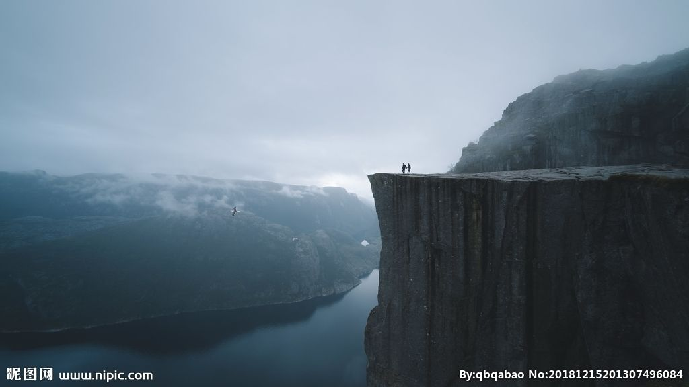

未来，第一的背后将会是悬崖

>李嘉图定律，又被称为“租金定律”，租金定律讲的是下面这样一回事：土地租金是土地使用者所支付的价格，它是由垄断性（稀缺性）来决定的，而不是取决于地主在上面做的投资和改良的成本。它的价格受限于租用者（农民）能够承担的价格。

**一流的工程师收入是天价，末流的工程师往往是免费。**

**优质的就是稀缺的**

**对外部资源**

- 宁可投资1000元一股的行业第一的公司，不投100元10股的行业第二的公司。

- 宁可买高于市场价的中心地段房子，不买烂地段的低价楼

- 宁可高价买A地，不眼红便宜买B地

- 宁可高薪请一流员工，不雇低价的三教九流

**对于自身**

力争成为行业的No.1

**认识规律是前提，把握规律是优势**

当我们发现一些基本原则和规律时，要十分上心，你一旦忽视它，就会被趋势和潮流抛掷远方，或者被现实击垮。处在信息时代，就要了解它的定律，并且把它们写入我们的行动指南。

​		**这个世界是强者恒强的世界，人们更容易记住第一名，世界上几乎没有人记住第二高峰叫什么名字。只在站在峰端才能够吸引更多的资源。**