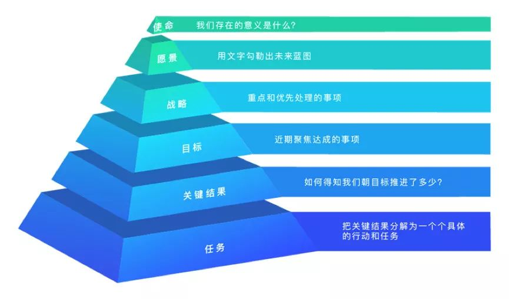

# 第一版

使命：磨砺灵魂，做一个通透的人。

愿景：身体健康，家庭和睦，工作水平达到世界级水平，财务自由（1个亿）。

战略：

1. 身体摆脱亚健康。
2. 增加感情账户的金额。
3. 数据结构和算法过一遍，用算法剖析软件世界（redis，mysql 等）。
4. 炒股达到巴菲特的水平。

价值观：

1. 积极主动。
2. 以终为始。
3. 要事第一。
4. 双赢思维。
5. 不断更新。
6. 彻底完成一件事。
7. 做正确的事，不做容易的事。
8. 先做 60 分，再做 90 分，最终做 120 分。
9. 人生做减法。

# 第二版

使命：富国强兵

愿景：

- 十年（成熟区）
  - 年薪百万。
  - 资产财富增值速度 >> 薪资。
  - 在机器学习领域达到专家级别。

- 五年（爆发期）
  - 年薪五十万。
  - 资产财富增值速度 = 薪资。
  - 在机器学习领域达到高级工程师。 
- 三年（成长期）
  - 年薪三十六万。
  - 学习炒股，形成自己方法论。
  - 成为合格：机器学习工程师。

价值观

- 成就＝成功率 x 事情的量级 x 做事的速度
- 做正确的事，不做容易的事。
- 彻底完成一件事。
- 目标 -- 过程 -- 成果。