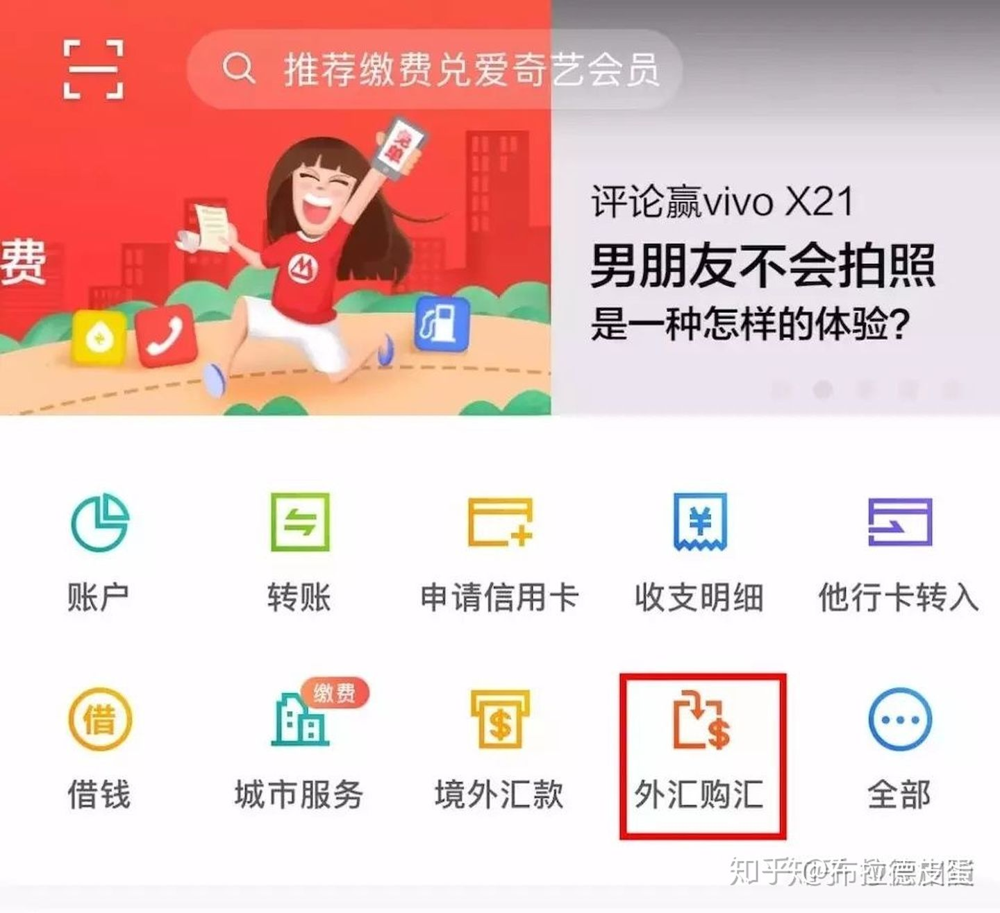
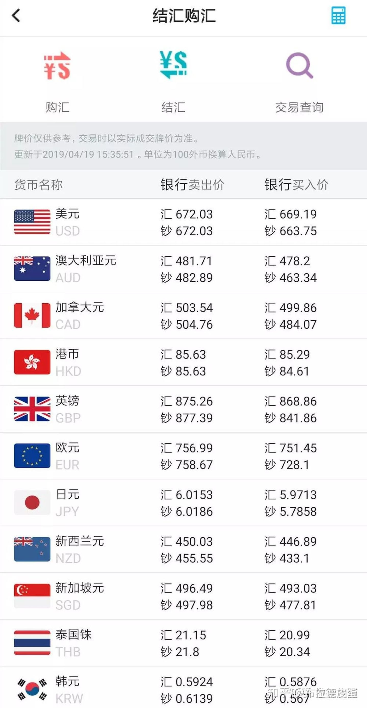
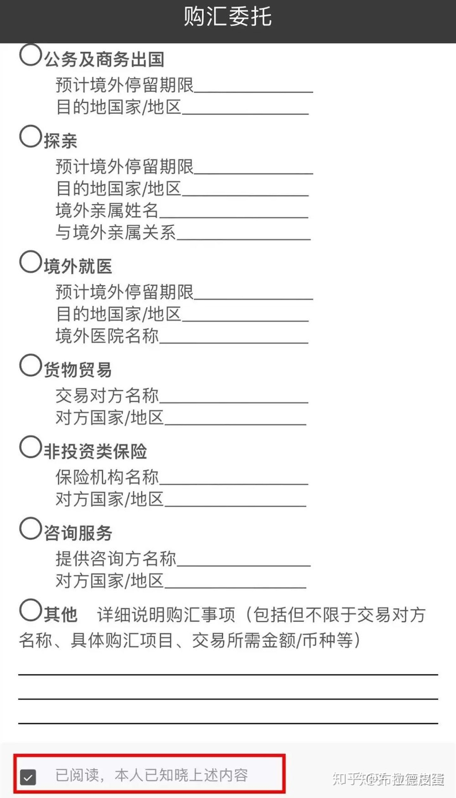
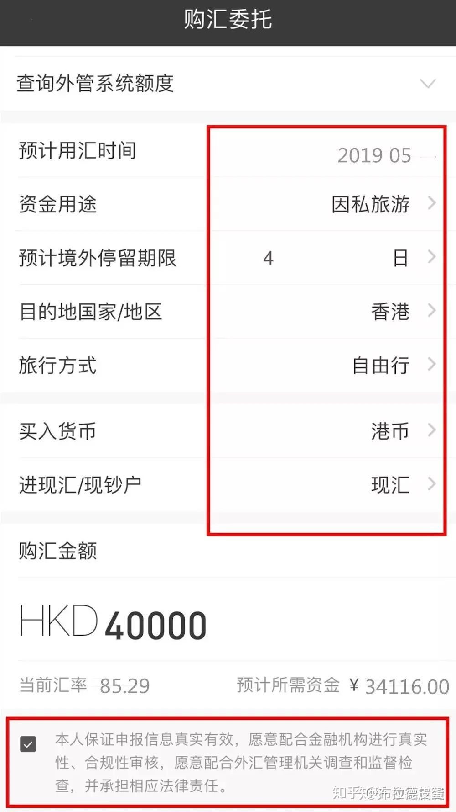
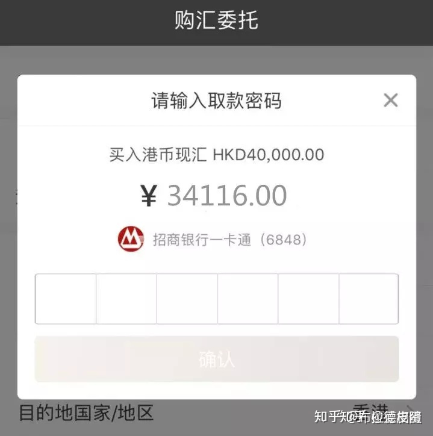
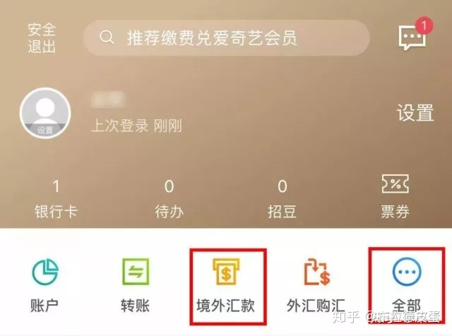

[TOC]

https://zhuanlan.zhihu.com/p/153240783

# 换汇

1.打开招商银行手机APP，点击外汇购汇

2.选择港币，并点击下方购汇委托。

3.勾选“已阅读”，并点击下一步。

4.输入用汇信息与购汇金额（因国家目前对外汇监管较严，资金用途建议写“因私旅游”，目的地填香港），打钩后点击确定。

5.输入密码，完成购汇。

# 汇款至招商永隆账户

1. 在APP“跨境金融”的栏目下找到“境外汇款”按钮

2.点击境外普通汇款

永隆

https://www.com/help/us-inout-winglung