[TOC]

# 切分算法

1. 完全切分
2. 正向最长匹配
3. 逆向最长匹配
4. 双向最长匹配


基于词典分词基本假设：**词典中的字符串才是词。**也就是说：词典之外的字符串不是词。


## 完全切分

时间复杂度：O(n^2)

```python
def full_segment(text, dic):
    word_list = []
    for i in range(len(text)):
        for j in range(i + 1, len(text) + 1):
            word = text[i:j]
            if word in dic:
                word_list.append(word)
    return word_list


text = "商品和服务"
dic = {"商", "品",  "和","服","务","商品", "服务","和服"}
print(full_segment(text, dic))
# ['商', '商品', '品', '和', '和服', '服', '服务', '务']
```

完全切分的原则：宁可错杀一千，不可放过一个。

严格意义上：这个算法的结果不能算作分词算法。


优化：

时间复杂度：O(n)。精确的是：O(kn) 

k： max_word_len
如果没有：max_word_len，那么时间复杂度就是：O(n)


如果词典中有“中华”，那么“中华民族” 永远切不出来。

## 正向最长匹配

**假设：单词越长表达的意义越丰富**，所以单词越长优先级越高。

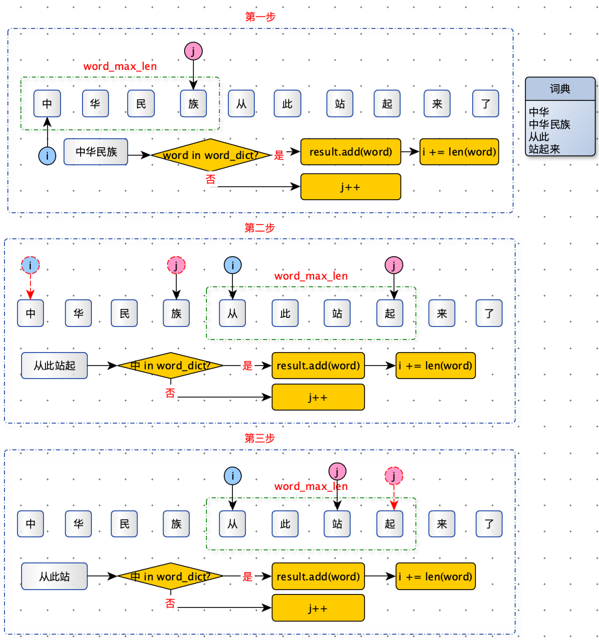

```python
class ForwardSeg:
    def __init__(self,term_dict,max_word_len):
        self.term_dict = term_dict
        self.max_word_len = max_word_len

    def segment(self, text):
        n = len(text)
        terms = []
        i = 0
        while i < n:
            window_end_index = min(n, i + self.max_word_len)
            term, position = self.max_match(text[i:window_end_index])
            terms.append(term)
            i += position
        return terms

    def max_match(self, text):
        term = text[0]
        for i in range(len(text), -1, -1):
            if text[:i] in self.term_dict:
                term = text[0:i]
                return term, len(term)
        return term, len(term)

dic = {"研究", "生命", "起源", "研究生",'中华', '中华民族', '从此', '站起来'}
mmSeg = ForwardSeg(dic,4)
print(mmSeg.segment('研究生命起源'))
# 
```

时间复杂度：O(n)。精确的是：O(kn) 

k： max_word_len
如果没有：max_word_len，那么时间复杂度就是：O(n)

## 逆向最长匹配

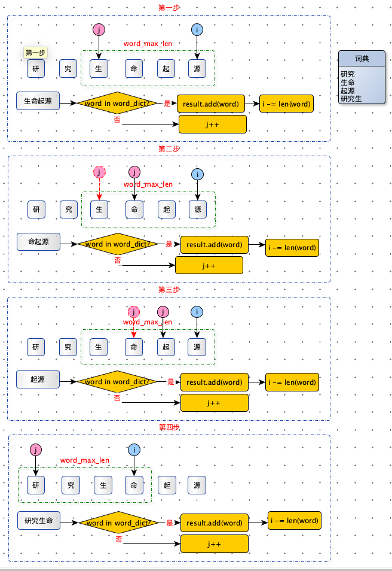


与正向最长匹配相反，从文本最后开发向前匹配。

```python
class BackwardSeg:
    def __init__(self, term_dict, max_word_len):
        self.term_dict = term_dict
        self.max_word_len = max_word_len

    def segment(self, text):
        n = len(text)
        terms = []

        i = n
        while i > 0:
            window_end_index = max(0, i - self.max_word_len)
            term, position = self.match(text[window_end_index:i])
            terms.insert(0, term)
            i -= position
        return terms

    def match(self, text):
        term = text[len(text)-1]
        for i in range(len(text)):
            if text[i:] in self.term_dict:
                term = text[i:]
                return term, len(term)
        return term, len(term)


dic = {"研究", "生命", "起源", "研究生", '中华', '中华民族', '从此', '站起来'}
backwardSeg = BackwardSeg(dic, 4)
print(backwardSeg.segment('研究生命起源'))
print(backwardSeg.segment('中华民族从此站起来了'))
```

## 双向最长匹配

时间复杂度：O(n^2)

融合了：正向最长匹配，逆向最长匹配。根据一定规则，选出比较好的结果。

规则：

1. 同时执行正向最长匹配和逆向最长匹配，返回词数较少的分词结果。
2. 如果词数相等，返回单字更少的结果。
3. 如果单字也相等，返回逆向最长匹配的结果。

```python
from my_hanlp.forward_segment import forward_segment
from my_hanlp.backward_segment import backward_segment

def count_single_char(word_list):
    return sum(1 for word in word_list if len(word) == 1)

def bidirectional_segment(text, dic):
    f = forward_segment(text, dic)
    b = backward_segment(text, dic)

    if len(f) < len(b):
        return f
    if len(f) > len(b):
        return b
    if count_single_char(f) < count_single_char(b):
        return f
    return b
```

# 效果评测

| 序号 | 原文                 | 正向最长匹配                     | 逆向最长匹配                       | 双向最长匹配                       |
| ---- | -------------------- | -------------------------------- | ---------------------------------- | ---------------------------------- |
| 1    | 项目的研究           | **[项目， 的，研究]**            | [项，目的，研究]                   | [项，目的，研究]                   |
| 2    | 商品和服务           | [商品， 和服，务]                | **[商品， 和，服务]**              | **[商品， 和，服务]**              |
| 3    | 研究生命起源         | [研究生，命，起源]               | **[研究，生命，起源]**             | **[研究，生命，起源]**             |
| 4    | 当下雨天地面积水     | [当下，雨天，地面，积水]         | **[当，下雨天，地面，积水]**       | [当下，雨天，地面，积水]           |
| 5    | 结婚的和尚未结婚的   | [结婚，的，和尚，未，结婚，的]   | **[结婚，的，和，尚未，结婚，的]** | **[结婚，的，和，尚未，结婚，的]** |
| 6    | 欢迎新老师生前来就餐 | [欢迎，新，老师，生前，来，就餐] | [欢，迎新，老，师生，前来，就餐]   | [欢，迎新，老，师生，前来，就餐]   |

正向最长匹配正确率：$\frac{1}{6}$

逆向最长匹配正确率：$\frac{4}{6}$

双向最长匹配正确率：$\frac{3}{6}$

双向最长匹配：在 case_1 和 case_4 上反而选择更差的结果返回了。

规则集的维护：有时就是拆东墙补西墙，有时是帮倒忙。


词典分词核心价值：在于速度，不在于精度。

# 优化匹配

匹配算法的瓶颈之一：判断一个字符串是否存在一个集合（词典）中。

如果用有序集合 TreeMap 的话，时间复杂度为O(log n)，n  = len(dic)

如果用散列表（HashMap）的话，时间复杂度O(1) ，但是空间复杂度却上去了。默认负载因子：0.75，内存翻倍。

前缀树单次查询时间复杂：O(1) , 空间复杂度：O(n) ，n 词表中词的长度。

## 前缀树

观察正向最大匹配的过程：

第一次匹配：从此站起

第二次匹配：从此站

第三次匹配：从此

这三次匹配拥有公共前缀。根据这个特点，我们使用前缀树最合适不过了。


首先看一下，前缀树张什么样。

使用 [ how ，hi ， her，hello ， so，see ]  构建的前缀树

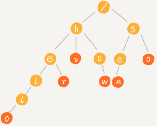

前缀树的特点

1. 根节点不包含任何信息。
2. 分为数据节点和路径节点：从根节点到数据节点之间的路径表示一个字符。

前缀树的本质：**利用字符串之间的公共前缀，将重复的前缀合并在一起**。


前缀树的构建

```python
class TrieNode:
    def __init__(self, data=None):
        self.data = data
        self.children = {}


	def insert(self, word):
        p = self.root
        for i in range(len(word)):
            if word[i] not in p.children:
                p.children[word[i]] = TrieNode()
            p = p.children[word[i]]
        p.data = word
```

前缀树的查询

查询

一个模式串和一个主串之间进行匹配：也就是在主串中查找一个模式串。

```python
    def find(self, pattern):
        p = self.root
        for i in range(len(pattern)):
            if pattern[i] not in p.children: return
            p = p.children[pattern[i]]
        return p.data
```


多模匹配

多个模式串和一个主串之间做匹配：也就是说在主串中查找多个模式串。

```python
    def multi_match(self, text):
        res = []
        for i in range(len(text)):
            p = self.root
            for j in range(i, len(text)):
                if text[j] not in p.children: break
                p = p.children[text[j]]
                if p.data: res.append(p.data)

        return res
```


观察逆向最大匹配的过程：

第一次匹配：生命起源

第二次匹配：命起源

第三次匹配：起源

这三次匹配拥有公共后缀。根据这个特点，我们使用后缀树最合适不过了。


前缀树 + 后缀树 = AC 自动机。

## AC 自动机

 [ abcd , bc , bcd , c ] 构造成的AC 自动机

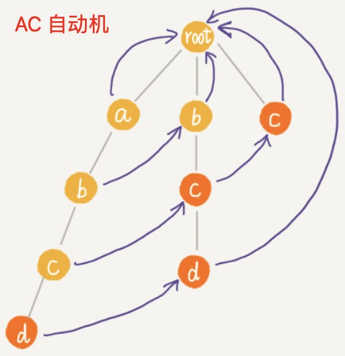

AC 自动机在前缀树的基础上，为前缀树上的每个节点建立一棵==**后缀树**==，节省了大量的查询。

AC 自动机就是在 Trie 树之上，加了类似 KMP 的 next 数组，只不过此处的 next 数组是构建在树上。


AC 自动构建步骤：

1. 构建 Trie Tree
2. 在 Trie Tree 上构建失败指针。


构建失败指针的三种情况：

假设：现在需要构建 pc 的fail 指针。

第一种情况

pc 的父节点 p 的fail 指针的子节点中有与 p 值相等的结点qc，那么 pc.fail = qc

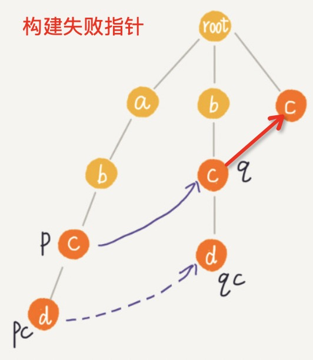


第二种情况：q 的子节点中没有与pc 结点值相同的结点，那么 q = q.fail ，继续向上找（更短的后缀）

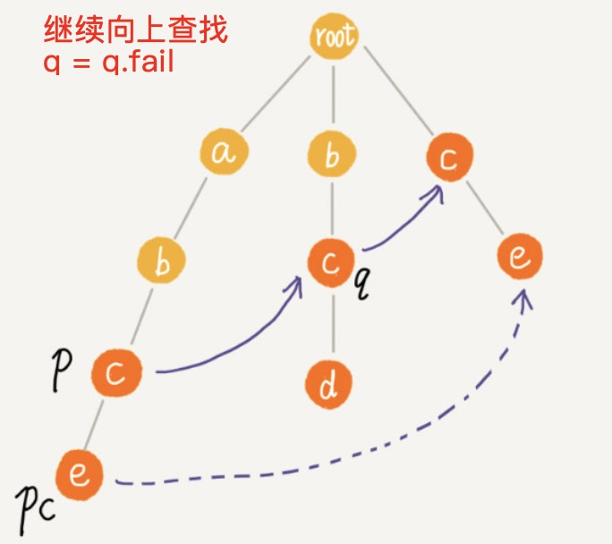

第三种情况：

q == None 那么 pc = root


构建整体树的 fail 指针。

 根据上图可以看出：

如果我们将树中相同深度的节点放到同一层，那么某个节点的失败指针只有可能出现在它所在层的上层。

所以对树进行层次遍历，从上到下构建 fail 指针。


图解 fail 指针的构建过程

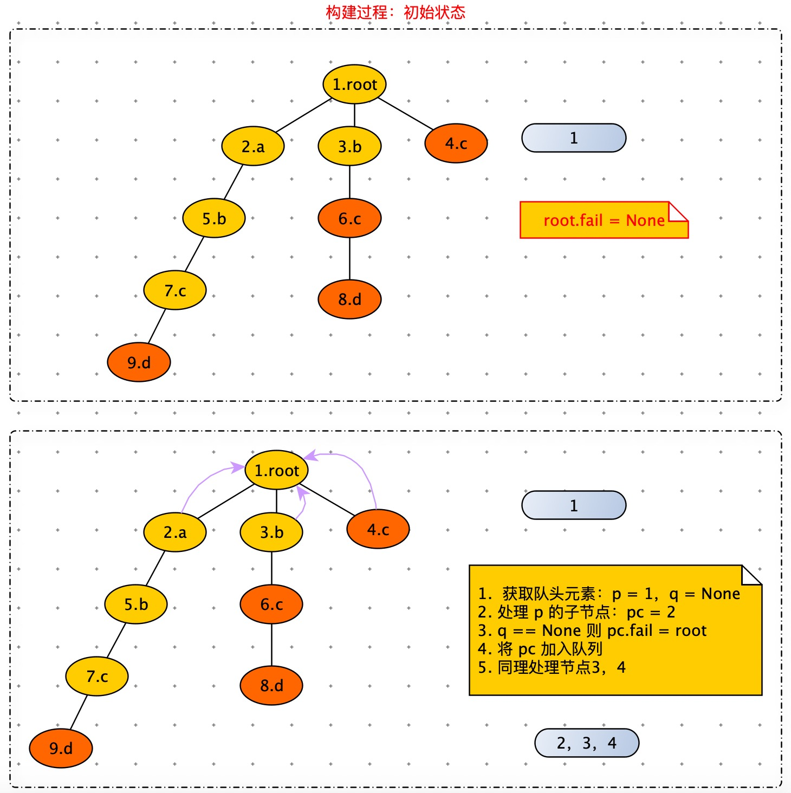


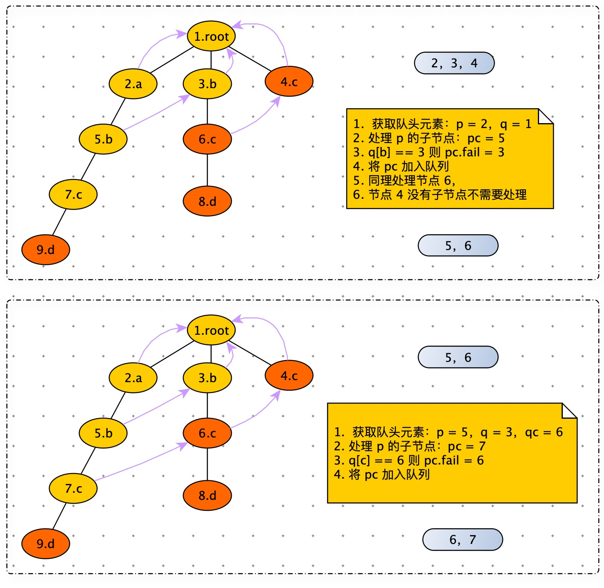

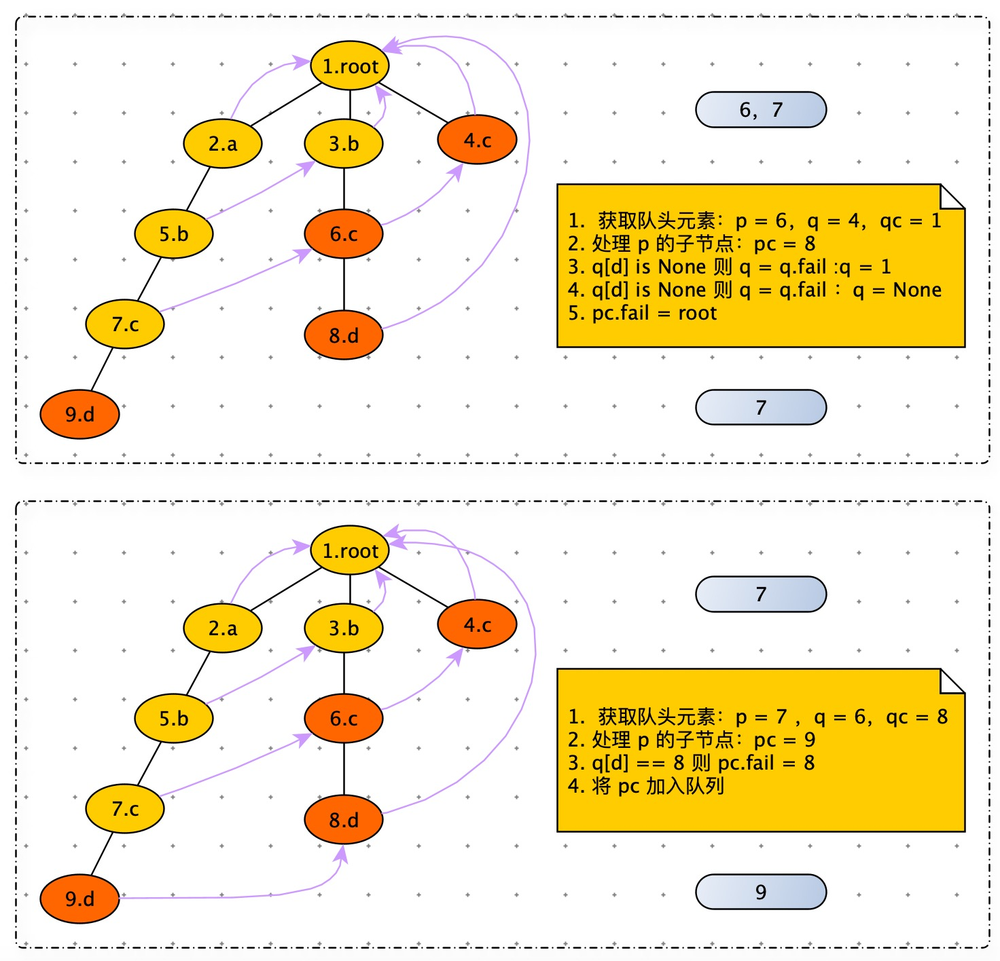

代码：

```python
    def build_failure_pointer(self):
        queue = [self.root]
        while queue:
            p = queue.pop(0)
            for key, pc in p.children.items():
                q = p.fail
                while q:
                    qc = q.children.get(key, None)
                    if qc:
                        pc.fail = qc
                        break
                    q = q.fail
                if q is None:
                    pc.fail = self.root
                queue.append(pc)
```


**AC 自动机匹配**


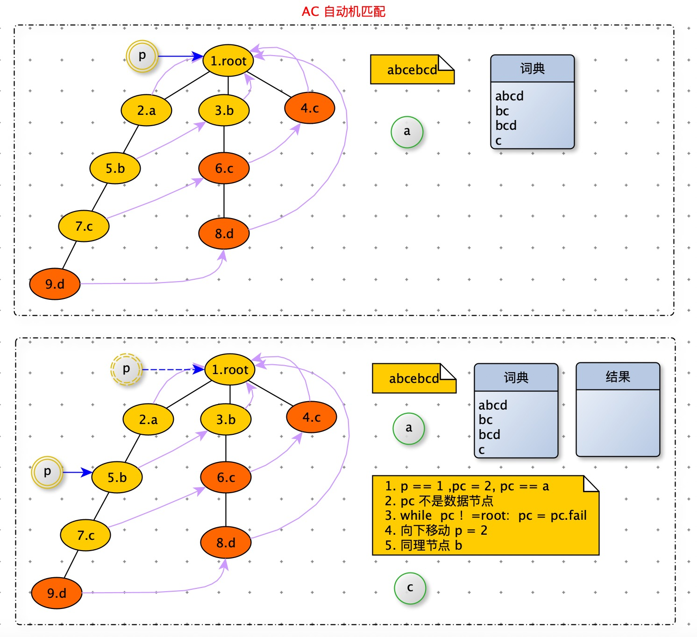

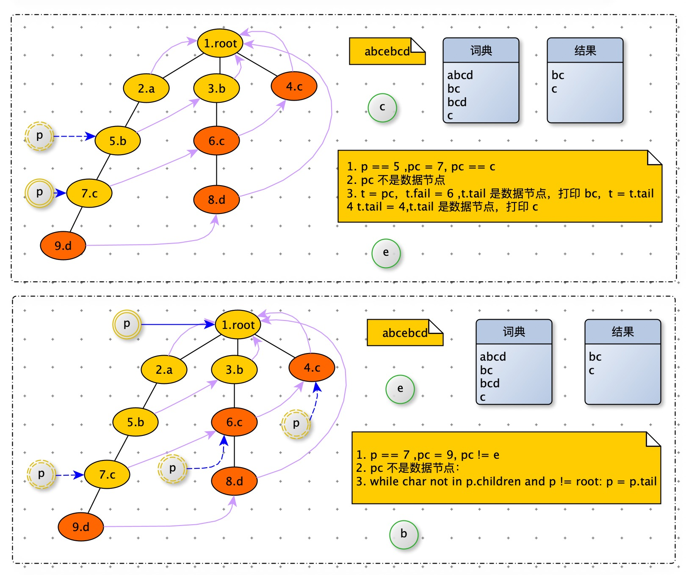

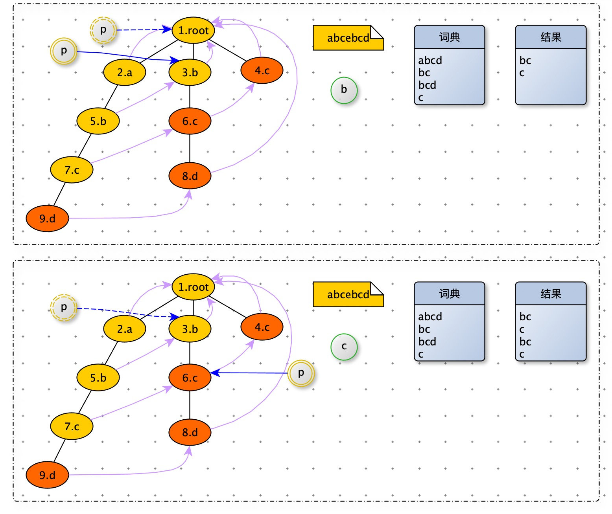

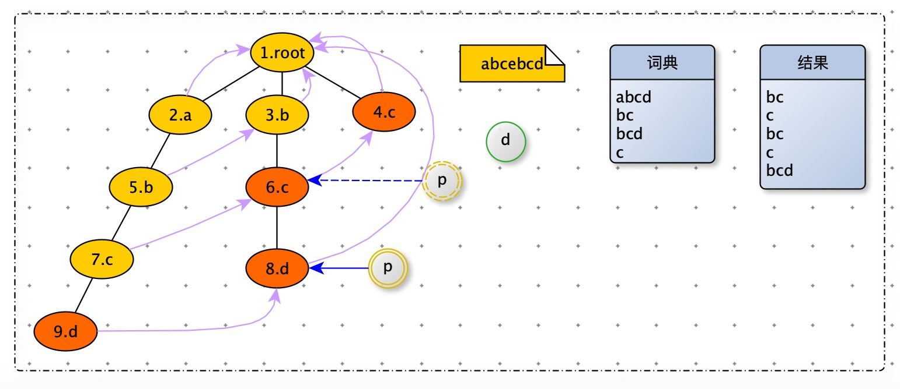


```python
    def match(self, text):
        res = []
        p = self.root
        for i, char in enumerate(text):
            # 一个新 char ，通过 fail 寻找合适 node，开始查询
            while char not in p.children and p != self.root:
                p = p.fail

            # 如果没有匹配，从 root 开始。
            p = p.children[char] if char in p.children else self.root
            tmp = p
            while tmp != self.root:
                if tmp.data is not None:
                    pos = i - tmp.length + 1
                    print('匹配起始下标' + str(pos) + ";长度:" + str(tmp.length))
                    res.append(tmp.data)
                tmp = tmp.fail
        return res
```

