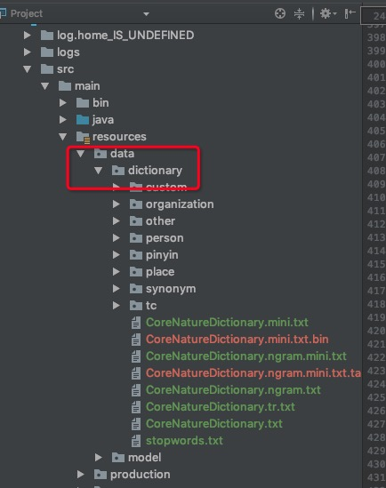
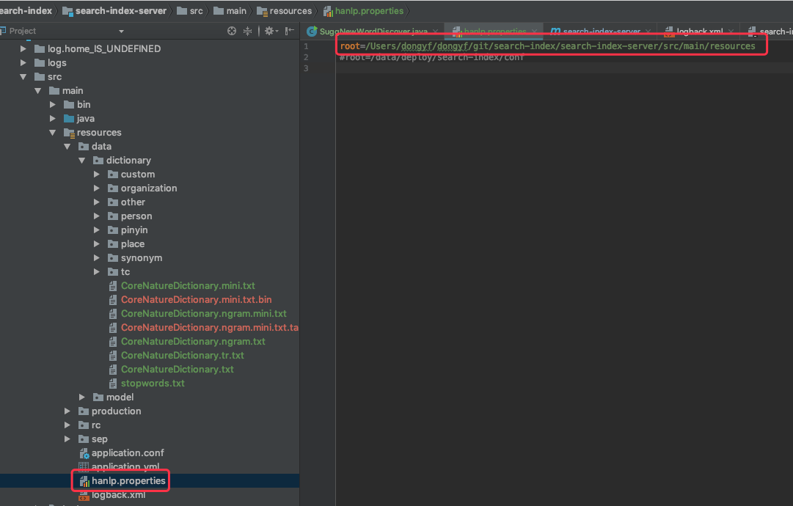

[TOC]

# Java 使用 hanlp 分词

## 新增依赖

```xml
        <dependency>
            <groupId>com.hankcs</groupId>
            <artifactId>hanlp</artifactId>
            <version>portable-1.7.5</version>
        </dependency>
```

如果新增完毕依赖后，只能使用分词的基础功能。

## 新增词表



这次词表是hanlp Githup 上下载的。

第一次使用hanlp 时，会生成 xxx.bin 文件。

注意：

1. ==如果修改了关键词，需要删除 xxx.bin，然后重新生成 xxx.bin 文件后才能生效==。
2. 词表中，优先级高于 CustomDictionary.add("海康");

## 指定词表位置




# 自定义词表优先

```java
        String text = "2021年年度报告";

//        CustomDictionary.add("年度报告", "n 1");

        Segment segment = HanLP.newSegment().enableCustomDictionaryForcing(true);
        System.out.println(segment.seg2sentence(text));
```


# hanLP 常用方法

## 分词

```java
        // 标准分词
        // HanLP.segment其实是对StandardTokenizer.segment的包装
        System.out.println(HanLP.segment(text));
        System.out.println(StandardTokenizer.segment(text));

        // NLP 分词
        // NLP分词NLPTokenizer会执行词性标注和命名实体识别，由结构化感知机序列标注框架支撑
        // 默认模型训练自9970万字的大型综合语料库，是已知范围内全世界最大的中文分词语料库。语料库规模决定实际效果，面向生产环境的语料库应当在千万字量级。欢迎用户在自己的语料上训练新模型以适应新领域、识别新的命名实体。
        System.out.println(NLPTokenizer.segment(text));


        // 索引分词
        // 索引分词IndexTokenizer是面向搜索引擎的分词器，能够对长词全切分，另外通过term.offset可以获取单词在文本中的偏移量
        // 任何分词器都可以通过基类Segment的enableIndexMode方法激活索引模式
        System.out.println(IndexTokenizer.segment(text));


        // N-最短路径分词
        Segment nShortSegment = new NShortSegment().enableCustomDictionary(false).enablePlaceRecognize(true).enableOrganizationRecognize(true);
        Segment shortestSegment = new DijkstraSegment().enableCustomDictionary(false).enablePlaceRecognize(true).enableOrganizationRecognize(true);
        System.out.println(nShortSegment.seg(text));
        System.out.println(shortestSegment.seg(text));

        // CRF分词(过时了)
        // Segment segment = new CRFSegment();
        // segment.enablePartOfSpeechTagging(true);
        // System.out.println(segment.seg(text));

				final List<Term> segment = NLPTokenizer.segment(text);

        // 极速词典分词
        System.out.println(SpeedTokenizer.segment(text));


```

