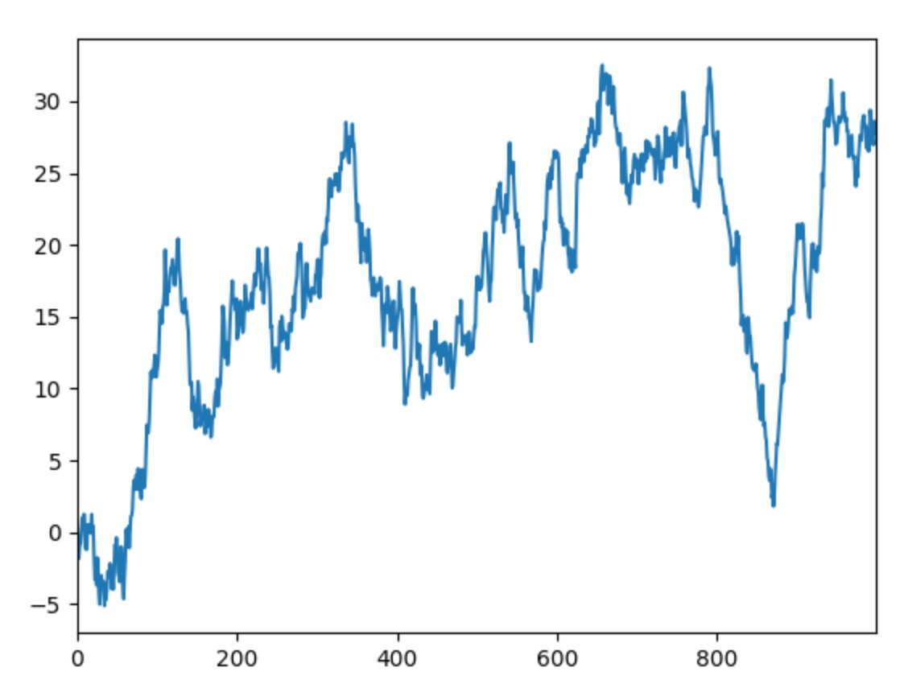
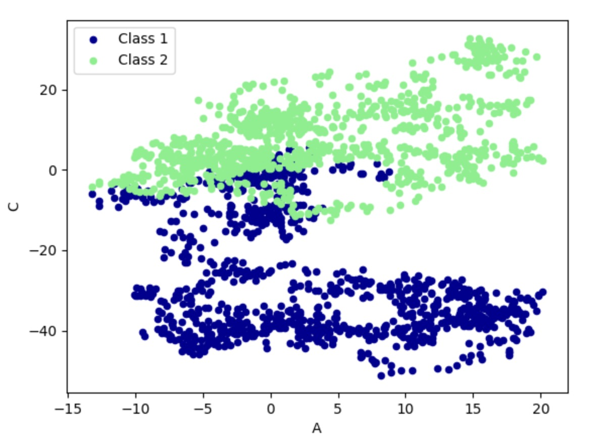

[TOC]

numpy 是List 的话，Pandas 就是 Dict

# 快速上手

```python
import pandas as pd
import numpy as np

# 一维 pandas
s = pd.Series([1, 3, 6, np.nan, 44, 1])

# 生成日期序列
dates = pd.date_range('20201122', periods=6)
print(dates)

# 生成一个二维表
# index 行的名称。默认是[0,1,2,..]
# columns 列的名称。默认是[0,1,2,..]
df = pd.DataFrame(np.random.randn(6, 4), index=dates, columns=["A", "B", "C", "D"])
print(df)
'''
                   A         B         C         D
2020-11-22  0.794085 -0.773412 -0.224570 -0.616072
2020-11-23  1.353855 -0.247853 -1.172822 -0.055587
2020-11-24  1.351260 -1.593613 -0.090627  0.791321
2020-11-25  0.034938  0.251626  0.521127  0.621370
2020-11-26 -1.083454  1.447499  0.973762 -0.624592
2020-11-27 -0.238948  0.554286 -0.590289 -0.057431
'''

d = {"A": 1, "B": [2, 3, 4], "C": 5}
df = pd.DataFrame(d)
print(df)
'''
   A  B  C
0  1  2  5
1  1  3  5
2  1  4  5
'''

# 查看每一列的数据类型
print(df.dtypes)

# 列的名称
print(df.columns)
# Index(['A', 'B', 'C'], dtype='object')

# 行的名称
print(df.index)
# RangeIndex(start=0, stop=3, step=1)

# dataFrame 的数据
print(df.values)
'''
[[1 2 5]
 [1 3 5]
 [1 4 5]]
'''

# 数值列的，count，mean，std，min，25%，50%，75%，max
print(df.describe())
'''
         A    B    C
count  3.0  3.0  3.0
mean   1.0  3.0  5.0
std    0.0  1.0  0.0
min    1.0  2.0  5.0
25%    1.0  2.5  5.0
50%    1.0  3.0  5.0
75%    1.0  3.5  5.0
max    1.0  4.0  5.0
'''

# 转置
print(df.T)

# 排序列索引
df.sort_index(axis=1, ascending=False)

# 排序行索引
df.sort_index(axis=0, ascending=False)

# 对索引为 B，列的数据，倒序
df = df.sort_values(by="B", ascending=False)
print(df)
'''
   A  B  C
2  1  4  5
1  1  3  5
0  1  2  5
'''
```


# 选择数据

```python
df = pd.DataFrame(np.random.randn(6, 4), index=dates, columns=["A", "B", "C", "D"])
print(df)

# 选择一列
print(df.A, df["A"])
# 切片行(第0行到第三行)
print(df[0:3])
# 切片行(第0行到第三行)
print(df['2020-11-22':'2020-11-24'])

print("模式一")
# select by label:loc
# 选择行标签
print(df.loc["2020-11-22"])
# 选择所有行，列标签为：A,B
print(df.loc[:, ["A", "B"]])

print("模式二")
# select by position:iloc

print(df)
# 选择第 3 行
print(df.iloc[3])

# 选择第 3 行第一位
print(df.iloc[3, 1])

# （切片）选择第 3 行到第 5 行的第一位到第三位
print(df.iloc[3:5, 1:3])

# （切片）不连续
print(df.iloc[[1, 3, 5], 1:3])

print("模式三：布尔选择")
# Boolean indexing
print(df)
print(df[df.A>0])


print("模式四：标签和位置混合模式")
# mixed selection:ix(deprecated 过期了，官方不建议使用了)
# 前三行，列标签为 A 和 C
print(df)
# print(df.ix[:3, ["A", "C"]])
```


# 设置值

```python
df.iloc[2,2]=111
df.loc["2020-11-22","B"]=222
df.A[df.A>0]=1
df.A[df.A<0]=0
df.B[df.A<0]=333
# 新增一列
df["E"]=np.nan
df["F"]=pd.Series([1,2,3,4,5,6],index=pd.date_range('20201122',periods=6))
print(df)
```


# 处理丢失数据

```python

dates = pd.date_range('20201122', periods=6)
df = pd.DataFrame(np.random.randn(6, 4), index=dates, columns=["A", "B", "C", "D"])
df.iloc[0,1]=np.nan
df.iloc[1,2]=np.nan

# 删除有空值的行
# how:any 有任何一个空值的行，就丢弃了。（默认值）
# how:all 一行所有值都为 null，才丢弃。
print(df.dropna(axis=0,how="any"))

# 删除有空值的列
print(df.dropna(axis=1))

# 填充缺失值
print(df.fillna(value=0))

# 是否有缺失值
print(df.isna())
'''
                A      B      C      D
2020-11-22  False   True  False  False
2020-11-23  False  False   True  False
2020-11-24  False  False  False  False
2020-11-25  False  False  False  False
2020-11-26  False  False  False  False
2020-11-27  False  False  False  False
'''

# np.any：只要一个true 就是 true
print(np.any(df.isnull()))
```


# 导入导出

| 编号 | 导入           | 导出         |
| ---- | -------------- | ------------ |
| 1    | read_csv       | to_csv       |
| 2    | read_excel     | to_excel     |
| 3    | read_hdf       | to_hdf       |
| 4    | read_sql       | to_sql       |
| 5    | read_json      | to_json      |
| 6    | read_msgpack   | to_msgpack   |
| 7    | read_html      | to_html      |
| 8    | read_gbq       | to_gbq       |
| 9    | read_sas       | to_sas       |
| 10   | read_clipboard | to_clipboard |
| 11   | read_pickle    | to_pickle    |


```python
data = pd.read_cvs('student.csv')
print(data)
data.to_pickle('student.pickle')
```


# 合并 

## concat

```python
df1 = pd.DataFrame(np.ones((3, 4)) * 0, columns=["A", "B", "C", "D"])
df2 = pd.DataFrame(np.ones((3, 4)) * 1, columns=["A", "B", "C", "D"])
df3 = pd.DataFrame(np.ones((3, 4)) * 2, columns=["A", "B", "C", "D"])

# 垂直方向合并（可以对齐）
res = pd.concat([df1, df2, df3], axis=0, ignore_index=True)
print(res)
'''
     A    B    C    D
0  0.0  0.0  0.0  0.0
1  0.0  0.0  0.0  0.0
2  0.0  0.0  0.0  0.0
3  1.0  1.0  1.0  1.0
4  1.0  1.0  1.0  1.0
5  1.0  1.0  1.0  1.0
6  2.0  2.0  2.0  2.0
7  2.0  2.0  2.0  2.0
8  2.0  2.0  2.0  2.0
'''

# 水平方向合并（可以对齐）
res = pd.concat([df1, df2, df3], axis=1, ignore_index=True)
print(res)
'''
     0    1    2    3    4    5    6    7    8    9   10   11
0  0.0  0.0  0.0  0.0  1.0  1.0  1.0  1.0  2.0  2.0  2.0  2.0
1  0.0  0.0  0.0  0.0  1.0  1.0  1.0  1.0  2.0  2.0  2.0  2.0
2  0.0  0.0  0.0  0.0  1.0  1.0  1.0  1.0  2.0  2.0  2.0  2.0
'''


df1 = pd.DataFrame(np.ones((3,4))*0, columns=['a','b','c','d'], index=[1,2,3])
df2 = pd.DataFrame(np.ones((3,4))*1, columns=['b','c','d', 'e'], index=[2,3,4])

# 水平方向合并（无法对齐），外连接
res = pd.concat([df1, df2], axis=1, join='outer')
print(res)
'''
     a    b    c    d    b    c    d    e
1  0.0  0.0  0.0  0.0  NaN  NaN  NaN  NaN
2  0.0  0.0  0.0  0.0  1.0  1.0  1.0  1.0
3  0.0  0.0  0.0  0.0  1.0  1.0  1.0  1.0
4  NaN  NaN  NaN  NaN  1.0  1.0  1.0  1.0
'''

# 水平方向合并（无法对齐），内连接（只保留行标签匹配上的）
res = pd.concat([df1, df2], axis=1, join='inner')
print(res)
'''
     a    b    c    d    b    c    d    e
2  0.0  0.0  0.0  0.0  1.0  1.0  1.0  1.0
3  0.0  0.0  0.0  0.0  1.0  1.0  1.0  1.0
'''

# join_axes
res = pd.concat([df1, df2], axis=1, join_axes=[df1.index])
print(res)
'''
     a    b    c    d    b    c    d    e
1  0.0  0.0  0.0  0.0  NaN  NaN  NaN  NaN
2  0.0  0.0  0.0  0.0  1.0  1.0  1.0  1.0
3  0.0  0.0  0.0  0.0  1.0  1.0  1.0  1.0
'''


# append：尾部追加，类似List.append
df1 = pd.DataFrame(np.ones((3,4))*0, columns=['a','b','c','d'])
df2 = pd.DataFrame(np.ones((3,4))*1, columns=['a','b','c','d'])
df3 = pd.DataFrame(np.ones((3,4))*2, columns=['b','c','d', 'e'])

res = df1.append(df2, ignore_index=True)
print(res)

print("+"*100)

res = df1.append([df2, df3])
print(res)
'''
     a    b    c    d    e
0  0.0  0.0  0.0  0.0  NaN
1  0.0  0.0  0.0  0.0  NaN
2  0.0  0.0  0.0  0.0  NaN
0  1.0  1.0  1.0  1.0  NaN
1  1.0  1.0  1.0  1.0  NaN
2  1.0  1.0  1.0  1.0  NaN
0  NaN  2.0  2.0  2.0  2.0
1  NaN  2.0  2.0  2.0  2.0
2  NaN  2.0  2.0  2.0  2.0
'''
```


## merge

```python
# merging two df by key/keys. (may be used in database)
# simple example
left = pd.DataFrame({'key': ['K0', 'K1', 'K2', 'K3'],
                     'A': ['A0', 'A1', 'A2', 'A3'],
                     'B': ['B0', 'B1', 'B2', 'B3']})
right = pd.DataFrame({'key': ['K0', 'K1', 'K2', 'K3'],
                      'C': ['C0', 'C1', 'C2', 'C3'],
                      'D': ['D0', 'D1', 'D2', 'D3']})
print(left)
print(right)
# 相当于:select * from left inner join right on left.key = right.key
res = pd.merge(left, right, on='key')
print(res)

'''
  key   A   B   C   D
0  K0  A0  B0  C0  D0
1  K1  A1  B1  C1  D1
2  K2  A2  B2  C2  D2
3  K3  A3  B3  C3  D3
'''

# consider two keys
left = pd.DataFrame({'key1': ['K0', 'K0', 'K1', 'K2'],
                     'key2': ['K0', 'K1', 'K0', 'K1'],
                     'A': ['A0', 'A1', 'A2', 'A3'],
                     'B': ['B0', 'B1', 'B2', 'B3']})
right = pd.DataFrame({'key1': ['K0', 'K1', 'K1', 'K2'],
                      'key2': ['K0', 'K0', 'K0', 'K0'],
                      'C': ['C0', 'C1', 'C2', 'C3'],
                      'D': ['D0', 'D1', 'D2', 'D3']})
print(left)
print(right)
res = pd.merge(left, right, on=['key1', 'key2'], how='inner')  # default for how='inner'
# how = ['left', 'right', 'outer', 'inner']
res = pd.merge(left, right, on=['key1', 'key2'], how='left')
print(res)


# indicator：给出join 方式
print("indicator")
df1 = pd.DataFrame({'col1': [0, 1], 'col_left': ['a', 'b']})
df2 = pd.DataFrame({'col1': [1, 2, 2], 'col_right': [2, 2, 2]})
print(df1)
print(df2)
res = pd.merge(df1, df2, on='col1', how='outer', indicator=True)
print(res)
# left_only：只在 left_table 中出现
# right_only：只在 right_table 中出现
# both：在 left_table 和 right_table 同时出现
'''
   col1 col_left  col_right      _merge
0     0        a        NaN   left_only
1     1        b        2.0        both
2     2      NaN        2.0  right_only
3     2      NaN        2.0  right_only
'''

# give the indicator a custom name
res = pd.merge(df1, df2, on='col1', how='outer', indicator='indicator_column')
print(res)
'''
   col1 col_left  col_right indicator_column
0     0        a        NaN        left_only
1     1        b        2.0             both
2     2      NaN        2.0       right_only
3     2      NaN        2.0       right_only
'''

# 根据行 index 进行 join
# merged by index
print("merged by index")
left = pd.DataFrame({'A': ['A0', 'A1', 'A2'],
                     'B': ['B0', 'B1', 'B2']},
                    index=['K0', 'K1', 'K2'])
right = pd.DataFrame({'C': ['C0', 'C2', 'C3'],
                      'D': ['D0', 'D2', 'D3']},
                     index=['K0', 'K2', 'K3'])
print(left)
print(right)
# left_index and right_index
res = pd.merge(left, right, left_index=True, right_index=True, how='outer')
res = pd.merge(left, right, left_index=True, right_index=True, how='inner')
print(res)
'''
     A   B   C   D
K0  A0  B0  C0  D0
K2  A2  B2  C2  D2
'''

# handle overlapping
boys = pd.DataFrame({'k': ['K0', 'K1', 'K2'], 'age': [1, 2, 3]})
girls = pd.DataFrame({'k': ['K0', 'K0', 'K3'], 'age': [4, 5, 6]})
res = pd.merge(boys, girls, on='k', suffixes=['_boy', '_girl'], how='inner')
print(res)
'''
    k  age_boy  age_girl
0  K0        1         4
1  K0        1         5
'''
```


# 画图

```python
import matplotlib.pyplot as plt

# plot data

# Series
data = pd.Series(np.random.randn(1000), index=np.arange(1000))
data = data.cumsum()
data.plot()

# DataFrame
data = pd.DataFrame(np.random.randn(1000, 4), index=np.arange(1000), columns=list("ABCD"))
data = data.cumsum()
# plot methods:
# 'bar', 'hist', 'box', 'kde', 'area', scatter', hexbin', 'pie'
ax = data.plot.scatter(x='A', y='B', color='DarkBlue', label="Class 1")
data.plot.scatter(x='A', y='C', color='LightGreen', label='Class 2', ax=ax)

plt.show()
```





