[TOC]

# K-means

## 聚类概念

聚类：将数据划分到不同的类里，使相似的数据在同一类里，不相似的数据在不同的类里。

无监督学习。

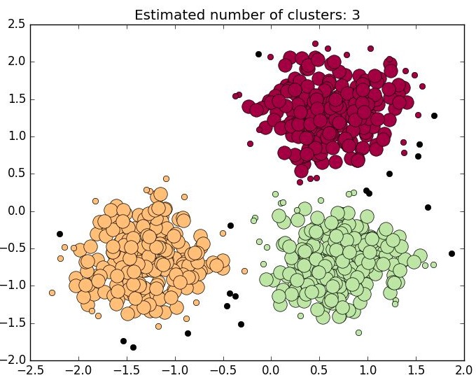

## demo

1. 生成模拟数据

```python
from sklearn.datasets import make_blobs
import matplotlib.pyplot as plt

# 生成：样本数500，特征数为2，4 个中心的样本集
X, y = make_blobs(n_samples=500, n_features=2, centers=4, random_state=1)
plt.scatter(X[:, 0], X[:, 1], marker='o', s=8)
plt.show()
```

X = [[-6.92324165e+00 -1.06695320e+01]
 [-8.63062033e+00 -7.13940564e+00]
 [-9.63048069e+00 -2.72044935e+00]
 [-2.30647659e+00  5.30797676e+00]]


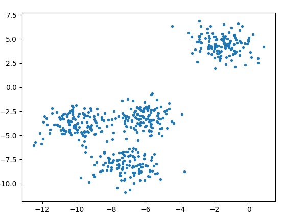


1. 聚类及可视化

```python
from sklearn.datasets import make_blobs
import matplotlib.pyplot as plt
from sklearn.cluster import KMeans

# 生成：样本数500，特征数为2，4 个中心的样本集
X, y = make_blobs(n_samples=500, n_features=2, centers=4, random_state=1)

# 聚类
n_clusters = 4
cluster = KMeans(n_clusters=n_clusters, random_state=0).fit(X)

# 可视化 -- 样本
color = ["red", "pink", "orange", "gray"]
y_pred = cluster.labels_
for i in range(n_clusters):
    plt.scatter(X[y_pred == i, 0], X[y_pred == i, 1], marker='o', s=8, c=color[i])

# 可视化 -- 质心
centroid = cluster.cluster_centers_
plt.scatter(centroid[:,0], centroid[:,1], marker='x', s=15, c="black")

plt.show()
```

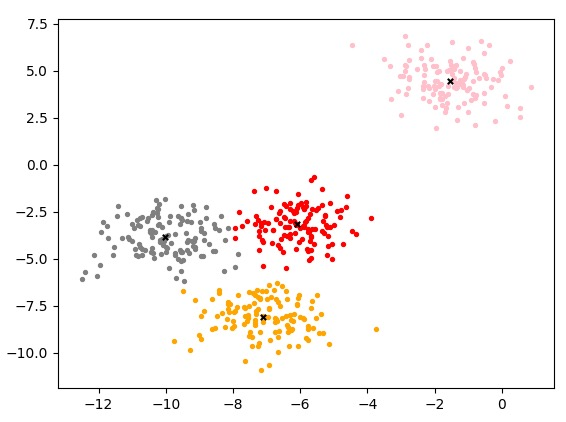


## 欧式距离

点 X 到点 Y 的距离。

$dist(X,Y) = \sqrt{\sum_{i=1}^n{(x_i-y_i)^2}}$


如图：点 $P_1(x_1,y_1) $ 与点$P_2(x_2,y_2)$ 之间的距离为：$\sqrt{{(x_1-x_2)^2+(y_1-y_2)^2}}$

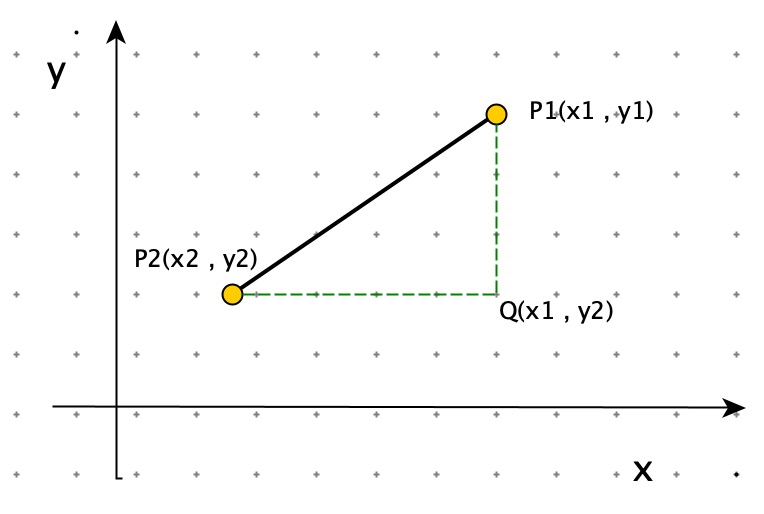

## K-Means 算法描述

**算法描述**

1. 从数据集中随机选取 K 个样本，作为初始质心。
2. 重新对样本划分类别：计算每个样本 $x_i$ ，计算它到每一个质心的距离，将其分配到距离最小质心所对应的类中。
3. 重新计算每个质心。$c_i = \frac{1}{|c_i|}\sum_{x \in c_i}x$
4. 当满足一定条件，如类别划分不在变化时或者达到最大迭代轮数，则终止算法，否则继续步骤 2 和 3。

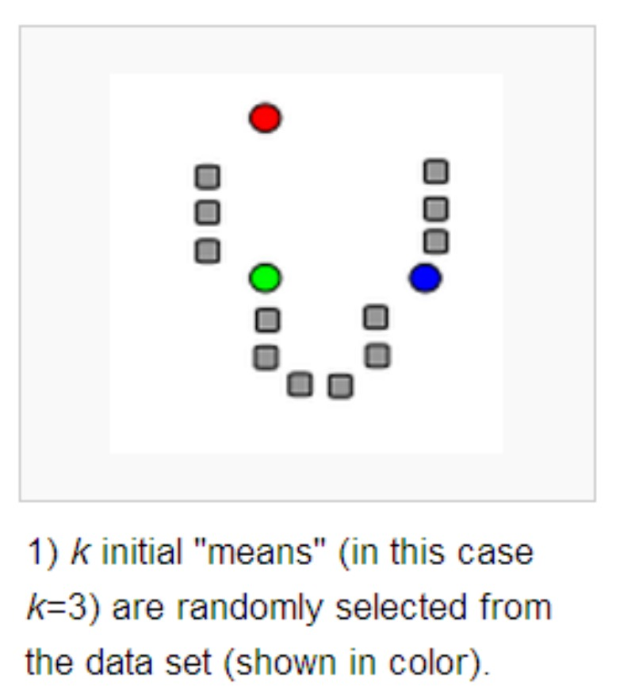


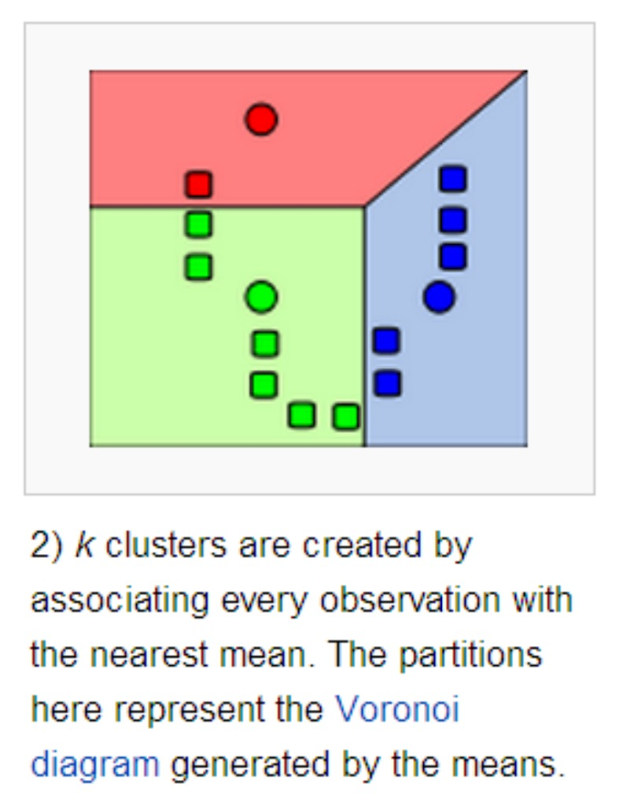

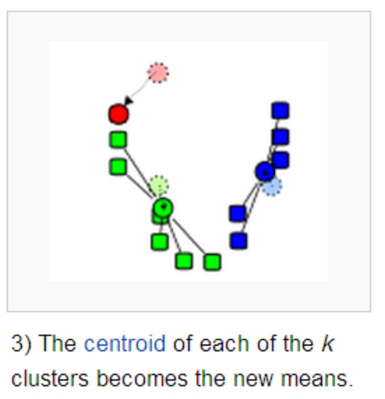


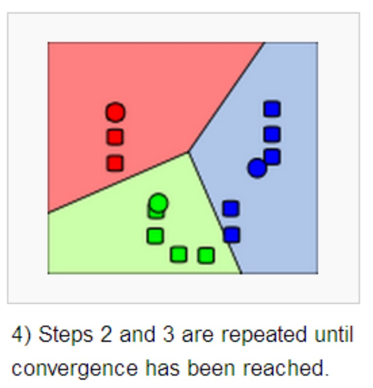

关键点：

- 计算样本数据与中心点的距离

  欧式距离：$dist(X,Y) = \sqrt{\sum_{i=1}^n{(x_i-y_i)^2}}$

- 计算聚类的中心点（更新质心）

  均值。

- 算法终止条件：最小化 WCSS

  $L(C) = \sum_{k \in K}\sum_{i \in k}||x_i-c_k||^2$

代码：

```python

import math
from random import sample

class Kmeans:
    def __init__(self):
        self.centorids = []
        self.labels = []
    # 训练
    def train(self, train_data, n_clusters=10, max_iter=300):
        last_wcss = 0.0
        iter_count = 0
        centorids = [train_data[i] for i in sample(range(len(train_data)), n_clusters)]

        print("kmeans train start:", centorids)
        while True:
            labels = [[] for _ in range(n_clusters)]
            wcss = 0
            # 聚类
            for x_id in range(len(train_data)):
                min_distance = math.inf
                for cluster_id in range(n_clusters):
                    distance = self.calc_distance(train_data[x_id], centorids[cluster_id])
                    if min_distance > distance:
                        min_distance = distance
                        cluster = cluster_id
                labels[cluster].append(x_id)
                wcss += min_distance

            print("kmeans wcss:", wcss, iter_count)

            # modify centers
            for cluster_id in range(n_clusters):
                centorids[cluster_id] = self.calc_centroid(train_data, labels[cluster_id])

            iter_count += 1
            if last_wcss == wcss or iter_count == max_iter: break

            last_wcss = wcss

        self.centorids = centorids

        tmp = sorted([(x_id, cluster_id) for cluster_id in range(len(labels)) for x_id in labels[cluster_id]])
        self.labels = [cluster_id for x_id, cluster_id in tmp]
        print("kmeans train Over")

    # 计算质心
    def calc_centroid(self, train_data, cluster_data):
        x_dimension = len(train_data[0])
        centroid = [0.0] * x_dimension
        for x_id in cluster_data:
            for i in range(x_dimension):
                centroid[i] += train_data[x_id][i]

        return [item / len(cluster_data) for item in centroid]

    # 计算距离
    def calc_distance(self, x, y):
        return math.sqrt(sum([math.pow(i - j, 2) for i, j in zip(x, y)]))
      
      
      
# 测试
from sklearn.datasets import make_blobs
import matplotlib.pyplot as plt
import numpy as np

# 生成：样本数500，特征数为2，4 个中心的样本集
X, y = make_blobs(n_samples=500, n_features=2, centers=4, random_state=1)
# 聚类
kmeans = Kmeans()
kmeans.train(X, k=4)

# 可视化
color = ["red", "pink", "orange", "gray"]

# 可视化 -- 样本
y_pred = np.array(kmeans.labels)
for i in range(n_clusters):
    plt.scatter(X[y_pred == i, 0], X[y_pred == i, 1], marker='o', s=8, c=color[i])

# 可视化 -- 质心
centroid = np.array(kmeans.centorids)
plt.scatter(centroid[:, 0], centroid[:, 1], marker='x', s=15, c="black")
plt.show()
```

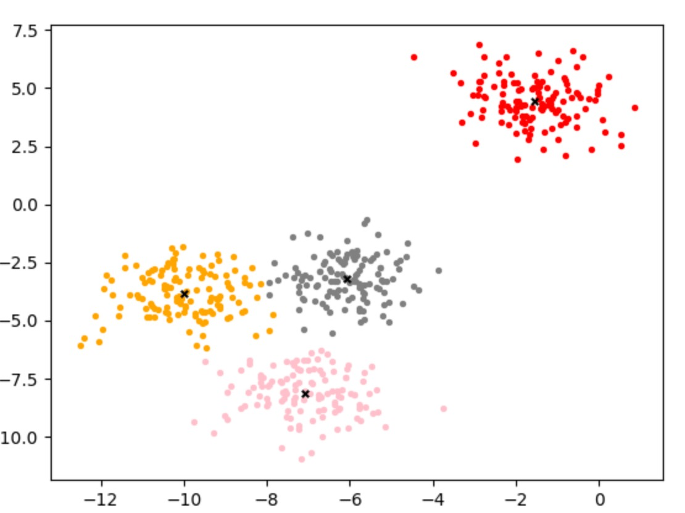

## 局部最优

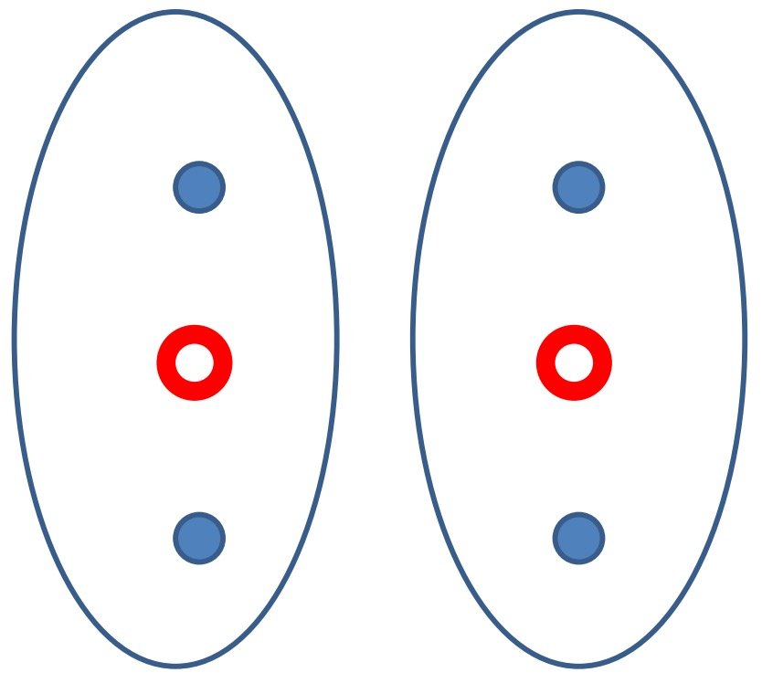

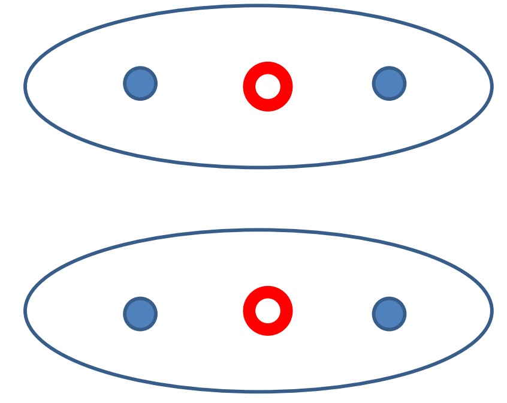

## K-Means++

由于初始质心对分类结果及收敛速度影响甚大，所以K-Means ++ 对初始质心进行优化。

==**<font color='red'>核心思想：初始质心相互距离尽可能的远。</font>**==


### 算法描述

1. 步骤一：随机选取一个样本作为第一个聚类质心：$c_1$
2. 步骤二：
   1. 计算每个样本与当前已有质心的最短距离（即与最近的一个质心的距离），用 D（x）表示。
   2. D(x) 越大，表示被选取作为质心的概率越大。概率公式：$\frac{D(x)^2}{\sum_{x \in X}{D(x)^2}}$
   3. 用轮盘法选出下一个质心。
3. 步骤三：重复步骤二，直到选出 k 个质心。


效果：网上有人使用真实和合成的数据集测试了他们的方法，速度通常提高了 2 倍，对于某些数据集，误差提高了近 1000 倍。

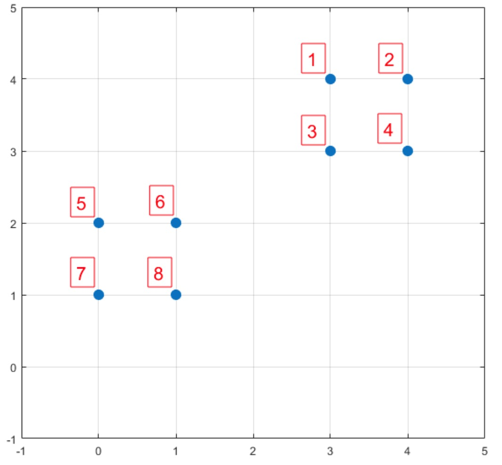

数据点：1:( 3 , 4 )，2:( 4 , 4 )，3:( 3 , 3 )，4:( 4 , 3 )，5:( 0 , 2 )，6:( 1 , 2 )，7:( 0 , 1 )，8:( 1 , 1 )

$dist(X,Y) = \sqrt{\sum_{i=1}^n{(x_i-y_i)^2}}$

步骤一：$c1 = $ 6 号点。

步骤二：

1. 计算所有样本的 D(x)。

   | 序号     | 1         | 2           | 3        | 4           | 5     | 6     | 7          | 8     |
   | -------- | --------- | ----------- | -------- | ----------- | ----- | ----- | ---------- | ----- |
   | D(x)     | $2\sqrt2$ | $\sqrt{13}$ | $\sqrt5$ | $\sqrt{10}$ | 1     | 0     | $ \sqrt2 $ | 1     |
   | $D(x)^2$ | 8         | 13          | 5        | 10          | 1     | 0     | 2          | 1     |
   | P(x)     | 0.2       | 0.325       | 0.125    | 0.25        | 0.025 | 0     | 0.05       | 0.025 |
   | Sum      | 0.2       | 0.525       | 0.65     | 0.9         | 0.925 | 0.925 | 0.975      | 1     |

   P(x) 就是每个样本被选为下一个质心的概率。

   sum 是概率 P(x) 的累加，用于轮盘法。

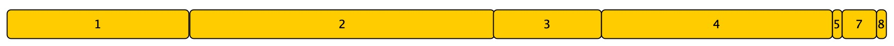

节点1，2，3，4 的被选中的概率是90%。从图上看，这四个节点，选做下一个质心更好。

这样验证了：K-Means++ 的思想：核心思想：初始质心相互距离尽可能的远。

Sum(D(x)) * random.random() 


```python
    def get_closest_dist(self, point, centroids):
        min_dist = math.inf
        for i, centroid in enumerate(centroids):
            dist = self.calc_distance(centroid, point)
            if dist < min_dist:
                min_dist = dist
        return min_dist

    def kpp_centers(self, train_data, k):
        centroids = [random.choice(train_data)]
        d = [0.0] * len(train_data)
        for _ in range(1, k):
            total = 0.0
            for i, point in enumerate(train_data):
                d[i] = self.get_closest_dist(point, centroids)
                total += d[i]
            total *= random.random()

            for i, di in enumerate(d):
                total -= di
                if total > 0: continue
                centroids.append(train_data[i])
                break
        return centroids
```


## ISODATA 算法

K-Means 和 K-Means++ 质心个数 K 是固定不变的。ISODATA 算法通过：**==分裂和合并==**，来调整质心个数。


### ISODATA 算法的超参数

1. **预期质心个数：$K_0$**，算法的质心数的变动范围由 $K_0$ 决定。最终输出的质心数的范围 [$\frac{K_0}{2}$ , $2K_0$]
2. **每个类所要求的最少样本数 $N_{min}$** ：如果分裂后导致某个子类别包含样本数目小于 $N_{min}$，就不会进行分裂。
3. **最大方差 Sigma**：用于衡量某个类别中样本的分散程度。当样本的分散程度超过这个值，就进行分裂。
4. **两个类别对应质心之间允许的最小距离 dmin**：如果两个质心的距离小于 dmin，则需要对这两个类进行合并。

ISODATA 算法非常直观，但是多了几个超参数，对这些超参数调参也非常难。所以实际使用过程中，ISODATA 算法并没有 K-Means++ 受欢迎。

### ISODATA 算法描述

1. 从数据集中随机选取 $K_0$ 个样本，作为初始质心。
2. 重新对样本划分类别：计算每个样本 $x_i$ ，计算它到每一个质心的距离，将其分配到距离最小质心所对应的类中。
3.  ==判断每个类中样本数目是否小于 $N_{min}$。如果小于 $N_{min}$ 则需要丢弃该类，令 K = K - 1 ，并将该类中样本重新分配给剩下类中距离最小的类。==
4. 重新计算每个质心。$c_i = \frac{1}{|c_i|}\sum_{x \in c_i}x$
5. ==如果当前 $K <= \frac{K_0}{2} $ ,说明当前类别数太少，进行分裂==
6. ==如果当前  $K >= 2 K_0$ ,说明当前类别数太多，进行合并==
7. 当满足一定条件，如类别划分不在变化时或者达到最大迭代轮数，则终止算法，否则回到第 2 步执行。


```python
    # 训练
    def train(self, train_data, min_n, sigma, min_distance, k0=10, max_iter=300):
        last_wcss = 0.0
        iter_count = 0
        centorids = np.array([train_data[i] for i in sample(range(len(train_data)), k0)])

        k = k0
        print("kmeans train start:", centorids)
        while True:
            labels = [[] for _ in range(k)]
            # 聚类
            wcss = self.cluster(train_data, range(len(train_data)), centorids, labels)

            # 判断每个类中样本数目是否小于 N_{min}。如果小于 N_{min} 则需要丢弃该类，
            # 令 K = K - 1 ，并将该类中样本重新分配给剩下类中距离最小的类。
            i = 0
            while i < len(labels):
                if len(labels[i]) < min_n:
                    remove_labels = labels[i]
                    labels = [item for h, item in enumerate(labels) if i != h]
                    centorids = [item for h, item in enumerate(centorids) if i != h]
                    self.cluster(train_data, remove_labels, centorids, labels)
                i += 1
            k = len(centorids)

            print("kmeans wcss:", wcss, iter_count)

            # modify centers
            for cluster_id in range(k):
                centorids[cluster_id] = self.calc_centroid(train_data, labels[cluster_id])

            # 分裂
            if k <= k0 / 2:
                self.split(train_data, labels, centorids, sigma, min_n)
                k = len(centorids)

            # 合并
            if k >= 2 * k0:
                print("merge")
                self.merge(centorids, min_distance, labels)
                k = len(centorids)

            iter_count += 1
            if last_wcss == wcss or iter_count == max_iter: break

            last_wcss = wcss
```


**合并**

1. 计算质心之间两两之间的距离，用矩阵 D 表示，其中 $D(i,i) = 0$

2. 对于 $D(i,j) < d_{min}\;\;(i!=j)$ 的两个类别需要进行合并操作，变成一个新类，新类的质心：$c_{new}=\frac{1}{n_i+n_j}(n_ic_i+n_jc_j)$

   $n_i\;,\;n_j$ 表示两个类别中样本数目，新的质心可以看做两个质心的加权求和。如果其中一个类所包含的样本个数较多，所合成的新质心就会更加偏向它。

```python
    # 合并
    def merge(self, centorids, min_distance, lables):
        k = len(centorids)
        for i in range(k):
            for j in range(i + 1, k):
              	# 计算质心之间的距离
                distance = self.calc_distance(centorids[i], centorids[j])
                if distance < min_distance:
                    n_i = len(lables[i])
                    n_j = len(lables[j])
                    # 两个质心合并为一个质心
                    c_new = [(n_i * centorids[i][k] + n_j * centorids[j][k]) / (n_i + n_j) for k in
                             range(len(centorids[i]))]

                    centorids = [item for h, item in enumerate(centorids) if i != h and h != j]
                    centorids.append(c_new)

                    data = lables[i] + lables[j]
                    lables = [item for h, item in enumerate(lables) if i != h and h != j]
                    lables.append(data)
```


**分裂**

1. 计算每个类别下所有样本在每个维度下的方差：$s^2 = \frac{(M-x_1)^2+(M-x_2)^2+...+(M-x_n)^2}{n}$。
2. 针对每个类别的所有方差挑选出最大的方差 $\sigma_{max}$。
3. 如果某个类别的   $\sigma_{max}> Sigma$ 并且该类别包含样本数 $n_i >= 2n_{min}$ ，则可以分裂。
4. 满足步骤 3 中条件，分裂中两个子类并令 K = K + 1. $c_i^{(+)}=c_i+\sigma_{max}\;,\; c_i^{(-)}=c_i-\sigma_{max}$
5. 将类中样本重新划分中 $c_i^{(+)}\;,\;c_i^{(-)}$ 中。

```python
    # 分裂
    def split(self, train_data, lables, centorids, sigma, min_n):
        for i in range(len(lables)):
            data = [train_data[j] for j in lables[i]]
						# 计算最大方差
            max_sigma = max(np.var(data, axis=0))
            if not (max_sigma > sigma and len(lables[i]) >= 2 * min_n):
                continue
            # 新质心
            c_new_0 = [v + max_sigma for v in centorids[i]]
            c_new_1 = [v - max_sigma for v in centorids[i]]
            tmp_lables = [[], []]
            # 重新分类
            self.cluster(train_data, lables[i], [c_new_0, c_new_1], tmp_lables)
						
            # 跟新质心和聚类
            centorids = [item for j, item in enumerate(centorids) if i != j]
            centorids.append(c_new_0)
            centorids.append(c_new_1)

            lables = [item for j, item in enumerate(lables) if i != j]
            lables.append(tmp_lables[0])
            lables.append(tmp_lables[1])
```


查看质心

```shell
awk -F"," '{ if(NR==1){ for(i=1;i<=NF;i++){ d[$i]=1  };print "center,query_id,query_keyword"  }else{ if($2 in d){ print $0  }  }  }' query_rvy_uniq_seg_filter_model
```


查看聚类

```shell
awk -F"," '{ if($1==9){ print $0  }  }' query_rvy_uniq_seg_filter_model | more
```

