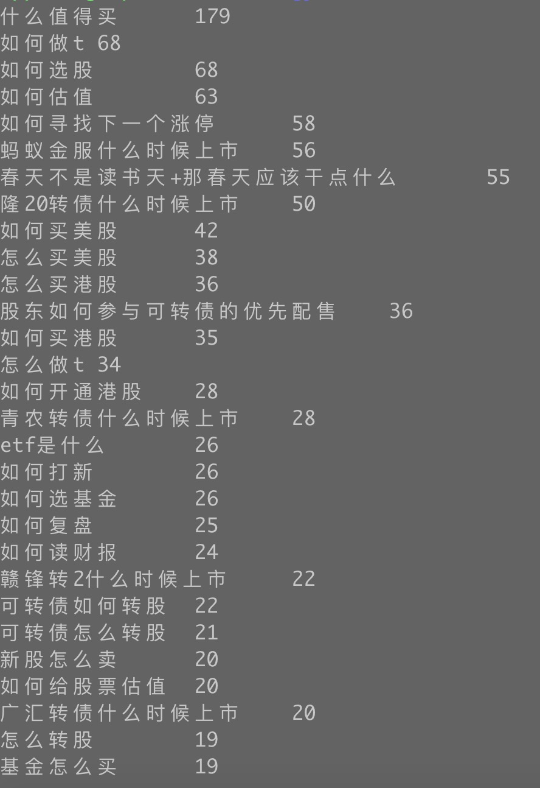

[TOC]

# 背景

搜索系统优化长尾 query。想了解一下长尾 query 长什么样？大体上都有几类？最好能归类，一类一类处理。

Query 数据源：包含“什么”，“怎么”，“如何” 关键词的 Query。





# K-means

## 聚类概念

生活中的聚类例子：班级分组。

​		一个班级有 40 名学生，班主任分别让小明，小红，小强，小李将班级中学生分成两组。

​		小明：男生一组，女生一组。

​		小红：前三排一组，后三排一组。

​		小强：左三列一组，右三列一组。

​		小李：住校生一组，走读生一组。

​		

为什么造成大家的分组不一样？是因为老师没有给明确定分组规则。


聚类是无监督学习。

无监督学习不需要标注数据。

有监督学习需要标注数据。NB，LR。


聚类：**将数据划分到不同的类里，使相似（距离相近）的数据在同一类里，不相似（距离较远）的数据在不同的类里。**


## Demo

生成模拟数据

```python
from sklearn.datasets import make_blobs
import matplotlib.pyplot as plt

# 生成：样本数500，特征数为2，4 个中心的样本集
X, y = make_blobs(n_samples=500, n_features=2, centers=4, random_state=1)
plt.scatter(X[:, 0], X[:, 1], marker='o', s=8)
plt.show()
```

X = [[-6.92324165e+00 -1.06695320e+01]
 [-8.63062033e+00 -7.13940564e+00]
 [-9.63048069e+00 -2.72044935e+00]
 [-2.30647659e+00  5.30797676e+00]]


模拟的数据的分布：


聚类及可视化代码（使用 sklearn 库中的 KMeans）：

```python
from sklearn.datasets import make_blobs
import matplotlib.pyplot as plt
from sklearn.cluster import KMeans

# 生成：样本数500，特征数为2，4 个中心的样本集
X, y = make_blobs(n_samples=500, n_features=2, centers=4, random_state=1)

# 聚类
n_clusters = 4
cluster = KMeans(n_clusters=n_clusters, random_state=0).fit(X)

# 可视化 -- 样本
color = ["red", "pink", "orange", "gray"]
y_pred = cluster.labels_
for i in range(n_clusters):
    plt.scatter(X[y_pred == i, 0], X[y_pred == i, 1], marker='o', s=8, c=color[i])

# 可视化 -- 质心
centroid = cluster.cluster_centers_
plt.scatter(centroid[:,0], centroid[:,1], marker='x', s=15, c="black")

plt.show()
```


聚类的结果：不同颜色表示不同类型


## 欧式距离

点 X 到点 Y 的距离。

$dist(X,Y) = \sqrt{\sum_{i=1}^n{(x_i-y_i)^2}}$


如图：点 $P_1(x_1,y_1) $ 与点$P_2(x_2,y_2)$ 之间的距离为：$\sqrt{{(x_1-x_2)^2+(y_1-y_2)^2}}$


## K-Means 算法

### 算法描述

1. 从数据集中随机选取 K 个样本，作为初始质心。
2. 重新对样本划分类别：计算每个样本 $x_i$ ，计算它到每一个质心的距离，将其分配到距离最小质心所对应的类中。
3. 重新计算每个质心。$c_i = \frac{1}{|c_i|}\sum_{x \in c_i}x$
4. 当满足一定条件，如类别划分不在变化时或者达到最大迭代轮数，则终止算法，否则继续步骤 2 和 3。


$dist(x,y)=\sqrt{{(x_1-x_2)^2+(y_1-y_2)^2}}$


例如：绿色类中点：$A:[x_1,y_1] \,, B:[x_2,y_2]\,,C:[x_3,y_3]\,,D:[x_4,y_4]$

更新绿色质心：$[\frac{x_1+x_2+x_3+x_4}{4},\frac{y_1+y_2+y_3+y_4}{4}]$

<font color=green>**注意：此时的质心是虚拟的点（不是训练集中的样本，后续优化点）**</font>


**关键点：**

- 计算样本数据与中心点的距离

  欧式距离：$dist(X,Y) = \sqrt{\sum_{i=1}^n{(x_i-y_i)^2}}$

- 计算聚类的中心点（更新质心）

  均值。

- 算法终止条件：最小化 WCSS

  $L(C) = \sum_{k \in K}\sum_{i \in k}||x_i-c_k||^2$


Kmeans 聚类代码（自己实现方便后根据业务需求优化聚类过程）：

```python
import math
from random import sample

class Kmeans:
    def __init__(self):
        self.centorids = []
        self.labels = []
    # 训练
    def train(self, train_data, n_clusters=10, max_iter=300):
        last_wcss = 0.0
        iter_count = 0
        centorids = [train_data[i] for i in sample(range(len(train_data)), n_clusters)]

        print("kmeans train start:", centorids)
        while True:
            labels = [[] for _ in range(n_clusters)]
            wcss = 0
            # 聚类
            for x_id in range(len(train_data)):
                min_distance = math.inf
                for cluster_id in range(n_clusters):
                    distance = self.calc_distance(train_data[x_id], centorids[cluster_id])
                    if min_distance > distance:
                        min_distance = distance
                        cluster = cluster_id
                labels[cluster].append(x_id)
                wcss += min_distance

            print("kmeans wcss:", wcss, iter_count)

            # modify centers
            for cluster_id in range(n_clusters):
                centorids[cluster_id] = self.calc_centroid(train_data, labels[cluster_id])

            iter_count += 1
            if last_wcss == wcss or iter_count == max_iter: break

            last_wcss = wcss

        self.centorids = centorids

        tmp = sorted([(x_id, cluster_id) for cluster_id in range(len(labels)) for x_id in labels[cluster_id]])
        self.labels = [cluster_id for x_id, cluster_id in tmp]
        print("kmeans train Over")

    # 计算质心
    def calc_centroid(self, train_data, cluster_data):
        x_dimension = len(train_data[0])
        centroid = [0.0] * x_dimension
        for x_id in cluster_data:
            for i in range(x_dimension):
                centroid[i] += train_data[x_id][i]

        return [item / len(cluster_data) for item in centroid]

    # 计算距离
    def calc_distance(self, x, y):
        return math.sqrt(sum([math.pow(i - j, 2) for i, j in zip(x, y)]))
            
      
# 测试
from sklearn.datasets import make_blobs
import matplotlib.pyplot as plt
import numpy as np

# 生成：样本数500，特征数为2，4 个中心的样本集
X, y = make_blobs(n_samples=500, n_features=2, centers=4, random_state=1)
# 聚类
kmeans = Kmeans()
kmeans.train(X, k=4)

# 可视化
color = ["red", "pink", "orange", "gray"]

# 可视化 -- 样本
y_pred = np.array(kmeans.labels)
for i in range(n_clusters):
    plt.scatter(X[y_pred == i, 0], X[y_pred == i, 1], marker='o', s=8, c=color[i])

# 可视化 -- 质心
centroid = np.array(kmeans.centorids)
plt.scatter(centroid[:, 0], centroid[:, 1], marker='x', s=15, c="black")
plt.show()
```


聚类的结果：不同颜色表示不同类型


### K-Means 缺点

1. K 的选择需要事先预定：K值的选取不好把握。（改进：ISODATA 算法）
2. K 个初始质心的位置选择对聚类结果和运行时间都有很大影响。（改进：k-means++）
3. 采用迭代方法，得到的结果只是局部最优。

如下图：红色圆圈是初始质心的位置，由于初始质心的位置不同，最终聚类的结果也不同。


## K-Means++

由于初始质心对分类结果及收敛速度影响甚大，所以 K-Means++ 对初始质心进行优化。

==**<font color='green'>核心思想：初始质心相互距离尽可能远</font>**==


### 算法描述

1. 步骤一：随机选取一个样本作为第一个聚类质心：$c_1$
2. 步骤二：
   1. 计算每个样本与当前已有质心的最短距离（即与最近的一个质心的距离），用 D（x）表示。
   2. D(x) 越大，表示被选取作为质心的概率越大。概率公式：$\frac{D(x)^2}{\sum_{x \in X}{D(x)^2}}$
   3. 用轮盘法选出下一个质心。
3. 步骤三：重复步骤二，直到选出 k 个质心。


<font color=green>效果：网上有人使用真实和合成的数据集测试了他们的方法，速度通常提高了 2 倍，对于某些数据集，误差提高了近 1000 倍。</font>


数据点：1:( 3 , 4 )，2:( 4 , 4 )，3:( 3 , 3 )，4:( 4 , 3 )，5:( 0 , 2 )，6:( 1 , 2 )，7:( 0 , 1 )，8:( 1 , 1 )

$dist(X,Y) = \sqrt{\sum_{i=1}^n{(x_i-y_i)^2}}$

步骤一：$c1 = $ 6 号点。

步骤二：

1. 计算所有样本的 D(x)。

   | 序号     | 1         | 2           | 3        | 4           | 5     | 6     | 7          | 8     |
   | -------- | --------- | ----------- | -------- | ----------- | ----- | ----- | ---------- | ----- |
   | D(x)     | $2\sqrt2$ | $\sqrt{13}$ | $\sqrt5$ | $\sqrt{10}$ | 1     | 0     | $ \sqrt2 $ | 1     |
   | $D(x)^2$ | 8         | 13          | 5        | 10          | 1     | 0     | 2          | 1     |
   | P(x)     | 0.2       | 0.325       | 0.125    | 0.25        | 0.025 | 0     | 0.05       | 0.025 |
   | Sum      | 0.2       | 0.525       | 0.65     | 0.9         | 0.925 | 0.925 | 0.975      | 1     |

   P(x) 就是每个样本被选为下一个质心的概率。

   sum 是概率 P(x) 的累加，用于轮盘法。


节点1，2，3，4 的被选中的概率是90%。从图上看，这四个节点，选为下一个质心更好。

这样验证了：K-Means++ 的思想：核心思想：初始质心相互距离尽可能远。

Sum(D(x)) * random.random() 


```python
    def get_closest_dist(self, point, centroids):
        min_dist = math.inf
        for i, centroid in enumerate(centroids):
            dist = self.calc_distance(centroid, point)
            if dist < min_dist:
                min_dist = dist
        return min_dist

    def kpp_centers(self, train_data, k):
        centroids = [random.choice(train_data)]
        d = [0.0] * len(train_data)
        for _ in range(1, k):
            total = 0.0
            for i, point in enumerate(train_data):
                d[i] = self.get_closest_dist(point, centroids)
                total += d[i]
            total *= random.random()

            for i, di in enumerate(d):
                total -= di
                if total > 0: continue
                centroids.append(train_data[i])
                break
        return centroids
```


## ISODATA 算法

K-Means 和 K-Means++ 质心个数 K 是固定不变的。ISODATA 算法通过：**==分裂和合并==**，来调整质心个数。


### ISODATA 算法的超参数

1. **预期质心个数：$K_0$**，算法的质心数的变动范围由 $K_0$ 决定。最终输出的质心数的范围 [$\frac{K_0}{2}$ , $2K_0$]
2. **每个类所要求的最少样本数 $N_{min}$** ：如果分裂后导致某个子类别包含样本数目小于 $N_{min}$，就不会进行分裂。
3. **最大方差 Sigma**：用于衡量某个类别中样本的分散程度。当样本的分散程度超过这个值，就进行分裂。
4. **两个类别对应质心之间允许的最小距离 dmin**：如果两个质心的距离小于 dmin，则需要对这两个类进行合并。

<font color=red>ISODATA 算法非常直观，但是多了几个超参数，对这些超参数调参也非常难。所以实际使用过程中，ISODATA 算法并没有 K-Means++ 受欢迎。</font>

### ISODATA 算法描述

1. 从数据集中随机选取 $K_0$ 个样本，作为初始质心。
2. 重新对样本划分类别：计算每个样本 $x_i$ ，计算它到每一个质心的距离，将其分配到距离最小质心所对应的类中。
3.  ==判断每个类中样本数目是否小于 $N_{min}$。如果小于 $N_{min}$ 则需要丢弃该类，令 K = K - 1 ，并将该类中样本重新分配给剩下类中距离最小的类。==
4. 重新计算每个质心。$c_i = \frac{1}{|c_i|}\sum_{x \in c_i}x$
5. ==如果当前 $K <= \frac{K_0}{2} $ ,说明当前类别数太少，进行分裂==
6. ==如果当前  $K >= 2 K_0$ ,说明当前类别数太多，进行合并==
7. 当满足一定条件，如类别划分不在变化时或者达到最大迭代轮数，则终止算法，否则回到第 2 步执行。


```python
    # 训练
    def train(self, train_data, min_n, sigma, min_distance, k0=10, max_iter=300):
        last_wcss = 0.0
        iter_count = 0
        centorids = np.array([train_data[i] for i in sample(range(len(train_data)), k0)])

        k = k0
        print("kmeans train start:", centorids)
        while True:
            labels = [[] for _ in range(k)]
            # 聚类
            wcss = self.cluster(train_data, range(len(train_data)), centorids, labels)

            # 判断每个类中样本数目是否小于 N_{min}。如果小于 N_{min} 则需要丢弃该类，
            # 令 K = K - 1 ，并将该类中样本重新分配给剩下类中距离最小的类。
            i = 0
            while i < len(labels):
                if len(labels[i]) < min_n:
                    remove_labels = labels[i]
                    labels = [item for h, item in enumerate(labels) if i != h]
                    centorids = [item for h, item in enumerate(centorids) if i != h]
                    self.cluster(train_data, remove_labels, centorids, labels)
                i += 1
            k = len(centorids)

            print("kmeans wcss:", wcss, iter_count)

            # modify centers
            for cluster_id in range(k):
                centorids[cluster_id] = self.calc_centroid(train_data, labels[cluster_id])

            # 分裂
            if k <= k0 / 2:
                self.split(train_data, labels, centorids, sigma, min_n)
                k = len(centorids)

            # 合并
            if k >= 2 * k0:
                print("merge")
                self.merge(centorids, min_distance, labels)
                k = len(centorids)

            iter_count += 1
            if last_wcss == wcss or iter_count == max_iter: break

            last_wcss = wcss
```


**合并**

1. 计算质心之间两两之间的距离，用矩阵 D 表示，其中 $D(i,i) = 0$

2. 对于 $D(i,j) < d_{min}\;\;(i!=j)$ 的两个类别需要进行合并操作，变成一个新类，新类的质心：$c_{new}=\frac{1}{n_i+n_j}(n_ic_i+n_jc_j)$

   $n_i\;,\;n_j$ 表示两个类别中样本数目，新的质心可以看做两个质心的加权求和。如果其中一个类所包含的样本个数较多，所合成的新质心就会更加偏向它。

```python
    # 合并
    def merge(self, centorids, min_distance, lables):
        k = len(centorids)
        for i in range(k):
            for j in range(i + 1, k):
              	# 计算质心之间的距离
                distance = self.calc_distance(centorids[i], centorids[j])
                if distance < min_distance:
                    n_i = len(lables[i])
                    n_j = len(lables[j])
                    # 两个质心合并为一个质心
                    c_new = [(n_i * centorids[i][k] + n_j * centorids[j][k]) / (n_i + n_j) for k in
                             range(len(centorids[i]))]

                    centorids = [item for h, item in enumerate(centorids) if i != h and h != j]
                    centorids.append(c_new)

                    data = lables[i] + lables[j]
                    lables = [item for h, item in enumerate(lables) if i != h and h != j]
                    lables.append(data)
```


**分裂**

1. 计算每个类别下所有样本在每个维度下的方差：$s^2 = \frac{(M-x_1)^2+(M-x_2)^2+...+(M-x_n)^2}{n}$。
2. 针对每个类别的所有方差挑选出最大的方差 $\sigma_{max}$。
3. 如果某个类别的   $\sigma_{max}> Sigma$ 并且该类别包含样本数 $n_i >= 2n_{min}$ ，则可以分裂。
4. 满足步骤 3 中条件，分裂中两个子类并令 K = K + 1. $c_i^{(+)}=c_i+\sigma_{max}\;,\; c_i^{(-)}=c_i-\sigma_{max}$
5. 将类中样本重新划分中 $c_i^{(+)}\;,\;c_i^{(-)}$ 中。

```python
    # 分裂
    def split(self, train_data, lables, centorids, sigma, min_n):
        for i in range(len(lables)):
            data = [train_data[j] for j in lables[i]]
						# 计算最大方差
            max_sigma = max(np.var(data, axis=0))
            if not (max_sigma > sigma and len(lables[i]) >= 2 * min_n):
                continue
            # 新质心
            c_new_0 = [v + max_sigma for v in centorids[i]]
            c_new_1 = [v - max_sigma for v in centorids[i]]
            tmp_lables = [[], []]
            # 重新分类
            self.cluster(train_data, lables[i], [c_new_0, c_new_1], tmp_lables)
						
            # 跟新质心和聚类
            centorids = [item for j, item in enumerate(centorids) if i != j]
            centorids.append(c_new_0)
            centorids.append(c_new_1)

            lables = [item for j, item in enumerate(lables) if i != j]
            lables.append(tmp_lables[0])
            lables.append(tmp_lables[1])
```


# query 聚类

## query 相似度

### One Hot Encoding


要计算 query 与 query 的欧式距离，需要将 query 表达成高维空间中一个点。通过 One Hot Encoding。

$dist(X,Y) = \sqrt{\sum_{i=1}^n{(x_i-y_i)^2}}$


One Hot Encoding 例子：

```python
from sklearn.preprocessing import OneHotEncoder

# handle_unknown='ignore' 忽略在 fit 中没有见过的特征值
enc = OneHotEncoder(handle_unknown='ignore')

X = [['Male', 1], ['Female', 3], ['Female', 2]]
# 生成词表
enc.fit(X)
# one-hot 编码
enc.transform([['Female', 1], ['Male', 4]]).toarray()
# 如果嫌fit 后在transform 麻烦，可以使用：enc.fit_transform(X)
```


$dist(X,Y) = \sqrt{\sum_{i=1}^n{(x_i-y_i)^2}}$

$dist(query_1,query_2) = \sqrt{1^2+1^2+1^2+1^2+1^2+1^2+0+...+0}=\sqrt{6}$

$dist(query_1,query_3) = \sqrt{1^2+1^2+0^2+1^2+1^2+0+...+0}=\sqrt{4}$

$\sqrt{6}>\sqrt{4}$   所以query_1 与 query_3 距离更短，更相似。这与我们感觉不相符？Why？

因为：One Hot Encoding 认为维度与维度是独立的，会造成信息的丢失。

query 本身就很短，信息量很少，我们要充分利用这些少的可怜的信息，不能再独立的假设了。

如何 -> 怎么  -> 0 -> ?

投资 -> 买     -> 0 -> ?

美股 -> 港股 -> 0 -> ?

怎么办计算词与词的相似度（距离）？


### word2vec

$dist(X,Y) = \sqrt{\sum_{i=1}^n{(x_i-y_i)^2}}$


训练 word2vec 模型

```shell
nohup word2vec -train train_data_file_name -output vec_model_file_name -size 100 -window 5 -sample 1e-3 -negative 5 -hs 0 -binary 0 -cbow 1 -iter 5 &
```

参数说明：

- train：语料集，建议使用 BrownCorpus , Text8Corpus 或 ·ineSentence 构建。
- output：模型文件名
- size：是指特征向量的维度，默认为100。大的size需要更多的训练数据,但是效果会更好. 推荐值为几十到几百。
- window：表示当前词与预测词在一个句子中的最大距离是多少。Harris 在 1954 年提出的分布假说( distributional hypothesis)指出， 一个词的词义由其所在的上下文决定。所以word2vec的参数中，窗口设置一般是5，而且是左右随机1-5（小于窗口大小）的大小，是均匀分布,随机的原因应该是比固定窗口效果好，增加了随机性，个人理解应该是某一个中心词可能与前后多个词相关，也有的词在一句话中可能只与少量词相关（如短文本可能只与其紧邻词相关）。
- sample：高频词汇的随机降采样的配置阈值，默认为1e-3，范围是(0,1e-5)。
- negative：如果>0,则会采用negativesamp·ing，用于设置多少个noise words。
- hs：如果为1则会采用hierarchica·softmax技巧。如果设置为0（defau·t），则negative sampling会被使用。
- binary：为1指的是结果二进制存储，为0是普通存储。
- cbow：如果为0，则采用上下文词向量的和，如果为1（defau·t）则采用均值。只有使用CBOW的时候才起作用。
- iter： 迭代次数，默认为 5。

**训练数据**

- 雪球帖子数据：1.3G，700838 条 + 用户( 1894299685 )的所有帖子 +用户( 5507081370 ) 的长帖
- 维基百科数据：1.2 G，372433 条
- 智齿系统用户反馈问题数据：544 条


有了 word 与 word 之间相似度，怎么计算 query 与 query 的相似度？


**第一版：选择词相关性最大分值，求和。**

如下图：query1 = "如何买美股" 和 query2= “怎么投资港股”。

1. 分词：对 query1 分词后得到 ["如何"，“买”，“美股”]，query2 分词后得到 ["怎么"，“投资”，“港股”]。
2. 计算词与词的相似度：使用 word2vec 分别计算 “如何” 与  ["怎么"，“投资”，“港股”] 的相似度，选取最大值作为 "如何" 对应的分值 s1。
3. 计算 query 与 query 的相似度：s = s1 + s2 + s3


**第二版：添加词性约束**

如下图所示，在第一版方案中：原本预期：（“如何”，“怎么”）、（“买”，“投资”）、（“美股”，“港股”）之间相似度最大，但实际上（“买”，“港股”）的相似度最大。“买港股” 确实在训练 word2vec 的语料中经常出现。为了达到预期的目标，我们添加了词性约束。


新增词性约束

如下图：query 分完词后，都带有词性。计算词与词的相似度时，方案一中是将 query1 中的一个单词与 query2 中所有单词都计算相似度。本方案优化为：将 query1 中的一个单词只与 query2 中词性相同的单词计算相似度（如果有多个取最大值那个）。例如：query1 中 “如何” 只与 query2 中的 “怎么” 计算相似度。


**第三版：扩展核心词，动宾结构，句式结构**，有股票名称新增：xx_stock

为了提高相似 query 与 query 之间的相似度分值，新增了一些特征：

1. query 的核心词
2. 动宾结构：query 一般很短，如果query1 和 query2 中都有动宾结构，那么动宾结构大概率是用户搜索意图，是非常重要的特征。
3. query 所有词的词性：为了将相似的句式的 query 聚合在一起。
4. query 中的股票：query 中股票也是用户强烈的搜索意图。


处理完毕的 query


相同句式的 query


query  与 query 相似度代码：

```python
    def similarity_sentence(self, sentence1, sentence2):
        similarity = 0.0
        for word in sentence1:
            max_word, max_score = self.max_word(word, sentence2)
            similarity += max_score
        return similarity / len(sentence1)

    def max_word(self, word, sentence):
        max_score = 0
        max_word = ""
        w, p = word
        for w2, p2 in sentence:
            if p2 != p: continue
            score = self.similarity_word(w, w2)
            if score is None: continue
            if max_score < score:
                max_score = score
                max_word = w2
        return (max_word, max_score)

    def similarity_word(self, word1, word2):
        if word1 not in self.word2vec_model.keys():
            self.log.write(word1 + " not in model\n")
            return
        if word2 not in self.word2vec_model.keys():
            self.log.write(word2 + " not in model\n")
            return
        vec1 = self.word2vec_model[word1]
        vec2 = self.word2vec_model[word2]

        prod = 0
        mod1 = 0
        mod2 = 0

        for i in range(min(len(vec2), len(vec2))):
            prod += vec1[i] * vec2[i]
            mod1 += vec1[i] * vec1[i]
            mod2 += vec2[i] * vec2[i]

        return prod / (math.sqrt(mod1) * math.sqrt(mod2))
```


至此能够按照业务想要的方式计算 query 与 query 的相关性。

问题：怎么将定制相关性计算，融合到 KMeans 中？


## 定制 K-Means

K-Means 核心步骤：

1. 重新对样本划分类别：计算每个样本 $x_i$ ，计算它到每一个质心的距离，将其分配到距离最小质心所对应的类中。
2. 重新计算每个质心。$c_i = \frac{1}{|c_i|}\sum_{x \in c_i}x$


### 替换距离计算

将第一步中距离计算，替换为query 与 query 相似度计算。


### 虚质心改为实质心

计算质心麻烦：质心是虚拟的点（不是样本点），无法找到质心对应词，没有词就没有办法通过 word2vec 计算词与词的距离，进而无法计算 query 与质心的距离（相似度）。


例如：绿色类中点：$A:[x_1,y_1] \,, B:[x_2,y_2]\,,C:[x_3,y_3]\,,D:[x_4,y_4]$

跟新绿色质心：$[\frac{x_1+x_2+x_3+x_4}{4},\frac{y_1+y_2+y_3+y_4}{4}]$

<font color=green>**注意：此时的质心是虚拟的点（不是训练集中的样本）**</font>


**解决方案：强制让质心是训练集中的样本点。**

问题：在一个类别，选择哪一个样本点作为质心？

答：最靠近中心的样本点，最为质心最合适。

问题：怎么选出来最靠近中心的样本点？或者说最靠近中心的样本点有什么特征？

答：在一个类别中，计算每个样本点到其他样本点的距离之和，最靠近中心的样本点距离之和最小。


```python
     # 计算质心
     def calc_centroid(self, data):
         max_wcss = -100
         result = -1

         for i in data:
             wcss = 0
             for j in data:
                 wcss += self.similarity_map[(i, j)]
             if max_wcss < wcss:
                 result = i
                 max_wcss = wcss
         return result
```

注意：时间复杂度为：$O(n^2)$。在训练之前计算所有 query 与 query 的相似度保存在字典中，后续所有用到地方，直接获取。


### 其他改进

1. 实现了KMeans ++ ：优化质心初始化。
2. 加入质心过滤规则：query 小于 3个词，大于10个词，不包含一个动词和一个名词。
3. 多轮迭代聚类：指定一个最小相似度（min_similarity），一次聚类完成后，自动将相似度小于 min_similarity 的样本过滤出来，进行下一次的聚类。

完整代码：

```python
# coding:utf-8

# kmeans 对 query 聚类：自定义 query 与 query 的相似度。
# query 与 query 的相似度：sum(word2vec * word2vec)

import math
from random import sample

class MyKmeans:
    def __init__(self, train_data_file_name, n_clusters=10, max_iter=300,min_similarity=0.5):
        self.n_clusters = n_clusters
        self.max_iter = max_iter
        self.word2vec_model = None
        self.train_data = {}
        self.similarity_map = None
        self.centers = []
        self.labels = set()
        self.dir_path = "./"
        self.train_file_name = train_data_file_name
        self.log = open(self.dir_path + train_data_file_name + "_log.log", "w")
        self.centers_black_list = set()
        self.min_similarity = min_similarity

        print('kmeans loading word2vec model')
        self.load_word2vec_model(self.dir_path + "vec_model_v3")
        print('kmeans loaded word2vec model')

        print('kmeans loading train data')
        self.load_train_data(self.dir_path + self.train_file_name)
        print('kmeans loaded train data')
        self.init_center()

    def __del__(self):
        self.log.close()

    def load_word2vec_model(self, model_file_name):
        model = {}
        for line in open(model_file_name, "r"):
            try:
                data = line.strip().split(" ")
                if len(data) < 2: continue
                model[data[0]] = [float(x) for x in data[1::]]
            except Exception as err:
                print(err, line)
        self.word2vec_model = model

    # 数据格式：
    # 如何/ryv 看盘/v
    def load_train_data(self, file_name):
        train_data = {}
        i = 0
        for line in open(file_name):
            try:
                train_data[i] = [(item.strip().split("/")[0], item.strip().split("/")[1]) for item in line.strip().split(" ") if
                     len(item) > 0 and len(item.strip().split("/")) > 1]
                i += 1
            except Exception as err:
                print(err, line, "kmeans")
        self.train_data = train_data

    def init_center(self):
        center_black_list = set()
        for sid,item in self.train_data.items():
            if len(item) < 3 or len(item)>10:center_black_list.add(sid)
            pos_tag_v = [(w,p) for w,p in item if p == "v"  ]
            pos_tag_n = [(w,p) for w,p in item if p.find("n") == 0  ]
            if len(pos_tag_v) == 0 or len(pos_tag_n) == 0:center_black_list.add(sid)
        self.center_black_list = center_black_list
        # 初始化质心
        self.centers = sample( [ sid for sid,item in self.train_data.items() if sid not in center_black_list  ], self.n_clusters)

    # 训练
    def train(self,calc_similarity=False):
        print("kmeans calc all similarity start")
        if not self.similarity_map:
            if calc_similarity:
                self.calc_train_data_similarity()
            else:
                self.load_similarity_map()
        last_wcss = 0.0
        iter_count = 0
        print("kmeans train start")
        while True:
            self.labels = set([[sid] for sid in self.centers])
            wcss = 0
            for sid,feature in self.train_data.items():
                max_similarity = -100
                cluster = -1
                for i, centroid_id in enumerate(self.centers):
                    if max_similarity < self.similarity_map[(sid, centroid_id)]:
                        max_similarity = self.similarity_map[(sid, centroid_id)]
                        cluster = i
                self.labels[cluster].add(sid)
                wcss += max_similarity

            print("kmeans wcss:", wcss, iter_count)

            # modify centers
            for i in range(self.n_clusters):
                new_centers = self.calc_centroid(self.labels[i])
                if new_centers >= 0:
                    self.centers[i] = new_centers

            iter_count += 1
            if last_wcss == wcss or iter_count == self.max_iter: break

            last_wcss = wcss
        print("kmeans train Over")

    # 计算质心
    def calc_centroid(self, data):
        max_wcss = -100
        result = -1

        for sid in data:
            if sid in self.center_black_list:continue
            wcss = 0
            for sid2 in data:
                if sid2 in self.center_black_list:continue
                wcss += self.similarity_map[(sid, sid2)]
            if max_wcss < wcss:
                result = sid
                max_wcss = wcss
        return result

    def calc_train_data_similarity(self):
        similarity_map = {}
        k = 0
        for sid,feature in self.train_data.items():
            for sid2,feature2 in self.train_data.items():
                k += 1
                if k % 10000 == 0:
                    print("kmeans calc_train_data_similarity:", k)
                similarity_map[(sid, sid2)] = self.similarity_sentence(feature, feature2)
        self.similarity_map = similarity_map
        self.save_similarity()

    def similarity_sentence(self, sentence1, sentence2):
        similarity = 0.0
        for word in sentence1:
            max_word, max_score = self.max_word(word, sentence2)
            similarity += max_score
        return similarity / len(sentence1)

    def max_word(self, word, sentence):
        max_score = -1.0
        max_word = ""
        w, p = word
        for w2, p2 in sentence:
            if p2 != p: continue
            score = self.similarity_word(w, w2)
            if score is None: continue
            if max_score < score:
                max_score = score
                max_word = w2
        return (max_word, max_score)

    def similarity_word(self, word1, word2):
        if word1 == word2:
            return 1.0
        if word1 not in self.word2vec_model.keys():
            self.log.write(word1 + " not in model\n")
            return
        if word2 not in self.word2vec_model.keys():
            self.log.write(word2 + " not in model\n")
            return
        vec1 = self.word2vec_model[word1]
        vec2 = self.word2vec_model[word2]

        prod = 0
        mod1 = 0
        mod2 = 0

        for i in range(min(len(vec2), len(vec2))):
            prod += vec1[i] * vec2[i]
            mod1 += vec1[i] * vec1[i]
            mod2 += vec2[i] * vec2[i]

        return prod / (math.sqrt(mod1) * math.sqrt(mod2))

    def save_model(self,i):
        fw_next_train_data = open(self.dir_path + self.train_file_name+"_train_data_"+str(i),"w")
        fw = open(self.dir_path + self.train_file_name + "_model_"+str(i), "w")
        # 存质心
        fw.write(",".join([str(x) for x in self.centers]) + "\n")

        # 存分类
        for i in range(len(self.labels)):
            fw.write(str(self.labels[i]) + "\n")

        next_train_data = {}
        for label in range(len(self.labels)):
            for score,sid in sorted([ (self.similarity_map[(self.centers[label],sid)],sid) for sid in self.labels[label]  ],reverse=True):
                if score < self.min_similarity:
                    fw_next_train_data.write(" ".join([ w+ "/"+p for w,p in self.train_data[sid] ]  )+"\n")
                    next_train_data[sid] = self.train_data[sid]
                else:
                    fw.write(str(label)+","+str(sid)+","+str(score)+","+str(self.train_data[sid])+"\n")

        self.train_data = next_train_data
        fw.close()
        fw_next_train_data.close()

    def save_similarity(self):
        fw = open(self.dir_path + self.train_file_name + "_similarity", "w")
        for k, v in self.similarity_map.items():
            fw.write(str(k) + "," + str(v) + "\n")
        fw.close()

    # (1531, 3553),-0.2741255043304492
    def load_similarity_map(self):
        similarity_map = {}
        for line in open(self.dir_path + self.train_file_name + "_similarity", "r"):
            data = line.replace('(','').replace(')','').replace(' ','').strip().split(',')
            if len(data) != 3:continue
            similarity_map[(int(data[0]),int(data[1]))] = float(data[2])
        self.similarity_map = similarity_map

    def multi_iter_train(self):
        print("第 0 轮 start")
        self.train()
        self.save_model(0)
#        self.save_similarity()
        print("第 0 轮 end")
        for i in range(9):
            print("第"+str(i+1)+" 轮 start")
            if (len(self.train_data) - len(self.center_black_list)) <= self.n_clusters:break
            self.init_center()
            self.train()
            self.save_model(i+1)
            print("第"+str(i+1)+" 轮 start")

my_kmeans = MyKmeans("all_query_3docker_uniq_rvn_text_seg_filter", n_clusters=100,min_similarity=0.4)
my_kmeans.multi_iter_train()
print("Over")
```


## 聚类结果

**类一：股票的某一个指标怎么看**


**类二：最近行情为什么涨（跌）**


**类三：某一只股票为什么涨(跌)**


 **类四：跟打新相关的操作**


