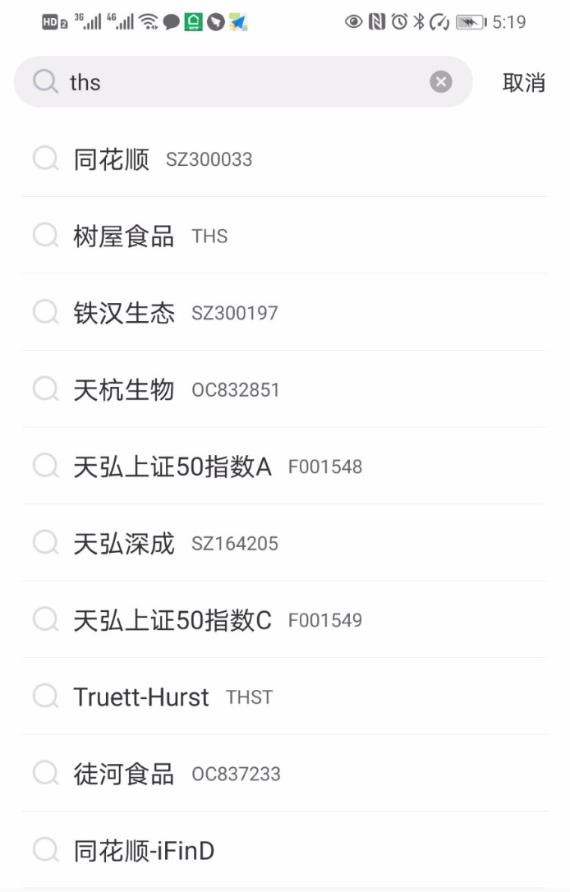
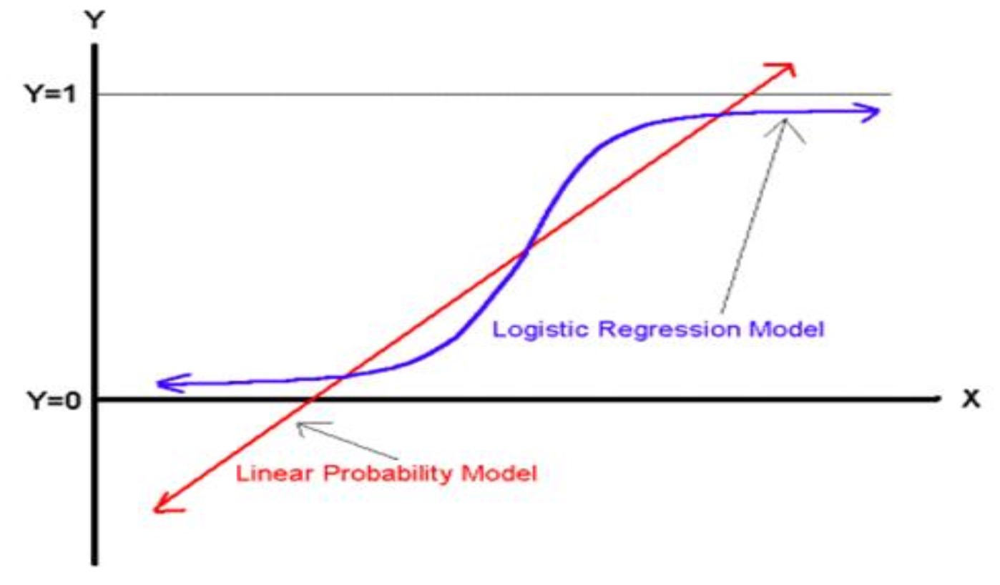
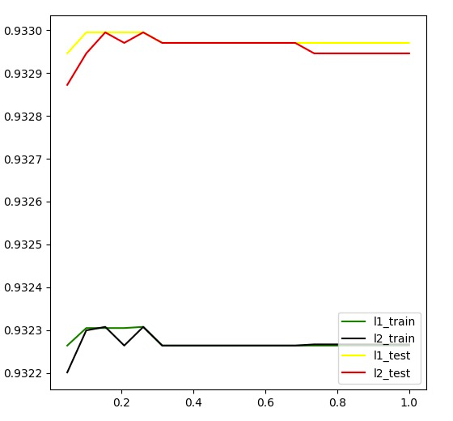
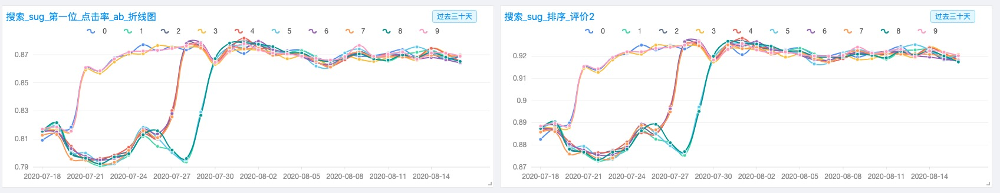

[TOC]

# 问题

钉钉群里经常反馈的问题。

| Badcase                                 | Target                                  |
| --------------------------------------- | --------------------------------------- |
|                     |                     |
|  |  |
|  |  |

原因：

sug 排序规则： query 与 symbol 全匹配优先级最高。


这条规则能否去掉？

不能。下图是 sug 第一位点击占比：81%。也就是这条规则解决了 81% 的问题，而上述问题就是剩下 19% 。


怎么解决剩下 19% 的问题呢？

从上边的 badcase 总结经验

1. 近期更热的股票，排名更高。
2. 退市的股票，排名更低。


绿色：在线系统已有排序因子。

红色：新增的排序因子。


**多因子排序**

怎么将这么多排序因子融合排序？

1. 规则系统：定义优先级。
2. 线性加权。


规则系统缺点

1. 容易规则冲突。
2. 线上代码逻辑复杂：各种规则堆砌。
3. 容易出现 bug。
4. 后期维护成本高：不易扩展。


线性加权

$$ score = w_1 * 是否全匹配 + w_2 * 匹配度 + w_3 * 粉丝数 + w_4 * 股票状态 + w_5 * 股票近期热度 $$

根据 socre 排序。

优点：

1. 在线代码简单，计算 score ，倒序。
2. 容易扩展，增减排序因子简单。

这种方式，在给帖子打分时也经常使用，比如：$score = 1*阅读数+ 2*点赞数 + 3*转发数 + 4*评论数+ 5*收藏数$


$[w_1,w_2,w_3,w_4,w_5]$ 怎么调权？

1. 拍脑袋。
2. 机器调权（LR）。


多因子排序场景：

1. 个性化广告 CTR 预估。
2. 搜索用户，股票，帖子。

# LR

## 机器学习基础概念

**什么是机器学习？**

计算机<font color="red">**自动**</font>从<font color="red">**数据**</font>中发现<font color="red">**规律**</font>，并应用于<font color="red">**解决新问题**</font>。

- 数据$(X_1,Y_1),(X_2,Y_2)...(X_n,Y_n)$ ，机器自动学习 X 和 Y 之间的关系，对于新 $X_i$ 能够预测 $Y_i$
  - 垃圾邮件识别：$(邮件_1,垃圾),(邮件_2,正常)...(邮件_n,垃圾)$
  - $邮件_x \Rightarrow $ 垃圾 or 正常 ?
- 输入规则到输入数据。
- 从机器执行到机器决策。


**机器学习执行框架**


**机器学习三要素**

- 模型
  - F(X) ：X -> Y 的映射。
  - 问题的影响因素（特征）有哪些？它们之间的关系如何？
- 策略
  - 什么样的模型是好的模型。
  - 损失函数：（最小化经验损失）。
    - log 对数损失函数
    - 0 - 1 损失函数
    - 绝对值损失函数
- 算法
  - 如何高效的找到最优参数。
    - 梯度下降法
    - 牛顿法
    - 最小二乘法
    - EM 算法


## LR

Logistic Regression （ 逻辑回归 ）：用于二分类。

Y ：{ 0 , 1 }

- 1：发生（用户会点击）
- 0：不发生（用户不会点击）

目标：根据特征 x ，预测发生概率：$p( y |x)$

$p(y=1|x) = y $         $p(y=0|x) = 1 - y $  

合并成一个公式：$p(y|x)=y*p(y=1|x)+(1-y)*p(y=0|x)$

### 模型

$$
y = f(wx) = \frac{1}{1+e^{-wx}}
$$

$  wx = w_1 * 是否全匹配 + w_2 * 匹配度 + w_3 * 粉丝数 + w_4 * 股票状态 + w_5 * 股票近期热度 $

$wx \in (-\infty ,+\infty)$

$f(wx) \in (0,1)$

sigmoid 函数：$ f(x) = \frac{1}{1+e^{x}}$



sigmoid 函数优点

1. 数据压缩能力，将数据压缩至 （0 , 1）
2. 处处连续，便于求导。
3. 两端不灵敏，分界面处灵敏。

### 策略

极大似然估计

假设：样本$(x_i,y_i)$ 独立同分布

每一个样本就是一个时间，整个样本集中事情同时发生的概率是：$\prod_i{p(x_i)}$    ，独立事件。

似然函数：$F(w) = \prod_i{f(wx_i)}= \prod_i{[y_i*p(y_i=1|x_i,w)+(1-y_i)*p(y_i=0|x_i,w)]}$


$y_i \in \{0,1\}$ 

如果 $y_i = 0$，那么$ f(wx_i)$ , 越大越好。

如果 $y_i = 1$，那么$ 1 - f(wx_i)$ , 越大越好。

在数据集上，先 log 然后求和，越大越好。


- 损失函数

  $L(w) = -\sum_i{[y_i*log(p(y_i=1|x_i,w))+(1-y_i)*log(p(y_i=0|x_i,w))]}$

  $=-\sum_i{(y_i*log(f(wx_i))+(1-y_i)log(1-f(wx_i)))}$

### 算法

最小化损失函数

$L(w) = -\sum_i{(y_i*log(f(wx_i))+(1-y_i)log(1-f(wx_i)))}$

这是一个凸优化问题，根据凸优化理论，经典数值优化算法：梯度下降法，牛顿法。

#### 梯度下降法

梯度：$\nabla L(w) = -\sum_i(y_i-f(wx_i))*x_i$


$y = f(wx) = \frac{1}{1+e^{-wx}}$

目标：最小化 L(w)

步骤：

1. 设置初始 w （随机数），计算 L(w)

2. 计算梯度：$ d = \nabla L(w)$

   下降方向：$dir = -\nabla L(w) $

3. $w^{new} = w + \lambda * dir$      $\lambda$ ：步长。

4. 计算 $L(w^{new})$

5. 如果 $L(w) - L(w^{new})$ 较小（收敛条件）或者达到轮数限制，停止；跳转到 2 。


计算梯度：

$f(wx) = \frac{1}{1+e^{-wx}}$

$$L(w)=-\sum_i{ ( y_i * log( f( wx_i )) + (1-y_i) log( 1-f(wx_i)))}$$

$=-\sum_i{ y_i log( \frac{1}{1+e^{ -wx_i }} )+(1-y_i)log( 1 - \frac{1}{1+e^{ -wx_i }} ) }$

令：$ a = e^{-wx}$

$=-\sum_i{ y_i log( \frac{1}{1+a} )+(1-y_i)log( 1 - \frac{1}{1+a} ) }$

$=-\sum_i{ y_i log( \frac{1}{1+a} )+(1-y_i)log(\frac{a}{1+a} ) }$

$=-\sum_i{ y_i log( \frac{1}{1+a} )+log( \frac{a}{1+a} )-y_ilog( \frac{a}{1+a} ) }$

$=-\sum_i{ y_i [log( \frac{1}{1+a} )-log(\frac{a}{1+a})]+log( \frac{a}{1+a} ) }$

$=-\sum_i{ y_ilog( \frac{1}{a} )+log( \frac{a}{1+a} ) }$

$代入 a = e^{-wx}$

$=-\sum_i{ y_ilog( \frac{1}{e^{-wx_i}} )+log( \frac{e^{-wx_i}}{1+e^{-wx_i}} ) }$

$=-\sum_i{ y_i(wx_i)+log( \frac{1}{1+e^{wx_i}} ) }$

$=-\sum_i{ y_i(wx_i)-log(1+e^{wx_i}) }$

对 w 求导

$\nabla L(w) =-\sum_i{ y_ix_i-(\frac{1}{1+e^{wx_i}})*e^{wx_i}x_i) } $

$=-\sum_i{ x_i(y_i-\frac{e^{wx_i}}{1+e^{wx_i}})}$

$=-\sum_i{ x_i(y_i-\frac{1}{1+e^{-wx_i}})}$

$=-\sum_i{ x_i(y_i-f(wx_i))}$


#### 牛顿法

Hession 矩阵：$\nabla \nabla L(w) = \sum_i {f(wx_i)(1-f(wx_i))x_ix_i^T }$

牛顿下降方向：$dir = (\nabla\nabla L(w))^{-1}(-\nabla L(w))$


## 正则化框架

###  过拟合与欠拟合


误差：模型预测结果与样本真实结果之间的差异。

训练误差（经验误差）：模型预测在训练集上的误差。

泛化误差：模型在新样本上的误差。

我们希望获得泛化误差较小的模型。


过拟合：训练误差非常小，将训练样本自身的一些特点，当作了所有潜在样本都会具有的一般性质了，这样就会导致泛化能力下降。

欠拟合：对训练样本的一般性质尚未学好。


应对欠拟合：

- 增加训练的轮数。
- 训练集数据不够，补充训练集。
- 提高特征刻画能力。

缓解过拟合

- 加正则化项。
- 通过交叉验证（度量泛化误差）。


目的：提高模型的泛化能力。控制模型复杂度。

奥卡姆剃刀：如无必要，勿增实体。


正则化框架

$min_w L(w) + \lambda r(w)$

L(w) ：经验损失，越小表示训练数据上拟合程度越高。

$\lambda $：折中因子

r(w)：正则化项，越小表示模型复杂度越小。


常用的正则化项

- L1 范数正则：$||w||_1=\sum_i|w_i|$
- L2 范数正则：$w^2=\sum_iw_i^2$
- Lp 范数正则：$||w||_P=\sum_i|w_i|^P$


# 工程实现


## 离线训练

目标：根据用户点击数据，训练 LR 模型，在线预估用户对 sug 点击率，根据点击率排序。 

### 准备训练数据

$ score = w_1 * 是否全匹配 + w_2 * 匹配度 + w_3 * 粉丝数 + w_4 * 股票状态 + w_5 * 股票近期热度 $

$(X_1,Y_1),(X_2,Y_2)...(X_n,Y_n)$

例子：

X1 = [ 是否全匹配, 匹配度，粉丝数，股票状态，股票近期热度 ]

Y1 = {1,0} 

- 1：用户点击
- 0：没有点击

用户 sug 点击日志

```mysql
SELECT REGEXP_EXTRACT(extend0,'input":"?([^,"|}]+)',1) AS input,
REGEXP_EXTRACT(extend0,'query":"?([^,"|}]+)',1) AS query,
REGEXP_EXTRACT(extend0,'rank":"?([^,"|}]+)',1) AS rank
FROM web_mobile.user_behavior
WHERE ds LIKE '20200609%'
  AND page_id = 2200
  AND component_type =19
  AND extend0 like '%input%'
```


缺少展示数据（之前没有记录）

分析：线上 sug 没有个性化，相同的 query 在返回的是相同的内容。

通过逆向功能生成展示数据：

```python
# sug 接口 ( 是否全匹配，匹配度，分数数 )
http://10.10.33.23:8080/query/v1/suggest?q=

# 股票接口（股票状态）
http://api.inter.xueqiu.com/internal/v5/stock/batch/quote.json?symbol=
  
# 股票近期热度(股票覆盖度不够，不可以使用)
http://stock.xueqiu.com/v5/stock/screener/quote/list.json?order=desc&order_by=value&page=1&size=100&type=hot_1h&_=1586418778761&x=0.500
```

股票近期热度

```mysql
 WITH t as
  ( SELECT REGEXP_EXTRACT(extend0,'symbol":"?([^,"|}]+)',1) AS `symbol`
   FROM web_mobile.user_behavior
   WHERE ds LIKE '20200617%'
     AND page_id = 1600
     AND component_type =1)
SELECT `symbol`,
       count(1) AS c
FROM t
GROUP BY `symbol`
```

### 模型训练

训练模型

```python
from sklearn.linear_model import LogisticRegression as LR

class SugRank:
    def __init__(self):
        self.model = LR(penalty="l2", solver="liblinear", C=0.2, max_iter=1000)
    
    def train(self, fileName):
        # 加载训练数据
        x = []
        y = []
        # 特征选择时使用
        feature_selector = set(range(100)) - set([])
				
        for line in open(fileName, "r"):
            try:
                data = line.strip().split(",")
                y.append(int(data[0]))
                x_feature = [float(data[i]) for i in range(1, len(data)) if i in feature_selector] 
                x.append(x_feature)
            except Exception as e:
                print("load data:", line, e)
        # 训练
        self.model = self.model.fit(x, y)
        # 导出模型
        self.w = self.model.coef_[0]
        self.b = self.model.intercept_[0]
```


**模型评估**

混淆矩阵适用于：二分类问题。

如果是多分类，转换成二分类问题。

一级指标：

- TP( True Postive )：真实值是 postive , 模型预测是 postive 的样本数。真阳性

- FN( False Negative )：真实值是 postive , 模型预测是 negative 的样本数。假阴性

- FP( False Postive )：真实值是 Negative , 模型预测是 postive 的样本数。假阳性

- TN( True Negative )：真实值是 Negative , 模型预测是 negative 的样本数。真阴性

对角线上数据值（TP，TN）越大越好。

|            | 预测值 = 1 | 预测值 = 0 |
| ---------- | ---------- | ---------- |
| 真实值 = 1 | TP         | FN         |
| 真实值 = 0 | FP         | TN         |

二级指标

- 准确率（Accuracy）= $\frac{TP+TN}{TP+TN+FP+FN}$ --- 针对整个模型

- 精确率( precision ) = $ \frac{TP}{TP+ FP}$  --- 针对某一类别预测精确率

- 召回率( recall ) = $\frac{TP}{TP+FN}$   --- 针对某一类别真实数据召回情况

- 特异度( specificity ) = $\frac{TN}{TN+FP}$


三级指标

- F1-值(  F1-score )  = $ \frac{2PR}{P+R} =\frac{2*TP}{2*TP+FP+FN}$ ：精确率和召回率的调和平均数。

P：precision

R：recal

更复杂评价指标：ROC 曲线和 AUC 值


**调参**

```python
from sklearn.linear_model import LogisticRegression as LR
from sklearn.model_selection import train_test_split
from sklearn.metrics import accuracy_score

# 绘图
import numpy as np
import matplotlib.pyplot as plt


l1_train = []
l2_train = []
l1_test = []
l2_test = []

x_train, x_test, y_train, y_test = train_test_split(x, y, test_size=0.1, random_state=300)

# np.linspace(起始数，终止数，个数)
# np.linspace(0.05,1,19)：[0.05,1] 均匀生成19个数
for i in np.linspace(0.05, 1, 19):
    lrl1 = LR(penalty="l1", solver="liblinear", C=i, max_iter=1000)
    lrl2 = LR(penalty="l2", solver="liblinear", C=i, max_iter=1000)

    lrl1 = lrl1.fit(x_train, y_train)
    l1_train.append(accuracy_score(lrl1.predict(x_train), y_train))
    l1_test.append(accuracy_score(lrl1.predict(x_test), y_test))

    lrl2 = lrl2.fit(x_train, y_train)
    l2_train.append(accuracy_score(lrl2.predict(x_train), y_train))
    l2_test.append(accuracy_score(lrl2.predict(x_test), y_test))

graph = [l1_train, l2_train, l1_test, l2_test]
color = ["green", "black", "yellow", "red"]
label = ["l1_train", "l2_train", "l1_test", "l2_test"]

# 6*6 的画布
plt.figure(figsize=(6, 6))
for i in range(len(graph)):
    plt.plot(np.linspace(0.05, 1, 19), graph[i], color[i], label=label[i])

plt.legend(loc=4)
plt.show()
```


效果：比猜略微好。


新增特征：sug 召回位置。


新增特征：query 下 stock 的点击率

$rate = \frac{queryStockClickCount}{queryClickCount}$



## 在线排序

### 系统架构图

$y = f(wx) = \frac{1}{1+e^{-wx}}$


### 在线智能排序


### 特征工程


### 评测

[AIBO 大数据平台](http://aibo.inter.snowballfinance.com/panel/details/321)



左图：sug 第一位的点击率：$\frac{第一位点击数}{总点击数}$

右图：sug Mean reciprocal rank：

$MRR = \frac{1}{|click|} \sum_i^{|click|}{\frac{1}{rank_i}}$


### badcase 自动发现

