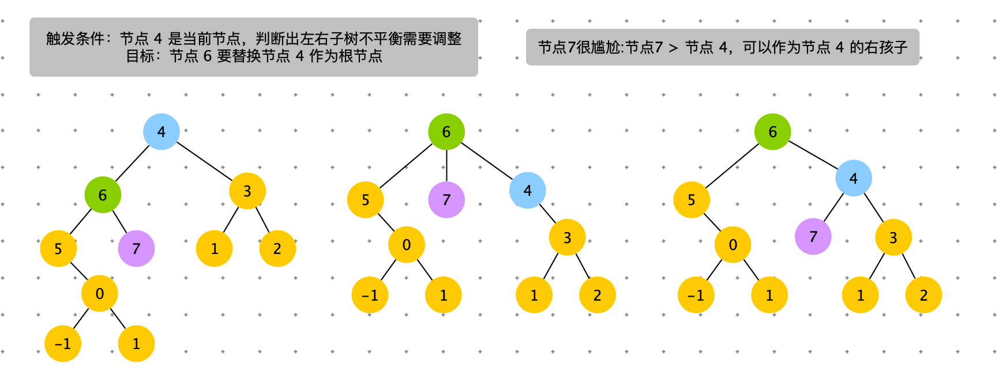
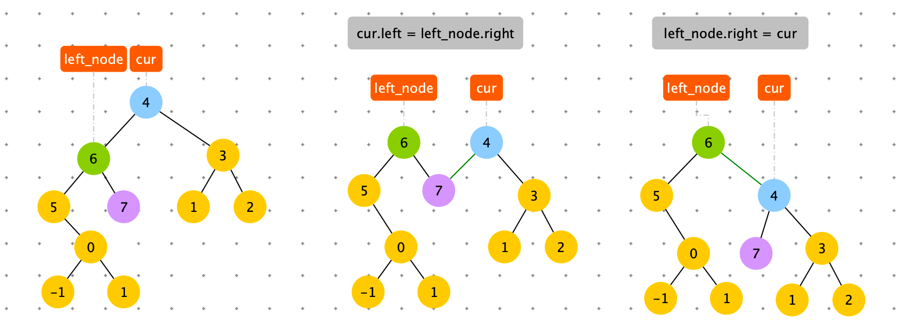

[TOC]

# 概述

## 有序表的简单介绍


有序表和哈希表的本质区别就是：哈希表的 Key 是通过 Hash 函数散列组织的，而有序表的 Key 是顺序组织的。


1. 有序表在使用层面上可以理解为一种<font color=green>**集合**</font>结构
2. 如果只有 key，没有伴随数据 value，可以使用 TreeSet 结构
3. 如果既有 key，又有伴随数据 value，可以使用 TreeMap 结构
4. 有无伴随数据，是 TreeSet 和 TreeMap 唯一的区别，底层的实际结构是一回事
5. 有序表和哈希表的区别是，有序表把 key 按照顺序组织起来，而哈希表完全不组织
6. 红黑树、AVL 树、size-balance-tree 和 跳表等都属于有序表，只是底层具体实现不同
7. 放入有序表中的数据，如果是基础类型，内部按值传递，内存占用就是数据的大小
8. 放入有序表中的数据，如果不是基础类型，必须提供比较器，内部按引用传递，内存占用是数据内存地址的大小
9. 不管是什么底层具体实现，只要是有序表，都有固定的基本功能和固定的时间复杂度。


## 有序表的固定操作

以下所有操作的时间复杂度都是：<font color=orange>O( logN )</font>，N 为有序表含有的记录数


1.  put(key , value) ：将一个（key，value）记录加入到表中，或者将 key 的记录更新成 value
2.  V get( key )：根据给定的 key，查询 value 并返回。
3.  remove( key )：移除 key 的记录
4.  containsKey( key )：询问是否有关于 key 的记录 
5.  <font color=green>K firstKey()：返回所有键值的排序结果中，最左（最小）的那个</font>
6.  <font color=green>K lastKey()：返回所有键值的排序结果中，最右（最大）的那个</font>
7.  <font color=green>K floorKey( key )：如果表中存入过 key，返回 key，否则返回所有键值的排序结果中，key 的前一个</font>
8.  <font color=green>K ceilingKey( key )：如果表中存入过 key，返回 key，否则返回所有键值的排序结果中，key 的后一个</font>


```java
public static void main(String[] args) {
    TreeMap<Integer, String> treeMap = new TreeMap<Integer, String>();

    treeMap.put(7, "我是7");
    treeMap.put(5, "我是5");
    treeMap.put(4, "我是4");
    treeMap.put(3, "我是3");
    treeMap.put(9, "我是9");
    treeMap.put(2, "我是2");

    System.out.println(treeMap.containsKey(5));
    System.out.println(treeMap.get(5));
    System.out.println(treeMap.firstKey() + ",我最小");
    System.out.println(treeMap.lastKey() + ",我最大");
    System.out.println(treeMap.floorKey(8) + ",在表中所有 <= 8 的数中，我离 8 最近");
    System.out.println(treeMap.ceilingKey(8) + ",在表中所有 >= 8 的数中，我离 8 最近");
    System.out.println(treeMap.floorKey(7) + ",在表中所有 <= 7 的数中，我离 7 最近");
    System.out.println(treeMap.ceilingKey(7) + ",在表中所有 >= 7 的数中，我离 7 最近");
  
    treeMap.remove(5);
  
  System.out.println(treeMap.get(5) + ",删除就没有了哦");
}
```


## 常见的有序表

如果使用数组实现：put 和 remove 时需要移动数据。

如果使用链表实现：查询类都不满足 O(log N)

如果使用 HashMap 实现：HashMap 中是无序的，所以 firstKey，lastKey，floorKey，ceilingKey 操作不能满足时间复杂度：O(log N)

- Binary Search Tree

  - SB（Size Blanced Tree）

  - AVL 树

  - 红黑树

- 跳表


# Binary Search Tree

二叉搜索树：支持快速查找，插入，删除一个数据。（log N）

定义：

1. 根节点 > 左节点
2. 根节点 < 右节点

性质：BST 中序遍历：结果是升序。

```python
class Node:
    def __init__(self, data):
        self.data = data
        self.left = None
        self.right = None
```


## Find


```python
  def find(self, data):
        p = self.root
        while p:
            if data < p.data:
                p = p.left
            elif data > p.data:
                p = p.right
            else:
            	return p
```

与二分查有异曲同工之妙。


## 插入

新插入的数据一般都是在叶子节点上。

查找插入位置。


```python
    def insert(self, data):
        if not self.root:
            self.root = Node(data)
            return

        # 查找插入位置:节点 51
        temp = self.root
        while temp:
            p = temp
            temp = temp.left if data < temp.data else temp.right
        
        if data < p.data:
            p.left = Node(data)
        else:
            p.right = Node(data)
```


## 删除

真删除

删除操作分为三种情况：

1. 要删除的节点没有子节点，将其父指向它的指针设为 null。
2. 要删除的节点只有一个子节点，将其父节点指向它的指针，指向其子节点即可。
3. 要删除的节点有两个子节点，找到这个节点右子树中最小的结点 min，将最小节点的值赋给要删除的节点，然后删除最小节点（或者找到这个节点左子树中最大的结点 max，用最大节点的值覆盖要删除节点的值，然后删除最大节点）。


代码：

```python
    def remove(self, data):
        # p 指向要删除的节点
        p = self.root
        # p 的父节点
        pp = Node
        while p and p.data != data:
            pp = p
            if data > p.data:
                p = p.right
            else:
                p = p.left

        # 没有找到
        if p is None: return

        # 要删除的结点有两个子节点
        if p.left and p.right:
            # 查找右子树中，最小节点
            min_p = p.right
            min_pp = p
            while min_p.left:
                min_pp = min_p
                min_p = min_p.left
            # 将 min_p 的数据替换到 p 中
            p.data = min_p.data
            # 下边变成要删除 min_p
            p = min_p
            pp = min_pp

        # 要删除节点是叶子节点或者仅有一个子节点
        # child 是 p 的子节点
        if p.left:
            child = p.left
        elif p.right:
            child = p.right
        else:
            child = None

        # 要删除的节点是根节点
        if pp is None:
            self.root = child
        elif pp.left == p:
            pp.left = child
        else:
            pp.right = child
```

软删除

删除时，将节点标记为“已删除”，这样删除和查找一样。

浪费空间，但是操作简单了很多。


## 查找最大节点

查找最大节点：一直右下去。


```python
    def last(self):
        cur = self.root
        while cur:
            if cur.right:
                cur = cur.right
            else:
                return cur.data
```


## 查找最小节点

查找最小节点：一直左下去


```python
    def first(self):
        cur = self.root
        while cur:
            if cur.left:
                cur = cur.left
            else:
                return cur.data
```


## floor

如果表中存入过 key，返回 key，否则返回所有键值的排序结果中，key 的前一个。


```python
    def floor(self, data):
        res = None
        cur = self.root
        while cur:
            if cur.data == data:
                return cur
            if cur.data > data:
                cur = cur.left
            else:
                res = cur
                cur = cur.right
        return res
```


## ceiling

如果表中存入过 key，返回 key，否则返回所有键值的排序结果中，key 的后一个。


```python
    def ceiling(self, data):
        res = None
        cur = self.root
        while cur:
            if cur.data == data:
                return cur
            if cur.data > data:
                res = cur
                cur = cur.left
            else:
                cur = cur.right
        return res
```


二叉查找树满足下边所有操作时间复杂度为 O ( log N )

1.  put(key , value) ：将一个（key，value）记录加入到表中，或者将 key 的记录更新成 value
2.  V get( key )：根据给定的 key，查询 value 并返回。
3.  remove( key )：移除 key 的记录
4.  containsKey( key )：询问是否有关于 key 的记录 
5.  <font color=green>K firstKey()：返回所有键值的排序结果中，最左（最小）的那个</font>
6.  <font color=green>K lastKey()：返回所有键值的排序结果中，最右（最大）的那个</font>
7.  <font color=green>K floorKey( key )：如果表中存入过 key，返回 key，否则返回所有键值的排序结果中，key 的前一个</font>
8.  <font color=green>K ceilingKey( key )：如果表中存入过 key，返回 key，否则返回所有键值的排序结果中，key 的后一个</font>


## 二叉查找树的问题


1. 根节点左右子树极度不平衡，将退化为链表。这样查找的时间复杂度就变为：O(n).

   最理想的情况：完全二叉树（或者满二叉树）：查找的时间复杂度：$O(log_2{n})$


如何构建一棵不管怎么删除，插入数据，都是保持任意节点的左右子树都比较平衡的二叉查找树？


- SB（Size Blanced Tree）

- AVL 树

- 红黑树

这三棵树是在二叉搜索树基础上，解决了二叉搜索树的平衡性问题。


# Size Balanced Tree


平衡性的定义：

1. 每棵子树的大小（节点个数），不小于其兄弟的子树大小。既每棵叔叔树的大小，不小于其任何侄子树的大小。

```python
class Node:
    def __init__(self, key, value):
        self.key = key
        self.value = value
        self.size = 1
        self.left = None
        self.right = None
```


## 平衡性解决方案

### 左旋

触发条件：cur = 节点 4，cur.right.right.size > cur.left.size。出现右边子树节点数太多。通过左旋，将 cur.right 的结点替换 cur 节点。


具体过程如下图


```python
# 左旋
def left_rotate(self, cur: Node):
    right_node = cur.right
    cur.right = right_node.left
    right_node.left = cur
    # 此时 right_node 成为父节点
    right_node.size = cur.size
    cur.size = (cur.left.size if cur.left else 0) + (cur.right.size if cur.right else 0) + 1
    return right_node
  
# 左旋触发时机
if right_right_size > left_size:  # 左旋
   cur = self.left_rotate(cur)
   cur.left = self.maintain(cur.left)
   cur = self.maintain(cur)
```


### 右旋

触发条件：cur = 节点 4，cur.left.left.size > cur.right.size。出现左边子树节点数太多。通过右旋，将 cur.left 的结点替换 cur 节点。

具体过程如下图






```python
    # 右旋
    def right_rotate(self, cur: Node):
        left_node = cur.left
        cur.left = left_node.right
        left_node.right = cur
        # 此时 left_node 成为父节点
        left_node.size = cur.size
        cur.size = (cur.left.size if cur.left else 0) + (cur.right.size if cur.right else 0) + 1
        return left_node
      
# 右旋触发时机
if left_left_size > right_size:
   cur = self.right_rotate(cur)
   cur.right = self.maintain(cur.right)
   cur = self.maintain(cur)
```


### 左旋 + 右旋

触发条件：cur = 节点 4，cur.left.right.size > cur.right.size。出现左边子树节点数太多。通过右旋，将 cur.left 的结点替换 cur 节点。

具体过程如下图


```python
# 左旋，右旋：触发时机
if left_right_size > right_size:  # 左旋，右旋
   cur.left = self.left_rotate(cur.left)
   cur = self.right_rotate(cur)
   # 检查cur.left 是否平衡
   cur.left = self.maintain(cur.left)
   # 检查cur.right 是否平衡
   cur.right = self.maintain(cur.right)
   cur = self.maintain(cur)
```


### 右旋 + 左旋

触发条件：cur = 节点 4，cur.right.left.size > cur.left.size。出现左边子树节点数太多。通过右旋，将 cur.left 的结点替换 cur 节点。

具体过程如下图


```python
# 右旋，左旋：触发时机
if right_left_size > left_size:  # 右旋，左旋
   cur.right = self.right_rotate(cur.right)
   cur = self.left_rotate(cur)
   cur.left = self.maintain(cur.left)
   cur.right = self.maintain(cur.right)
   cur = self.maintain(cur)
```


旋转触发的时机

新增数据，删除数据后，调用一下 maintain

```python
    def maintain(self, cur: Node):
        if not cur: return

        left_size = cur.left.size if cur.left else 0
        left_left_size = cur.left.left.size if cur.left and cur.left.left else 0
        left_right_size = cur.left.right.size if cur.left and cur.left.right else 0
        right_size = cur.right.size if cur.right else 0
        right_right_size = cur.right.right.size if cur.right and cur.right.right else 0
        right_left_size = cur.right.left.size if cur.right and cur.right.left else 0

        # 右旋
        if left_left_size > right_size:
            cur = self.right_rotate(cur)
            cur.right = self.maintain(cur.right)
            cur = self.maintain(cur)
        elif left_right_size > right_size:  # 左旋，右旋
            cur.left = self.left_rotate(cur.left)
            cur = self.right_rotate(cur)
            cur.left = self.maintain(cur.left)
            cur.right = self.maintain(cur.right)
            cur = self.maintain(cur)
        elif right_right_size > left_size:  # 左旋
            cur = self.left_rotate(cur)
            cur.left = self.maintain(cur.left)
            cur = self.maintain(cur)
        elif right_left_size > left_size:  # 右旋，左旋
            cur.right = self.right_rotate(cur.right)
            cur = self.left_rotate(cur)
            cur.left = self.maintain(cur.left)
            cur.right = self.maintain(cur.right)
            cur = self.maintain(cur)

        return cur
```


## AVL 树

AVL 树是一种平衡二叉树，得名于其发明者的名字（ Adelson-Velskii 以及 Landis）。

平衡性定义：左右子树的高度差小于等于 1。

```python
class Node:
    def __init__(self, key, value):
        self.key = key
        self.value = value
        self.height = 1
        self.left = None
        self.right = None
```


## 红黑树

红黑树的定义：

1. 任何一个节点都有颜色，黑色或者红色
2. 根节点是黑色的
3. 父子节点之间不能出现两个连续的红节点
4. 任何一个节点向下遍历到其子孙的叶子节点，锁经过的黑色节点个数必须相等。
5. 空节点被认为是黑色节点


## SkipLists

- 跳表是一个随机化的搜索数据结构


1.  put(key , value) ：将一个（key，value）记录加入到表中，或者将 key 的记录更新成 value
2.  V get( key )：根据给定的 key，查询 value 并返回。
3.  remove( key )：移除 key 的记录
4.  containsKey( key )：询问是否有关于 key 的记录 
5.  <font color=green>K firstKey()：返回所有键值的排序结果中，最左（最小）的那个</font>
6.  <font color=green>K lastKey()：返回所有键值的排序结果中，最右（最大）的那个</font>
7.  <font color=green>K floorKey( key )：如果表中存入过 key，返回 key，否则返回所有键值的排序结果中，key 的前一个</font>
8.  <font color=green>K ceilingKey( key )：如果表中存入过 key，返回 key，否则返回所有键值的排序结果中，key 的后一个</font>


跳表的 NB 之处：

1. 思想先进：跳表不再使用硬规则来数据的平衡性，而是使用概率保证。
2. 由于使用概率随机生成数据层，与用户输入的数据无关。


跳表时间复杂度评估

第 0 层：N 个节点（每个节点必在第 0 层）

第 1 层：$\frac{N}{2}$ 个节点

第 2 层：$\frac{N}{4}$ 个节点

第 3 层：$\frac{N}{8}$ 个节点

...

第 k 层：$\frac{N}{2^k}$ 个节点

类似满二叉树


## 查找数据

查找 50 。从 head 的最上层开始查找，如果节点小于 50 就 next，否则就下降一层查找。


```python
    def find(self, value):
        p = self.head
        for i in range(len(self.head.next_nodes) - 1, -1, -1):
            while p.next_nodes[i] and p.next_nodes[i].value < value:
                p = p.next_nodes[i]

        if p.next_nodes[0] and p.next_nodes[0].value == value:
            return p.next_nodes[0].value
```


## 添加数据

新增数据 70，随机出 70 需要的层数（以等概率出现 0 和 1 ，当出现 1 时层数+1，当出现 0 时结束。但是要保证至少有一层）

如下图：70 随机出了 7 层 大于 head 的层数，所以 head 需要扩展层数到 7 层。


```python
    def expand_head(self, level):
        n = len(self.head.next_nodes)
        if level < n:
            return
        for _ in range(level - n):
            self.head.next_nodes.append(None)

    def get_random_level(self):
        res = 0
        while int(random.random() * 2) != 0:
            res += 1
        
        return min(max(res,1), math.log (self.node_count + 1))
```


查找插入为位置：从 head 的最上层开始查找，寻找每一层小于  70 的最后的节点。


插入节点：根据 70 节点的层数，从上向下加入到每一层，加入位置就是上边查找的位置。


```python
    def insert(self, value):
        self.insert_level(value, self.get_random_level())

    def insert_level(self, value, level):
        self.expand_head(level)

        new_node = Node(value, level)
        update_arr = [self.head] * len(self.head.next_nodes)
        p = self.head

        n = len(self.head.next_nodes)
        for i in range(n - 1, -1, -1):
            while p.next_nodes[i] and p.next_nodes[i].value < value:
                p = p.next_nodes[i]
            update_arr[i] = p

        # 加入 new_node
        for i in range(level):
            new_node.next_nodes[i] = update_arr[i].next_nodes[i]
            update_arr[i].next_nodes[i] = new_node
```


## 删除数据

删除节点 15

查找删除为位置：从 head 的最上层开始查找，寻找每一层小于  15 的最后的节点。


删除节点：如果上一步的节点的 node.next_node.value = 15，那么 node.next_node = node.next_node.next_node


```python
    def delete(self, value):
        n = len(self.head.next_nodes)
        update_arr = [None] * n
        p = self.head
        # 查找需要更新结点
        for i in range(n - 1, -1, -1):
            while p.next_nodes[i] and p.next_nodes[i].value < value:
                p = p.next_nodes[i]
            update_arr[i] = p

        # 如果没有删除节点，直接返回
        if p.next_nodes and p.next_nodes[0].value != value: return

        # 删除节点
        for i in range(n - 1, -1, -1):
            if update_arr[i].next_nodes[i] and update_arr[i].next_nodes[i].value == value:
                update_arr[i].next_nodes[i] = update_arr[i].next_nodes[i].next_nodes[i]
```


## floor


floor(60)； node = 50

```python
# 如果表中存入过 value，返回 value，否则返回所有键值的排序结果中，value 的前一个
def floor(self, value):
    node = self.find(value)
    if node.next_nodes[0] and node.next_nodes[0].value == value:
        return value
    return node.value
```


## ceiling

floor(60)；node = 50；node.next_nodes[0].value = 70

```python
# 如果表中存入过 value，返回 value，否则返回所有键值的排序结果中，value 的后一个
def ceiling(self, value):
    node = self.find(value)
    if node.next_nodes[0] and node.next_nodes[0].value == value:
        return value

    if node.next_nodes[0]:
        return node.next_nodes[0].value
```


业务中经常需要存储一些伴随数据（业务数据）

```python
import random

class Node:
    def __init__(self, key, value, max_level):
      	# 伴随数据
        self.value = value
        self.key = key
        self.next_nodes = [None] * max_level

    def __lt__(self, other):
        return self.key < other

    def __eq__(self, other):
        return self.key == other

    def __ge__(self, other):
        return self.key > other

class SkipListMap:
    def __init__(self):
        self.head = Node(-1, -1, 1)

    def insert(self, key, value):
        self.insert_level(key, value, self.get_random_level())

    def insert_level(self, key, value, level):
        self.expand_head(level)

        new_node = Node(key, value, level)

        update_arr = [self.head] * len(self.head.next_nodes)
        p = self.head

        n = len(self.head.next_nodes)
        for i in range(n - 1, -1, -1):
            while p.next_nodes[i] and p.next_nodes[i].key < key:
                p = p.next_nodes[i]
            update_arr[i] = p

        # 加入 new_node
        for i in range(level):
            new_node.next_nodes[i] = update_arr[i].next_nodes[i]
            update_arr[i].next_nodes[i] = new_node

    def delete(self, key):
        n = len(self.head.next_nodes)
        update_arr = [None] * n
        p = self.head
        # 查找需要更新结点
        for i in range(n - 1, -1, -1):
            while p.next_nodes[i] and p.next_nodes[i].key < key:
                p = p.next_nodes[i]
            update_arr[i] = p

        # 删除节点
        if p.next_nodes and p.next_nodes[0].value != key: return

        # 删除节点
        for i in range(n - 1, -1, -1):
            if update_arr[i].next_nodes[i] and update_arr[i].next_nodes[i].value == key:
                update_arr[i].next_nodes[i] = update_arr[i].next_nodes[i].next_nodes[i]

    def expand_head(self, level):
        n = len(self.head.next_nodes)
        if level < n:
            return
        for _ in range(level - n):
            self.head.next_nodes.append(None)

    def get_random_level(self):
        res = 1
        while int(random.random() * 2) != 0:
            res += 1
        return res

    def find(self, key):
        p = self.head
        for i in range(len(self.head.next_nodes) - 1, -1, -1):
            while p.next_nodes[i] and p.next_nodes[i].key < key:
                p = p.next_nodes[i]

        return p

    def __contains__(self, item):
        node = self.find(item)
        return node.next_nodes[0] and node.next_nodes[0].key == item

    def first(self):
        return self.head.next_nodes[0].key

    def last(self):
        p = self.head
        n = len(self.head.next_nodes)
        for i in range(n - 1, -1, -1):
            while p.next_nodes[i]:
                p = p.next_nodes[i]

        return p.key

    def floor(self, key):
        node = self.find(key)
        if node.next_nodes[0] and node.next_nodes[0].value == key:
            return key
        return node.key

    def ceiling(self, key):
        node = self.find(key)
        if node.next_nodes[0] and node.next_nodes[0].value == key:
            return key

        if node.next_nodes[0]:
            return node.next_nodes[0].key

skipList = SkipListMap()
skipList.insert_level(3, None, 3)
skipList.insert_level(10, None, 2)
skipList.insert_level(15, None, 4)
skipList.insert_level(20, None, 6)
skipList.insert_level(30, None, 1)
skipList.insert_level(40, None, 4)
skipList.insert_level(50, None, 5)
skipList.insert_level(70, None, 2)
skipList.insert_level(100, None, 6)

print(40 in skipList)
print(60 in skipList)

print(skipList.first())
print(skipList.last())
print("-" * 100)
print(skipList.ceiling(50))
print(skipList.ceiling(60))

print(skipList.floor(50))
print(skipList.floor(60))
```


# 应用

> 为了找到自己满意的工作，牛牛收集了每种工作的难度和报酬。牛牛选工作的标准是在难度不超过自身能力值的情况下，牛牛选择报酬最高的工作，在牛牛选定了自己的工作以后，牛牛的小伙伴们来找牛牛帮忙选工作，牛牛依然使用自己的标准来帮助小伙伴。牛牛的小伙伴太多了，于是他只好把这个任务交给了你。
>
> 输入参数：
>
> - Job_arr：表示所有的工作。
> - Int_arr：表示所有小伙伴的能力值。
>
> 返回数据：int_arr 表示每个小伙伴按照牛牛的标准选工作后所能获得的报酬。


步骤：

1. hard 升序，money 降序，对 job_arr 排序
2. 将 hard 相同，money 最大的 job 加入有序表（TreeMap），如果当前 money 小于之前的 job 也要排除（例如任务3的money 小于任务 2）。
3. 遍历 int_arr 数据，从有序表 treeMap floorEntry （获取能力能达到最大Job，将对应money 写入 result ）


```java
public static class Job {
        // 工作报酬
        public int money;
        // 工作难度
        public int hard;

        public Job(int hard, int money) {
            this.money = money;
            this.hard = hard;
        }
    }

    public static class JobComparator implements Comparator<Job> {
        @Override
        public int compare(Job o1, Job o2) {
            return o1.hard != o2.hard ? o1.hard - o2.hard : o2.money - o1.money;
        }
    }

    public static int[] getMoneys(Job[] jobs, int[] ability) {
        Arrays.sort(jobs, new JobComparator());
        TreeMap<Integer, Integer> treeMap = new TreeMap<>();

        int money = 0;
        for (Job job : jobs) {
            if (treeMap.containsKey(job.hard) || job.money <= money) {
                continue;
            }
            money = Math.max(money, job.money);
            treeMap.put(job.hard, job.money);
        }

        int[] res = new int[ability.length];

        for (int i = 0; i < ability.length; i++) {
            int item = ability[i];
            Map.Entry<Integer, Integer> entry = treeMap.floorEntry(item);
            if (entry == null) {
                continue;
            }
            res[i] = entry.getValue();
        }
        return res;
    }

    public static int[] getMoneys2(Job[] jobs, int[] ability) {
        Arrays.sort(jobs, new JobComparator());
        TreeMap<Integer, Integer> treeMap = new TreeMap<>();

      	// 由于已经排序，hard 相同并且 money 大的一定排在第一名，只需要将第一名插入 treeMap 中
      	// 需要 pre 记录每组的第一个 job，即可区分不同的组
      	// 时间复杂度从 O(N log N) 下降到 O(N)
        Job pre = jobs[0];
        for (int i = 1; i < jobs.length; i++) {
            if (jobs[i].hard != pre.hard && jobs[i].money > pre.money) {
                treeMap.put(jobs[i].hard, jobs[i].money);
                pre = jobs[i];
            }
        }

        int[] res = new int[ability.length];

        for (int i = 0; i < ability.length; i++) {
            int item = ability[i];
            Map.Entry<Integer, Integer> entry = treeMap.floorEntry(item);
            if (entry == null) {
                continue;
            }
            res[i] = entry.getValue();
        }
        return res;
    }

    public static void main(String[] args) {
        Job[] jobs = new Job[8];
        jobs[0] = new Job(3, 5);
        jobs[1] = new Job(2, 7);
        jobs[2] = new Job(9, 100);
        jobs[3] = new Job(1, 4);
        jobs[4] = new Job(2, 6);
        jobs[5] = new Job(3, 3);
        jobs[6] = new Job(1, 1);
        jobs[7] = new Job(2, 8);
        int[] ability = new int[]{0, 2, 8, 9, 10};
        
        for (int item : getMoneys(jobs, ability)) {
            System.out.println(item);
        }
    }
```

