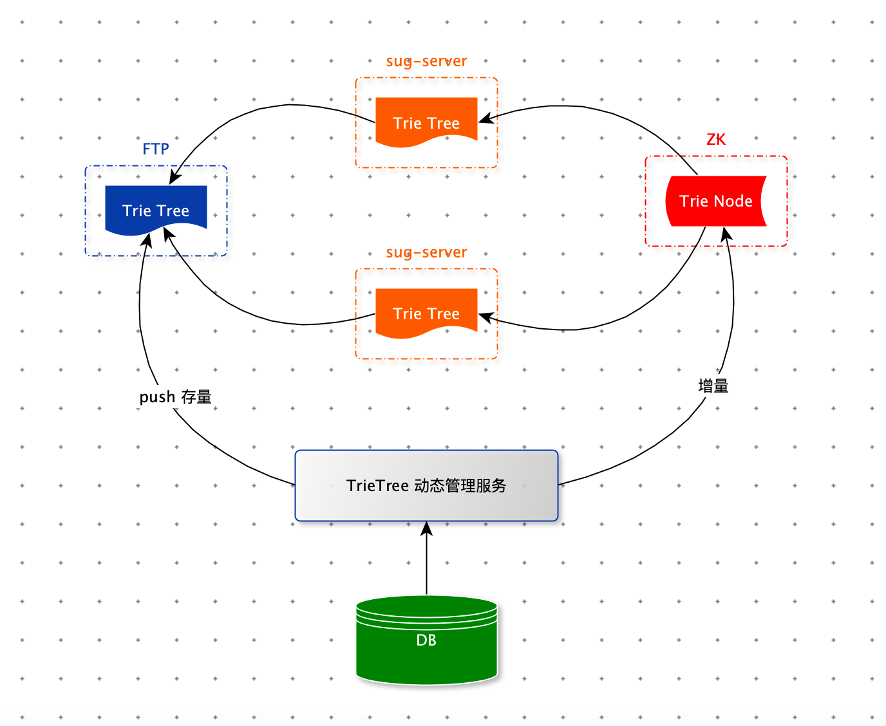

[TOC]

# 一、背景

​		搜索关键字智能提示是一个搜索应用的标配，主要作用是避免用户输入错误的搜索词，并将用户引导到相应的关键词上，以提升用户搜索体验。

​		雪球以连接人与资产，让财富的雪球越滚越大为使命，在投资社区领域处于领先地位。为了让用户快速找到目标的股票，大V。我们基于 ES 实现了股票搜索模块。用户在查找股票时主要输入股票名，股票symbol 进行搜索，为了提升用户体验和输入效率，本文实现了一种基于 Trie Tree 前缀匹配查询关键词只能提示（Suggestion）实现。


# 二、需求分析

- 支持前缀匹配原则：在搜索框中输入“中国”，搜索框下面会以中国为前缀，展示“中国平安”、“中国神华”、“中国中免”等等搜索词；输入“贵州”，会提示“贵州茅台”、“贵州燃气”、“贵州百灵”等搜索词。
- 同时支持汉字、拼音输入：由于中文的特点，如果搜索自动提示可以支持拼音的话会给用户带来更大的方便，免得切换输入法。比如，输入 “zhongguo” 提示的关键字和输入“中国”提示的一样，输入“guizhou”与输入“贵州”提示的关键字一样。
- 支持拼音缩写输入：对于较长关键字，为了提高输入效率，有必要提供拼音缩写输入。比如输入“zg”应该能提示出“zhongguo”相似的关键字，输入“gzmt”也一样能提示出“贵州茅台”关键字。
- <font color=red>支持多音字输入提示：比如输入“chongqing”或者“zhongqing”都能提示出“重庆啤酒”、“重庆钢铁”、“重重庆百货”。</font>
- 支持汉字数字转阿拉伯数字：比如输入“360”都能提示出“三六零”。
- 支持Query纠错：比如输入“贵州毛台”都能提示出“贵州茅台”。


# 三、解决方案


## 什么是Tire 树

​		Tire 树，也叫“字典树”，又称单词查找树或键树，是一种树形结构，是一种哈希树的变种。典型应用是用于统计和排序大量的字符串（但不仅限于字符串），所以经常被搜索引擎系统用于文本词频统计。它的优点是：最大限度地减少无谓的字符串比较，查询效率比哈希表高。

​		**Trie的核心思想是空间换时间。利用字符串的公共前缀来降低查询时间的开销以达到提高效率的目的。**

它有3个基本性质：

1. 根节点不包含字符，除根节点外，每一个节点都只包含一个字符。
2. 从根节点到某一节点，路径上经过的字符连接起来，为该节点对应的字符串。
3. 每个节点的所有子节点包含的字符都不相同。


​		Trie 是一颗存储多个字符串的树。这样树的每条分支代表一则子串，而树的叶节点则代表完整的字符串。和普通树不同的地方是，相同的字符串前缀共享同一条分支。例如，给出一组字符串：中国平安、中国银行、中兴通讯、中信证券、平安银行、平安、zgpn 等。我们可以构建出下面的 Trie 树：


​		其中，绿色节点是数据节点，黄色节点是路径节点。从根节点到绿色节点的一条路径表示一个字符串（注意：数据节点并不都是叶子节点）。

​		有上图可知，当用户输入前缀“中国”的时候，搜索框可能会展示以“中国”为前缀的“中国平安”，“中国银行”等关键词，再当用户输入前缀“中兴”的时候，搜索框里面可能会提示以 “中兴” 为前缀的“中兴通讯”等关键词。


## Trie 树的实现

### 插入过程

​		为了让你更容易理解 Trie 树是怎么构造出来的，我画了一个 Trie 树构造的分解过程。构造过程的每一步，都相当于往 Trie 树中插入一个字符串。当所有字符串都插入完成之后，Trie 树就构造好了。


```python
class TrieNode:
    def __init__(self, char=None):
        self.char = char
        self.data = None
        self.children = {}

    def is_data_node(self):
        return self.data is not None

    def is_leaf_node(self):
        return len(self.children) == 0

class Trie:
    def __init__(self):
        self.root = TrieNode("/")

    def insert(self, text):
        if not text: return
        p = self.root
        for i in range(len(text)):
            if text[i] not in p.children:
                p.children[text[i]] = TrieNode(text[i])
            p = p.children[text[i]]
        p.data = text
```


### 查询过程

**精确查询**

​		在 Trie 树中查询“中国平安”，需要将字符串分割成单个字符：中、国、平、安，然后从 Trie 树的根节点开始匹配。如图所示，红色路径就是在 Trie 树中匹配路径。


```python
    def find_node(self, pattern):
        if not pattern: return
        p = self.root
        for i in range(len(pattern)):
            if pattern[i] not in p.children: return
            p = p.children[pattern[i]]
        return p

    def find(self, pattern):
        node = self.find_node(pattern)
        if node: return node.data
```


**前缀查询**

​		如果要查询 “中国”，用上边的同样的方法，从根节点开始，沿着红色路径来到节点“国”。但是，节点”国“不是数据节点。”中国“是某些字符串的前缀子串，不能完全匹配任何字符串。如果需要给用户 Query 建议的话，需要继续下探，继续沿着蓝色路径，找到 ”中国平安“ 和 ”中国银行“。


```python
    def prefix_find(self, pattern):
        node = self.find_node(pattern)
        if not node: return
        res = []
        for k, v in node.children.items():
            self.drill_down(v, res)

        return res

    def drill_down(self, node, res):
        if node.data:
            res.append(node.data)
        for k, v in node.children.items():
            self.drill_down(v, res)
```


### 删除过程

​		如果要从 Trie 树删除 “中国银行”这个字符串，需要先精确查找到对应的数据节点，将该数据节点的data 属性设置为 None 即可。那么节点”银“ 和节点”行“ 已经没有用了。如果不删除，即浪费内存空间，也影响后续的前缀查询的下探效率。要删除废弃节点，需要记录查找”中国银行“时所走的路径，放在一个栈里。删除是从下向上依次删除。删除条件为：当前节点是叶子节点并且不是数据节点。节点”中“ 和 节点”国“在”中国平安“中还在使用，不可以删除。


```python
    def delete(self, pattern):
        if not pattern: return

        # 查找要删除的节点
        p = self.root
        stack = [p]
        for i in range(len(pattern)):
            if pattern[i] not in p.children: return
            p = p.children[pattern[i]]
            stack.append(p)
        if not p.data or p.data != pattern: return
        # 删除数据
        p.data = None

        # 删除路径
        node = stack.pop()
        while stack:
            parent = stack.pop()
            if not node.is_leaf_node() or node.is_data_node() or node.char not in parent.children:
                break
            parent.children.pop(node.char)
            node = parent
```


## 雪球的 Sug 方案

​		雪球是一个投资社区。用户主要搜索：投资标的（股票、公募基金、私募基金）、大V、帖子（挖掘热门 Query）。其中投资标的的搜索量占 78.5%。股票Query是 Sug 中非常重要的数据。Sug 也必须满足用户非常便捷地找到对应的股票。 


- **关键字收集：**用户搜索股票的习惯使用股票名和股票symbol。
- **汉字转拼音：**用户有可能股票名的拼音来搜索股票，需要将股票名转成拼音作为股票的关键词，java中考虑使用pinyin4j组件实现转换。
- **拼音缩写提取：**考虑到需要支持拼音缩写，汉字转换拼音的过程中，顺便提取出拼音缩写，如“guizhoumaotai”,“zhongguopingan”—>“gzmt”,”zgpa”。
- **多音字全排列：**要支持多音字提示，对查询串转换成拼音后，需要实现一个全排列组合，字符串多音字全排列算法
- **大写数字转阿拉伯数字：**比如：“三六零”这只股票，有用户习惯用 “360” 进行搜索。
- **挖掘股票关键词：**通过一些离线挖掘来丰富股票关键词。比如：英特尔这只股票“intel” 这个关键词无法通过股票名和股票symbol 生成出来。
- **人工配置股票关键词：**一切规则都有漏，需要人工顶住最后的防线。


## 系统架构

​		接收到用户请求，拿到用户 Query，系统会在本地内存中 Trie 树中，进行前缀前缀查询，拿到 TopN 条数据。然后给这 N 条数据组装特征。最后交给模型打分，排序后返回给用户。


整个过程涉及三个模块：

		1. Trie 树的维护。
		1. 召回：Trie 树的前缀查询
		1. 模型排序：特征组装集模型打分


## Trie 树的维护

​		sug-server 对外提供 sug 服务，依赖 Trie 树。每台 sug-server 服务器内存中都保存一棵完整的 Trie 树。当 sug-server 服务启动时需要构建 Trie 树；当股票数据变更时，需要及时更新每台 sug-server 内存中 Trie 树。Trie 树所有更新都依赖：Trie 树动态管理服务。

​		sug-server 启动前，会从 FTP 上下载 Trie 树文件，直接加载到内存中。加载完毕后，就可以对外提供 sug 服务了。当 sug-server 接受到用户一个 Query，sug-server 会对 Query 做预处理，然后在 Trie 树上进行前缀匹配，如果匹配失败，会将 Query 转成拼音继续前缀匹配。将匹配到的数据进行模型排序，最后是业务规则的排序，最终返回给客户端。

 

​		股票的 sug 信息都存在 MySQL 数据库。每当股票名信息需要变更，管理系统会记录变更日志，将最新的数据存入 MySQL 数据库中，通知通过 ZK 的订阅与通知机制，将变更同步到 sug-server 集群中。管理系统还会定期从 MySQL 中读取全部股票sug 数据构建 Trie 树，将构建好的全新的Trie 树，序列化成二进制文件，推送到 FTP 服务上，供 sug-server 启动时使用。 管理系统还承担了 sug 数据巡检功能，一旦发现有错误的数据，及时修复。




## 召回

### Trie 树结构设计

​		雪球的 Trie 树结构比较复杂，因为需要存储更多的数据来加速前缀匹配，满足业务。为了解决内存空间，我们将 sug 服务要展示的数据与 Trie 树检索需要的索引数据，进行分离。索引数据存在 Trie 树中，保存在内存中。而 sug 服务要展示的数据，存在 redis 中。索引数据比价固定，一旦服务稳定，几乎不再变化。而 sug 服务展示数据，经常跟随业务调整：比如产经经理要给 sug 中股票添加一个状态图标。sug 服务的展示数据对准确性要求更高。下图中 data_map 就是存在 redis 中 sug 服务要展示数据。

​		


**Trie 节点**

​		如果 data 为空，表示普通节点，如果 data 不为空，表示数据节点。在前缀匹配下探过程利用 sortHelperList  数据，进行剪枝。在讲前缀匹配时，会详细介绍 sortHelperList 。

```java
@Data
public class TrieNode {
  	// 字符
    private char key;
  	// 子节点
    private Map<Character, TrieNode> subNodes;
  	// 节点权重（股票粉丝数）
    private double weight;
  	// 数据节点（倒序）
    private List<DataNode> data;
  	// 辅助排序
    private List<SortHelper> sortHelperList = new ArrayList<>();

    public TrieNode(Character key, double score) {
        this.key = key;
        this.score = score;
        subNodes = new HashMap<>(2);
    }

    public Boolean isDataNode() {
        return !CollectionUtils.isEmpty(data);
    }

    public Boolean isLeafNode() {
        return subNodes == null || subNodes.isEmpty();
    }
}
```


**数据节点：存储的数据**

```java
@Data
public class DataNode {
    private String symbol;
    private double weight;
}
```


### 前缀查询

​		用户在输入Query时，每一个字符的输入都会调用雪球 sug 服务。因此对性能要求极高，必须几毫秒返回数据。否则用户就有卡顿感。

​		然而雪球 Trie 树中，最多的子节点有：<font color=red>xxx个，树的高度为： xxx</font>。如果将以 Query 为前缀的所有路径都下探完毕，在某些 Query 的场景下，用户会感受到卡顿感。这是不可以接受的。因此我们从两个方面进行优化

1. 限制最深下探层数。
2. 在遍历路径是进行剪枝。


​		前缀查询的整体思路与之前将的一致：精确匹配 + 下探，来获取 TopN 条数据。

​		限制最深下探层数：这个好实现。下探时记录下探曾是，当达到限制，就停止下探。

​		在遍历路径是进行剪枝：比如有 100 条路径等待下探，我们应该优先下探哪些路径？应该丢弃哪些路径？数据节点的 weight 值越大表示这个数据越重要。我们肯定想将所有等待下探分支中 weight 越大越被优先获取的。根据这个思路，我们需要给路径也赋予权重，优先遍历路径权重大的。路径的权重等于该路径上数据节点权重的最大值。由于我们获取数据是根据数据权重从大到小获取，那么我们在获取够 N 条数据后，就不需要再继续遍历了。

​		如下图，用户 Query = “中国”，有很多条路径等待我们去探索。从 sortHelperList 中到从大到存储着每条路径的权重。我们优先遍历节点“平”这条路径。在下探节点“平”时，有可能获取到权重为 80 以下的数据，如果此时获取的数据达到了 N，那么节点“银”分支下更好的数据，就被丢失了。怎么解决这个问题？下探过程时，可以带着一个权重范围，只获取在权重范围内的数据。比如：下探节点“平”时，权重范围是 [100,80]，只获取权重在范围 [100,80]  内的数据，这样就保证了在第一次下探节点“平”时，获取的数据的权重都大于后续遍历的路径。

​		节点‘平“在[100,80] 的范围被探索完毕后，权重范围变为[80,70]。此时节点”平“在 [80,70] 之间的数据在上一次探索节点”平“并没有被获取，所以这一次也需要再次探索节点”平“ 和 节点”银“。依次类推遍历后续路径。终止条件为：获取的数据量达到 N 或者所有路径都遍历完毕了。


​		在召回阶段（前缀查询阶段），对查询结果影响最大的两个因素：

1. Query 与数据的相关性
2. 数据的重要性

​		Query 与数据的相关性：体现在下探过程中，处在树层数越小的数据，更早的被获取到，这样的数据相关性更好。

​		数据的重要性：根据上面描述，下探过程中的剪枝，数据权重越大越早被遍历。当然数据的权重，可以简单的是股票的粉丝数，也可以离线用模型打分，这样可以综合更多因素，比如：股票的状态（是否退市），股票的市场（A股，港股，美股）等。


## 模型排序


损失函数

$ L(w) = -\sum^{n}_{i=0}{y_i*log( p(y_i=1|x_i,w) ) + (1-y_i)* log(p(y_i=0|x_i,w)) }$


由于：$ p(y_i=0|x_i,w)= 1 - p(y_i=1|x_i,w) $

$ L(w) = -\sum^{n}_{i=0}{y_i*log( p(y_i=1|x_i,w) ) + (1-y_i)* log(1-p(y_i= 0|x_i,w)) }$


梯度：

$\nabla L(w) = -\sum_{i}^{n}{(y_i - y(wx_i))*x_i} $

负梯度就是就是下降方向：

w 更新公式

$ w = w + k*\sum_{i=0}^{n}{x_i(y_i-y(w_i))} $


### 优化效果


# 四、总结


# 五、展望