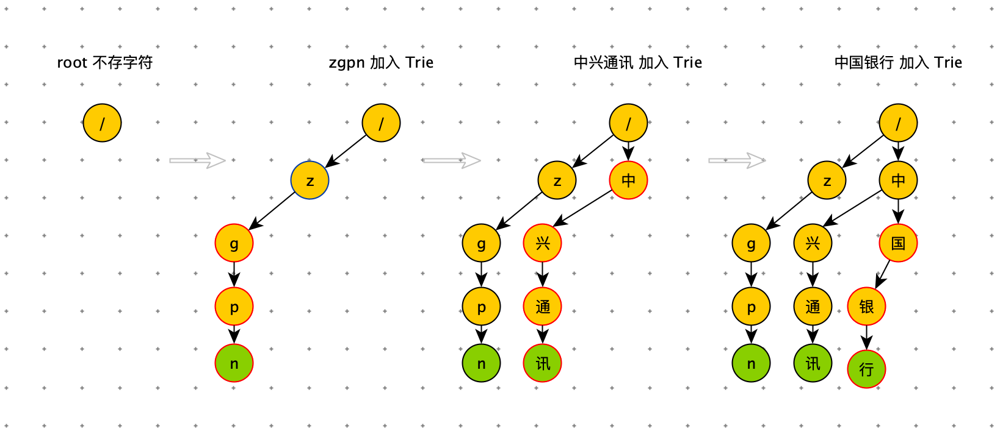
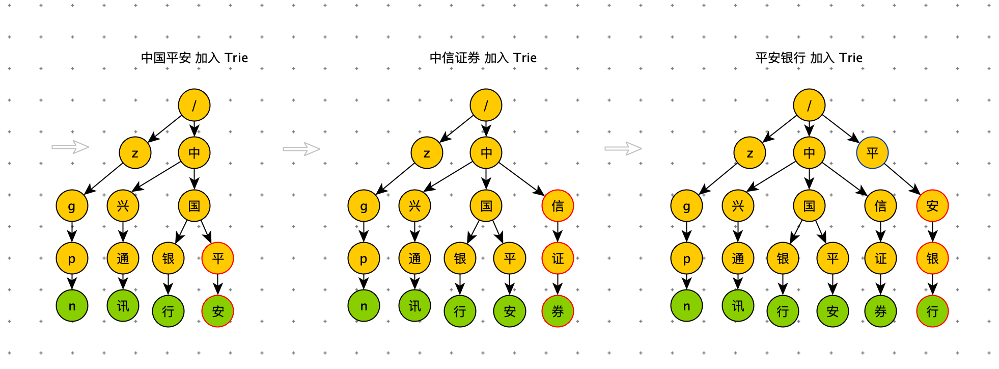

[TOC]

# 一、背景

​		搜索关键字智能提示是一个搜索应用的标配，主要作用是避免用户输入错误的搜索词，并将用户引导到相应的关键词上，以提升用户搜索体验。

​		雪球以连接人与资产，让财富的雪球越滚越大为使命，在投资社区领域处于领先地位。为了让用户快速找到目标的股票，大V。我们基于 ES 实现了股票搜索模块。用户在查找股票时主要输入股票名，股票symbol 进行搜索，为了提升用户体验和输入效率，本文实现了一种基于 Trie Tree 前缀匹配查询关键词只能提示（Suggestion）实现。


# 二、需求分析

- 支持前缀匹配原则：在搜索框中输入“中国”，搜索框下面会以中国为前缀，展示“中国平安”、“中国神华”、“中国中免”等等搜索词；输入“贵州”，会提示“贵州茅台”、“贵州燃气”、“贵州百灵”等搜索词。
- 同时支持汉字、拼音输入：由于中文的特点，如果搜索自动提示可以支持拼音的话会给用户带来更大的方便，免得切换输入法。比如，输入 “zhongguo” 提示的关键字和输入“中国”提示的一样，输入“guizhou”与输入“贵州”提示的关键字一样。
- 支持拼音缩写输入：对于较长关键字，为了提高输入效率，有必要提供拼音缩写输入。比如输入“zg”应该能提示出“zhongguo”相似的关键字，输入“gzmt”也一样能提示出“贵州茅台”关键字。
- <font color=red>支持多音字输入提示：比如输入“chongqing”或者“zhongqing”都能提示出“重庆啤酒”、“重庆钢铁”、“重重庆百货”。</font>
- 支持汉字数字转阿拉伯数字：比如输入“360”都能提示出“三六零”。
- 支持Query纠错：比如输入“贵州毛台”都能提示出“贵州茅台”。


# 三、解决方案


## 什么是Tire 树

​		Tire 树，也叫“字典树”，又称单词查找树或键树，是一种树形结构，是一种哈希树的变种。典型应用是用于统计和排序大量的字符串（但不仅限于字符串），所以经常被搜索引擎系统用于文本词频统计。它的优点是：最大限度地减少无谓的字符串比较，查询效率比哈希表高。

​		**Trie的核心思想是空间换时间。利用字符串的公共前缀来降低查询时间的开销以达到提高效率的目的。**

它有3个基本性质：

1. 根节点不包含字符，除根节点外，每一个节点都只包含一个字符。
2. 从根节点到某一节点，路径上经过的字符连接起来，为该节点对应的字符串。
3. 每个节点的所有子节点包含的字符都不相同。


​		Trie 是一颗存储多个字符串的树。这样树的每条分支代表一则子串，而树的叶节点则代表完整的字符串。和普通树不同的地方是，相同的字符串前缀共享同一条分支。例如，给出一组字符串：中国平安、中国银行、中兴通讯、中信证券、平安银行、平安、zgpn 等。我们可以构建出下面的 Trie 树：


​		其中，绿色节点是数据节点，黄色节点是路径节点。从根节点到绿色节点的一条路径表示一个字符串（注意：数据节点并不都是叶子节点）。

​		有上图可知，当用户输入前缀“中国”的时候，搜索框可能会展示以“中国”为前缀的“中国平安”，“中国银行”等关键词，再当用户输入前缀“中兴”的时候，搜索框里面可能会提示以 “中兴” 为前缀的“中兴通讯”等关键词。


## Trie 树的实现

### 插入过程

​		为了让你更容易理解 Trie 树是怎么构造出来的，我画了一个 Trie 树构造的分解过程。构造过程的每一步，都相当于往 Trie 树中插入一个字符串。当所有字符串都插入完成之后，Trie 树就构造好了。








```python
class TrieNode:
    def __init__(self, char=None):
        self.char = char
        self.data = None
        self.children = {}

    def is_data_node(self):
        return self.data is not None

    def is_leaf_node(self):
        return len(self.children) == 0

class Trie:
    def __init__(self):
        self.root = TrieNode("/")

    def insert(self, text):
        if not text: return
        p = self.root
        for i in range(len(text)):
            if text[i] not in p.children:
                p.children[text[i]] = TrieNode(text[i])
            p = p.children[text[i]]
        p.data = text
```


### 查询过程

**精确查询**

​		在 Trie 树中查询“中国平安”，需要将字符串分割成单个字符：中、国、平、安，然后从 Trie 树的根节点开始匹配。如图所示，红色路径就是在 Trie 树中匹配路径。


```python
    def find_node(self, pattern):
        if not pattern: return
        p = self.root
        for i in range(len(pattern)):
            if pattern[i] not in p.children: return
            p = p.children[pattern[i]]
        return p

    def find(self, pattern):
        node = self.find_node(pattern)
        if node: return node.data
```


**前缀查询**

​		如果要查询 “中国”，用上边的同样的方法，从根节点开始，沿着红色路径来到节点“国”。但是，节点”国“不是数据节点。”中国“是某些字符串的前缀子串，不能完全匹配任何字符串。如果需要给用户 Query 建议的话，需要继续下探，继续沿着蓝色路径，找到 ”中国平安“ 和 ”中国银行“。


```python
    def prefix_find(self, pattern):
        node = self.find_node(pattern)
        if not node: return
        res = []
        for k, v in node.children.items():
            self.drill_down(v, res)

        return res

    def drill_down(self, node, res):
        if node.data:
            res.append(node.data)
        for k, v in node.children.items():
            self.drill_down(v, res)
```


### 删除过程

​		如果要从 Trie 树删除 “中国银行”这个字符串，需要先精确查找到对应的数据节点，将该数据节点的data 属性设置为 None 即可。那么节点”银“ 和节点”行“ 已经没有用了。如果不删除，即浪费内存空间，也影响后续的前缀查询的下探效率。要删除废弃节点，需要记录查找”中国银行“时所走的路径，放在一个栈里。删除是从下向上依次删除。删除条件为：当前节点是叶子节点并且不是数据节点。节点”中“ 和 节点”国“在”中国平安“中还在使用，不可以删除。


```python
    def delete(self, pattern):
        if not pattern: return

        # 查找要删除的节点
        p = self.root
        stack = [p]
        for i in range(len(pattern)):
            if pattern[i] not in p.children: return
            p = p.children[pattern[i]]
            stack.append(p)
        if not p.data or p.data != pattern: return
        # 删除数据
        p.data = None

        # 删除路径
        node = stack.pop()
        while stack:
            parent = stack.pop()
            if not node.is_leaf_node() or node.is_data_node() or node.char not in parent.children:
                break
            parent.children.pop(node.char)
            node = parent
```


## 雪球的 Sug 方案

​		雪球是一个投资社区。用户主要搜索：投资标的（股票、公募基金、私募基金）、大V、帖子（挖掘热门 Query）。其中投资标的的搜索量占 78.5%。股票Query是 Sug 中非常重要的数据。Sug 也必须满足用户非常便捷地找到对应的股票。 


- **关键字收集：**用户搜索股票的习惯使用股票名和股票symbol。
- **汉字转拼音：**用户有可能股票名的拼音来搜索股票，需要将股票名转成拼音作为股票的关键词，java中考虑使用pinyin4j组件实现转换。
- **拼音缩写提取：**考虑到需要支持拼音缩写，汉字转换拼音的过程中，顺便提取出拼音缩写，如“guizhoumaotai”,“zhongguopingan”—>“gzmt”,”zgpa”。
- **多音字全排列：**要支持多音字提示，对查询串转换成拼音后，需要实现一个全排列组合，字符串多音字全排列算法
- **大写数字转阿拉伯数字：**比如：“三六零”这只股票，有用户习惯用 “360” 进行搜索。
- **挖掘股票关键词：**通过一些离线挖掘来丰富股票关键词。比如：英特尔这只股票“intel” 这个关键词无法通过股票名和股票symbol 生成出来。
- **人工配置股票关键词：**一切规则都有漏，需要人工顶住最后的防线。


## 系统架构

​		接收到用户请求，拿到用户 Query，系统会在本地内存中 Trie 树中，进行前缀查询，拿到 TopN 条数据。然后给这 N 条数据组装特征。最后交给模型打分，排序后返回给用户。


整个过程涉及三个模块：

		1. Trie 树的维护。
		1. 召回：Trie 树的前缀查询
		1. 模型排序：特征组装集模型打分


## Trie 树的维护


## 召回


## 模型排序


# 四、总结


# 五、展望