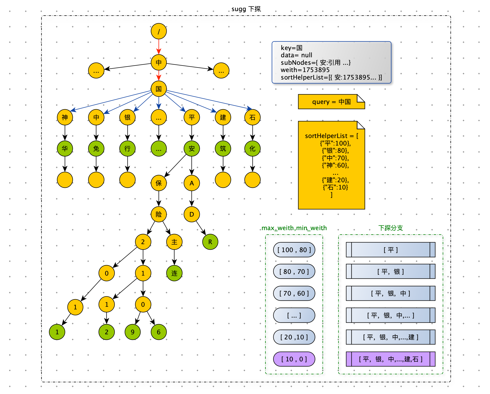

[TOC]

# 一、背景

搜索关键字智能提示是一个搜索应用的标配，主要作用是避免用户输入错误的搜索词，并将用户引导到相应的关键词上，以提升用户搜索体验。

雪球以连接人与资产，让财富的雪球越滚越大为使命，在投资社区领域处于领先地位。为了让用户快速找准确到目标的股票，大V，我们开发 sug 服务来自动补全 Query。用户在查找股票时主要输入股票名称、股票 symbol 进行搜索，为了提升用户体验和输入效率，本文实现了一种基于 Trie 树前缀匹配查询 + 模型排序关键词智能提示（Suggestion）实现。

# 二、需求分析

- 支持前缀匹配原则：在搜索框中输入 “中国”，搜索框下面会以 “中国” 为前缀，展示 “中国平安”、“中国神华”、“中国中免” 等搜索词；输入“贵州”，会提示 “贵州茅台”、“贵州燃气”、“贵州百灵”等搜索词。
- 同时支持汉字、拼音输入：由于中文的特点，如果搜索自动提示可以支持拼音的话会给用户带来更大的方便，免得切换输入法。比如，输入 “zhongguo” 提示的关键字和输入 “中国” 提示的一样，输入 “guizhou” 与输入 “贵州” 提示的关键字一样。
- 支持拼音缩写输入：对于较长关键字，为了提高输入效率，有必要提供拼音缩写输入。比如输入 “zg” 应该能提示出 “zhongguo” 相似的关键字，输入 “gzmt” 也一样能提示出 “贵州茅台” 关键字。
- 支持多音字输入提示：比如输入 “chongqing” 或者 “zhongqing” 都能提示出 “重庆啤酒”、“重庆钢铁”、“重重庆百货”。
- 支持大写数字转阿拉伯数字：比如输入 “360” 都能提示出 “三六零” 这只股票。
- 支持 Query 纠错：比如输入 “贵州毛台” 都能提示出 “贵州茅台”。


# 三、解决方案


## 什么是 Tire 树

Tire 树，也叫字典树，又称单词查找树或键树，是一种树形结构，是一种哈希树的变种。典型应用是用于统计和排序大量的字符串（但不仅限于字符串），所以经常被搜索引擎系统用于文本词频统计。它的优点是：最大限度地减少无谓的字符串比较，查询效率比哈希表高。

**Trie 树的核心思想是空间换时间。利用字符串的公共前缀来降低查询时间的开销以达到提高效率的目的。**

它有3个基本性质：

1. 根节点不包含字符，除根节点外，每一个节点都只包含一个字符。
2. 从根节点到某一节点，路径上经过的字符连接起来，为该节点对应的字符串。
3. 每个节点的所有子节点包含的字符都不相同。


Trie 是一颗存储多个字符串的树。这样树的每条分支代表一则子串，而树的叶节点则代表完整的字符串。和普通树不同的地方是，相同的字符串前缀共享同一条分支。例如，给出一组字符串：中国平安、中国银行、中兴通讯、中信证券、平安银行、平安、zgpn 等。我们可以构建出下面的 Trie 树：


其中，绿色节点是数据节点，黄色节点是普通节点。从根节点到绿色节点的一条路径表示一个字符串（注意：数据节点并不都是叶子节点）。

有上图可知，当用户输入前缀 “中国” 的时候，搜索框可能会展示以 “中国” 为前缀的 “中国平安”、“中国银行”等关键词，再当用户输入前缀 “中兴” 的时候，搜索框里面可能会提示以 “中兴” 为前缀的“中兴通讯”等关键词。


## Trie 树的实现

### 插入过程

为了更容易理解 Trie 树是怎么构造出来的，我画了一个 Trie 树构造的分解过程。构造过程的每一步，都相当于往 Trie 树中插入一个字符串。当所有字符串都插入完成之后，Trie 树就构造好了。


```python
class TrieNode:
    def __init__(self, char=None):
        self.char = char
        self.data = None
        self.children = {}

    def is_data_node(self):
        return self.data is not None

    def is_leaf_node(self):
        return len(self.children) == 0

class Trie:
    def __init__(self):
        self.root = TrieNode("/")

    def insert(self, text):
        if not text: return
        p = self.root
        for char in text:
            if char not in p.children:
                p.children[char] = TrieNode(char)
            p = p.children[char]
        p.data = text
```


### 查询过程

**精确查询**

在 Trie 树中查询 “中国平安”，需要将字符串分割成单个字符：中、国、平、安，然后从 Trie 树的根节点开始匹配。如图所示，红色路径就是在 Trie 树中匹配路径。


```python
    def find_node(self, pattern):
        if not pattern: return
        p = self.root
        for char in pattern:
            if char not in p.children: return
            p = p.children[char]
        return p

    def find(self, pattern):
        node = self.find_node(pattern)
        if node: return node.data
```


**前缀查询**

如果要查询 “中国”，用上边的同样的方法，从根节点开始，沿着红色路径来到节点 “国”。但是，节点 ”国“ 不是数据节点。”中国“ 是某些字符串的前缀子串，不能完全匹配任何字符串。如果需要给用户 Query 建议的话，需要继续下探，继续沿着蓝色路径，找到 ”中国平安“ 和 ”中国银行“。


```python
    def prefix_find(self, pattern):
        node = self.find_node(pattern)
        if not node: return
        res = []
        for k, v in node.children.items():
            self.drill_down(v, res)
        return res

    def drill_down(self, node, res):
        if node.data:
            res.append(node.data)
        for k, v in node.children.items():
            self.drill_down(v, res)
```


### 删除过程

如果要从 Trie 树删除 “中国银行” 这个字符串，需要先精确查找到对应的数据节点，将该数据节点的 data 属性设置为 None 即可。此时节点 ”银“ 和节点 ”行“ 已经没有用了，如果不删除，即浪费内存空间，也影响后续的前缀查询的下探效率。要删除废弃节点，需要用栈记录查找 ”中国银行“ 时所走的路径。利用栈先进后出的特性，从下向上依次删除废弃节点。删除条件为：当前节点是叶子节点并且不是数据节点。注意：节点 ”中“ 和节点 ”国“ 在”中国平安“中还在使用，不可以删除。


```python
    def delete(self, pattern):
        if not pattern: return

        # 查找要删除的节点
        p = self.root
        stack = [p]
        for char in pattern:
            if char not in p.children: return
            p = p.children[char]
            stack.append(p)
        if not p.data or p.data != pattern: return
        # 删除数据
        p.data = None

        # 删除路径
        node = stack.pop()
        while stack:
            parent = stack.pop()
            if not node.is_leaf_node() or node.is_data_node() or node.char not in parent.children:
                break
            parent.children.pop(node.char)
            node = parent
```


## 雪球的 sug 方案

雪球作为一个著名的投资社区，搜索股票和帖子是用户的刚需。股票的搜索量占总搜索量的 78.5%。提升用户搜索股票的体验和输入效率势在必行。后续为了便于讲解，所说的股票数据就代表了 sug 数据。

- **关键字收集：**用户习惯使用股票名称和股票 symbol 搜索股票，所以股票名称和股票 symbol 是非常重要的 sug 关键词。
- **汉字转拼音：**用户有可能股票名称的拼音来搜索股票，需要将股票名称转成拼音作为股票的关键词，java 中考虑使用 pinyin4j 组件实现转换。
- **拼音缩写提取：**考虑到需要支持拼音缩写，汉字转换拼音的过程中，顺便提取出拼音缩写，如“guizhoumaotai”,“zhongguopingan”—>“gzmt”,”zgpa”。
- **多音字全排列：**要支持多音字提示，对查询串转换成拼音后，需要实现一个字符串多音字全排列算法。
- **大写数字转阿拉伯数字：**比如：“三六零” 这只股票，有用户习惯用 “360” 进行搜索。
- **挖掘股票关键词：**通过一些离线挖掘来丰富股票关键词。比如：“英特尔” 这只股票， “intel”  这个关键词无法通过股票名和股票 symbol 生成出来。
- **人工配置股票关键词：**一切规则皆有漏，需要人工配置关键词兜底，作为最后的防线。


### 系统架构

当 sug-server 接受到用户一个 Query，做完预处理后，就会在本地内存中 Trie 树上进行前缀前缀查询，拿到 TopN 条数据（一般 N = 10）。然后给这 N 条数据组装特征，最后交给模型打分排序后返回给用户。为了给模型训练准备训练数据，需要将 sug 的展示数据及特征通过 FlumeNG 落盘到大数据平台。雪球 APP 上用户对 sug 的点击行为也需要埋点上报。


整个过程涉及三个模块：

1. Trie 树的维护
2. 召回：Trie 树的前缀查询
3. 模型排序：特征组装集模型打分


### Trie 树的维护

sug-server 对外提供 sug 服务，召回时依赖 Trie 树。因此每台 sug-server 服务器内存中都保存一棵完整的 Trie 树。当 sug-server 服务启动时，需要从 FTP 下载 Trie 树的二进制文件，来构建一棵完整的 Trie 树。当股票数据变更时，需要及时更新每台 sug-server 内存中的 Trie 树。Trie 树的生成、更新、删除、巡检等功能都依赖：Trie 树管理系统。

股票的 sug 数据都存在 MySQL 数据库中。每当股票名称需要变更时，管理系统会记录变更日志，将最新的数据存入 MySQL 数据库中，然后通过 ZK 的订阅与通知机制，将变数据更同步到每一台 sug-server 服务器上。管理系统还会定期从 MySQL 数据库中读取全部股票 sug 数据构建 Trie 树，将构建好的全新的Trie 树序列化成二进制文件，推送到 FTP 服务器上，供 sug-server 启动时使用。 管理系统还承担了 sug 数据巡检功能，一旦发现有错误的数据及时修复。


### 召回

#### Trie 树结构设计

雪球的 Trie 树结构比较复杂，因为需要存储更多的数据来加速前缀匹配，因此我们定制开发了 Trie 树。为了减少内存空间的占用和保持 sug-server 服务的稳定性，我们抽象出 Trie 树需要的检索数据，并与多变的业务数据进行隔离。索引数据存储在 Trie 树中，保存在内存里，而 sug 服务需要业务数据，保存在 redis 中。sug 服务的业务数据，经常跟随业务调整：比如产品经理要给 sug 中股票添加一个状态图标。业务数据是要展示给用户的，因此对数据准确性要求更高。下图中 data_map 就是存在 redis 中业务数据。


**Trie 节点**

如果 data 为空，表示普通节点，如果 data 不为空，表示数据节点。在前缀匹配下探过程利用 sortHelperList  数据进行剪枝。在讲前缀匹配时，会介绍 sortHelperList 。

```java
@Data
public class TrieNode {
  	// 字符
    private char key;
  	// 子节点
    private Map<Character, TrieNode> subNodes;
  	// 节点权重（股票粉丝数）
    private double weight;
  	// 数据节点（倒序）
    private List<DataNode> data;
  	// 辅助排序
    private List<SortHelper> sortHelperList = new ArrayList<>();

    public TrieNode(Character key, double score) {
        this.key = key;
        this.score = score;
        subNodes = new HashMap<>(2);
    }

    public Boolean isDataNode() {
        return !CollectionUtils.isEmpty(data);
    }

    public Boolean isLeafNode() {
        return subNodes == null || subNodes.isEmpty();
    }
}
```


**数据节点：存储的数据**

```java
@Data
public class DataNode {
    private String symbol;
    private double weight;
}
```


#### 前缀查询

前缀查询的整体思路与之前将的一致：精确匹配 + 下探，来获取 TopN 条数据。

用户在使用雪球 APP 进行搜索时，每输入一个字符都会调用一次 sug 服务。因此对 sug 服务的性能要求极高，必须几毫秒返回数据，否则用户就有卡顿感。然而雪球 Trie 树中，最多的子节点有：435 个，树的高度为： 320。如果将以 Query 为前缀的所有路径都下探完毕，在某些 Query 的场景下，用户会感受到卡顿感。这是不可以接受的。因此我们从两个方面进行优化。

1. 限制最深下探层数：这个好实现。下探时记录下探层数，当达到限制，就停止下探。

2. 在下探时进行剪枝：这是我们创新性改造 Trie 树，它保证了 sug 服务性能稳定的。435


在下探时，假如有 100 个子节点等待下探，我们应该优先下探哪些子节点？应该丢弃哪些子节点？

**数据节点权重值越大表示数据越重要。下探时我们希望将权重大的数据优先获取到。要找到权重大的数据，我们需要将数据的权重赋值给普通节点，优先遍历权重大的子节点进行下探。子节点的权重等于该子树上所有数据节点权重的最大值。现在每个子节点都有自己权重，我们只需从大到小依次下探。按照这种方式下探，实现了我们所希望的那样将权重大的数据优先获取到。因此当获取够 N 条数据后，就不需要继续下探了，从而达到了剪枝的目的。将所有子节点的 key 按权重从大到小存储在 sortHelperList  中**


如下图，用户 Query = “中国”，有很多条路径等待我们去探索。从 sortHelperList 中获取到权重最大的子节点，优先遍历节点 “平” 这条路径。在下探节点 “平” 时，有可能获取到权重为 80 以下的数据，如果此时获取的数据达到了 N，那么节点 “银” 分支下更好的数据，就被丢失了。怎么解决这个问题？**下探过程中，可以带着一个权重范围，只获取在权重范围内的数据。**比如：下探节点 “平”时，权重范围是 [100 , 80]，只获取权重在范围 [100 , 80]  内的数据，这样就保证了在第一次下探节点 “平” 时，获取的数据的权重都大于后续遍历的路径。

节点 ‘平“ 在 [100 , 80] 的范围被探索完毕后，权重范围变为 [80 , 70]。此时节点 ”平“ 在 [80 , 70] 之间的数据，在上一次探索节点”平“时并没有被获取，所以这一次也需要再次带着权重法范围 [80 , 70] 探索节点”平“ 和 节点”银“。依次类推遍历后续路径。**下探终止条件为：获取的数据量达到 N 或者所有路径都遍历完毕。** 



注意：在数据权重发生变化时，需要维护路径上所有普通节点的权重。


在召回阶段（前缀查询阶段），对查询结果影响最大的两个因素：

1. Query 与数据的相关性
2. 数据的重要性

​		

确保相关性和重要性大的数据优先获取到，否则有可能被丢弃。

Query 与数据的相关性：体现在下探过程中，处在树层数越小的数据，越早的被获取到，数据相关性更好。

数据的重要性：根据上面描述的下探规则，数据权重越大越早被遍历。当然数据的权重，可以简单是股票的粉丝数，也可以离线用模型打分，这样可以综合更多因素，比如：股票的状态（是否退市），股票的市场（A股，港股，美股）等。


到此，一个线上 sug 服务已经完成。为了给用户更好的体验，我们需要对结果进行模型打分。


### 模型排序

最初没有模型排序，雪球的 sug 完全是基于规则。sug 中的股票数据，以股票粉丝数打底，加入一些业务规则，比如 Query 完全等于股票名称或者股票 symbol 的数据排在第一位。已退市的股票进行降权。市场是 A 股的股票排在港股的股票之上等等。这些规则系统，在绝大多数场景下是有效的，但是总有 basecase 出现，并且在解决掉这个 basecase 时，会引入其他的 basecase。规则之间也会有冲突。


在 sug 仅仅基于规则实现时，像下边表格里的 badcase 是比较典型的，出现的原因： query 与 symbol 全匹配优先级最高。没有考虑 Query 与股票的历史 CTR 以及股票的近期热度。

| 基于规则                                   | 模型排序                                   | 基于规则                                                     | 模型排序                                                     |
| ------------------------------------------ | ------------------------------------------ | ------------------------------------------------------------ | ------------------------------------------------------------ |
|  |  |  |  |


规则系统缺点

1. 容易规则冲突。
2. 线上代码逻辑复杂：各种规则堆砌。
3. 容易出现 bug。
4. 后期维护成本高：不易扩展。


线性加权

$$ score = w_1 * query\_stock\_ctr + w_2 * 匹配度 + w_3 * 粉丝数 + w_4 * 股票状态 + w_5 * 股票近期热度 + ... $$ 

根据 socre 排序优点：

1. 在线代码简单，计算 score ，倒序。
2. 容易扩展，增减排序因子简单。


想通过线性加权给 sug 数据打分排序。那么怎么去拟合这些维度的权重呢？逻辑回归处理这类问题的经典算法。

#### LR

逻辑回归（Logistic Regression）的数学模型和求解都相对比较简洁，实现相对简单。通过对特征做离散化和其他映射，逻辑回归也可以处理非线性问题，是一个非常强大的分类器。因此在实际应用中，当我们能够拿到许多低层次的特征时，可以考虑使用逻辑回归来解决我们的问题。


#### 模型

Sigmoid 函数，其数学形式是：
$$
y = f(wx) = \frac{1}{1+e^{-wx}}
$$

对应的函数曲线如下图所示：


从上图可以看到 sigmoid 函数是一个 S 形的曲线，它的取值在 [0, 1] 之间，在远离 0 的地方函数的值会很快接近 0 / 1。这个性质使我们能够以概率的方式来解释。


sigmoid 函数优点

1. 数据压缩能力，将数据压缩至 （0 , 1）
2. 处处连续，便于求导。
3. 两端不灵敏，分界面处灵敏。

#### 策略

极大似然估计

假设：样本$(x_i,y_i)$ 独立同分布

每一个样本就是一个时间，整个样本集中事情同时发生的概率是：$\prod_i{p(x_i)}$    ，独立事件。

似然函数：$F(w) = \prod_i{f(wx_i)}= \prod_i{[y_i*p(y_i=1|x_i,w)+(1-y_i)*p(y_i=0|x_i,w)]}$


$y_i \in \{0,1\}$ 

如果 $y_i = 0$，那么$ f(wx_i)$ , 越大越好。

如果 $y_i = 1$，那么$ 1 - f(wx_i)$ , 越大越好。

在数据集上，先 log 然后求和，越大越好。


- 损失函数

  $L(w) = -\sum_i{[y_i*log(p(y_i=1|x_i,w))+(1-y_i)*log(p(y_i=0|x_i,w))]}$

  $=-\sum_i{(y_i*log(f(wx_i))+(1-y_i)log(1-f(wx_i)))}$

#### 算法

最小化损失函数

$L(w) = -\sum_i{(y_i*log(f(wx_i))+(1-y_i)log(1-f(wx_i)))}$

这是一个凸优化问题，根据凸优化理论，经典数值优化算法：梯度下降法，牛顿法。

##### 梯度下降法

梯度：$\nabla L(w) = -\sum_i(y_i-f(wx_i))*x_i$


$y = f(wx) = \frac{1}{1+e^{-wx}}$

目标：最小化 L(w)

步骤：

1. 设置初始 w （随机数），计算 L(w)

2. 计算梯度：$ d = \nabla L(w)$

   下降方向：$dir = -\nabla L(w) $

3. $w^{new} = w + \lambda * dir$      $\lambda$ ：步长。

4. 计算 $L(w^{new})$

5. 如果 $L(w) - L(w^{new})$ 较小（收敛条件）或者达到轮数限制，停止；跳转到 2 。


##### 牛顿法

Hession 矩阵：$\nabla \nabla L(w) = \sum_i {f(wx_i)(1-f(wx_i))x_ix_i^T }$

牛顿下降方向：$dir = (\nabla\nabla L(w))^{-1}(-\nabla L(w))$


#### 训练模型

目标：将线上 sug 的展示日志与用户点击日志生成训练数据，训练 LR 模型，在线预估用户对 sug 点击率，根据点击率排序。 


**准备训练数据**

$$ score = w_1 * query\_stock\_ctr + w_2 * 匹配度 + w_3 * 粉丝数 + w_4 * 股票状态 + w_5 * 股票近期热度 + ... $$ 

样本数据：$(X_1,Y_1),(X_2,Y_2)...(X_n,Y_n)$

例子：

X1 = [ query_stock_ctr, 匹配度，粉丝数，股票状态，股票近期热度 ]

Y1 = {1,0} 

- 1：用户点击
- 0：没有点击


**训练代码：**

```python
from sklearn.linear_model import LogisticRegression as LR

class SugRank:
    def __init__(self):
        self.model = LR(penalty="l2", solver="liblinear", C=0.2, max_iter=1000)
    
    def train(self, fileName):
        # 加载训练数据
        x = []
        y = []
        # 特征选择时使用
        feature_selector = set(range(100)) - set([])
				
        for line in open(fileName, "r"):
            try:
                data = line.strip().split(",")
                y.append(int(data[0]))
                x_feature = [float(data[i]) for i in range(1, len(data)) if i in feature_selector] 
                x.append(x_feature)
            except Exception as e:
                print("load data:", line, e)
        # 训练
        self.model = self.model.fit(x, y)
        # 导出模型
        self.w = self.model.coef_[0]
        self.b = self.model.intercept_[0]
```


**离线效果**

|            | 预测值 = 1 | 预测值 = 0 |
| ---------- | ---------- | ---------- |
| 真实值 = 1 | TP         | FN         |
| 真实值 = 0 | FP         | TN         |

准确率（Accuracy）= $\frac{TP+TN}{TP+TN+FP+FN}$ --- 针对整个模型


下图是调参准确率曲线：


#### 在线效果

雪球 sug 模型排序上线后，点击率相对提升 31.56%。sug 的 badcase 明显减少。

下图是 sug 模型排序切流上线后点击率的变化：


左图：sug 第一位的点击率：$\frac{第一位点击数}{总点击数}$

右图：sug Mean reciprocal rank：$MRR = \frac{1}{|click|} \sum_i^{|click|}{\frac{1}{rank_i}}$


# 四、总结

雪球 sug 服务基于定制化 Trie 树 + 模型排序，提升用户搜索体验。为了提高 sug 性能稳定性，创新性设计出 Trie 树下探时的剪枝策略。正是由于 sug 服务性能极好、准确率高，在 Query 理解项目中也调用 sug 服务，去识别 Query 中的股票。sug 服务抽象出索引数据，并与业务数据进行隔离，使得 sug 基础服务（Trie 树检索部分）非常稳定，一般个性化业务需求只需上层修改即可满足。

目前雪球 sug 服务接入的数据源：股票，公募基金，私募基金，大 V，热门 Query。

sug 服务带来好处：

1. 自动补全用户要输的 Query，提升了用户的搜索体验和输入效率。
2. 对 Query 中错别字进行纠错处理，给出正确的 Query 建议。
3. 多样化的用户 Query，经过 sug 服务变成了标准化 Query ，方便后续召回，甚至可以提前准备好搜索结果，减轻了搜索引擎的压力。


# 五、展望

1. Trie 树的数据节点的权重，目前还是股票粉丝数，后续可以优化成模型打分。
2. Trie 树目前还是单机模式，受限服务器内存大小，后续可以做成分布式。