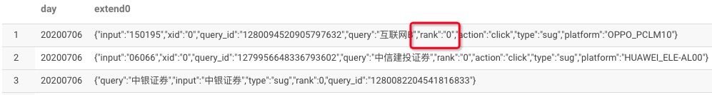
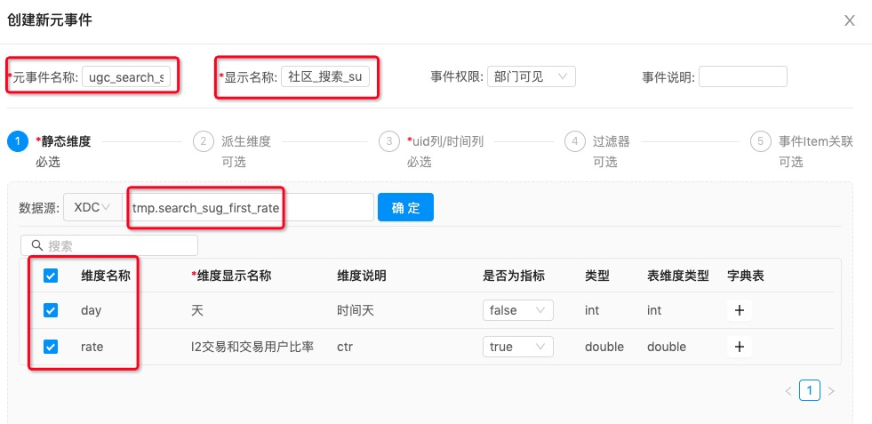
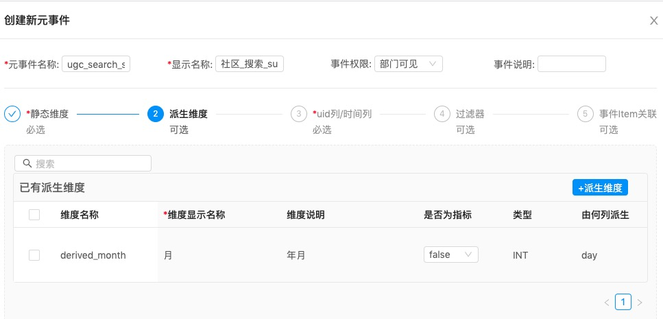
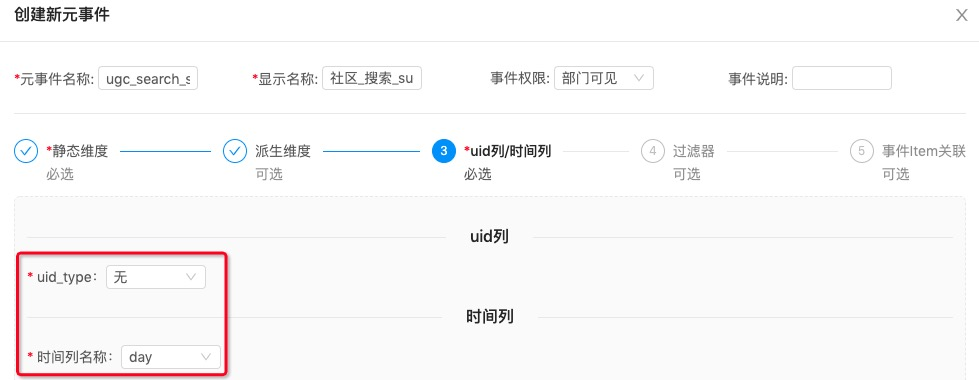
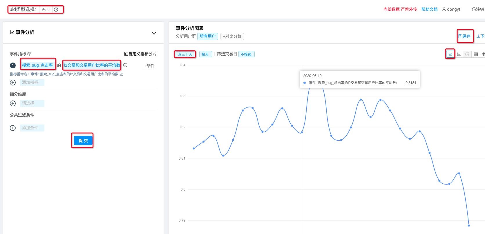
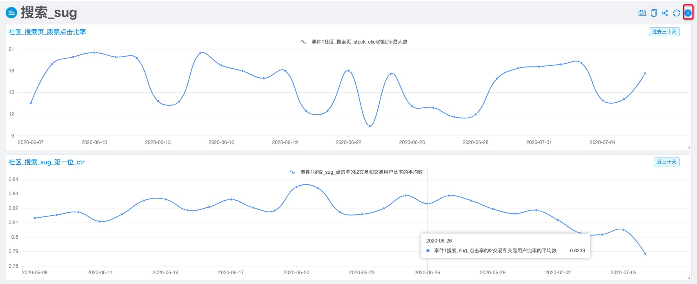
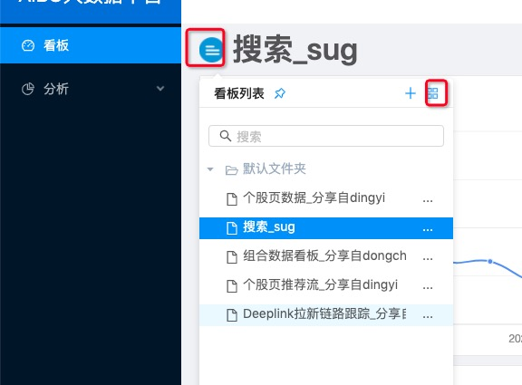
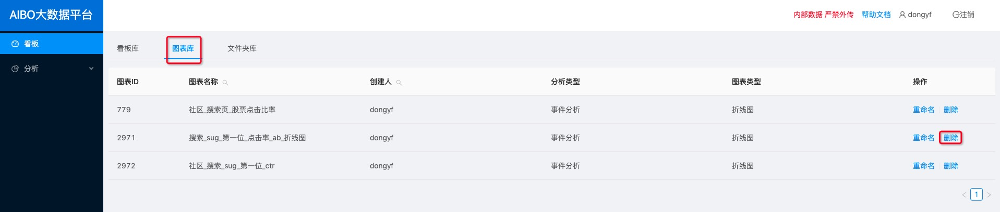
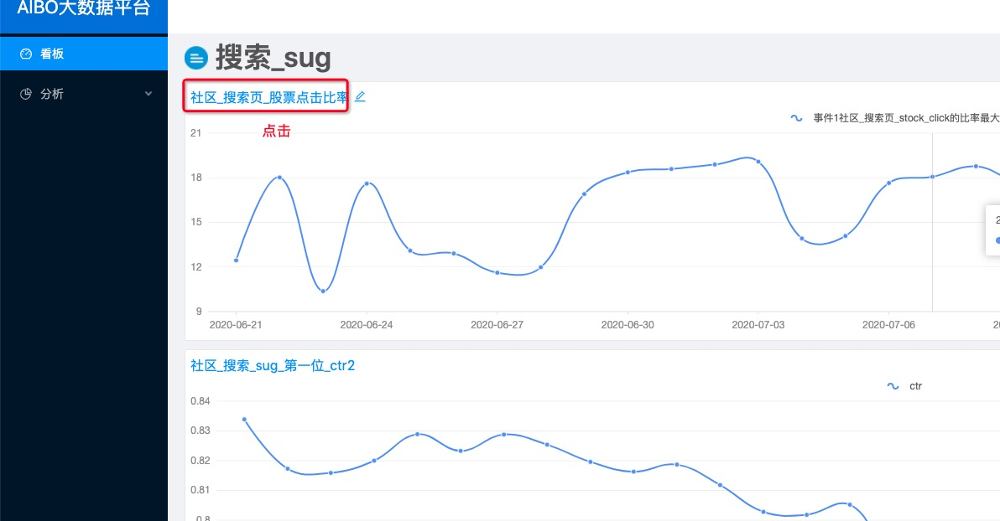
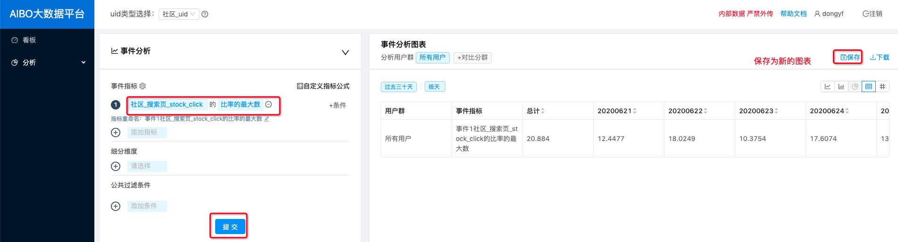

[TOC]

# 配置看板

## 需求

每天统计 suggest 第一位的 ctr。

## 原始数据

```mysql
SELECT DAY,
       extend0
FROM xueqiu.user_behavior
WHERE page_id = 2200
  AND component_type =19
  AND DAY=20200706
```




## 创建 view

```mysql
CREATE VIEW xueqiu.search_sug_first_rate AS
SELECT DAY,
       sum(CASE
               WHEN REGEXP_EXTRACT(`extend0`,'rank":"?([^,"|}]+)',1) ='0' THEN 1
               ELSE 0
           END)/count(1) AS rate
FROM xueqiu.user_behavior
WHERE page_id = 2200
  AND component_type =19
  AND REGEXP_EXTRACT(`extend0`,'rank":"?([^,"|}]+)',1) !=''
GROUP BY DAY

-- 不同 uid 尾号，分开统计（AB 测试使用）
CREATE VIEW search_dw.search_sug_first_rate_ab_test AS
SELECT DAY,
       sum(CASE
               WHEN REGEXP_EXTRACT(`extend0`,'rank":"?([^,"|}]+)',1) ='0' THEN 1
               ELSE 0
           END)/count(1) AS rate,
           uid % 10 as suffix
FROM xueqiu.user_behavior
WHERE page_id = 2200
  AND component_type =19
  AND REGEXP_EXTRACT(`extend0`,'rank":"?([^,"|}]+)',1) !=''
GROUP BY DAY,suffix
```

aibo 会根据日期控件，自动填充日期范围。

## 创建元事件







## 创建事件分析



## 添加到看板



# 删除图表





# 修改图表






删除旧的图表