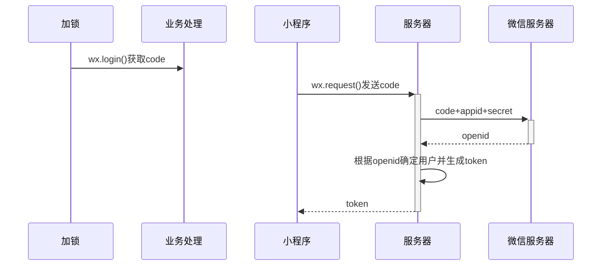

插入图片：control + command + i

插入表格：alt + Command + t 

插入链接：alt + Command + l

==高亮：shift + Command + h==    == ==

**加粗：command + b**    ****

*斜体：command + i*      * *

> 引用：alt + Command + q          > 

<u>下划线：command + u</u>

删除线：

列表增加缩进：command + [

列表减加缩进：command + ]

内联公式：control + m  $ $

公式块：alt + Command + b     $$   $$

一级标题：Command + 1

二级标题：Command + 2

五级标题：Command + 5

常见符号：

$\nabla$ $\Delta$ $\rightarrow$ $\uparrow$ $\downarrow$ $\leftarrow$ $\Uparrow$ $\Downarrow$ $\Leftarrow$ $\Rightarrow$ $\Updownarrow$ $\Leftrightarrow$  $\leftrightarrow$ $\longrightarrow$

$\mu ,\sigma ,\lambda \;, \pi \;, \varepsilon \; , \eta \;, \alpha \;, \beta , \theta$

$$
aaa
$$
