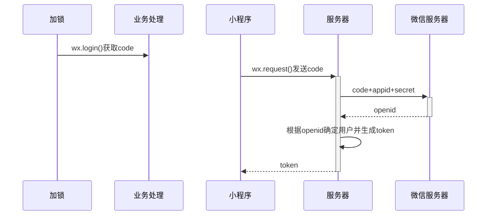

插入图片：control + command + i

插入表格：alt + Command + t 

插入链接：alt + Command + l

==高亮：shift + Command + h==    == ==

**加粗：command + b**    ****

*斜体：command + i*      * *

> 引用：alt + Command + q          > 

<u>下划线：command + u</u>

删除线：

列表增加缩进：command + [

列表减加缩进：command + ]

内联公式：control + m  $ $

公式块：alt + Command + b     $$   $$

一级标题：Command + 1

二级标题：Command + 2

五级标题：Command + 5

常见符号：

$\nabla$ $\Delta$ $\rightarrow$ $\uparrow$ $\downarrow$ $\leftarrow$ $\Uparrow$ $\Downarrow$ $\Leftarrow$ $\Rightarrow$ $\Updownarrow$ $\Leftrightarrow$  $\leftrightarrow$ $\longrightarrow \approx \, \in \, \not\in A\subseteq B\,A\subsetneq B ,A\not\subseteq B,A\supseteq B ,A\supsetneq B,A\not\subseteq B,A\cap B,A\cup B,\overline{A} ,A\setminus B,\mathbb{R},\emptyset$

$\pm, \times,\div ,\cdot ,\cap, \cup, \geq , \leq ,\neq , \approx , \equiv $

数学符号

$\mu ,\sigma ,\lambda \;, \pi \;, \varepsilon \; , \eta \;, \alpha \;, \beta , \theta ,\hat a ,\widehat a,\overline a ,\widetilde a, \dot a,\ddot a ,\epsilon,\Omega ,\omega, \Phi$

$lim_{x \to 0}x_2$    $\int_a^b x^2 dx$

$ y = \begin{cases} -x & x < 0 \\ x & x \geq 0\end{cases}$

空格

| 两个 quad 空格 | $a \qquad b$ | 两个 *m* 的宽度        |
| -------------- | ------------ | ---------------------- |
| quad 空格      | $a \quad b$  | 一个 *m* 的宽度        |
| 大空格         | $a\ b$       | $\frac{1}{3}$ m 的宽度 |
| 中等空格       | $a\;b$       | $\frac{2}{7}$ m 的宽度 |
| 小空格         | $a\,b$       | $\frac{1}{6}$ m 的宽度 |
| 没有空格       | $ab$         |                        |
| 紧贴           | $a\!b$       | 缩进1/6*m*宽度         |

标注

| $\overline{xx}$  | $\overleftrightarrow{xx}$ | $\underleftrightarrow{xx}$       | $\overleftarrow{xx}$ | $\underleftarrow{xx}$ | $\overrightarrow{xx}$ | $\underrightarrow{xx}$ |
| ---------------- | ------------------------- | -------------------------------- | -------------------- | --------------------- | --------------------- | ---------------------- |
| $\underline{xx}$ | $\overbrace{xxx}$         | $\overbrace{xxx}^{aaaa}_{bbbbb}$ | $\underbrace{xxx}$   | $\widetilde{xxx}$     | $\widehat{xxx}$       |                        |
| $\cdot$          |                           |                                  |                      |                       |                       |                        |
|                  |                           |                                  |                      |                       |                       |                        |
|                  |                           |                                  |                      |                       |                       |                        |
|                  |                           |                                  |                      |                       |                       |                        |
|                  |                           |                                  |                      |                       |                       |                        |

$$
aaa
$$
