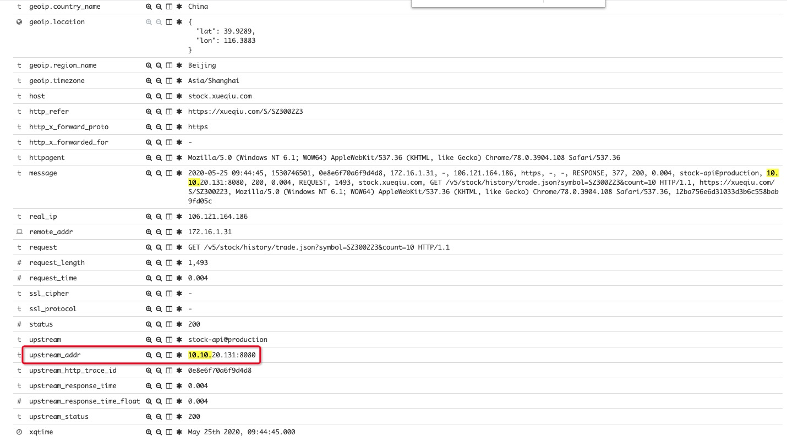

Impala 查询

```mysql
# 由于时区的原因，需要-8*3600。hive 查询不需要减
select unix_timestamp('2020-01-01 00:00:00')-8*3600
```


int 溢出

```java
// 错误方式：STATUS_TIME_LIMIT = 1471228928
private static final long STATUS_TIME_LIMIT = 1000 * 60 * 60 * 24 * 365;


// 正确方式：STATUS_TIME_LIMIT = 31536000000
private static final long STATUS_TIME_LIMIT = 1000L * 60 * 60 * 24 * 365;

```


**日志排查**

1. 通过 kibana 查看 ES 中服务日志。

http://logs.snowballfinance.com/app/kibana#/discover

2. 找到具体记录的服务器日志，然后去对应服务器，查看详细日志。




**监控打点**

```java
Constants.METRIC_REGISTRY.timer(MetricRegistry.name(Constants.ZABBIX_KEY_PREFIX, "blizzard_rpc_getCubeCountByOwnerId")).update(costTime, TimeUnit.MILLISECONDS)
```

