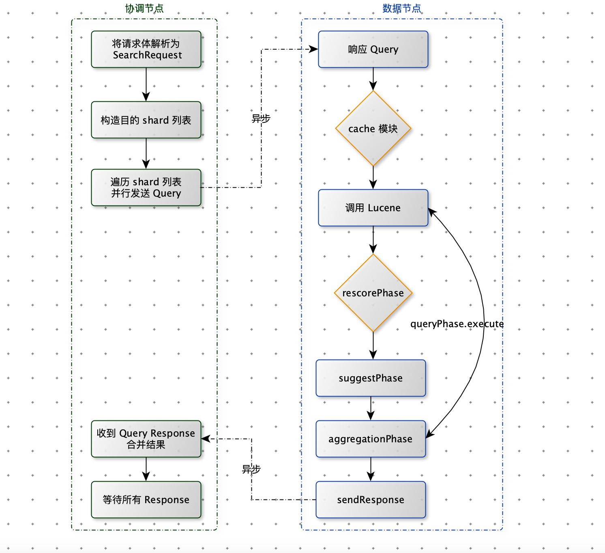
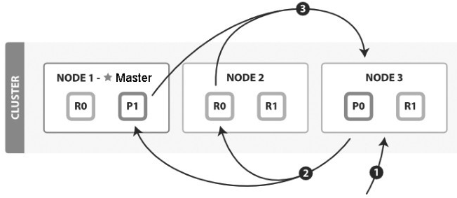
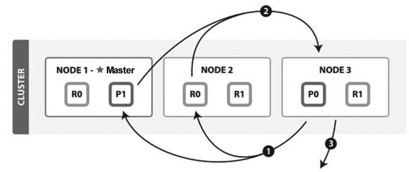
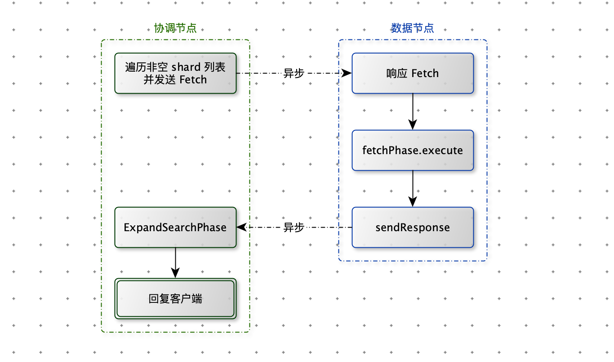

[TOC]

# Search 流程

GET 流程是通过 _index、_type、_id 三元组来确定唯一文档，但是 search 流程不知道要查询哪些文档。

Search 流程分为两个过程

1. Query（检索）
2. Fetch（获取）

Search 流程的主要步骤

1. 遍历所有分片，发送 Query 请求
2. 协调节点合并检索结果
3. 根据 ID 获取文档内容。

例如：有 5 分片，返回前 10 个匹配度最高的文档，每个分片都检索出当前分片的 TOP 10，协调节点将 5 * 10 = 50 个结果再次排序，返回客户端最终的 TOP 10 的结果查询。

## Query 阶段

一个搜索请求必须询问索引的所有分片的某个副本来进行匹配。每个分片在本地执行搜索并构建一个匹配文档的优先级队列。

优先级队列时一个存有 TopN 匹配文档的有序列表。优先级队列大小为分页参数：from + size

比如：一个索引有 5 个主分片，每个主分片有 1 个副分片，共 10 个分片，一次搜索会请求 5 个分片来共同完成。它们可能是主分片，也可能是副分片。

1. 客户端发送 search 请求到 Node3（协调节点）
2. Node 3 将请求转发到索引的每个主分片或者副分片
3. 每个分片在本地执行查询，并使用本地的 Term/Document Frequency 信息进行打分，添加结果到大小为 from + size 的本地有序队列中。
4. 每个分片返回各自优先队列中所有的文档 ID 和排序值给协调节点，协调节点合并这些值到自己的优先级队列中，产生一个全局排序后的列表。

补充：

1. 协调节点通过轮询所有的分片副本来分摊负载。

## Fetch 阶段

Fetch 阶段步骤：

1. 协调节点向相关 Node 发送 GET请求。
2. 分片所在节点向协调节点返回数据。
3. 协调节点等待所有文档被取得，然后返回给客户端。

补充：

1. 分片所在节点在返回数据时，处理出现在_source 字段和高亮参数。
2. 协调节点决定那些文档 “确实” 需要取回，例如：{ from:90 , size: 10 } 只会从第 91 个开始的 10 个结果被取回。
3. 为了避免在协调节点中创建的 number_of_shards * ( from + size ) 优先队列过大，应尽量控制分页深度。

# 小结

- 聚合是在 ES 中实现的，而非 Lucene
- Query 和 Fetch 之前是无状态的，除非使用 scroll 方式
- 分页搜索不会单独 “cache ”，cache 和分页没有关系。
- 