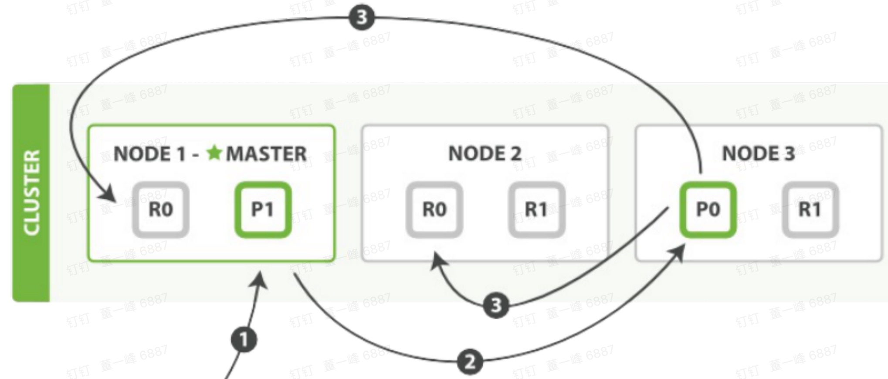
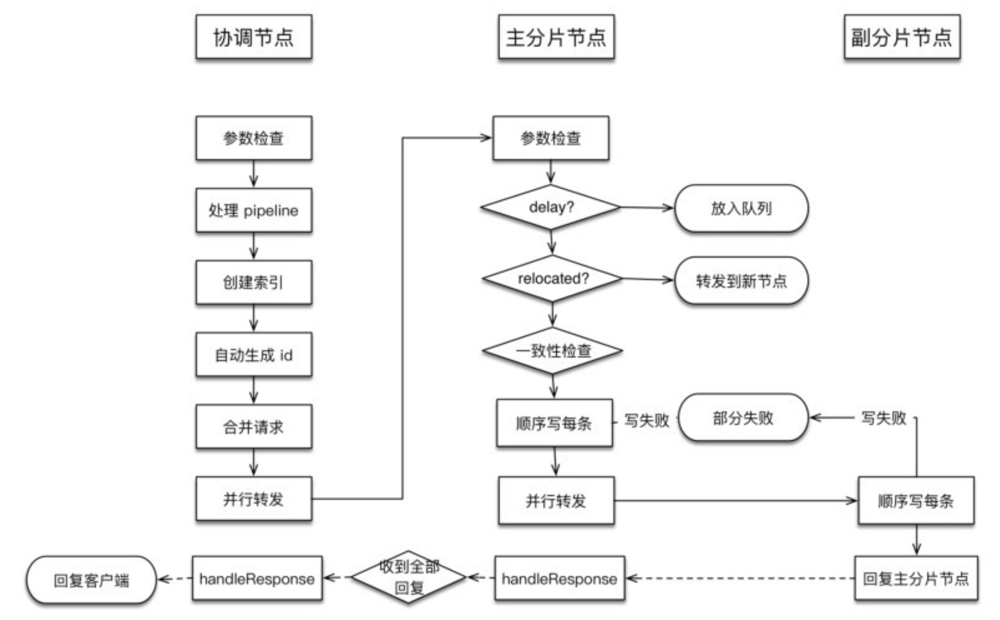

[TOC]

写单个和多个文档使用相同的逻辑，请求被统一封装为 BulkRequest

## 基本流程

1. 客户端向 Node 1 发送新建、索引、删除请求（Node 1 是协调节点）。
2. Node 1 根据文档 _id 计算出属于 分片 0，通过集群状态中的内容路由表，获知分片 0 的主分片位于 Node3，于是将请求转发给 Node 3。
3. Node 3 在主分片上执行请求（写请求），如果成功，它转发到 Node 1 和 Node 2 的副分片上。当所有的副节点报告成功，Node 3 报告成功给协调节点（Node 1），协调节点在报告给客户端。

补充：

1. 一致性的默认策略：quorum 即多数的分片在写入操作时处于可用状态：

   $quorum=int( \frac{prmary+number\_of\_replicas}{2} )+1$

**路由算法**

路由计算公式：shard_num = hash（_routing） % num_primary_shards

默认情况：_routing 值就是文档 id

注意：使用自定义 id 可能会导致数据倾斜。

可以使用 index.routing_partition_size 配置减少数据倾斜的风险。

在设置了 index.routing_partition_size 的情况下，路由公式：

shard_num = ( hash（_routing）+ hash(\_id) % routing_partition_size ) %  num_primary_shards

- \_routing 字段用于计算索引中的一组分片，然后使用 _id 来选择该组内的分片。
- index.routing_partition_size 取值：[ 1,  index.number_of_shards ]。

## 详细流程

### 协调节点

协调节点负责：

1. 创建索引（应该索引对象）
2. 转发请求到主分片节点
3. 等待响应
4. 回复客户端

参数检查

#### 参数检查

| 参数            | 检查                                                         |
| --------------- | ------------------------------------------------------------ |
| Index           | 不可为空                                                     |
| type            | 不可为空                                                     |
| source          | 不可为空                                                     |
| contentType     | 不可为空                                                     |
| opType          | 如果当前操作类型是创建索引，则校验 versionType 必须为 internal，且 Version 不可以为 MATCH_DELETED |
| resolvedVersion | 校验解析的 Version 是否合法                                  |
| vertionType     | 不可为 FORCE 类型，此类型已作废                              |
| Id              | 非空时，长度不可大于 512，以及为空时对 versionType 和 resolvedVersion 的检查 |

每项检查遇到异常都会拒绝当前请求。

Pipeline ：数据预处理。