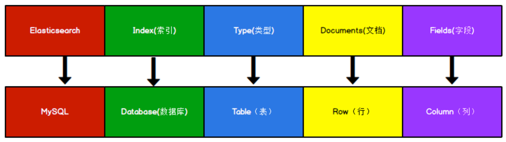

[TOC]

# ES 概述

ES 是一个开源的高扩展的分布式全文搜索引擎。

## 倒排索引


# 环境准备

Elasticsearchn 官方地址：https://www.elastic.co/cn/

下载地址：

<font color=red>注意：9300 端口为 Elasticsearch 集群间组件的通信端口，9200 端口为浏览器访问的 http</font>

在浏览器中访问：http://localhost:9200

# ES 入门

GET，PUT，DELTE，HEAD 操作具有幂等性，POST 操作不具有幂等性。

倒排索引的概念

与 MySQL 中概念对比




Types 的概念已经被逐渐弱化，Elasticsearch 6.X 中，一个 index 下已经只能包含一个 type，Elasticsearch 7.X 中, Type 的概念已经被删除了。

| 版本 | Type                                         |
| ---- | -------------------------------------------- |
| 5.x  | 支持多个 type                                |
| 6.x  | 只能有一种 type                              |
| 7.x  | 默认不再支持自定义 type （默认类型为：_doc） |


## 索引操作

```apl
# 创建索引
PUT shopping
```


```json
{
 "acknowledged"【响应结果】: true, # true 操作成功
 "shards_acknowledged"【分片结果】: true, # 分片操作成功
 "index"【索引名称】: "shopping"
}
```

 注意：创建索引库的分片数默认 1 片，在 7.0.0 之前的 Elasticsearch 版本中，默认 5 片


```apl
# 查看索引
GET shopping
```


```json
{
 "shopping"【索引名】: {
 "aliases"【别名】: {},
 "mappings"【映射】: {},
 "settings"【设置】: {
 "index"【设置 - 索引】: {
 "creation_date"【设置 - 索引 - 创建时间】: "1614265373911",
 "number_of_shards"【设置 - 索引 - 主分片数量】: "1",
 "number_of_replicas"【设置 - 索引 - 副分片数量】: "1",
 "uuid"【设置 - 索引 - 唯一标识】: "eI5wemRERTumxGCc1bAk2A",
 "version"【设置 - 索引 - 版本】: {
 "created": "7080099"
 },
 "provided_name"【设置 - 索引 - 名称】: "shopping"
 }
 }
 }
}
```


```apl
# 删除索引
DELETE shopping
```


## 文档操作

### 创建文档

```apl
# 自动生成 ID
POST shopping/_doc
{
  "title": "小米手机",
  "category": "小米",
  "images": "http://www.gulixueyuan.com/xm.jpg",
  "price": 3999
}

# 指定 ID(具有幂等性可以使用 PUT 命令)
PUT shopping/_doc/1001
{
  "title": "小米手机",
  "category": "小米",
  "images": "http://www.gulixueyuan.com/xm.jpg",
  "price": 3999
}
```


### 文档检索

```apl
# 全部查询
GET shopping/_doc/_search

# 主键查询
GET shopping/_doc/1001
```


### 修改文档

```apl
# 全量修改
PUT shopping/_doc/1001
{
  "title": "小米手机2",
  "category": "小米2",
  "images": "http://www.gulixueyuan.com/xm.jpg",
  "price": 4999
}
```


```apl
# 局部修改
POST shopping/_update/1001
{
  "doc": {
    "title":"华为手机"
  }
}
```


### 删除文档

```apl
DELETE shopping/_doc/9H58aXwBfxge3XJyFrMl
```


### 高级查询

条件查询

```apl
# 条件查询
# select * from shopping where category='小米'
# match 会把 query 进行分词，多个词之间是 or 关系
GET shopping/_search
{
  "query": {
    "match": {
      "category": "小米"
    }
  }
}

# 分页查询
# select title,price from shopping where category='小米' order by price desc limit 0,2
GET shopping/_search
{
  "query": {
    "match": {
      "category": "小米"
    }
  },
  "from": 0,
  "size": 2,
  "sort": [
    {
      "price": {
        "order": "desc"
      }
    }
  ],
  "_source": [
    "title",
    "price"
  ]
}
```


多条件查询：and  or

```apl
# select * from shopping where category='小米' and price>= 5000
GET shopping/_search
{
  "query": {
    "bool": {
      "must": [
        {
          "match": {
            "category": "小米"
          }
        },
        {
        # 范围查询
          "range": {
            "price": {
              "gte": 5000
            }
          }
        }
      ]
    }
  }
}

# select * from shopping where category like '%小米%' or category like '%华为%'
GET shopping/_search
{
  "query": {
    "bool": {
      "should": [
        {
          "match": {
            "category": "小米"
          }
        },
        {
          "match": {
            "category": "华为"
          }
        }
      ]
    }
  }
}

# select * from shopping where not category like '%小米%'
GET shopping/_search
{
  "query": {
    "bool": {
      "must_not": [
        {
          "match": {
            "category": "小米"
          }
        }
      ]
    }
  }
}

# select * from shopping where category like '%手机%' or title like '%手机%'
# multi_match 与 match 类似，不同的是它可以在多个字段中查询
GET shopping/_search
{
  "query": {
    "multi_match": {
      "query": "手机",
      "fields": [
        "category",
        "title"
      ]
    }
  }
}

# 分词
GET _analyze
{
  "text": ["小米","华为"]
}
```


聚合查询

```apl
# price 平均值
# select avg(price) from shopping
GET shopping/_search
{
  "aggs": {
    "category_avg": {
      "avg": {
        "field": "price"
      }
    }
  },
  "size": 0
}

# price 最小值
# select min(price) from shopping
# avg，min，max，sum
GET shopping/_search
{
  "aggs": {
    "category_min": {
      "min": {
        "field": "price"
      }
    }
  },
  "size": 0
}

# 同时返回：count,min,max,avg,sum
GET shopping/_search
{
  "aggs": {
    "stats_price": {
      "stats": {
        "field": "price"
      }
    }
  },
  "size": 0
}

# select price as key,count(1) as doc_count  from shopping group by price
GET shopping/_search
{
  "aggs": {
    "category_group": {
      "terms": {
        "field": "price"
      }
    }
  },
  "size": 0
}
```


## 映射关系

```apl
# name：分词并建倒排索引
# sex：不分词，建倒排索引
# tel：不建倒排索引
PUT user
{
  "mappings": {
    "properties": {
      "name": {
        "type": "text",
        "index": true
      },
      "sex": {
        "type": "keyword",
        "index": true
      },
      "tel": {
        "type": "text",
        "index": false 
      }
    }
  }
}

# 查看索引 mapping
GET user/_mapping

# 插入测试数据
POST user/_bulk
{"index":{"_id":"1001"}}
{"name":"张三","sex":"男生","tel":"1111"}
{"index":{"_id":"1002"}}
{"name":"李四","sex":"男生","tel":"2222"}
{"index":{"_id":"1003"}}
{"name":"王五","sex":"女生","tel":"3333"}


GET user/_search
{
  "query": {
    "match": {
      "name": "张"
    }
  }
}

GET user/_search
{
  "query": {
    "match": {
      "sex": "男"
    }
  }
}

GET user/_search
{
  "query": {
    "match": {
      "tel": "1111"
    }
  }
}

# keyword 可以聚合
GET user/_search
{
  "aggs": {
    "sex_group": {
      "terms": {
        "field": "sex"
      }
    }
  },
  "size": 0
}

# text 不可以聚合
GET user/_search
{
  "aggs": {
    "name_group": {
      "terms": {
        "field": "name"
      }
    }
  },
  "size": 0
}
```

TODO 补充其他类型

常见 type 类型

- String 类型
  - text：可分词
  - keyword：不可分词，数据会作为完整字段进行匹配
- Numerica：数值型
  - 基本数据类型：long、integer、short、byte、double、float、half_float
  - 浮点的高精度类型：sacled_float
- Date：日期类型
- Array：数组类型
- Object：对象


# Java API 操作

## 依赖

```xml
 <dependencies>
        <dependency>
            <groupId>org.elasticsearch</groupId>
            <artifactId>elasticsearch</artifactId>
            <version>7.8.0</version>
        </dependency>
        <!-- elasticsearch 的客户端 -->
        <dependency>
            <groupId>org.elasticsearch.client</groupId>
            <artifactId>elasticsearch-rest-high-level-client</artifactId>
            <version>7.8.0</version>
        </dependency>
        <!-- elasticsearch 依赖 2.x 的 log4j -->
        <dependency>
            <groupId>org.apache.logging.log4j</groupId>
            <artifactId>log4j-api</artifactId>
            <version>2.8.2</version>
        </dependency>
        <dependency>
            <groupId>org.apache.logging.log4j</groupId>
            <artifactId>log4j-core</artifactId>
            <version>2.8.2</version>
        </dependency>

        <dependency>
            <groupId>com.alibaba</groupId>
            <artifactId>fastjson</artifactId>
            <version>1.2.78</version>
        </dependency>

        <!-- junit 单元测试 -->
        <dependency>
            <groupId>junit</groupId>
            <artifactId>junit</artifactId>
            <version>4.12</version>
        </dependency>
    </dependencies>
```

环境测试

```java
public class EsClient {
    public static void main(String[] args) throws IOException {
        // 创建 ES 客户端
        RestHighLevelClient esClient = new RestHighLevelClient(
                RestClient.builder(new HttpHost("127.0.0.1", 9200, "http")));

        // 关闭 ES 客户端
        esClient.close();
    }
}
```


## 索引操作

创建索引

```java
    public static void main(String[] args) throws IOException {
        RestHighLevelClient esClient = new RestHighLevelClient(
                RestClient.builder(new HttpHost("127.0.0.1", 9200, "http")));

        CreateIndexRequest request = new CreateIndexRequest("user_v1");
        CreateIndexResponse response = esClient.indices().create(request, RequestOptions.DEFAULT);

        System.out.println(response.isAcknowledged());
        esClient.close();
    }
```


查询索引信息

```java
    public static void main(String[] args) throws IOException {
        RestHighLevelClient esClient = new RestHighLevelClient(
                RestClient.builder(new HttpHost("127.0.0.1", 9200, "http")));

        GetIndexRequest request = new GetIndexRequest("user_v1");
        GetIndexResponse response = esClient.indices().get(request, RequestOptions.DEFAULT);

        System.out.println(response.getMappings());
        System.out.println(response.getAliases());
        System.out.println(response.getSettings());
        esClient.close();
    }
```

删除索引信息

```java
    public static void main(String[] args) throws IOException {
        RestHighLevelClient esClient = new RestHighLevelClient(
                RestClient.builder(new HttpHost("127.0.0.1", 9200, "http")));

        DeleteIndexRequest request = new DeleteIndexRequest("user_v1");
        AcknowledgedResponse delete = esClient.indices().delete(request, RequestOptions.DEFAULT);

        System.out.println(delete.isAcknowledged());
        esClient.close();
    }
```


## 文档操作

创建文档

```java
public class EsDocCreate {
    public static void main(String[] args) throws IOException {
        RestHighLevelClient esClient = new RestHighLevelClient(
                RestClient.builder(new HttpHost("127.0.0.1", 9200, "http")));

        IndexRequest request = new IndexRequest("user_v1");
        request.id("1003");
        User user = new User("张三", "男生", "1111");
        request.source(JSON.toJSONString(user), XContentType.JSON);

        IndexResponse index = esClient.index(request, RequestOptions.DEFAULT);
        System.out.println(index.getResult());
        esClient.close();
    }
```


局部修改

```java
    public static void main(String[] args) throws IOException {
        RestHighLevelClient esClient = new RestHighLevelClient(
                RestClient.builder(new HttpHost("127.0.0.1", 9200, "http")));

        // 局部修改
        UpdateRequest request = new UpdateRequest("user_v1", "1003");
        request.doc(XContentType.JSON, "name", "zhangsan");

        UpdateResponse response = esClient.update(request, RequestOptions.DEFAULT);
        System.out.println(response.getResult());
        esClient.close();
    }
```


根据ID 检索文档

```java
    public static void main(String[] args) throws IOException {
        RestHighLevelClient esClient = new RestHighLevelClient(
                RestClient.builder(new HttpHost("127.0.0.1", 9200, "http")));
        
        GetRequest request = new GetRequest("user_v1", "1003");
        GetResponse response = esClient.get(request, RequestOptions.DEFAULT);
        
        System.out.println(response.getSource());
        esClient.close();
    }
```


文档删除

```java
    public static void main(String[] args) throws IOException {
        RestHighLevelClient esClient = new RestHighLevelClient(
                RestClient.builder(new HttpHost("127.0.0.1", 9200, "http")));

        DeleteRequest request = new DeleteRequest("user_v1", "1002");
        DeleteResponse response = esClient.delete(request, RequestOptions.DEFAULT);

        System.out.println(response.getResult());
        esClient.close();
    }
```


批量更新

将操作打包，批量发送给 ES 集群。

```java
    public static void main(String[] args) throws IOException {
        RestHighLevelClient esClient = new RestHighLevelClient(
                RestClient.builder(new HttpHost("127.0.0.1", 9200, "http")));

        BulkRequest request = new BulkRequest();

        IndexRequest indexRequest = new IndexRequest("user_v1");
        indexRequest.id("1004");
        indexRequest.source(JSON.toJSONString(new User("李四", "男生", "4444")), XContentType.JSON);

        IndexRequest indexRequest2 = new IndexRequest("user_v1");
        indexRequest2.id("1005");
        indexRequest2.source(JSON.toJSONString(new User("王五", "女生", "5555")), XContentType.JSON);

        DeleteRequest deleteRequest = new DeleteRequest("user_v1", "1001");

        request.add(indexRequest);
        request.add(indexRequest2);
        request.add(deleteRequest);


        BulkResponse responses = esClient.bulk(request, RequestOptions.DEFAULT);
        System.out.println(responses.getItems());
        esClient.close();
    }
```


## 高级检索


```java
    public static void main(String[] args) throws IOException {
        RestHighLevelClient esClient = new RestHighLevelClient(
                RestClient.builder(new HttpHost("127.0.0.1", 9200, "http")));

        SearchRequest request = new SearchRequest("user_v1");
        request.source(new SearchSourceBuilder().query(QueryBuilders.matchAllQuery()));
        SearchResponse response = esClient.search(request, RequestOptions.DEFAULT);

        for (SearchHit searchHit : response.getHits()) {
            System.out.println(searchHit.getSourceAsString());
        }
        esClient.close();
    }
```


```java
    public static void main(String[] args) throws IOException {
        RestHighLevelClient esClient = new RestHighLevelClient(
                RestClient.builder(new HttpHost("127.0.0.1", 9200, "http")));

        SearchRequest request = new SearchRequest("shopping");
        request.source(new SearchSourceBuilder()
                .query(QueryBuilders.matchQuery("category", "小米"))
                .from(0) // 分页
                .size(10)
                .sort("price", SortOrder.DESC) // 排序
        );

//        request.source(new SearchSourceBuilder().query(QueryBuilders.termQuery("category","小米")));
        SearchResponse response = esClient.search(request, RequestOptions.DEFAULT);

        for (SearchHit searchHit : response.getHits()) {
            System.out.println(searchHit.getSourceAsString());
        }
        esClient.close();
    }
```

多条件检索

```java
    public static void main(String[] args) throws IOException {
        RestHighLevelClient esClient = new RestHighLevelClient(
                RestClient.builder(new HttpHost("127.0.0.1", 9200, "http")));

        // 构建查询的请求体
        SearchSourceBuilder sourceBuilder  = new SearchSourceBuilder();

        BoolQueryBuilder boolQueryBuilder = QueryBuilders.boolQuery();

        // and
        boolQueryBuilder.must(QueryBuilders.matchQuery("category","小米"));

        // not
        boolQueryBuilder.mustNot(QueryBuilders.matchQuery("price","5999"));

        // or
        boolQueryBuilder.should(QueryBuilders.matchQuery("category","华为"));
        sourceBuilder.query(boolQueryBuilder);
      
        SearchRequest request = new SearchRequest("shopping");
			  request.source(sourceBuilder);
        SearchResponse response = esClient.search(request, RequestOptions.DEFAULT);

        for (SearchHit searchHit : response.getHits()) {
            System.out.println(searchHit.getSourceAsString());
        }
        esClient.close();
    }
```


```java
    public static void main(String[] args) throws IOException {
        RestHighLevelClient esClient = new RestHighLevelClient(
                RestClient.builder(new HttpHost("127.0.0.1", 9200, "http")));

        // 构建高亮字段
        HighlightBuilder highlightBuilder = new HighlightBuilder();
        highlightBuilder.preTags("<font color='red'>");
        highlightBuilder.postTags("</font>");
        highlightBuilder.field("name");

        SearchRequest request = new SearchRequest("shopping");
        request.source(new SearchSourceBuilder()
                .query(QueryBuilders.rangeQuery("price")
                        .gt(0)
                        .lt(6000))
                .highlighter(highlightBuilder));

        SearchResponse response = esClient.search(request, RequestOptions.DEFAULT);

        for (SearchHit searchHit : response.getHits()) {
            System.out.println(searchHit.getSourceAsString());
        }
        esClient.close();
    }
```

聚合

```java
    public static void main(String[] args) throws IOException {
        RestHighLevelClient esClient = new RestHighLevelClient(
                RestClient.builder(new HttpHost("127.0.0.1", 9200, "http")));

        SearchRequest request = new SearchRequest("shopping");
        request.source(new SearchSourceBuilder().aggregation(AggregationBuilders.max("maxPrice").field("price")));
//   request.source(new SearchSourceBuilder().aggregation(AggregationBuilders.min("minPrice").field("price")));
//   request.source(new SearchSourceBuilder().aggregation(AggregationBuilders.avg("avgPrice").field("price")));

        SearchResponse response = esClient.search(request, RequestOptions.DEFAULT);

        if (response.getAggregations().iterator().hasNext()) {
            ParsedMax parsedMax = (ParsedMax) response.getAggregations().iterator().next();
//            ParsedMin parsedMin = (ParsedMin) response.getAggregations().iterator().next();
//            ParsedAvg parsedAvg = (ParsedAvg) response.getAggregations().iterator().next();
            System.out.println(parsedMax.getValue());
        }

        System.out.println(response);
        esClient.close();
    }
```

分组聚合

```java
        RestHighLevelClient esClient = new RestHighLevelClient(
                RestClient.builder(new HttpHost("127.0.0.1", 9200, "http")));

        SearchRequest request = new SearchRequest("shopping");
        request.source(new SearchSourceBuilder().aggregation(AggregationBuilders.terms("price_group").field("price")));

        SearchResponse response = esClient.search(request, RequestOptions.DEFAULT);

        if (response.getAggregations().iterator().hasNext()) {
            ParsedLongTerms parsedMax = (ParsedLongTerms) response.getAggregations().iterator().next();
            for (Terms.Bucket bucket : parsedMax.getBuckets()) {
                System.out.println(bucket.getKey() + "\t" + bucket.getDocCount());
            }
        }
        esClient.close();
```

# ES 集群

单点服务器的问题：

- 存储容量有限
- 容易出现单点故障，无法实现高可用
- 并发处理能力有限

## 搭建集群

### 修改配置文件

node.master：表示节点是否具有成为主节点的资格。

node.data：表示节点是否存储数据。

Node 节点组合：

- 主节点 + 数据节点（master + data）**即有称为主节点的资格，又存储数据**
- 数据节点（data）：**不参与选举，只会存储数据**
- 客户端节点（client）：不会成为主节点，也不会存储数据，主要是针对海量请求的时候，可以进行**负载均衡**


一个Mac 上起 3 es 进程

添加如下配置：config/elasticsearch.yml

```yaml
# 加入如下配置
# 集群名称
cluster.name: my-application
# 节点名称，每个节点的名称不能重复 
node.name: node-01
# 是不是有资格主节点 
node.master: true 
node.data: true 

http.port: 9201
transport.tcp.port: 9301

# head 插件需要这打开这两个配置
http.cors.allow-origin: "*"
http.cors.enabled: true


cluster.initial_master_nodes: ["node-01", "node-02", "node-03"]
discovery.seed_hosts: ["127.0.0.1:9301", "127.0.0.1:9302", "127.0.0.1:9303"]
```


```yaml
# 加入如下配置
# 集群名称
cluster.name: my-application
# 节点名称，每个节点的名称不能重复 
node.name: node-02
# 是不是有资格主节点 
node.master: true 
node.data: true 

http.port: 9202
transport.tcp.port: 9302

# head 插件需要这打开这两个配置
http.cors.allow-origin: "*"
http.cors.enabled: true

cluster.initial_master_nodes: ["node-01", "node-02", "node-03"]
discovery.seed_hosts: ["127.0.0.1:9301", "127.0.0.1:9302", "127.0.0.1:9303"]
```


```yaml
# 加入如下配置
#集群名称
cluster.name: my-application
#节点名称，每个节点的名称不能重复 
node.name: node-03
#是不是有资格主节点 
node.master: true 
node.data: true 

http.port: 9203
transport.tcp.port: 9303

# head 插件需要这打开这两个配置
http.cors.allow-origin: "*"
http.cors.enabled: true

cluster.initial_master_nodes: ["node-01", "node-02", "node-03"]
discovery.seed_hosts: ["127.0.0.1:9301", "127.0.0.1:9302", "127.0.0.1:9303"]
```

<font color=red>注意：</font>

1. yaml 中数组第一个元素前必须有空格。
2. 在启动 ES 节点前，将 data 目录下的数据清空。


```json
// http://127.0.0.1:9201/_cluster/health
{
	"cluster_name": "my-application",
	"status": "green",
	"timed_out": false,
	"number_of_nodes": 3,
	"number_of_data_nodes": 3,
	"active_primary_shards": 1,
	"active_shards": 2,
	"relocating_shards": 0,
	"initializing_shards": 0,
	"unassigned_shards": 0,
	"delayed_unassigned_shards": 0,
	"number_of_pending_tasks": 0,
	"number_of_in_flight_fetch": 0,
	"task_max_waiting_in_queue_millis": 0,
	"active_shards_percent_as_number": 100.0
}

http://127.0.0.1:9201/_cat/nodes

192.168.3.228 22 79 23 2.61   cdfhilmrstw - node-02
192.168.3.228 19 79 23 2.61   cdfhilmrstw * node-01
192.168.3.228 18 79 17 2.61   cdfhilmrstw - node-03
```


## 配置 kibana

配置：config/kibana.yml

```python
elasticsearch.hosts: ["http://localhost:9201", "http://localhost:9202", "http://localhost:9203"]
```

启动 kibana

```shell
bin/kibana
```


# ES 进阶

## 核心概念

### 分片

分片：类似数据库中分库分表的概念。

分片的优点

- 可以水平分割/扩展内容容量
- 在分片之上可以进行分布式并行操作，进而提高性能/吞吐量

一个分片就是一个Lucene 索引。

### 副本

副本：分片的备份。

副本的优点

- 防止数据丢失，提供高可用性。一本主分片和副本不会放在同一个节点上。
- 扩展吞吐量，因为搜索可以在所有副本上并行运行。


## 系统架构


Master 节点：负责管理集群的所有变更：增加，删除索引，增加，删除结点等。


# ES 集成

## Spring Data 框架集成

Spring Data 是一个用于简化数据库、非关系型数据库、索引库访问，并支持云服务的

开源框架。


Spring Data Elasticsearch

官方网站: https://spring.io/projects/spring-data-elasticsearch

mvn 依赖

```xml
    <dependencies>
        <dependency>
            <groupId>org.projectlombok</groupId>
            <artifactId>lombok</artifactId>
        </dependency>

        <dependency>
            <groupId>org.springframework.boot</groupId>
            <artifactId>spring-boot-starter-data-elasticsearch</artifactId>
        </dependency>
        <dependency>
            <groupId>org.springframework.boot</groupId>
            <artifactId>spring-boot-devtools</artifactId>
            <scope>runtime</scope>
            <optional>true</optional>
        </dependency>
        <dependency>
            <groupId>org.springframework.boot</groupId>
            <artifactId>spring-boot-starter-test</artifactId>
            <scope>test</scope>
        </dependency>
        <dependency>
            <groupId>org.springframework.boot</groupId>
            <artifactId>spring-boot-test</artifactId>
        </dependency>
        <dependency>
            <groupId>junit</groupId>
            <artifactId>junit</artifactId>
        </dependency>
        <dependency>
            <groupId>org.springframework</groupId>
            <artifactId>spring-test</artifactId>
        </dependency>
    </dependencies>
```

配置文件：application.properties

```properties
# es服务地址
elasticsearch.host=127.0.0.1
# es服务端口
elasticsearch.port=9200
# 配置日志级别,开启 debug 日志
logging.level.com.atguigu.es=debug
```

索引操作

```java
@RunWith(SpringRunner.class)
@SpringBootTest
public class SpringDataIndexTest {
    // 注入 ElasticsearchRestTemplate
    @Autowired
    private ElasticsearchRestTemplate elasticsearchRestTemplate;

    @Test
    public void createIndex() {
        // 创建索引，系统会自动化创建索引
        System.out.println("创建索引");
    }

    @Test
    public void deleteIndex() {
        elasticsearchRestTemplate.deleteIndex(Product.class);
    }
}
```

文档操作

```java
@RunWith(SpringRunner.class)
@SpringBootTest
public class SpringDataESProductDaoTest {
    @Autowired
    ProductDao productDao;

    // 新增
    @Test
    public void save() {
        Product product = Product.builder()
                .id(1L)
                .title("华为手机")
                .category("手机")
                .price(9999.0)
                .images("https://xavatar.imedao.com/community/201011/1293612628607-20121221.png!240x240.jpg")
                .build();

        productDao.save(product);
    }

    // 修改
    @Test
    public void update() {
        Product product = Product.builder()
                .id(1L)
                .title("小米手机")
                .category("手机")
                .price(9999.0)
                .images("https://xavatar.imedao.com/community/201011/1293612628607-20121221.png!240x240.jpg")
                .build();
        productDao.save(product);
    }
    
    // 根据 Id 查询
    @Test
    public void findById() {
        Product product = productDao.findById(1L).get();
        System.out.println(product);
    }

    // 查询全部
    @Test
    public void findAll() {
        Iterable<Product> iterable = productDao.findAll();
        for (Product product : iterable) {
            System.out.println(product);

        }
    }

    // 删除
    @Test
    public void delete() {
        Product product = Product.builder().id(1L).build();
        productDao.delete(product);
    }

    // 批量插入
    @Test
    public void saveAll() {
        List<Product> productList = new ArrayList<>();
        for (int i = 0; i < 10; i++) {
            Product product = Product.builder()
                    .id(Long.valueOf(i))
                    .title(i + "小米手机")
                    .category("手机")
                    .price(9999.0 + i)
                    .images("https://xavatar.imedao.com/community/201011/1293612628607-20121221.png!240x240.jpg")
                    .build();
            productList.add(product);
        }
        productDao.saveAll(productList);
    }

    // 分页查询
    @Test
    public void findByPageable() {
        Sort sort = Sort.by(Sort.Direction.DESC, "id");
        int page = 0;
        int size = 5;
        PageRequest pageRequest = PageRequest.of(page, size, sort);
        Page<Product> data = productDao.findAll(pageRequest);
        for (Product product : data.getContent()) {
            System.out.println(product);
        }
    }
}
```

文档检索

```java
@RunWith(SpringRunner.class)
@SpringBootTest
public class SpringDataEsSearchTest {
    @Autowired
    ProductDao productDao;

  	// term 检索
    @Test
    public void termQuery(){
        TermQueryBuilder termQueryBuilder = QueryBuilders.termQuery("title", "小米");
        Iterable<Product> iterable = productDao.search(termQueryBuilder);
        for (Product product : iterable) {
            System.out.println(product);
        }
    }

  	// term 检索加分页
    @Test
    public void termQueryByPage(){
        Sort sort = Sort.by(Sort.Direction.DESC, "id");
        int page = 0;
        int size = 5;
        PageRequest pageRequest = PageRequest.of(page, size, sort);
        TermQueryBuilder termQueryBuilder = QueryBuilders.termQuery("title", "小米");
        Iterable<Product> iterable = productDao.search(termQueryBuilder,pageRequest);
        for (Product product : iterable) {
            System.out.println(product);
        }
    }
}
```

