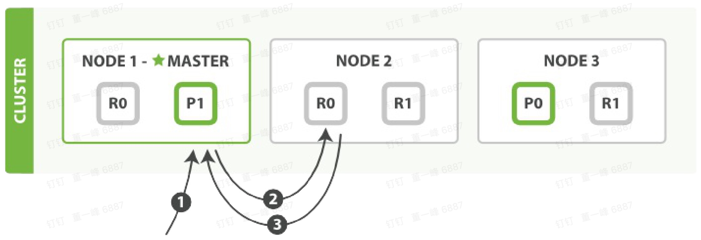
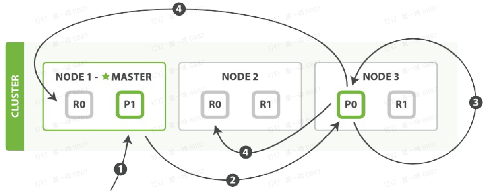
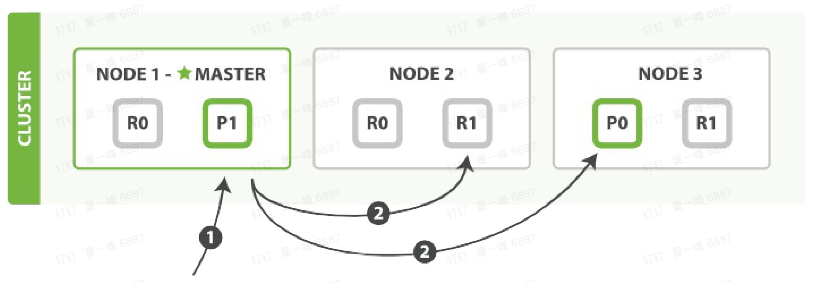
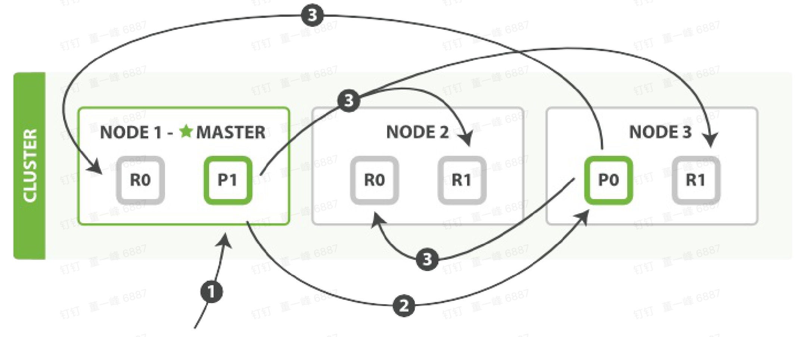

[TOC]

# 注意事项

- 索引分片过多，分布式资源消耗越大，查询响应越慢。

  

# 分片路由

> shard = hash( routing ) % number_of_primary_shards

- routing 是一个可变值，默认是文档 _id，可以自定义
- hash( routing  ) :  routing  通过 hash 函数生成一个数字
- number_of_primary_shards：主分片数
- shard 分布在 0 ~ number_of_primary_shards - 1 之间

number_of_primary_shards 是一个固定的数，会使索引难以扩容。实际上有很多技巧可以实现水平扩容。

这就是为什么主分片数在创建索引时定义而且不能修改

# 主分片和副分片交互

假设有三个节点的集群：bblogs 索引拥有 2 个主分片。每个主分片有 2 个复制分片。相同的分片不会放在同一个节点上。

每个 node 都有能力处理任意请求。

最好的做法：节点循环接受请求，这样可以负载平衡。

## 新建，索引和删除

write 操作

1. 客户端向 node 1 发送新建、索引、删除请求。
2. node 1 根据文档 _id 计算出属于 分片 0，于是将请求转发给 node 3。因为node 3 上的 分片 0是主分片。
3. node 3 在主分片上执行请求（写请求），如果成功，它转发到node 1 和 node 2 的副分片上。当所有的复制节点报告成功，node 3 报告成功给请求节点（node 1），请求节点在报告给客户端。

所以客户端收到成功的响应的时候，文档的修改已经被应用与主分片和副分片。

###  **replication** 

- 默认值：sync。主分片+复制分片都成功才算成功。
- 设置：async：在主分片上执行成功就放回给客户端。

###  **consistency** 

## 检索文档

主分片和复制分片都可以检索。

1. 客户端向 Node 1 发送 get 请求。
2. 路由到 分片 0，分片 0 在 3 个节点上都有。此时它转发给 Node 2.
3. Node 2 返回 endangered 给 Node 1，Node 1 返回给客户端。

注意：对于读请求，为了负载平衡，请求节点( Node1 )会为每一个请求选择不同的分片（循环所有分片副本）。

## 局部更新文档

1. 客户端向 Node 1 发送一个更新请求。
2. 路由到 0 分片上，于是将请求转发给 Node 3（因为Node 3 有 0 主分片）
3. Node 3 从主分片上检索出文档，修改 _source 字段的Json，然后在主分片上重建索引。如果有其他进程修改了文档，它以 retry_on_conflict 设置的次数重复步骤3，都未成功则放弃。
4. 如果 Node 3 成功更新了文档，它同时转发（异步，不保证顺序）文档到 Node1 和 Node 2 上的复制分片上重建索引。当所有复制节点报告成功，Node 3 放回成功给请求节点（Node 1）,然后返回给客户端。

## 多文档模式

mget 和 bulk

1. 客户端向 Node 1发送 mget 请求。
2. Node 1,为每个分片构建一个多条数据的检索，然后转发这些请求去所需的主分片或者复制分片上。当所有回复被接收，Node 1 构建响应并返回给客户端。

1. 客户端向 Node 1发送 bulk 请求。
2. Node 1,为每个分片构建批量请求，然后转到这些所需的主分片上。
3. 主分片顺序执行操作。当一个操作执行完毕后，主分片转发新文档（或者删除部分）给对应的复制分片，然后执行下一个操作。复制节点报告所有操作完成，节点报告给请求节点（Node 1），Node 1 构建响应并返回给客户端。

