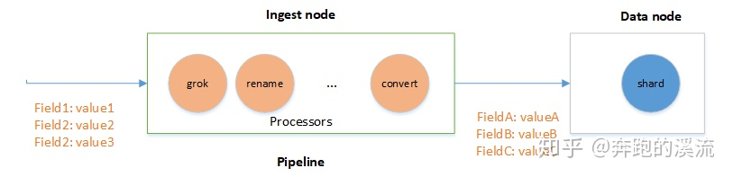

[TOC]

# pipeline

在文档写入 ES 之前，对数据进行预处理（ingest）工作通过定义 pipeline 和 processors 实现。




注意：数据预处理必须在 Ingest node 节点处理，ES 默认所有节点都是 Ingest node。

如果需要禁用 Ingest ，可以在 elasticsearch.yaml 配置：

```yaml
node.ingest: false
```

# pipeline Demo

## **创建 pipeline**

```apl
# 创建名称为：pipeline_uppercase pipeline
# processors 包含一个 processor ：将 message 字段的内容转换为大写
PUT _ingest/pipeline/pipeline_uppercase
{
  "description": "uppercase field message",
  "processors": [
    {
      "uppercase": {
        "field": "message",
        "ignore_missing": true
      }
    }
  ]
}
```

## **写入数据**

```apl
# 指定使用的 pipeline 名字
POST index_data/_doc?pipeline=pipeline_uppercase
{
  "name": "pipeline",
  "message": "this is so cool!"
}
```

## **查看数据**

```apl
GET index_data/_search

# 结果显示
{
  "took" : 0,
  "timed_out" : false,
  "_shards" : {
    "total" : 1,
    "successful" : 1,
    "skipped" : 0,
    "failed" : 0
  },
  "hits" : {
    "total" : {
      "value" : 2,
      "relation" : "eq"
    },
    "max_score" : 1.0,
    "hits" : [
      {
        "_index" : "index_data",
        "_type" : "_doc",
        "_id" : "lIiXsnYBv8g5MehmL98X",
        "_score" : 1.0,
        "_source" : {
          "name" : "pipeline",
          "message" : "THIS IS SO COOL!"
        }
      }
    ]
  }
}
```

## **模拟pipeline**

```apl
GET /_ingest/pipeline/pipeline_uppercase/_simulate
{
  "docs": [
    {
      "_index": "index",
      "_id": "id",
      "_source": {
        "message": "this is so cool!"
      }
    },
    {
      "_index": "index",
      "_id": "id",
      "_source": {
        "message": "elasticsearch"
      }
    }
  ]
}

# 测试结果
{
  "docs" : [
    {
      "doc" : {
        "_index" : "index",
        "_type" : "_doc",
        "_id" : "id",
        "_source" : {
          "message" : "THIS IS SO COOL!"
        },
        "_ingest" : {
          "timestamp" : "2020-12-30T07:44:47.1443329Z"
        }
      }
    },
    {
      "doc" : {
        "_index" : "index",
        "_type" : "_doc",
        "_id" : "id",
        "_source" : {
          "message" : "ELASTICSEARCH"
        },
        "_ingest" : {
          "timestamp" : "2020-12-30T07:44:47.1443329Z"
        }
      }
    }
  ]
}
```


# 内置 processor

ES  内置了大量 processor。

常用 processor ：

- convert
- Date
- Drop
- Grok
- Dissect
- Remove
- Rename
- Set
- URI
- ...

参考官方文档：

ES 还提供了 ingest 插件，需要自己安装

- Ingest-geoip: 是地理位置处理的数据库插件，在最新的版本已经不作为插件发布，合并到`geoip` processor。
- ingest-user-agent：扩展浏览器请求信息，在最新的版本已经不作为插件发布，合并到User agent processor。
- ingest-attachment：该插件扩展ES处理文本文件的能力， 使用它可以实现对（PDF,DOC,EXCEL等）主流格式文件的文本抽取及自动导入。处理的Field必须是Base64格式的二进制编码。

## **使用 Ingest API**

```apl
# 创建pipeline
PUT /_ingest/pipeline/<pipeline> 

# 查询pipeline
GET /_ingest/pipeline/<pipeline> 
GET /_ingest/pipeline

# 删除pipeline
DELETE /_ingest/pipeline/<pipeline>

# 模拟pipeline
POST /_ingest/pipeline/<pipeline>/_simulate
GET /_ingest/pipeline/<pipeline>/_simulate
POST /_ingest/pipeline/_simulate
GET /_ingest/pipeline/_simulate
```


## 自定义 processor 插件

自定义 processor 可以仿照 ES 官方插件实现自己的 processor 处理。直接完毕直接安装插件就可以使用。


### **初始化IngestPlugin插件 **

```java
public class CoordinateConvertPlugin extends Plugin implements IngestPlugin {    			
    @Override    
    public Map<String, Processor.Factory> getProcessors(Processor.Parameters parameters) {        
        return Collections.singletonMap(CoordinateProcessor.TYPE, new CoordinateProcessor.Factory());    
    }
}
```

IngestPlugin内我们只需要实现 getProcessors 创建 processsor 工厂方法，其中 CoordinateProcessor.TYPE 是 processor 名称不能重复。ES框架会遍历所有的 IngestPlugin，加载 Processor。

new CoordinateProcessor.Factory() 是初始化 Processor.Factory 工厂类。


### **Processor.Factory工厂实现**

Processor.Factory主要是定义processor的命令行格式和初始化CoordinateProcessor。

```java
public static final class Factory implements Processor.Factory {
        static final Set<Property> DEFAULT_PROPERTIES = EnumSet.allOf(Property.class);

        @Override
        public Processor create(Map<String, Processor.Factory> processorFactories, String tag,
                                Map<String, Object> config) throws Exception {
            String field = readStringProperty(TYPE, tag, config, "field");
            String targetField = readStringProperty(TYPE, tag, config, "target_field", "coordinate");
            List<String> propertyNames = readOptionalList(TYPE, tag, config, "properties");
            boolean ignoreMissing = readBooleanProperty(TYPE, tag, config, "ignore_missing", false);

            final Set<Property> properties;
            if (propertyNames != null) {
                properties = EnumSet.noneOf(Property.class);
                for (String fieldName : propertyNames) {
                    try {
                        properties.add(Property.parse(fieldName));
                    } catch (Exception e) {
                        throw newConfigurationException(TYPE, tag, "properties", "illegal field option [" +
                            fieldName + "]. valid values are " + Arrays.toString(Property.values()));
                    }
                }
            } else {
                properties = DEFAULT_PROPERTIES;
            }

            return new CoordinateProcessor(tag, field, targetField, properties, ignoreMissing);
        }
    }
```


### **Processor实现**

CoordinateProcessor 是AbstractProcessor 的实现，所有的 processor 都是实现 Processor 接口，ES 框架定义了抽象类AbstractProcessor，不同的 Processor 实现各自不同的处理逻辑。

```java
public class CoordinateProcessor extends AbstractProcessor {
    public static final String TYPE = "location_coordinate";
    public CoordinateProcessor(String tag, String field, String targetField, Set<Property> properties, boolean ignoreMissing) {
        super(tag);
        this.field = field;
        this.targetField = targetField;
        this.properties = properties;
        this.ignoreMissing = ignoreMissing;
        this.mapIDRevertLonLat = new MapIDRevertLonLat();
    }

    @Override
    public IngestDocument execute(IngestDocument ingestDocument) throws Exception {
        Map<String, Object> additionalFields = new HashMap<>();
		String input = ingestDocument.getFieldValue(field, String.class);
		// 此处省略...
		additionalFields.put("longitude", value[0]);
        additionalFields.put("latitude", value[1]);
		
        return ingestDocument;
    }

    @Override
    public String getType() {
        return TYPE;
    }
}
```

这样我们只需要在 execute 中实现自己的 processor 处理逻辑就实现了自己的 processor 了。


### **效果测试**

创建 pipeline，process 指定为 location_coordinate。

```apl
PUT _ingest/pipeline/coordinate
{
  "description": "Extract single location coordinate information",
  "processors": [
    {
      "location_coordinate": {
        "field": "url",
        "ignore_missing": true
      }
    }
  ]
}
```

使用 pipeline

```apl
POST /coordinate_test/_doc?pipeline=coordinate
{
  "url": "x=25357&y=6538&level=15"
}
```

测试效果

```apl
{
        "_index" : "coordinate_test",
        "_type" : "_doc",
        "_id" : "l4i4snYBv8g5MehmA9_v",
        "_score" : 1.0,
        "_source" : {
          "coordinate" : {
            "level" : 15,
            "latitude" : "18.17",
            "x" : 25357,
            "y" : 6538,
            "longitude" : "98.59"
          },
          "url" : "x=25357&y=6538&level=15"
        }
      }
```


# 小结

ES的 Ingest node pipeline 功能很强大，具有强大的数据处理的能力，官方提供了丰富的 processes，用户可以灵活选择，也可以通过自定义 IngestPlugin 实现更为复杂的操作。既可以灵活的变更索引的结构和数据，又可以减少对业务代码的侵入。对数据清洗处理的任务提供了一种轻量级的解决方案。