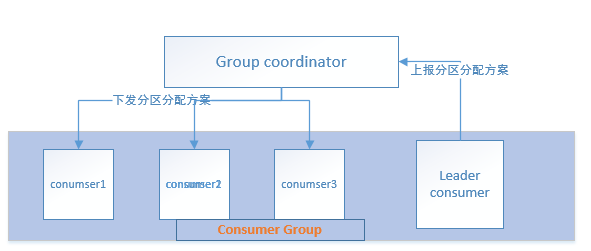

- heartbeat.interval.ms 3000

  心跳间隔。心跳是在 consumer 与 coordinator 之间进行的。心跳是确定 consumer 存活，加入或者退出 group 的有效手段。

  这个值必须设置的小于 session.timeout.ms，因为：当Consumer由于某种原因不能发Heartbeat到coordinator时，并且时间超过session.timeout.ms 时，就会认为该consumer已退出，它所订阅的partition会分配到同一group 内的其它的consumer上。

- session.timeout.ms 10000

  Consumer session 过期时间。这个值必须设置在broker configuration中的 group.min.session.timeout.ms 与 group.max.session.timeout.ms之间。

- connections.max.idle.ms 9 * 60 * 1000

  连接空闲超时时间。因为consumer只与broker有连接（coordinator也是一个broker），所以这个配置的是consumer到broker之间的。

- max.poll.interval.ms 300000

  前面说过要求程序中不间断的调用 poll() 。如果长时间没有调用 poll，且间隔超过这个值时，就会认为这个 consumer 失败了，offsetCommit 就会失败，offset 就不变了，一直重复获取相同的消息，旧线程依然会执行，导致拖垮服务器。