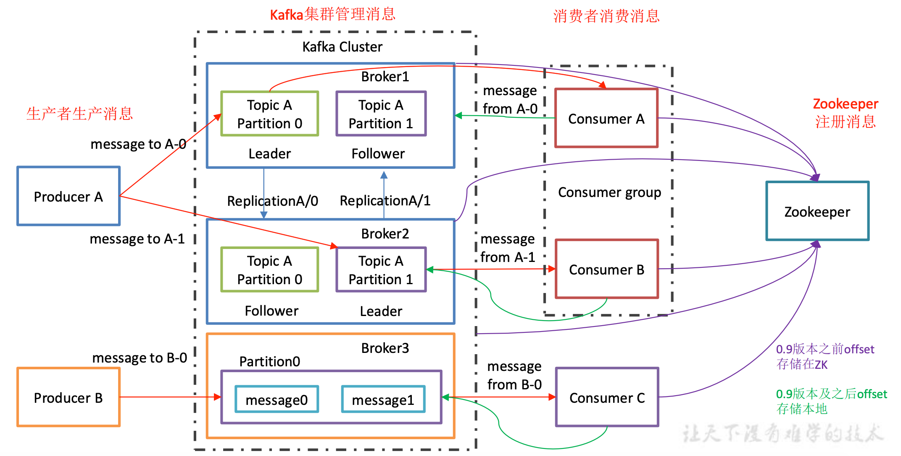

# 概述

## 定义

Kafaka 是一个分布式的基于发布/订阅模式的消息队列（Message Queue），主要应用于大数据实时数据处理领域。

## 基础架构

- Producer：消息生产者，向 kafka broker 发消息的客户端。
- Consumer：消息消费者，向 kafka broker 取消息的客户端。
- Consumer Group（CG)：消费者组，由多个 consumer 组成。消费者组内每个消费者负责消费不同分区的数据，一个分区只能由一个组内的消费者消费；消费者组之间互不影响。消费者组是逻辑上的一个订阅者。
- Broker：一台 kafka 服务器就是一个 broker。一个集群由多个 broker 组成。一个 broker 可以容纳多个 topic
- Topic：可以理解为一个队列，生产者和消费者面向的都是一个 topic 
- Partition：为了实现扩展性，一个非常大的 topic 可以分布到多个 broker（服务器）上，一个 topic 可以分为多个 partition，每个 partition 是一个有序的队列。
- Replica：副本，为保证集群中的某个节点发生故障时，该节点上的 partition 数据不丢失且kafka 仍然能够继续工作。kafka 提供了副本机制，一个 topic 的每个分区都有若干个副本，一个  leader 和若干个  follower 
- Leader：每个分区多个副本的“主”，生产者发送数据的对象，以及消费者消费数据的对象都是 leader。
- Follower：每个分区多个副本的“从”，实时从 leader 中同步数据，保持和 leader 数据同步。leader 发生故障时，某个 follower 会成为新的 leader。

