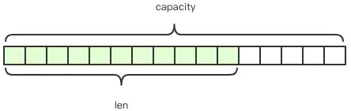
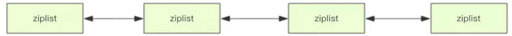
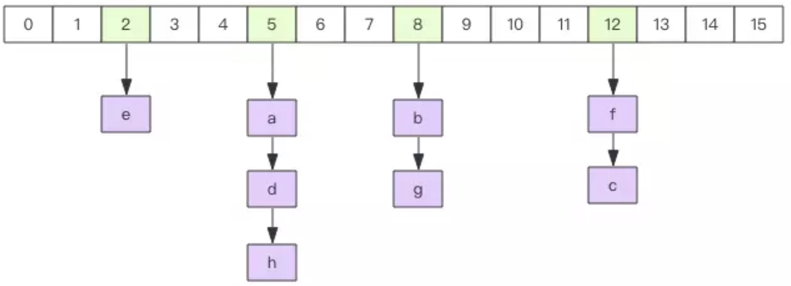

[TOC]

# string



- string 是一个可变的字节数组

- capacity：字符串实际分配的空间

- len：实际字符串长度

- 字符串小于 1M时，扩容都是加倍现有的空间，如果超过 1M，一次只会扩 1M。字符串最大长度为 512 M

  

**操作**

- 写：set key  str

- 获取子串：getrange key 0 -1

- 读：get key

- 长度：strlen key

- 覆盖 string 子串的内容：setrange key 28  sub_str

- 追加：append key sub_str

- 计数：incrby key 100

  计数范围：Long.MIN , Long.Max

- 主动删除：del

- 被动删除：expire 设置过期时间

expire 不精确

​	方法一：key + 时间戳

​    方法二：ttl 获取字符串的寿命，进行判断。

# list

使用双向链表实现的，所以随机定位性能较弱，首尾插入，删除性能较优。

如果 list 的列表长度很长，一定要关注链表相关操作的时间复杂度。

**负下标**

-1 表示：倒数第一个

-2 表示：倒数第二个

-n 表示：第一个


**队列 / 堆栈**

通过 rpush / rpop  / lpush / lpop 命令实现。

```shell
# 队列：右进左出
rpush key value1 value2

lpop()

# 堆栈：右进右出
rpush key value1 value2

rpop()
```

日常应用中，列表常用来作为异步队列使用。

- 列表长度：llen key 
- 随机度_根据下标：lindex key 0 2
- 随机度_获取子列表：lrange key 0 -1
- 修改元素_指定位置：lset key 1 dyf

**插入元素** 

​	linsert 命令里增加了方向参数 before / after 来显示前置插入还是后置插入。

​	linsert 并不是通过指定插入位置插入，而是通过指定具体的值。==因为在分布式环境下，列表的元素总是频繁变动的，意味着上一时刻计算的元素下标在下一时刻就不是你期望的下标了==。

```shell
linsert key before v1 v2
```


**删除元素**

​	需要指定删除的最大个数及元素的值

```shell
lrem key 1 v1
```


**定长列表**

需求：跑马灯的形式实现中奖用户名列表，因为中奖用户实在太多，能显示的数量一般不超过100条（实际项目中更多使用zset ，太多取舍需要规则，比如最近时间，比如中奖金额最大）。

```shell
ltrim key start end
```

if end < start : ltrim == del 

**快速列表**



Redis 的 list 底层使用的是 quicklist 的结构。

list 元素较少时，使用 ziplist（压缩列表），一块连续内存存储。

当数据量比较多时，使用 quicklist。

因为普通的链表需要的附加指针空间太大，会比较浪费空间。比如这个列表里存的只是int类型的数据，结构上还需要两个额外的指针prev和next。

quicklist：是将多个ziplist使用双向指针串起来使用。这样既满足了快速的插入删除性能，又不会出现太大的空间冗余。

# hash



与 Java 中的HashMap 或者 Python 中 dict 类似，使用二维结构实现，第一维是数组，第二维是链表。通过 key 查找元素时，先计算 key 的 hashcode，然后 hashcode % array_len 定位到链表表头，在遍历链表获取响应的 value。链表的作用解决 hash 碰撞的。

操作

- 增加元素：hset key k1 v1 

- 批量增加元素：hmset key k1 v1 k2 v2

- 获取元素：hget key

- 批量获取元素：hmget key k1 k2

- 获取全部元素：hgetall key

- 获取所有keys：hkeys key

- 获取所有values：hvals key

- 删除元素：hdel key k1 k2

- 判断元素是否存在：

  - hget key k ：判断 value 是否为空，如果 value 非常大，比较浪费。
  - hexists key k 

- 计数器：对于每一个 key 都可以作为独立计数器，如果 value 不是整数，调用 hincrby 会出错。

  ```shell
  hinicrby key v 1
  hinicrby key v2 2
  ```

**扩容**

​	当 hash 内部的元素比较拥挤时（hash 碰撞比较频繁），就需要进行扩容。扩容需要申请新的两倍大小的数组，然后将所有的键值对重新分配到新的数组下标对应的链表中（rehash）。如果hash结构很大，比如有上百万个键值对，那么一次完整rehash的过程就会耗时很长。这对于单线程的Redis里来说有点压力山大。所以Redis采用了渐进式rehash的方案。它会同时保留两个新旧hash结构，在后续的定时任务以及hash结构的读写指令中将旧结构的元素逐渐迁移到新的结构中。这样就可以避免因扩容导致的线程卡顿现象。

**缩容**

 Redis的hash结构不但有扩容还有缩容，从这一点出发，它要比Java的HashMap要厉害一些，Java的HashMap只有扩容。缩容的原理和扩容是一致的，只不过新的数组大小要比旧数组小一倍。

# set

Java 中 HashSet 内部使用了HashMap 实现的，value 指向同一个对象。Redis 的 set 亦然。

**操作**

- 增加元素：sadd key v1 v2 v3
- 读取所有元素：smembers key
- 集合长度：scard key
- 随机获取 count 个元素：srandmember key 3
  - count 默认是 1
- 删除元素：srem key v1 v2
- 随机删除一个元素：spop key
- 判断元素是否存在：sismember key v1

# zset

SortedSet(zset) 是 Redis 提供的一个非常特别的数据结构。等价于 Java Map<String,Double> ，每个元素 value 赋予一个权重 score，另一方面类似于 TreeSet，内部元素按照权重 score 进行排序，可以得到每一个元素的名次，还可以通过 score 的范围获取元素列表。


zset 底层实现使用了两个数据结构：

1. hash
2. 跳表

hash 的作用：关联元素 value 与 score ，保证 value 的唯一性，可以通过 value 找到对应 score。

跳表的作用：给 value 排序，根据score 的范围获取元素列表。

- 增加元素：zadd key score value
- 批量增加元素：zadd key s1 v1 s2 v2
- 长度：zcard key
- 删除元素：zrem key v1 
- 批量删除元素：zrem key v1 v2
- 计数器：zincrby key 1.0 v1
- 获取指定元素的权重：zscore key value
- 获取指点元素的正向排名：zrank key value
- 获取指点元素的反向排名：zrevrank key value
- 根据排名范围获取元素列表（正序）：zrange key 0 -1 withscores
- 根据排名范围获取元素列表（倒序）：zrevrange key 0 -1 withscores
- 根据 score 范围获取列表（正序）：zrangebyscore key 0 5
- 根据 score 范围获取列表（倒序）：zrevrangebyscore key +inf -inf withscores
  - +inf 正无穷
  - -inf 负无穷
- 根据范围移除元素列表
  - 移除 2 个元素：zremrangebyrank key 0 1
  - zremrangebyscore key -inf 4

跳表