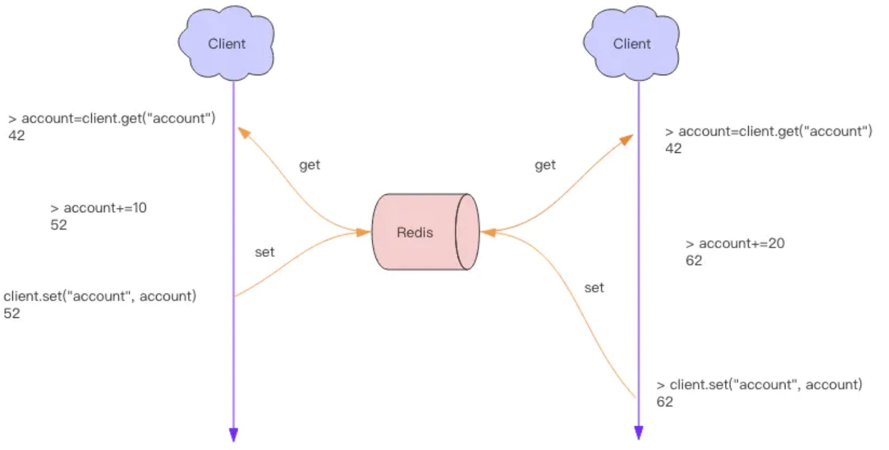
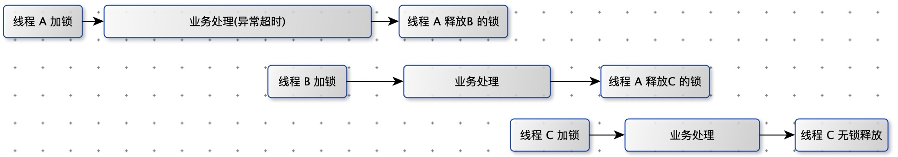

分布式应用经常遇到并发问题。

要修改用户的状态，修改状态需要先读出用户的状态，在内存里进行修改，改完了再存回去。

读取和保存状态这两个操作不是原子的。



==**分布式锁本质**==上要实现的目标就是在 Redis 里面占一个“茅坑”，当别的进程也要来占时，发现已经有人蹲在那里了，就只好放弃或者稍后再试。

# 方案一

**方案**：使用 setnx( set if not exists ) 指令，只允许被一个客户端占坑。先来先占， 用完了，再调用 del 指令释放茅坑。

```shell
setnx 'lock:codehole' true
... do something critical ...
del 'lock:codehole'
```

**问题**：如果逻辑执行到中间出现异常了，可能会导致 del 指令没有被调用，这样就会陷入死锁，锁永远得不到释放。

# 方案二

**方案**：拿到锁之后，再给锁加上一个过期时间，比如 5s，这样即使中间出现异常也可以保证 5 秒之后锁会自动释放。

```shell
setnx 'lock:codehole' true
expire 'lock:codehole' 5
... do something critical ...
del 'lock:codehole'
```

**问题**：如果在 setnx 和 expire 之间服务器进程突然挂掉了，可能是因为机器掉电或者是被人为杀掉的，就会导致 expire 得不到执行，也会造成死锁。

**问题原因**：setnx 和 expire 不是原子指令。

# 方案三

**方案：**Redis 2.8 版本中作者加入了 set 指令的扩展参数，使得 setnx 和 expire 指令可以一起执行。

```shell
set 'lock:codehole' true ex 5 nx
... do something critical ...
del 'lock:codehole'
```

**超时问题**：如果在加锁和释放锁之间的逻辑执行的太长，以至于超出了锁的超时限制，就会出现问题。

为了避免这个问题，Redis 分布式锁不要用于较长时间的任务。

例子：



如图：线程 A 由于异常超时，分布式锁被超时释放，导致线程 B 进来，加锁，B 在处理过程中，A 线程处理完毕后，将线程 B 的锁给释放了，导致线程 C 进入，加锁，在 C 处理过程中，线程 B 执行完毕后，导致线程 B 释放了线程 C 的锁。如此下去，一次系统异常，有可能导致后续所有处理：分布式锁的失效。


解决方案：每个线程使用各自的锁，释放时只能是否自己锁。不相互影响。 

# 方案四

为 set 指令的 value 参数设置为一个随机数，将随机数与对应线程绑定，释放锁时先匹配随机数是否一致，然后再删除 key，这是为了确保当前线程占有的锁不会被其它线程释放，除非这个锁是过期了被服务器自动释放的。 


这也不是一个完美的方案，它只是相对安全一点，因为如果真的超时了，当前线程的逻辑没有执行完，其它线程也会乘虚而入。