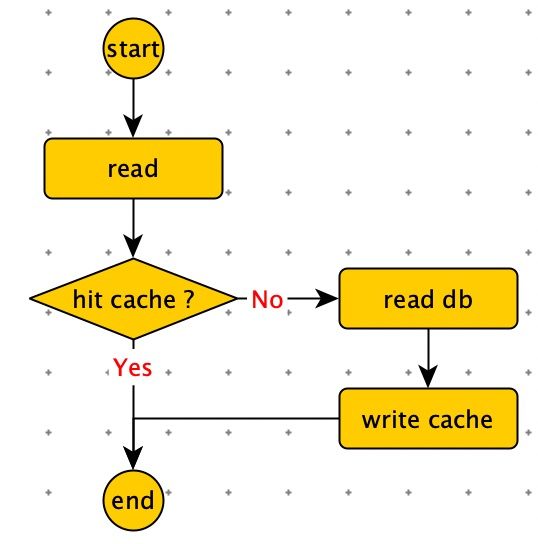
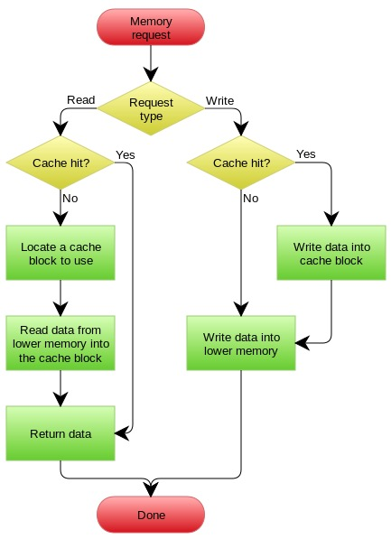
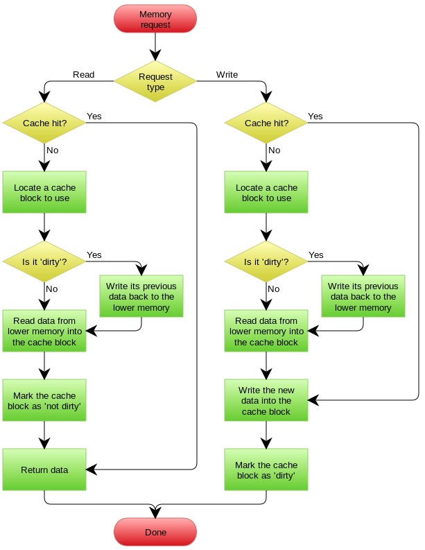

[TOC]

# 错误方案

错误使用方式

1. 先删除缓存。
2. 然后更新数据库。

并发：

 							—read—> 没有命中缓存 —> readdb (旧数据) —> 放入缓存

 —write—> 删除缓存 —> 更新数据  

这样造成：脏数据长期在内存中。

正确使用方式

1. 先更新数据库。
2. 然后删除缓存。

—read—> 没有命中缓存 —> readdb (旧数据) —> 放入缓存

—write——————————> 更新数据 —————————> 删除缓存 

这种方式理论上会出现脏数据，但是概率很低。

原因如下：

1. 缓存失效时，有并发读，写操作。
2. 实际执行时间 写 >> 读。
3. 读先于写进入数据库，又要晚于写操作更新缓存。

优化缓存方案的方向：

1. 通过2PC 或者 Paxos 协议保证一致性。（2PC 太慢，Paxos 太复杂）
2. 通过拼命降低并发时脏数据的概率。

# 缓存更新的 Design Pattern

1. Cache aside
2. Read through
3. Write through
4. Write behing caching

## Cache Aside Pattern

命中

**更新：先更新数据库，然后删除缓存。**

## Read/Write Through Pattern

Cache Aside套路中，我们的应用代码需要维护两个数据存储，一个是缓存（Cache），一个是数据库（Repository）。所以，应用程序比较啰嗦。而 Read/Write Through套路是把更新数据库（Repository）的操作由缓存自己代理了，所以，对于应用层来说，就简单很多了。**可以理解为，应用认为后端就是一个单一的存储，而存储自己维护自己的Cache**

这种方式：调用其他项目 rpc 服务，rpc 内部有缓存机制，不需要调用端关心。

## Write Behing Caching Pattern

Write Behind 又叫 Write Back。**就是Linux文件系统的Page Cache的算法**

Write Back套路：在更新数据的时候，只更新缓存，不更新数据库，而我们的缓存会异步地批量更新数据库。这个设计的好处就是让数据的I/O操作飞快无比（因为直接操作内存嘛 ），因为异步，write backg还可以合并对同一个数据的多次操作，所以性能的提高是相当可观的。

**问题：**

​		数据不是强一致性的，而且可能会丢失。Unix/Linux非正常关机会导致数据丢失。

Write Back实现逻辑比较复杂，因为他需要track有哪数据是被更新了的，需要刷到持久层上。操作系统的write back会在仅当这个cache需要失效的时候，才会被真正持久起来，比如，内存不够了，或是进程退出了等情况，这又叫lazy write。

# 缓存淘汰策略

1. 先进先出策略 FIFO ( Frist In,Frist Out )
2. 最少使用策略 LFU ( Least Frequently Used )
3. 最近最少使用策略 LRU ( Least Recently Used )

