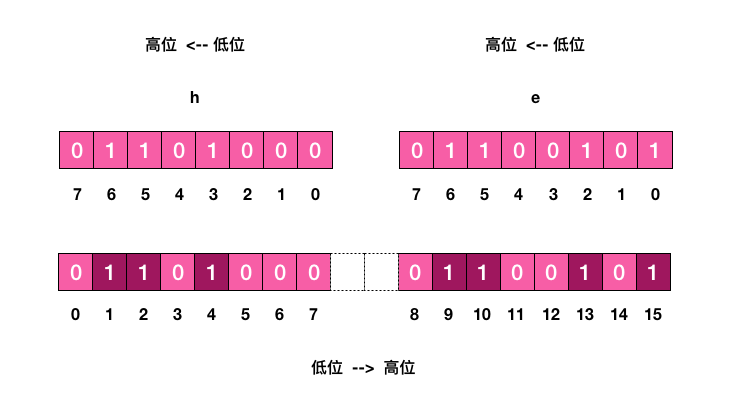

需求：要记录一个用户 365 天，每天的是否签到。需要一个 365 长的数组。


Redis 位图，每天签到的记录只占据一个位。365 天就是 365 位，46 个字节。这样大大节约了空间。

Redis 位图就是普通的字符串，也就是 byte 数组。

操作：

1.  get，set
2.  getbit，setbit


Redis 的位数组是==**自动扩展**==，如果设置了某个偏移位置超出了现有的内容范围，就会自动将位数组进行零扩充。


统计和查找


位图统计：bitcount：统计指定位置范围内 1 的个数。

位图查找：bitpos：查找指定范围内出现的第一个 0 或 1。

bitcount 统计用户一共签到多少天。

bitpos ：查找用户哪一天开始第一次签到。

**==遗憾的是， start 和 end 参数是字节索引，也就是说指定的位范围必须是 8 的倍数，而不能任意指定==** 

我们无法直接计算某个月内用户签到了多少天，而必须要将这个月所覆盖的字节内容全部取出来 (getrange 可以取出字符串的子串) 然后在内存里进行统计，这个非常繁琐。


魔术指令 bitfield

 setbit，getbit 都是对单个位操作的。如果要一次操作多个位，必须使用管道来出来。

Redis 3.2 以后新增 bitfield 。

bitfield 有三个子命令：get，set，incrby。最多只能处理 64 个连续位。如果超过 64 位，使用多个子命令，bitfield 可以一次执行多个子命令。



```shell
127.0.0.1:6379> set w hello
OK
127.0.0.1:6379> bitfield w get u4 0  # 从第一个位开始取 4 个位，结果是无符号数 (u)
(integer) 6
127.0.0.1:6379> bitfield w get u3 2  # 从第三个位开始取 3 个位，结果是无符号数 (u)
(integer) 5
127.0.0.1:6379> bitfield w get i4 0  # 从第一个位开始取 4 个位，结果是有符号数 (i)
1) (integer) 6
127.0.0.1:6379> bitfield w get i3 2  # 从第三个位开始取 3 个位，结果是有符号数 (i)
1) (integer) -3
```

一次执行多个子指令

```shell
127.0.0.1:6379> bitfield w get u4 0 get u3 2 get i4 0 get i3 2
1) (integer) 6
2) (integer) 5
3) (integer) 6
4) (integer) -3
```

