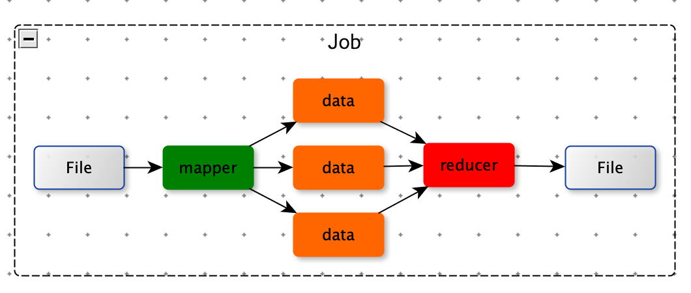
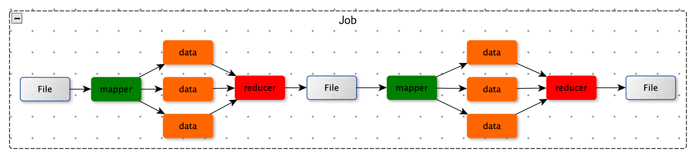
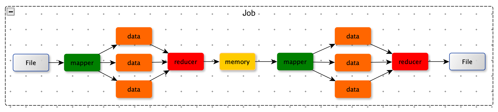
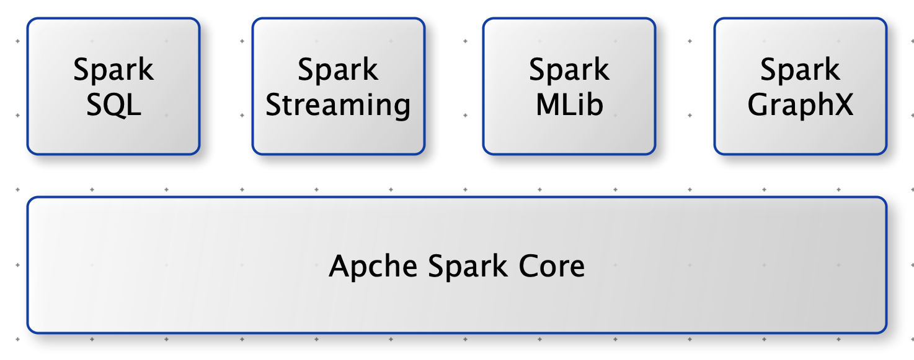

[TOC]

# Spark VS Hadoop

Hadoop 是一次性数据计算：Hadoop 框架在处理时，从存储设备（文件）中读取，然后逻辑处理操作，最后将处理结果存入存储设备（文件）中。

Hadoop 中只有 mapper 和 reducer 不能很好地适应复杂的计算，比如：机器学习中迭代计算。

一些复杂的计算，必须拆成一个一个Hadoop 任务，第一个任务输入文件，是下一个Hadoop任务的输入文件。这些磁盘操作性能比较低。

Spark 将 Hadoop 任务的计算结果放入内存中，方便下次计算使用，这种方式效率比较高。

Hadoop MapReduce 不适合循环迭代式数据流处理。在机器学习，数据挖掘算法中，存在诸多计算效率问题，所以 Spark 应运而生。

注意：Spark 是基于内存，由于内存的限制，可能会由于内存资源不足导致 Job 执行失败，此时，MapReduce 是更好的选择

# Spark 核心模块

- Spark Core：提供 Spark 最基础与最核心的功能。
- Spark SQL：操作结构化数据的组件。
- Spark Streaming：Spark 平台上针对实时数据进行流式计算的组件。
- Spark MLib：提供机器学习算法库。
- Spark GraphX：面向图计算提供的框架与算法库。

# Spark 快速上手
