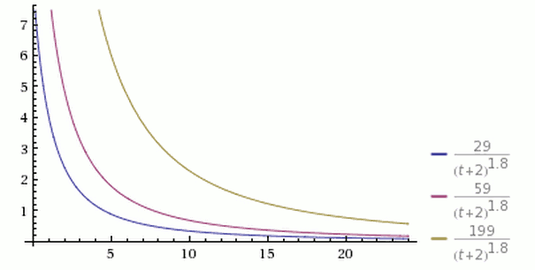
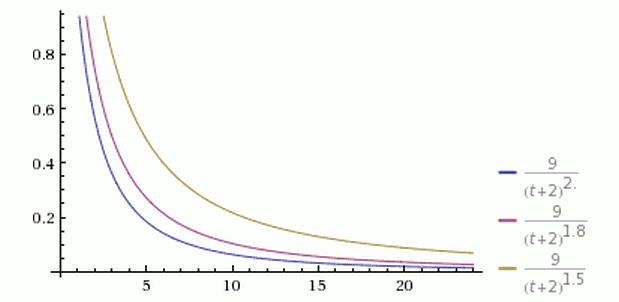
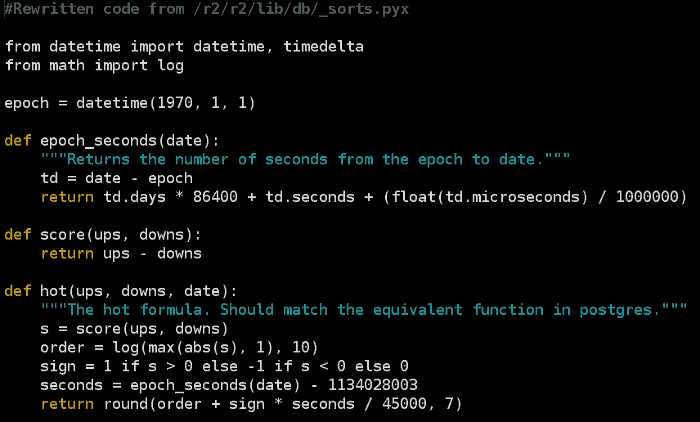
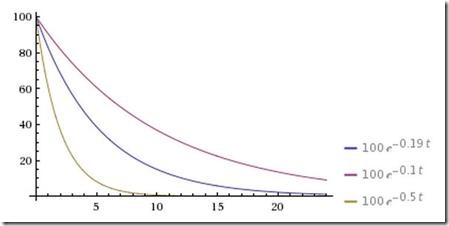

[TOC]

# 根据过去一段时间用户投票数排名

**排序因子**

1. 投票数


例如：按照” 过去 60 分钟内收藏的次数 “ 排名。每 60 分钟统计一次。

优点

1. 方案简单，已部署。
2. 内容更新的快。

缺点

1. 排名变化不够平滑：前一个小时还名列前茅，第二个小时就一落千丈。


# 重力因子加权投票数

**排序因子**

1. 发帖时间
2. 投票数


考虑到时间因素：新文章应该比旧文章更容易获得好的名次。

**==加权公式==**：$score = \frac{P-1}{(T+2)^G}$

- P：帖子的得票数，减去 1是为了忽略发帖人的票数。
- T：距离发帖的时间（单位为小时）。加上 2 为了防止最新的帖子导致分母过小（之所以选择 2 ，可能是因为原始文章出现在其他网站，到转帖只 Hacker News 平均需要 2 个小时）
- G：表示”重力因子“（gravityth power）,帖子排名向下拉的力量，默认值为：1.8.

## 得票数 P

在其他条件不变的情况下，**得票越多，排名越靠前**。




如果不想让”高票帖子“ 和 ”底票帖子“ 的差距过大，可以在票数上加一个小于 1 的指数，比如：$(P-1)^{0.8}$

## 距离发帖的时间 T

在其他条件不变的情况下，越是新发表的帖子，排名越高。或者说，**一个帖子的排名，会随着时间不断下降**。

从前一张图可以看到，经过 24 小时之后，所有帖子的得分基本上都小于1，这意味着它们都将跌到排行榜的末尾，保证了排名前列的都将是较新的内容。

## 重力因子

它的数值大小决定了排名随时间下降的速度。



从上图可以看到，三根曲线的其他参数都一样，G 的值分别为1.5、1.8和2.0。**G值越大，曲线越陡峭，排名下降得越快，意味着排行榜的更新速度越快**。


<font color='#e3170d'>加了时间衰减，为什么排行榜的变化就平缓了？</font>

答：有了时间衰减，新帖更容易上榜。榜单前几名，随着时间流逝，降权力度逐渐增大，排名会逐渐下降。当时间窗口要过期时，最早名列前茅的帖子，早已名落孙山了。

# 赞 + 踩 排行榜

**排序因子**

1. 发帖时间
2. 赞成票数
3. 反对票数


很多网站有赞和踩的投票。

怎么才能将赞成票和反对票结合起来，计算出一段时间内最受欢迎的文章呢？

如果文章 A 有 100 张赞成票和 5 张反对票，文章 B 有 1000 张赞成票和 950 张反对票，谁应该排在前边呢？

公式：



排序因子：

1. 帖子的新旧程度

   ```
   t = 发帖时间 - 2005年12月8日7:46:43
   ```

   t 单位为秒，帖子一旦发表，t 就是一个固定值。帖子越新，t 值越大。2005年12月8日7:46:43 是 Reddit 成立的时间。

2. 赞成票和反对票的差：s

   ```
   s = 赞成票 - 反对票
   ```

3. 投票方向：sign

   sign 是符号变量。

   ```python
   if ups > downs: sign = 1
   if ups < downs: sign = -1
   if ups = downs: sign = 0
   ```

4. 帖子的受肯定（否定）的程度：z

   $ z=\begin{cases}|x| & x!=0\\ 1 & x=0 \end{cases} $

   如果某个帖子的评价，越是一边倒，z 就越大。如果赞成票等于反对票，z = 1

综合以上四个因素：

$score = log_{10}z + \frac{sign*t}{45000}$

1. 以 10 为底数，意味着 z = 10 可以的 1 分，z = 100 可以得 2 分。也就是说前 10 投票的人与后 90 个投票人（乃至再后面900个投票人）的权重是一样的。如果一个帖子特别受欢迎，那么越到后面的赞成票，对得分产生的影响越小。
2. 分母 45000 秒，等于 12.5 小时，也就是说，后一天的帖子会比前一天的帖子多得 2 分（24/12.5 ≈ 2）。结合 $log_{10}z$ ，如果前一天的帖子在第二天还想保持原先的排名，z 值必须增加 100 倍（净赞成票增加 100 倍）。
3. sign 的作用：加分或者减分。
   1. 保证了大量净赞成票的文章，会排在前列。
   2. 赞成票与反对票接近或相等的文章，会排在后面。
   3. 得到净反对票的文章，会排在最后（因为得分是负值）。

**算法特点**

对于有争议的帖子，不能排在前列。

假定同一时间有两个帖子发表，文章A有 1 张赞成票（发帖人投的）、0 张反对票；文章 B 有1000 张赞成票、1000 张反对票，那么 A 的排名会高于 B，这显然不合理。

Reddit 排名，基本上由发帖时间决定，超级受欢迎的文章会排在最前面，一般性受欢迎的文章、有争议的文章都不会很靠前。这决定了 Reddit 是一个符合大众口味的社区，不是一个很激进、可以展示少数派想法的地方。


# 多因子排行榜

**排序因子**

1. 发帖时间
2. 最后一次回答的时间
3. 赞成票数
4. 反对票数
5. 回答参与人数
6. 浏览次数
7.  回答的赞成票
8. 回答的反对票


排序公式

$score = \frac{4*log_{10}{Qviews}+\frac{Qanswers*Qscore}{5}+sum(Ascores)}{((Qage+1)-\frac{Qage-Qupdated}{2})^{1.5}}$


- 问题的浏览次数：Qviews
- 问题得分 Qanswers：多少人参与了这个问题。这个值越大，得分将成倍放大。注意：如果 Qanswers 为 0，那么 Qscore 再高也没有用。在好的问题，如果没有回答，进不了排行榜。
- 回答数量：Qscore = 赞成票 - 反对票。好评越多，排名越靠前。
- 回答得分：Ascores = 回答的赞成票 - 回答的反对票，一般来说，“回答” 比 “问题” 更有意义。得分越高，排名越靠前。
- 距离问题发表的时间：Qage（单位秒）
- 距离最后一个回答的时间：Qupdate（单位秒）
  - 如果一个问题的存在时间越久，或者距离上一次回答的时间越久，*Qage* 和 *Qupdated* 的值就相应增大。也就是说，随着时间流逝，这两个值都会越变越大，导致分母增大，因此总得分会越来越小。

sum(Ascores) 的问题：一个正确的回答胜过一百个无用的回答，但是，简单加总会导致，1 个得分为 100 的回答与 100 个得分为 1 的回答，总得分相同。其次，由于得分会出现负值，因此那些特别差的回答，会拉低正确回答的得分。


**总结：**

Stack Overflow 热点问题的排名，与参与度（Qviews 和 Qanswers）和质量（Qscore 和 Ascores）成正比，与时间（Qage 和 Qupdated）成反比。

# 牛顿冷却定律

这是一个更一般的数学模型。我们可以把"热文排名"想象成一个"自然冷却"的过程：

1. 任一时刻，网站中所有的文章，都有一个“当前温度”，温度最高的文章就排在第一位。
2. 如果一个用户对某篇文章投了赞成票，该文章的温度就上升一度。
3. 随着时间流逝，所有文章的温度都逐渐“冷却”。

这样假设的意义：可以照搬物理学的冷却定律。构建一个“温度”与“时间” 的 “指数式衰减（Exponential decay）”过程。


牛顿冷却定律：物体的冷却速度，跟其当前温度与室温之间的温差成正比。

微分方程：$T'(t)=-a(T(t)-H)$

- T(t) ：温度 T 关于时间 t 的函数，则温度变化（冷却）的速度函数的导数 T'(t)
- H：代表室温
- T(t)-H：当前温度与室温之间的温差。冷却过程，当前温度高于室温，所以是个正值。
- 常数a（a > 0）：室温与降温速率之间的比例关系。前面的负号表示降温，不同的物质有不同的 α 值。


$ T = T_0 e^{-a(t-t_0)} $

本期温度 = 上期温度 * $e^{-冷却系数*时间间隔}$ 

**冷却系数**

冷却系数自己设定。如果假定一篇新文章的初始分数是100分，24小时之后"冷却"为1分，那么可以计算得到"冷却系数"约等于0.192。如果你想放慢"热文排名"的更新率，"冷却系数"就取一个较小的值，否则就取一个较大的值。




# 威尔逊区间

这个系列都在讨论，如何给出**"某个时段"**的排名，比如"过去 24 小时最热门的文章"。但是，很多场合需要的是**"==所有时段=="**的排名，比如"最受用户好评的产品"。


<font color='#e3170d'>**错误算法：得分 = 赞成票 - 反对票**</font>

假定有两个帖子，帖子 A 是 60 张赞成票，40 张反对票，帖子 B 是 550 张赞成票，450 张反对票。

请问，谁应该排在前面？按照上面的公式，B 会排在前面，因为它的得分（550 - 450 = 100）高于 A（60 - 40 = 20）。但是实际上，B 的好评率只有 55%（550 / 1000），而 A 为 60%（60 / 100），所以正确的结果应该是A排在前面。


<font color='#e3170d'>**错误算法：得分 = 赞成票 / 总票数**</font>

如果"总票数"很大，这种算法其实是对的。问题出在如果"总票数"很少，这时就会出错。假定 A 有 2 张赞成票、0张反对票，B 有 100 张赞成票、1 张反对票。这种算法会使得 A 排在 B 前面。这显然错误。


<font color='#e3170d'>**正确算法**</font>

假设

1. 每个用户的投票都是独立事件。
2. 用户只有两个选择，要么投赞成票，要么投反对票。
3. 如果投票总人数为 *n*，其中赞成票为 *k*，那么赞成票的比例 *p* 就等于 *k/n*。

为什么要这么假设？

1. 这种假设基本符合现实。
2. 为了使用 “ 二项分布 ”。

思路：

1. *p* 越大，就代表这个项目的好评比例越高，越应该排在前面。
2. *p* 的可信性，取决于有多少人投票，如果样本太小，*p* 就不可信，必须计算出 p 的 `可信区间`。

排名算法步骤

1. 计算每个帖子的“好评率”（k/n）。
2. 计算每个“好评率”的置信区间。
3. 根据置信区间的下限值，进行排名。这个值越大，排名就越高。

原理：置信区间的宽窄与样本的数量有关。

比如，A 有 8 张赞成票，2 张反对票；B 有 80 张赞成票，20 张反对票。这两个帖子的赞成票比例都是 80%，但是 B 的置信区间（假定 [75%, 85%]）会比 A 的置信区间（假定 [70%, 90%]）窄得多，因此，B 的置信区间的下限值（75%）会比 A（70%）大，所以 B 应该排在 A 前面。


<font color='#228B22'>**置信区间的实质，就是进行可信度的修正，弥补样本量过小的影响。**</font>

如果样本多，就说明比较可信，不需要很大的修正，所以置信区间会比较窄，下限值会比较大；如果样本少，就说明不一定可信，必须进行较大的修正，所以置信区间会比较宽，下限值会比较小。

二项分布的置信区间有多种计算公式，最常见的”[正态区间（Normal approximation interval）](http://en.wikipedia.org/wiki/Binomial_proportion_confidence_interval#Normal_approximation_interval)"，但它只适用于样本较多的情况（*np > 5* 且 *n(1 − p) > 5*），对于小样本，它的准确性很差。

1927年，美国数学家 Edwin Bidwell Wilson 提出了一个修正公式，被称为["威尔逊区间（Wilson score interval）"](http://en.wikipedia.org/wiki/Binomial_proportion_confidence_interval#Wilson_score_interval)，很好地解决了小样本的准确性问题。


# 贝叶斯平均

"威尔逊区间"，它解决了投票人数过少、导致结果不可信的问题。

这里就有一个问题：热门电影与冷门电影的平均得分，是否真的可比？举例来说，一部好莱坞大片有 10000 个观众投票，一部小成本的文艺片只有 100 个观众投票。这两者的投票结果，怎么比较？如果使用"威尔逊区间"，后者的得分将被大幅拉低，这样处理是否公平，能不能反映它们真正的质量？

　　一个合理的思路是，如果要比较两部电影的好坏，至少应该请同样多的观众观看和评分。既然文艺片的观众人数偏少，那么应该设法为它增加一些观众。