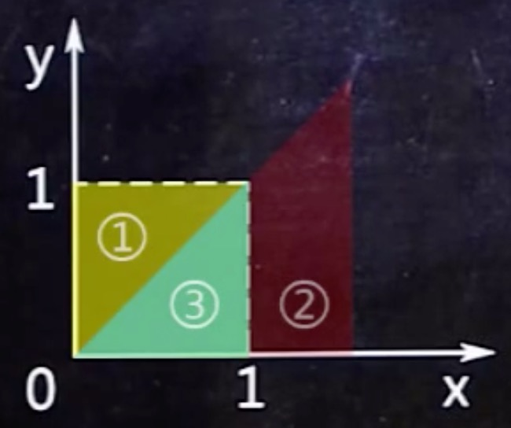
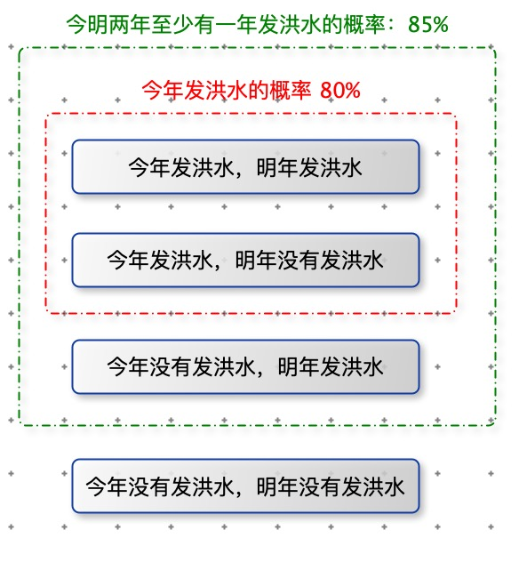

[TOC]

# 古典模型

特征：

1. 样本空间有限。
2. 事件等概率。

古典概率模型使用：排列组合求解。

$P = \frac{事件发生的次数}{实验的总次数}$

常用公式：

$A_n^m = n(n-1)...(n-m+1)=\frac{n!}{(n-m)!}$

$C_n^m=\frac{A_n^m}{m!}=\frac{n!}{m!(n-m)!}=C_n^{n-m}$

$n!=n*(n-1)*...*1$

$0!=1$

# 无放回类题目

盒子中有 4 个红 3 白共7个球，不用眼瞅，七个球摸起来是一样的，现无放回的摸 4 次，那摸出两个红球两个白球的概率是多少？

概率公式：$P = \frac{C_{条件一总}^{条件一取}*C_{条件二总}^{条件二取}*....*C_{条件 n 总}^{条件 n 取}}{C_总^取}$

条件一：摸出两个红球

条件二：摸出两个白球

$P = \frac{C_{4}^{2}*C_{3}^{2}}{C_7^4}=\frac{6*3}{35}=\frac{18}{35}$

# 有放回类题目

盒子中有 5 个红 6 白共 11 个球，不用眼瞅，11 个球摸起来是一样的，现有放回的摸 5 次，那摸出两个红球三个白球的概率是多少？

模式：

K 种颜色的球，代号分别为：$A_1,A_2,...,A_k$

抽一次，出现的概率分别为：$p_1,p_2,...,p_k$

求摸出各种球的个数分别为：$n_1,n_2,...,n_k$，$sum_k =n_1+n_2+...+n_k$ 

概率公式：$P=\frac{A_{sum_k}^{$sum_k}}{A_{n_1}^{n_1}*A_{n_2}^{n_2}*...*A_{n_k}^{n_k}}=\frac{(n_1+n_2+...+n_k)!}{n_1!*n_2!*...*n_k!} p_1^{n_1}*p_2^{n_2}*...p_k^{n_k}$

分析：

1. 前两次是红球，后三次是白球的概率：$p_1^{n_1}*p_2^{n_2}*...p_k^{n_k}$
2. 一共有$sum_k =n_1+n_2+...+n_k$,如果这些位置全排列是：$A_{sum_k}^{$sum_k}$
3. 但是相同颜色的球无差别，所以需要除以每种颜色球的全排列：$A_{n_1}^{n_1}*A_{n_2}^{n_2}*...*A_{n_k}^{n_k}$。前两次是红球，后三次是白球。那么再前两次红球交换位置还是同一种情况，不能算作两种。

求解：

2 中颜色的球，代号分别是 红，白。

抽一次，出现的概率分别为：$\frac{5}{11},\frac{6}{11}$

求摸出各种球的个数分别为：2 , 3

$P = \frac{(2+3)!}{2!*3!}(\frac{5}{11})^2(\frac{6}{11})^3$

 n 重伯努利的二项概率公式有点相似：

n 次试验 p 发生 k 次，$\overline p $ 发生(n-k)次，那么从 n 个位置选取 k 个位置放 p，剩下的就是 $\overline p$  $P_n(k)=C_n^kp^k(1-p)^{n-k}$

# 需要画图的题目

已知 0 < x < 1, 0 < y < 1, 求 x > y 的概率是多少？

1. 已知条件：$0 < x < 1, 0 < y < 1$,图中黄色正方形。
2. 待求概率条件：x > y ，图中红色三角形
3. $P ( x > y ) =\frac{③}{①}=\frac{1}{2}$ 

类似应用题

已知小明会在 0 点之后 1 点之前到教室，小刚也是，问小明比小刚晚到的概率是多少？

设小明到教室的时间为 x，小刚为 y。

等价于：已知 0 < x < 1, 0 < y < 1, 求 x > y 的概率是多少？

# 条件概率

$P(B|A)=\frac{P(AB)}{P(A)}$

**例一：**

​		小明概率论考试得 80 分以上的概率是 80%，得 60 分以上的概率是 85%，已知这次考试小明概率没挂，那么小明得80分以上的概率是多少？

事件A：已知事件（小明得 60 分以上）

事件B：要求事件（小明得 80 分以上）

$P(AB)=P(B)$ 同时考 60 分以上，考 80 分以上。那么就是 80 分以上。

要求的概率就是：$P(B|A)=\frac{P(AB)}{P(A)}=\frac{0.8}{0.85}$

**例二：**

​		某地区今年会发生洪水的概率是 80%，今明两年至少有一年会发生洪水的概率是 85%，假如今年没有发洪水，那么明年发生洪水的概率是多少？

事件A：已知事件（今年没有发洪水）

事件B：要求事件（明年发生洪水）

要求的概率就是：$P(B|A)=\frac{P(AB)}{P(A)}$

P(AB)：今年没有发洪水，明年发生洪水。这个概率未知。

如图：样本空间只有四种情况。P(AB) = 85% - 80% = 5%

$P(B|A)=\frac{P(AB)}{P(A)}=\frac{5\%}{20\%}$

# 全概率公式

A，B ... 等个体均可能发生概率

P(发生某事件) = P(A 出现) * P(A 发生某事件) + P(B 出现) * P(B 发生某事件) ....

**例一：**

​		某高速公路上客车中有 20% 是高速客车，80% 是普通客车。假设高速客车发生故障的概率是：0.002，普通客车发生故障的概率是：0.01。求该高速上客车发生故障的概率。

P(客车发生故障) = P(高速客车出现) * P(高速客车发生故障) +  P(普通客车出现) * P(普通客车发生故障)

​							 = 20% * 0.002 + 80% * 0.01

# 贝叶斯公式

考试全概率公式是第一问，贝叶斯公式是第二问。

$P(B|A) = \frac{P(AB)}{P(A)}=\frac{P(B)P(A|B)}{P(A)}$

$P(是 A 发生|已知有个体发生某事) = \frac{P(A出现)*P(A发生某事)}{P(发生某事)}$

**例一：**

​		某高速公路上客车中有 20% 是高速客车，80% 是普通客车。假设高速客车发生故障的概率是：0.002，普通客车发生故障的概率是：0.01。求该高速上客车发生故障时，故障的是高速客车的概率。

分析：

​		个体：普通客车，高速客车

​		事件：高速路上发生故障

$P(是高速客车发生|已知有客车发生故障) = \frac{P(高速客车出现)*P(高速客车发生故障)}{P(有客车故障)}=\frac{20\%*0.002}{20\% * 0.002 + 80\% * 0.01}$

