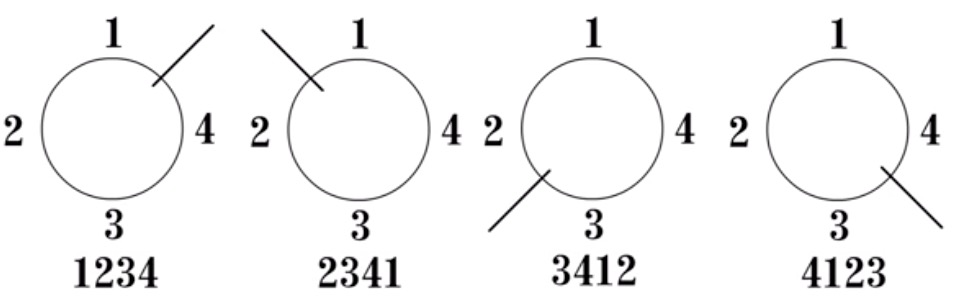
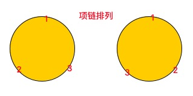

[TOC]

组合数学解决问题：

​	计数：不重复，不遗漏。

# 计数原则

## 分类：加法法则

​	设事件 A 有 m 种产生方式，事件 B 有 n 种产生方式：那么事件 A ==或== B 之一有 m + n 种产生方式。

集合论语言

若 $|A| = m ,|B| = n,A\cap B=\phi $ ,则 $|A \cup B| = m + n$

## 分步：乘法法则

​	设事件 A 有 m 种产生方式，事件 B 有 n 种产生方式：那么事件 A ==与== B 之一有 m * n 种产生方式。

集合论语言

若 $|A| = m ,|B| = n,A \times B={(a,b)|a\in A,b \in B} $ ,则 $|A  \times  B| = m * n$

注意：加法法则与乘法法则运用时：==事件要独立==。

## 减法法则

使用场景：直接求集合A，不好求，但是全集U 和 A的补集 $\overline{A}$ 容易求，那么 $|A| = |U| -| \overline{A}| $ 

补集定义：

A in U：$ \overline{A} = U | A = { x \in U:x \notin A } $

## 除法法则

例子：25个男生分成5组，每组的男生数：$\frac{25}{5}=5$

# 排列组合定义

## 排列(Permutation)

从 n 个不同的元素中，取 r 个不重复的元素，按次序排列，称为从 n 个中取 r 个的无重排列（ n >= r）

表示为：$ P_n^r = P(n,r)= n(n-1)…(n-r+1) = \frac{n!}{(n-r)!} $。

==考虑顺序==

基本模型：放球模型

例子：从 n 个不同的球中，取 r 个，放入 r 个不同的盒子里，每个盒子 1 个（n >=r ）,求排列数。

==分步递推：p(n,r) = nP(n-1,r-1)==

1. 第一个盒子，从 n 个球中选一个 1，n 中可能性。
2. 第二个盒子，从 n - 1 个球中选一个 1，n - 1 中可能性。
3. ...
4. 第 r 个盒子，从 n - r +1 个球中选一个 1，n - r +1 中可能性。

根据乘法原理：$ p(n,r) = n(n-1)…(n-r+1) = \frac{n!}{(n-r)!} $

==分类递推：p(n,r) = nP(n-1,r) + rP(n-1,r-1)==

- 不选第一个球：P(n-1,r)

  剩下 n -1 球，放 r 个盒子： P(n-1,r)

- 选择第一个球：rP(n-1,r-1)

  第一个球有 r 个盒子放，剩下 n - 1 放 r - 1 个盒子：rP(n-1,r-1)

加法原理：p(n,r) = nP(n-1,r) + rP(n-1,r-1)

全排列

如果 r = n，就是全排列：$ p(n,r) =n!$

## 组合

从 n 个不同的元素中，取 r 个不重复的元素 组成一个子集，而不考虑其元素的顺序，称为从 n 个中取 r 个的组合（ n >= r）。

表示为：$ C_n^r = C(n,r)=  $。

==不考虑顺序==

与排列区别：盒子是否有标号。

若将排列模型中盒子标号去掉，则产生相应的组合模型。盒子有 r！（r 个盒子全排列）个标号方案。

$C(  n , r ) * r! =  P(n,r) = \frac{n!}{(n-r)!}$

$C(  n , r )  = \frac{n!}{r!(n-r)!}$

性质：

1. 对称性：$C(  n , r )  = C(n,n-r)$

   C(n,r)：取出球的组合数

   C(n,n-r)：剩余球的组合数。

2. $C(  n , l )* C(l,r) = C(n,r)*C(n-r,l-r)$

   $C(  n , l )* C(l,r) $：分步：先从 n 个中取 l，然后再从 l 中取 r 

   $C(n,r)*C(n-r,l-r)$：分步：先从 n 个中取 r，然后再从 n - r 中去 l - r

   这是两种不同的选择方式，选出相同结果。

   例如：一个班级从 n 名同学中选出 l 个班委，然后在 l 班委中选出 r 个核心班委。

   一个班级从 n 名同学中选出 r 个核心班委，然后再从 n -r 名同学中选出 l - r 个班委。

基本模型：放球模型

## 格路模型组合恒等式

从(0,0)点出发沿x轴或y轴的正方向每步走一个单位，最终走到(m,n)点，有多少条路径？

水平方向：m 步，垂直方向：n 步。

$C(m,n) = \frac{n!}{r!(n-r)!}$

一些组合恒等式，可以用格路模型进行解释。

恒等式

1. $C(m+n,r)=C(m,0)*C(n,r)+C(m,1)C(n,r-1)+…+C(m,r)*C(n,0)$

   从 m 个红球，n 个蓝球，随机抽取 r 个球。 

## 圆排列和项链排列

同一个圆排列，从不同位置剪切，变成不同的线排列。

4 个元素的圆排列，有 4 个剪切位置。

圆排列：从 n 个中取 r 个的圆排列数为：$ \frac{P(n,r)}{r} $

项链排列

与圆排列相比：项链排列可以翻转。

如图：上边两个圆排列，是同一个项链排列。

项链排列：从 n 个中取 r 个的项链排列数为：$ \frac{P(n,r)}{2r};  (3<= r<=n) $

例题：

26 个英文字母能组成多少 4 位数的字符串，其中每位字母都不相同，且 b 和 d 不相邻。

思路：4 位 不相同字母组成的字符串数 - db 相邻数。

P(26,4) - x

bd 相邻捆绑法。将bd 和 db 捆绑,与其他 2 个字母进行全排列，3！

$x = C(24,2) * 3! * 2$

## 多重排列

例一：“pingpang” 8 个字母有多少种不同的排列？

有重复字母：2 个 p，2 个n，2 个g。

假设：$p_1in_1g_1p_2an_2g_2$  那么有 8！中排列。

$p_1p_2$ 的排列数：2！

$n_1n_2$ 的排列数：2！

$g_1g_2$ 的排列数：2！

最终排列数： $\frac{8!}{2!*2!*2!}$

多重全排列定义：

有若干个元素，r1 个 1，r2 个 2… r_t 个 t，元素个数之和为 n，它的全排列未：$P(n;r_1,r_2,…,r_t) = \frac{n!}{r_1!*r_2!*…*r_t!}$

例二：乒乓球入🕳

共有 6 个洞，洞口每次只能进入一个乒乓球，一组编号为 1-9 的 9 个乒乓球滚入洞口的方案有多少

==隔板法==:分区域的题目

每个门板是相同的，每个球是不同的，是多重全排列问题。

$\frac{14!}{5!}=726485760$

