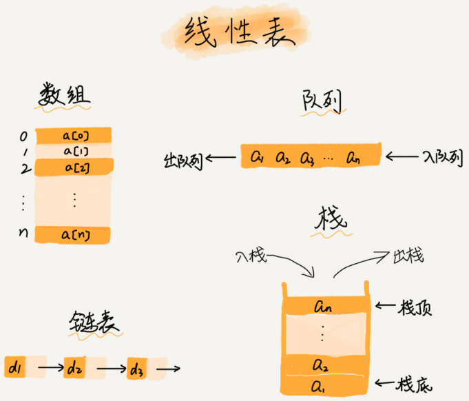
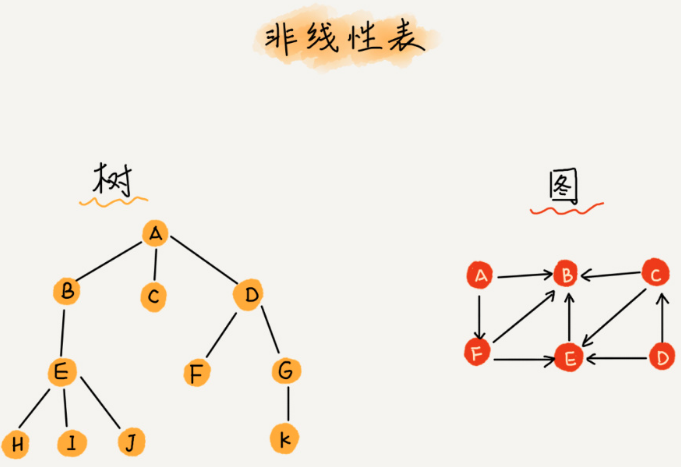
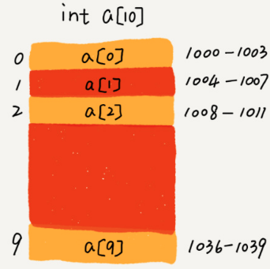
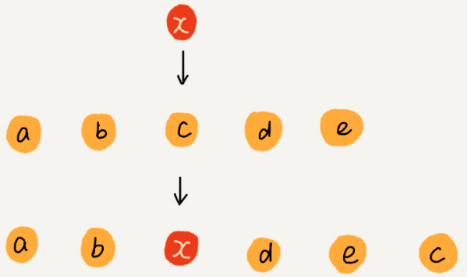
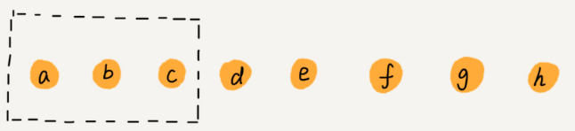

[TOC]

# 结构

数组是一种线性表。

他用一组==连续的内存空间==（可以借助CPU的缓存机制，预读数组中的数据，访问效率更高），来存储一组具有==相同类型==的数据。







# 操作

## 查询




数组支持随机查找，根据下标随机访问的时间复杂度：O(1)

base_address = 1000

寻址公式：

```python
a[i]_address = base_address + i * data_type_size;
```

data_type_size：每个元素的大小。

i：偏移量

## 插入

为了保持内存数据的连续性。

插入：

如果在数组尾部插入元素，不需要移动数据。O( 1 )

如果在数组头部插入元素，所有数据都需要向后移动一位。O(n)

每个位置插入元素的概率是一样的，平均情况（1+2+...+n)/n = O(n)


==在某些特殊情况下==：可以将 k 位置的元素置换到最后，将 k 空出来给 x。O(1) 的插入



## 删除

如果要删除数组尾部元素，不需要移动数据。O(1)

如果要删除数组头部元素，所有数据都需要向前移动一位。O(n)

平均情况（1+2+...+n)/n = O(n)。


在某些特殊场景下，并不一定非得追求数组中的数据的连续性。我们可以将多次删除集中一起执行，提升删除效率。



一次删除 a，b，c 三个元素。

为了避免 d，e，f，g，h 搬移三次，我们可以先记录已删除的数据。当数组中没有更多空间时，再触发一次真正的删除，这样就大大减少了删除操作导致的数据搬移。


JVM 标记清除垃圾回收的核心思想，就是这样的。


==很多时候我们并不需要死记硬背某个数据结构和算法，而是学习背后的思想和处理技巧。==

# 工程应用

Java ArrayList 最大的优势：==封装了很多数组的操作细节==。比如：插入，删除时数据搬移，以及支持==动态扩容==。

ArrayList 动态扩容是非常耗时的：new ArrayList(10000)


数组适合场景：

1. ArrayList 无法存储基本类型：int，long等。而 Integer，Long 类，需要Antoboxing，Unboxing，性能消耗。
2. 如果事先知道数据大小，并且对数据操作简单。
3. 多维数组往往比较简单，Object\[][\]  比 ArrayList\<ArrayList>

