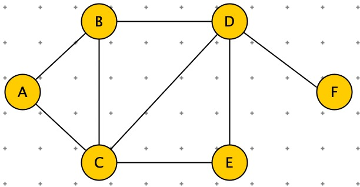

```python
graph = {
    "A": ["B", "C"],
    "B": ["A", "C", "D"],
    "C": ["A", "B", "D", "E"],
    "D": ["B", "C", "E", "F"],
    "E": ["C", "D"],
    "F": ["D"]
}

'''
广度遍历
s:其实节点
借助 queue
'''
print("广度遍历")
def BFS(graph, s):
    queue = []
    queue.append(s)
    seen = set()
    seen.add(s)
    while queue:
        vertex = queue.pop(0)
        nodes = graph[vertex]
        for w in nodes:
            if w in seen: continue
            queue.append(w)
            seen.add(w)
        print(vertex)
BFS(graph, "E")
```


```python
'''
深度遍历
s:其实节点
借助 queue
'''
def DFS(graph, s):
    stack = []
    stack.append(s)
    seen = set()
    seen.add(s)
    while stack:
        vertex = stack.pop()
        nodes = graph[vertex]
        for w in nodes:
            if w in seen: continue
            stack.append(w)
            seen.add(w)
        print(vertex)
DFS(graph, "E")
```


```python
'''
求任意两点间的最短路径
借助 parent 字典，记录所有节点的前一个节点
parent ={
    "A":None,
    "B":"A",
    "C":A,
    "D":"B",
    "E":"C",
    "F":"D" }

假设求：A -> E 的最短路径：E <- C <- A (通过查 parent 表即可获得)
'''
print("求任意两点间的最短路径")

def BFS2(graph, s):
    queue = []
    queue.append(s)
    seen = set()
    seen.add(s)
    parent = {s: None}
    while queue:
        vertex = queue.pop(0)
        nodes = graph[vertex]
        for w in nodes:
            if w in seen: continue
            queue.append(w)
            seen.add(w)
            parent[w] = vertex
        print(vertex)
    return parent

parent = BFS2(graph, "A")
print(parent)

print("打印路径")
v = 'E'
while v:
    print(v)
    v = parent[v]
```


```python
'''
求任意两点间的最短路径(加权图)
BFS：借助队列，而 dijkstra 借助：优先队列 Priority Queue
'''
import heapq
import math

graph = {
    "A": {"B": 5, "C": 1},
    "B": {"A": 5, "C": 2, "D": 1},
    "C": {"A": 1, "B": 2, "D": 4, "E": 8},
    "D": {"B": 1, "C": 4, "E": 3, "F": 6},
    "E": {"C": 8, "D": 3},
    "F": {"D": 6}
}

def dijkstra(graph, s):
    queue = []
    heapq.heappush(queue, (0, s))
    seen = set()

    parent = {s: None}
    distance = dict((i, math.inf) for i in graph.keys())
    distance[s] = 0
    while queue:
        dist, vertex = heapq.heappop(queue)
        nodes = graph[vertex].keys()
        seen.add(vertex)
        for w in nodes:
            if w in seen: continue
            if dist + graph[vertex][w] < distance[w]:
                heapq.heappush(queue, (dist + graph[vertex][w], w))
                parent[w] = vertex
                distance[w] = dist + graph[vertex][w]
    return parent, distance

p, d = dijkstra(graph, "A")
print(p)
print(d)

v = 'E'
while v:
    print(v, d[v])
    v = p[v]
```

