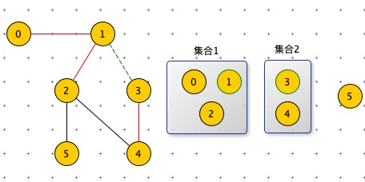
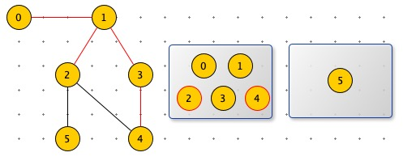
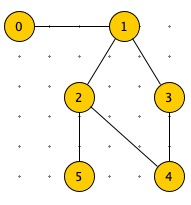
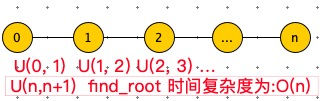

**并查集**

主要用途：判断图里是否包含环。




边（1，3），是集合1 与 集合 2 融合。



如图：红线的变表示已经已经处理过的边。节点 0，1，2，3，4 是联通的，在一个集合中。

节点 2，4 已经在同一个集合中了，那么边（2，4）就表示有环。



如何实现：集合合并。

使用 parent 数组，表示树的结构。

```python
'''
并查集
主要用途是判断图中是否有环
'''
def find_root(x, parent):
    x_root = x
    while parent[x_root]:
        x_root = parent[x_root]
    return x_root

'''
:return 1 合并成功
:return 0 合并失败：x，y 在同一个集合里,既：x_root == y_root
'''
def union(x, y, parent):
    x_root = find_root(x, parent)
    y_root = find_root(y, parent)
    if x_root == y_root:
        return False
    else:
        parent[x_root] = y_root
        return True


def main():
    edges = [(0, 1), (1, 2), (1, 3), (3, 4), (2, 5)]
    # edges = [(0, 1), (1, 2), (1, 3), (2, 4), (3, 4), (2, 5)]
    n = len(edges)
    parent = [None] * 6
    for i in range(n):
        x, y = edges[i]
        if not union(x, y, parent):
            print("Cycle detected")
            return
    print("No cycles found")

main()
```

以上算法在union 中：parent[x_root] = y_root ，随意指定父节点。会导致parent 这可树太长。



通过 rank 数组存在的是以 i 为根节点，树的高度。


```python
'''
并查集：新增rank，防止在union 时，过长
主要用途是判断图中是否有环
'''
def find_root(x, parent):
    x_root = x
    while parent[x_root]:
        x_root = parent[x_root]
    return x_root


'''
:return 1 合并成功
:return 0 合并失败：x，y 在同一个集合里,既：x_root == y_root
'''
def union(x, y, parent, rank):
    x_root = find_root(x, parent)
    y_root = find_root(y, parent)
    if x_root == y_root:
        return False
    else:
        # parent[x_root] = y_root
        if rank[x_root] > rank[y_root]:
            parent[y_root] = x_root
        elif rank[x_root] < rank[y_root]:
            parent[x_root] = y_root
        else:
            parent[x_root] = y_root
            rank[y_root] += 1
        return True

def main():
    # edges = [(0, 1), (1, 2), (1, 3), (3, 4), (2, 5)]
    edges = [(0, 1), (1, 2), (1, 3), (2, 4), (3, 4), (2, 5)]
    n = len(edges)
    parent = [None] * 6
    rank = [0] * 6
    for i in range(n):
        x, y = edges[i]
        if not union(x, y, parent, rank):
            print("Cycle detected")
            return
    print("No cycles found")

main()
```

