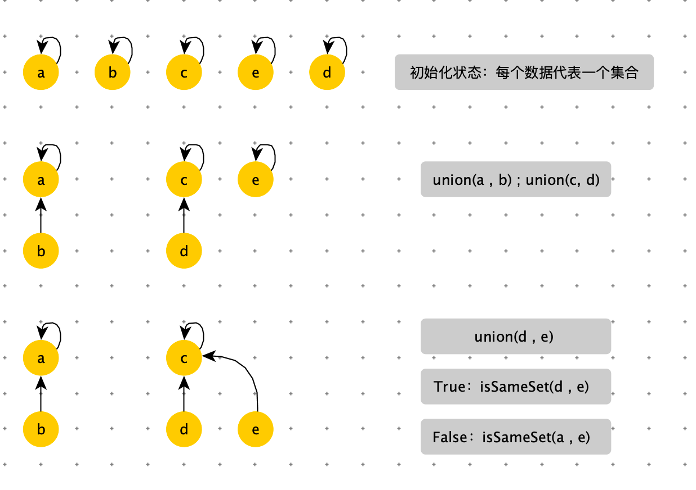
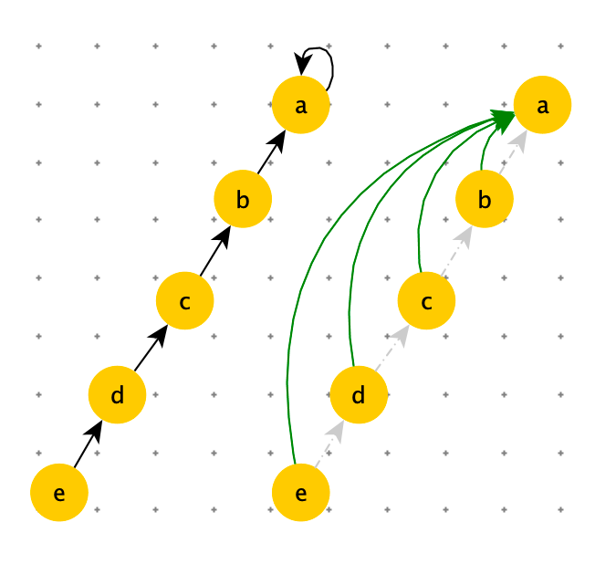

# 并查集

问题：

1. 在 O(1) 的时间复杂度的情况下，判断 a 和 b 是否属于同一个集合。
2. 在 O(1) 的时间复杂度的情况下，将集合 A 和集合 B 数据合并。

使用已有数据结构尝试解决上述问题


**HashSet**

要满足问题 1，使用 HashSet，可以在 O(1) 判断 a 和 b 是否属于同一个集合。但是要合并集合 A 和集合 B 时，必须将集合 A 中数据拷贝到集合 B 中，或者将集合 B 中数据拷贝到集合 A 中，就达不到集合 O(1)


**LinkedList**

如果是链表存储，可以实现在 O(1) 上合并两个集合。但是在判断 a 和 b 是否属于同一个集合，就需要遍历链表了。


为了更好解决上述两个问题，设计了一个新的数据结构：差并集。


差并集使用向上指的树或者图的结构。最上边的节点是集合代表节点。

主要操作：

- isSameSet( a , b )：判断 a 和 b 是否属于同一个集合。
- unoin( a , b)：把两个不相交的集合合并为一个集合。<font color=red>将数据小的集合挂在数据大代表节点下。</font>


下图是差并集的构建过程




差并集在union 过程确实是 O(1)。


**路径压缩**

在 isSameSet 过程中，如果链比较长，不是 O(1)。因此有下边的优化过程，在 isSameSet 时，我们需要从当前节点向上找到代表节点，这个过程中，需要将路径上所有节点之间指向代表节点。如下图：

据研究表明：如果差并集中的数据量为 N，调用 N 次以上的 isSameSet 后，isSameSet  的耗时就是 O(1)





```python
'''
代码最简版查并集
'''
class DisjointSet:
    def __init__(self,array):
        self.parent = dict((item, item) for item in array)

    def find(self, x):
        if self.parent[x] != x:
            self.parent[x] = self.find(self.parent, self.parent[x])
        return self.parent[x]

    def union(self, x, y):
        self.parent[self.find(x)] = self.find(y)

    def same(self, x, y):
        return self.find(x) == self.find(y)
```


```python
'''
在 find 时压缩路径
'''
class DisjointSet:
    def __init__(self, array):
        self.father = dict((item, item) for item in array)

    def find(self, x):
        if self.father[x] == x:
            return x

        # 记录查找路径
        path = []
        while self.father[x] != x:
            path.append(x)
            x = self.father[x]

         # 压缩路径，将路径上节点全部指向代表节点
        while path:
            self.father[path.pop()] = x
        return x

    def union(self, x, y):
        self.father[self.find(x)] = self.find(y)

    def same(self, x, y):
        return self.find(x) == self.find(y)
```


```python
'''
在 find 和 union 时压缩路径
'''
class DisjointSet:
    def __init__(self, array):
        self.father = dict((item, item) for item in array)
        self.size_map = dict((item, 1) for item in array)

    def find(self, x):
        if self.father[x] == x:
            return x

        path = []
        while self.father[x] != x:
            path.append(x)
            x = self.father[x]

        while path:
            self.father[path.pop()] = x
        return x

    def union(self, x, y):
        x_parent = self.find(x)
        y_parent = self.find(y)

        more_parent = x_parent if self.size_map[x_parent] > self.size_map[y_parent] else y_parent
        less_parent = x_parent if more_parent == y_parent else y_parent

        self.father[less_parent] = more_parent
        self.size_map[more_parent] += self.size_map[less_parent]
        self.size_map.pop(less_parent)

    def same(self, x, y):
        return self.find(x) == self.find(y)

disjointSet = DisjointSet([1, 2, 2, 3, 4])

disjointSet.union(1, 2)
print(disjointSet.father)
disjointSet.union(1, 3)
print(disjointSet.father)
disjointSet.union(1, 4)

print(disjointSet.father)
```


# 应用差并集

## 判断图是否有环

需要定义如何表示集合。一种常用的策略是为每个集合选定一个固定的元素，称为代表，以表示整个集合。接着，Find(x) Find(x) 返回 xx 所属集合的代表，而 Union 使用两个集合的代表作为参数。


边（1，3），是集合1 与 集合 2 融合。


如图：红线的变表示已经已经处理过的边。节点 0，1，2，3，4 是联通的，在一个集合中。

节点 2，4 已经在同一个集合中了，那么边（2，4）就表示有环。


如何实现：集合合并。

使用 parent 数组，表示树的结构。

```python
'''
并查集
主要用途是判断图中是否有环
'''
def find_root(x, parent):
    x_root = x
    while parent[x_root]:
        x_root = parent[x_root]
    return x_root

'''
:return 1 合并成功
:return 0 合并失败：x，y 在同一个集合里,既：x_root == y_root
'''
def union(x, y, parent):
    x_root = find_root(x, parent)
    y_root = find_root(y, parent)
    if x_root == y_root:
        return False
    else:
        parent[x_root] = y_root
        return True


def main():
    edges = [(0, 1), (1, 2), (1, 3), (3, 4), (2, 5)]
    # edges = [(0, 1), (1, 2), (1, 3), (2, 4), (3, 4), (2, 5)]
    n = len(edges)
    parent = [None] * 6
    for i in range(n):
        x, y = edges[i]
        if not union(x, y, parent):
            print("Cycle detected")
            return
    print("No cycles found")

main()
```


以上算法在union 中：parent[x_root] = y_root ，随意指定父节点。会导致parent 这可树太长。


通过 rank 数组存在的是以 i 为根节点，树的高度。


```python
'''
并查集：新增rank，防止在 union 时，过长
主要用途是判断图中是否有环
'''
def find_root(x, parent):
    x_root = x
    while parent[x_root]:
        x_root = parent[x_root]
    return x_root


'''
:return 1 合并成功
:return 0 合并失败：x，y 在同一个集合里,既：x_root == y_root
'''
def union(x, y, parent, rank):
    x_root = find_root(x, parent)
    y_root = find_root(y, parent)
    if x_root == y_root:
        return False
    else:
        # parent[x_root] = y_root
        if rank[x_root] > rank[y_root]:
            parent[y_root] = x_root
        elif rank[x_root] < rank[y_root]:
            parent[x_root] = y_root
        else:
            parent[x_root] = y_root
            rank[y_root] += 1
        return True

def main():
    # edges = [(0, 1), (1, 2), (1, 3), (3, 4), (2, 5)]
    edges = [(0, 1), (1, 2), (1, 3), (2, 4), (3, 4), (2, 5)]
    n = len(edges)
    parent = [None] * 6
    rank = [0] * 6
    for i in range(n):
        x, y = edges[i]
        if not union(x, y, parent, rank):
            print("Cycle detected")
            return
    print("No cycles found")

main()
```

