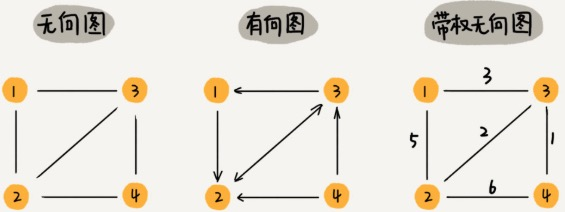
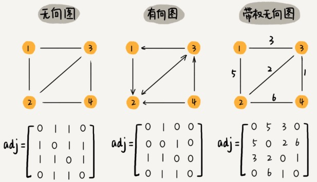
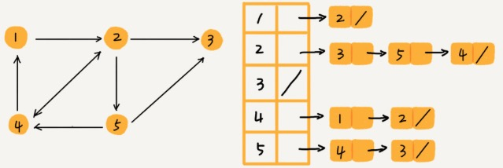
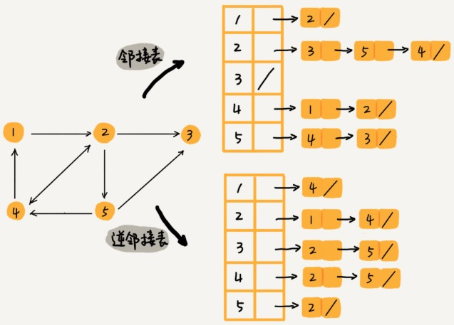
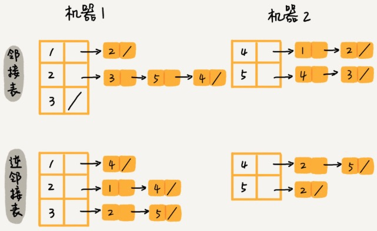
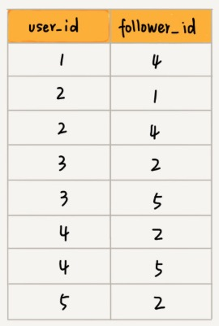
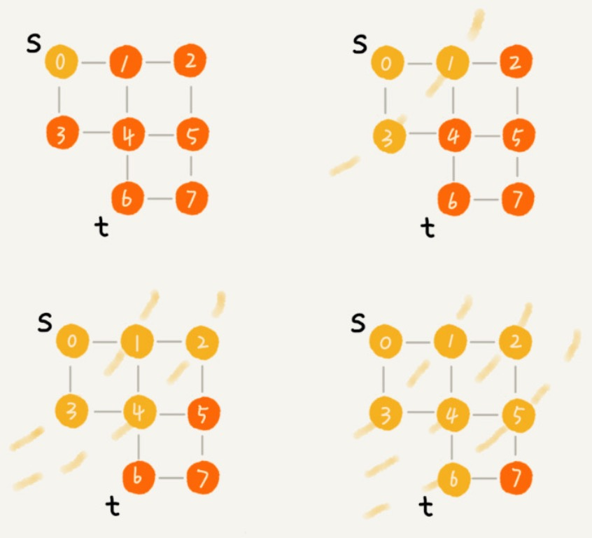
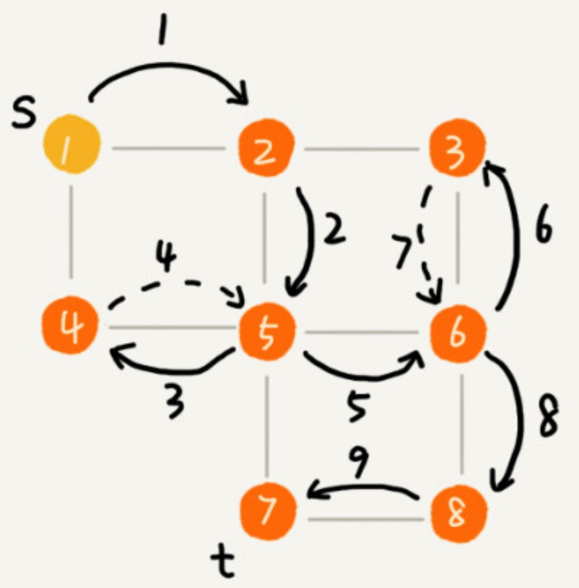
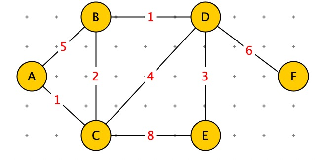

[TOC]



无向图

- 顶点 ( vertex )
- 边 ( edge )
- 度 （degree）：顶点相连边的条数。

有向图

- 入度（In-degree）：有多少边指向顶点。
- 出度（Out-degree）:顶点有多少边指出去。

带权图（weighted graph）


# 图的存储

## 邻接矩阵



邻接矩阵（Adjacency Matrix）底层是一个二维数组。

无向图：顶点 i 与 顶点 j 之间的边 $adj[i][j] = abj[j][i] = 1$

有向图：顶点 i 指向 顶点 j 之间的边$adj[i][j] = 1$

带权图：顶点 i 指向 顶点 j 之间的边，权重为 w：$adj[i][j] = w$


优点：简单，直观，高效，便于矩阵运算。

缺点：浪费存储空间。无线图：浪费一半的空间。稀疏图（Sparse Matrix），。

## 邻接表（Adjacency List）

针对 Adjacency Matrix 比较浪费空间的问题，诞生的。
是时间换空间。



图中每个节点对应一个链表，链表中存储着该节点指向的节点。

### 优点：

- 节省空间

### 缺点：
- 使用起来比较耗时间。比如：上图我们要确定：是否存在一条顶点 2 到顶点 4 的边，需要遍历顶点 2 对应的链表。
- 链表是非连续存储，对 CPU 缓存非常不友好。

### 优化
如果链表过长，影响查找效率。可以将链表替换为更高效的存储结构。
- 平衡二叉树（比如：红黑树）
- 跳表
- 散列表
- 有序动态数组：通过二分法来快速定位。

# 案例：如何存储微博，微信等社交网络中的好友关系？
微博可以单向关注：有向图。
微信必须双向关注：无向图。

针对微博用户：假设需要支持以下操作。
- 判断 A 是否关注了 B
- A 关注 B
- A 取消关注 B
- 分页获取用户的粉丝列表
- 分页获取用户的关注列表

分析：由于社交网络是一张稀疏图，因此使用邻接表。
注意：用一个图表示用户关注关系，获取用户的粉丝列表，将非常困难。所以需要一个逆邻接表（类似倒排索引）。



邻接表中链表不适合快速判断两个用户是否是关注与被关注的关系。用哪种动态数据结构替换? 红黑树、跳表、有序动态数组还是散列表？

因为需要按照用户名称的首字母排序，用跳表这种结构再合适不过了。因为：跳表插入、删除、查找都非常高效 O(logn),空间复杂度稍高Q(n)，最重要一点跳表中的数据是有序的，获取粉丝列表和关注列表，非常高效。

如果社交网络中只有几十万用户，可以将整个社交网络存储在内存中，但是如果像微博一样有上亿用户，无法全部存储到内存中。

## 数据量非常大：优化

方案一：用哈希算法，将邻接表存储在不同的机器上。

机器 1 上存储顶点 1，2，3 的邻接表

在机器 2 上，存储顶点 4，5 的邻接表

逆邻接表的处理方式也一样。



方案二：存在数据库（外部存储）中，在第一列、第二列都建立索引。



# 常见算法

- 图的搜索
- 最短路径
- 最小生成树
- 二分图

## 广度优先遍历



```python
# 无向图
graph = {
    "A": ["B", "C"],
    "B": ["A", "C", "D"],
    "C": ["A", "B", "D", "E"],
    "D": ["B", "C", "E", "F"],
    "E": ["C", "D"],
    "F": ["D"]
}

'''
广度遍历
s:起始节点
借助 queue
'''
print("广度遍历")
def BFS(graph, s):
    queue = []
    queue.append(s)
    seen = set()
    seen.add(s)
    while queue:
        vertex = queue.pop(0)
        nodes = graph[vertex]
        for w in nodes:
            if w in seen: continue
            queue.append(w)
            seen.add(w)
        print(vertex)
BFS(graph, "E")
```


## 深度遍历



- 实线箭头：遍历
- 虚线箭头：回退

<font color=red>深度优先搜索：回溯思想</font>

```python
'''
深度遍历
s:其实节点
借助 stack
'''
def DFS(graph, s):
    stack = []
    stack.append(s)
    seen = set()
    seen.add(s)
    while stack:
        vertex = stack.pop()
        nodes = graph[vertex]
        for w in nodes:
            if w in seen: continue
            stack.append(w)
            seen.add(w)
        print(vertex)
DFS(graph, "E")
```

## 最短路径


```python
'''
求任意两点间的最短路径
借助 parent 字典，记录所有节点的前一个节点
parent ={
    "A":None,
    "B":"A",
    "C":A,
    "D":"B",
    "E":"C",
    "F":"D" }

假设求：A -> E 的最短路径：E <- C <- A (通过查 parent 表即可获得)
'''
print("求任意两点间的最短路径")

def BFS2(graph, s):
    queue = []
    queue.append(s)
    seen = set()
    seen.add(s)
    parent = {s: None}
    while queue:
        vertex = queue.pop(0)
        nodes = graph[vertex]
        for w in nodes:
            if w in seen: continue
            queue.append(w)
            seen.add(w)
            parent[w] = vertex
        print(vertex)
    return parent

parent = BFS2(graph, "A")
print(parent)

print("打印路径")
v = 'E'
while v:
    print(v)
    v = parent[v]
```


 

```python
'''
求任意两点间的最短路径(加权图)
BFS：借助队列，而 dijkstra 借助：优先队列 Priority Queue
'''
import heapq
import math

graph = {
    "A": {"B": 5, "C": 1},
    "B": {"A": 5, "C": 2, "D": 1},
    "C": {"A": 1, "B": 2, "D": 4, "E": 8},
    "D": {"B": 1, "C": 4, "E": 3, "F": 6},
    "E": {"C": 8, "D": 3},
    "F": {"D": 6}
}

def dijkstra(graph, s):
    queue = []
    heapq.heappush(queue, (0, s))
    seen = set()

    parent = {s: None}
    distance = dict((i, math.inf) for i in graph.keys())
    distance[s] = 0
    while queue:
        dist, vertex = heapq.heappop(queue)
        nodes = graph[vertex].keys()
        seen.add(vertex)
        for w in nodes:
            if w in seen: continue
            if dist + graph[vertex][w] < distance[w]:
                heapq.heappush(queue, (dist + graph[vertex][w], w))
                parent[w] = vertex
                distance[w] = dist + graph[vertex][w]
    return parent, distance

p, d = dijkstra(graph, "A")
print(p)
print(d)

v = 'E'
while v:
    print(v, d[v])
    v = p[v]
```

