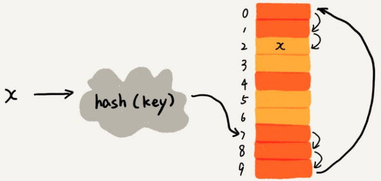

[TOC]

# 概述

散列表其实就是数组的一种扩展。

数组是连续自然数为索引。

散列表是任意类型字段为索引。

## 重要概念

### 散列函数

散列函数（hash函数）：将编号转换为数组下标。

散列值（hash 值）：散列函数计算的值。

散列函数设计的基本要点：

1. hash 值非负：数组下标。
2. if key1 = key2 那么 hash(key1) == hash(key2)：写入和查询
3. if key1 != key2 那么 hash(key1) != hash(key2)：避免散列冲突

### 散列冲突

再好的散列函数也无法避免散列冲突

#### 开放寻址法（open addressing）

核心思想：如果出现散列冲突，重新探测一个空间位置，将其插入。

探索方法：

##### 线性探索（Linear Probing）

###### 插入

从冲突位置开始，依次往后查找，直到找到空闲位置为止。

【图】

黄色色块：空闲位置

橙色色块：已经存储数据。

7 —> 8 —> 9 —> 0 —> 1 —> 2 (空闲)

注意：遍历到尾部都没有找到空闲位置，于是从表头继续开始找。


###### 查找

1. y —>  hash(key) = i ， 判断array[i] == y
2. 如果相等，返回对应的 value
3. 如果不相等，顺序向后一次查找。
4. 如果遍历到空位置，还没有找到，说明没有。


###### 删除

==注意：删除的元素不能置为空==。因为查找算法就失效了，本来存在的数据，会被认为不存在。

删除元素标记为 deleted。当线性探测查找时，遇到 deleted 的空间，继续下探。


###### 线性探测缺点

当装载因子很大时：插入，查询，删除的时间复杂度是 O(n)

装载因子（load factor）

```
装载因子 = 填入表中的元素个数 / 散列表的长度
```


##### 二次探测（Quadratic probing）

线性探测每次探测步长为1。

二次探测每次探测步长为原来步长的“二次方”：$hash(key) + 0,hash(key) + 1^2 ,hash(key) + 2^2$

##### 双重散列（Double hashing）

线性探测使用：一个散列函数。

双重散列使用：一组散列函数。

1. hash1(key) 
2. 如果冲突：hash2(key)
3. 如果冲突：hash3(key)
4. …. 直到找到空闲的位置。

开放寻址缺点：

==装载因子越大，说明空闲位置越少，冲突越多，散列表的性能会下降。==

#### 链表法（chaining）

链表法是更加常用的散列冲突解决办法，相比开放寻址法更简单。

结构：在散列表中，每个“桶(bucket)” 或者 “槽(slot)”  对对应一条链条，散列冲突的元素放到链表中。


插入：hash(key)  找到散列表槽位，加入链表头：O(1)

查找，删除：hash(key)后，遍历链表：O(k)：k = n/m

前提：散列函数比较均匀。

n：散列表中元素的个数。

m：“槽”的个数。

# 总结

1. 散列表来源于数组，对数组进行扩展。
2. 散列表核心问题：
   1. 散列函数设计：决定了冲突的概率，决定了散列表的性能。
   2. 散列冲突解决：（开放寻址法，链表法）。
