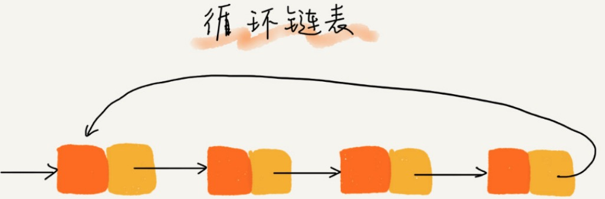

[TOC]

# 背景

数组新增和删除时 O(n) ，不支持动态扩容。

所以开发了链表。


链表通过指针将一组==零散的内存块==串联起来。

常见链表：单链表，双向链表，循环链表。

# 单链表


头结点：第一个节点

尾节点：最后一个节点。

```python
class ListNode(object):
    def __init__(self, x):
        self.val = x
        self.next = None

```

## 插入和删除


```python
'''
在 position 之后添加 x
'''
def insertNode(head, position, xNode):
    node = head
    while node:
        if node.val == position:
          	# node.val = b
            # x next 指向 c 节点
            xNode.next = node.next
            # b 节点 next 指向 x 节点
            node.next = xNode
            break
        else:
            node = node.next
    return head
  
'''
在 position 之前添加 x
'''
def insertNode2(head, position, xNode):
    dump = ListNode(None)
    dump.next = head
    node = dump

    while node and node.next:
        if node.next.val == position:
            xNode.next = node.next
            node.next = xNode
            break
        else:
            node = node.next
    return dump.next

'''
 删除 x ，涉及到 x 的前驱节点，x 节点，x 的 next 节点。
 如果删除是第一个节点，需要特殊判断，通过 dump 避免这种判断。
 note.next 中 next 是 图中的箭头，不是一下节点。
''' 
def deleteNode(head, x):
    dump = ListNode(None)
    dump.next = head

    while dump and dump.next:
        if dump.next.val == x:
            dump.next = dump.next.next
            break
        else:
            dump = dump.next
	    return head
```


## 随机访问第 k 个元素

由于链式是非连续存储，不能通过寻址公式直接计算出对应的内存地址。所以需要从头节点遍历查找节点 k，时间复杂度为 ==O(n)==。

```python
def find(head, k):
    node = head
    while node:
        if node.val == k:
            return node
        else:
            node = node.next
    return
```


# 循环链表



循环链表是一种特殊的单链表。

优点：从链尾到链头比较方便。适合处理环形结构的数据。比如：[约瑟夫斯问题](https://zh.wikipedia.org/wiki/%E7%BA%A6%E7%91%9F%E5%A4%AB%E6%96%AF%E9%97%AE%E9%A2%98)


# 双向链表


优点：找前驱节点的时间复杂度是O(1)，在某些情况下，插入，删除等操作比单链表简单，高效。

缺点：占用更多的空间。

删除数据的场景：

场景一：删除节点中”值等于 x “ 的节点。

步骤：

1. 查找到 value == x 的节点：单链表和双向链表为O(n)
2. 删除节点：O(1)

场景二：删除给定指针的节点。

删除指定节点，需要先找到前驱节点。那么单链表需要遍历链表找到前驱节点O(n)，而双向链表O(1) 找到前驱接节点。

同理指定节点插入。


对于有序链表，双向链表更高效。因为，可以记录上次查找位置p，每次查询时，根据要查找的值 与 p 的大小关系，决定是往前还是往后查找，所以平均只需要查找一半的数据。


双向链表在实际软件开发中，使用更频繁，Java 中 LikedHashMap 就用到了双向链表。

==空间换时间==的设计思想。

```python
class Node(object):
    def __init__(self, val, prev, next):
        self.val = val
        self.prev = prev
        self.next = next
```


# 双向循环链表


# 链表 VS 数组性能

|            | 数组 | 链表 |
| ---------- | ---- | ---- |
| 插入，删除 | O(n) | O(1) |
| 随机访问   | O(1) | O(n) |

链表天然支持动态扩容。

数组是连续内存，可以借助 CPU 的缓存机制，预读数组中的数据。

链表在内存中不是连续存储，所以对 CPU 缓存不友好。

数组的缺点：大小固定，如果声明过大，系统可能没有足够的内存空间分配给它，导致”内存不足（out of memery）“，如果声明过小，频繁扩容，拷贝数据性能。

同样的数据，链表占用内存空间会翻倍，如果对链表频繁的插入，删除操作，还会导致频繁的内存申请和释放，容易造成内存碎片，java 语言，可能会导致频发 GC （Garbege Collection，垃圾回收）。

# 链表常用技巧

## 一、理解指针的含义

**将某个变量赋值给指针，实际上就是将这个变量的地址赋值给指针，或者反过来说，指针中存储了这个变量的内存地址，指向了这个变量的内存地址，指向了这个变量，通过指针就能找到这个变量。**

p.next  = q   :     p 节点中 next 指针存储了 q 节点的内存地址。

p.next = p.next.next  :  p 节点中 next 指针存储了 p 节点下下一个结点的内存地址（删除结点是常用）。

## 二、警惕指针丢失和内存泄漏


如插入节点：

错误代码：

```python
# p 指针指向 b
p.next = x   # 将 p 的 next 指针指向 x 结点(注意：测试 c 结点及其以后结点丢失了)
x.next = p.next # 将 x 的 next 指针 指向 c 结点(错误地认为)
```

正确代码：

```python
x.next = p.next
p.next = x
```

一个链表可以想象成一只放飞的风筝，在要剪短风筝线时，第一步确保断口前后，有手（指针）拉住限购线头，否则风筝就飞走了。

## 三、利用哨兵简化实现难度

例子1：在 p 结点后插入一个新结点：

```python
x.next = p.next
p.next = x
```

但是如果向一个空链表中插入第一个结点，p == null 了，p.next 报错。所以需要特殊处理：

```python
if not p:
  p = x
```

例子2：删除结点 p 之后的结点：

```python
p.next = p.next.next
```

但是如果 p 是最后一个结点，p.next == null。

```python
if not p.next:
  p = None
```

**链表的插入和删除操作，需要针对头结点和尾结点进行特殊处理。**

引入哨兵元素：解决边界问题。

有人将这种有哨兵结点的链表叫：**带头链表**。没有哨兵的链表叫作**不带头链表**。


```python
def deleteNode(head, x):
	  # 哨兵结点
    dump = ListNode(None)
    dump.next = head

    node = dump
    while node and node.next:
        if node.next.val == val:
            node.next = node.next.next
        else:
            node = node.next
    return dump.next
```

## 四、重点留意边界条件处理

- 链表为空
- 链表只有一个结点
- 链表只有两个结点
- 逻辑在头结点和尾结点，是否正常。

## 五、举例画图，辅助思考

画图使逻辑更加清晰：

例如：画出插入前和插入后的链表变化

	

## 六、多写多练

https://github.com/dongyifeng/leetcode/tree/master/linked_list