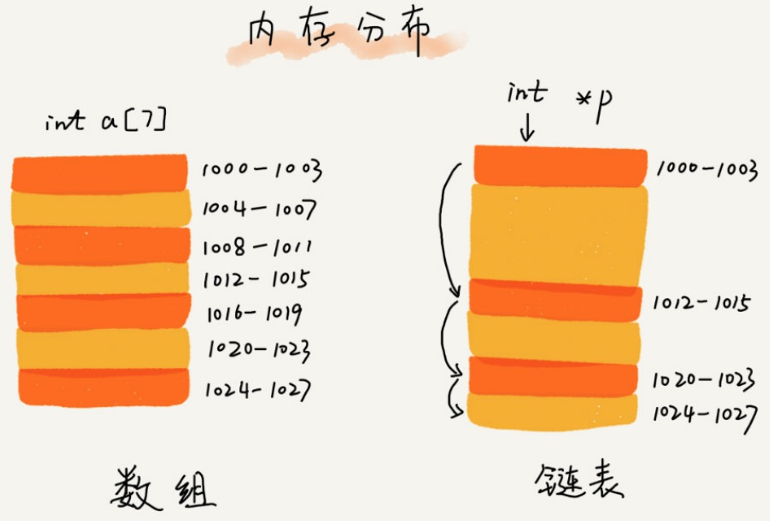
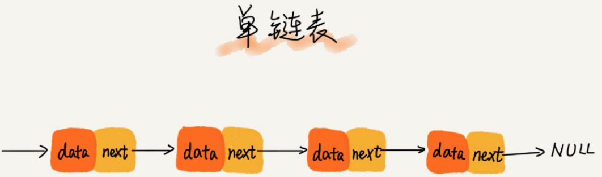
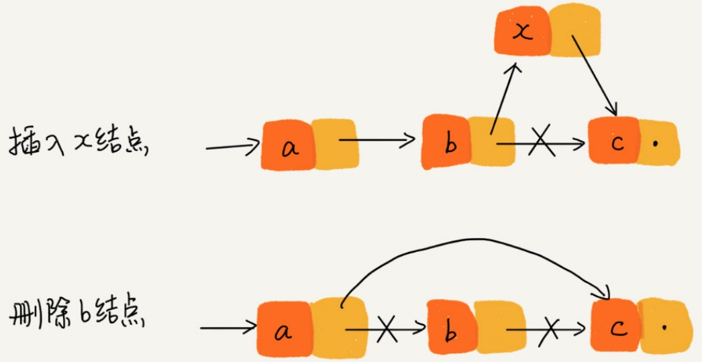
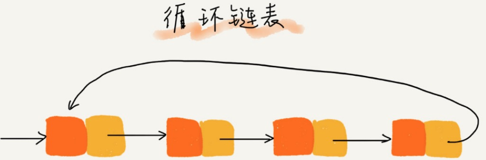
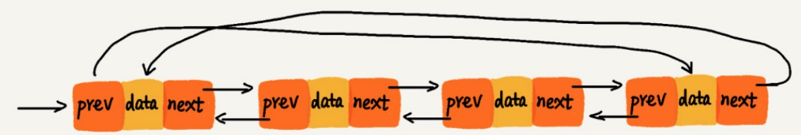

[TOC]

# 背景

数组新增和删除时O(n)，不支持动态扩容。

所以开发了链表。

链表通过指针将一组==零散的内存块==串联起来。

常见链表：单链表，双向链表，循环链表。

# 单链表

头结点：第一个节点

尾节点：最后一个节点。

## 插入和删除

## 随机访问第 k 个元素

由于链式是非连续存储，不能通过寻址公式直接计算出对应的内存地址。所以需要从头节点遍历查找节点k，时间复杂度为O(n)。

# 循环链表

循环链表是一种特殊的单链表。

优点：从链尾到链头比较方便。适合处理环形结构的数据。比如：[约瑟夫斯问题](https://zh.wikipedia.org/wiki/%E7%BA%A6%E7%91%9F%E5%A4%AB%E6%96%AF%E9%97%AE%E9%A2%98)

# 双向链表

优点：找前驱节点的时间复杂度是O(1)，在某些情况下，插入，删除等操作比单链表简单，高效。

缺点：占用更多的空间。

删除数据的场景：

场景一：删除节点中”值等于 x “ 的节点。

步骤：

1. 查找到 value == x 的节点：单链表和双向链表为O(n)
2. 删除节点：O(1)

场景二：删除给定指针的节点。

删除指定节点，需要先找到前驱节点。那么单链表需要遍历链表找到前驱节点O(n)，而双向链表O(1) 找到前驱接节点。

同理指定节点插入。

对于有序链表，双向链表更高效。因为，可以记录上次查找位置p，每次查询时，根据要查找的值 与 p 的大小关系，决定是往前还是往后查找，所以平均只需要查找一半的数据。

双向链表在实际软件开发中，使用更频繁，Java 中 LikedHashMap 就用到了双向链表。

==空间换时间==的设计思想。

# 双向循环链表

# 链表 VS 数组性能

|            | 数组 | 链表 |
| ---------- | ---- | ---- |
| 插入，删除 | O(n) | O(1) |
| 随机访问   | O(1) | O(n) |

链表天然支持动态扩容。