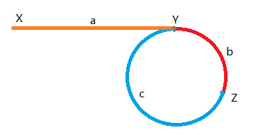

[TOC]

# 奇技淫巧

1. 快慢指针。
2. 带头链表。
3. 新建一个链表，从旧链表中删除，加入新链表（并没有多用空间）。
4. 剪切出自链表，处理后，拼接到原链表中。


节点：

```python
class ListNode(object):
    def __init__(self, x):
        self.val = x
        self.next = None
```


# Floyd 判环算法

Floyd Cycle Detection Algorithm，又称龟兔赛跑算法（Tortoise and Hare Algorithm）。

使用==快慢指针==

解决问题：

1. 判断链表是否有环。

   思路：慢指针每次前进一步，快指针每次前进两步，如果两者在链表在链表头以外的某一点相遇（相等）了，则有环，否则：快指针达到了链表结尾，说明没有环。时间复杂度：O(n)，空间复杂度：O(1)

   ```python
   def hasCycle(head):
       pos = -1
       if not head or not head.next: return pos
       fast = head
       slow = head
   
       while fast and fast.next:
           fast = fast.next.next
           pos += 1
           if fast == slow:
               return pos
           slow = slow.next
   
       return -1
   ```

   

2. 确定环的长度。

   思路：假设相遇点为 B 点，让其中一个指针停在 B 不动，另一个指针一步一步向前走并记录步数，再次相遇时，步长数即为环的长度。

3. 确定环的起点。

   思路：假设相遇点为 B 点，将其中一个指针移到链表起点，另一个指针为B点,两者同时移动，每次移动一步，那么两者相遇的地方就是环的起点。

   



> 证明：
>
> 快指针和慢指针同时从 X 点出发，在 Z 点第一次相遇，那么慢指针走过 a + b 的距离，快指针走过：a + b + n* ( b + c)
>
> 由于快指针每次两步，慢指针每次一步，则：2 * (a + b ) = a + b + n* ( b + c)
>
> 则：a = n * ( b + c) - b = (n - 1)*(b + c) + c
>
> 结论：慢指针从 X 出发，快指针从 Z 出发，每次都走一步，会在 Y 点再次相遇。此时慢指针走了 a 距离，快指针走了 n - 1 圈 + c 的距离。


