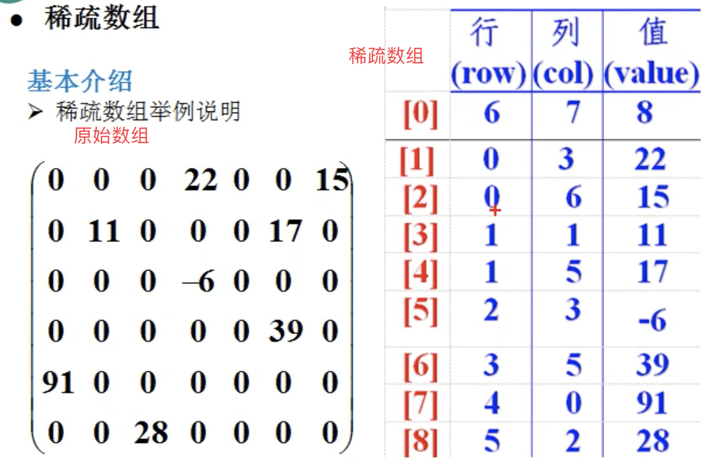

稀疏数组

使用场景

当数组中大部分元素相同时，可以使用稀疏数组保存数据，减少存储。

如图：



注意：第一行记录原始数组有几行几列。

原始数组：有 6 行 7 列 ，8 数值。

 

# 操作

二维数组转稀疏数组

步骤：

1. 遍历原始数组，得到有效数数据的个数。
2. 创建稀疏数组：spareArray int \[sum + 1\]\[3\]
3. 将原始数组中的有效数据存入稀疏数组。


稀疏数组转原始数组

1. 读取稀疏数组第一行，根据第一行的数据创建原始数组：chessArray = int\[11\]\[11\]
2. 将稀疏数组中的数据，赋值给 chessArrary


```java
    public static void main(String[] args) {
        // 创建原始二维数组：11*11
        // 0 表示没有棋子，1：黑子，3：蓝子
        int[][] chessArray = new int[11][11];
        chessArray[1][2] = 1;
        chessArray[2][3] = 2;

        // 输出原始数组
        for (int[] row : chessArray) {
            for (int data : row) {
                System.out.printf("%d\t", data);
            }
            System.out.println("");
        }

        // 遍历原始数组：求得非 0 数据的个数。
        int sum = 0;
        for (int[] row : chessArray) {
            for (int data : row) {
                if (data > 0) {
                    sum += 1;
                }
            }
        }

        // 创建对应的稀疏数组
        int sparseArray[][] = new int[sum + 1][3];
        // 赋值
        sparseArray[0][0] = 11;
        sparseArray[0][1] = 11;
        sparseArray[0][2] = sum;

        int count = 0;
        for (int i = 0; i < chessArray.length; i++) {
            for (int j = 0; j < chessArray[i].length; j++) {
                if (chessArray[i][j] != 0) {
                    count += 1;
                    sparseArray[count][0] = i;
                    sparseArray[count][1] = j;
                    sparseArray[count][2] = chessArray[i][j];
                }
            }
        }

        // 输出稀疏数组
        for (int[] row : sparseArray) {
            for (int data : row) {
                System.out.printf("%d\t", data);
            }
            System.out.println("");
        }

        // 将稀疏数组恢复成原始数组
        int[][] chessArray2 = new int[sparseArray[0][0]][sparseArray[0][1]];

        for (int i = 1; i < sparseArray.length; i++) {
            chessArray2[sparseArray[i][0]][sparseArray[i][1]] = sparseArray[i][2];
        }


        for (int[] row : chessArray2) {
            for (int data : row) {
                System.out.printf("%d\t", data);
            }
            System.out.println("");
        }
    }
```

