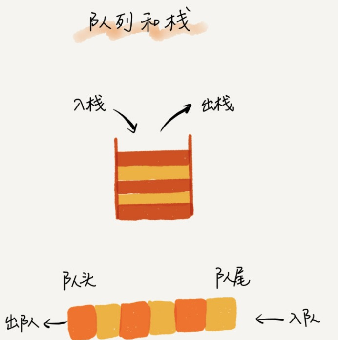
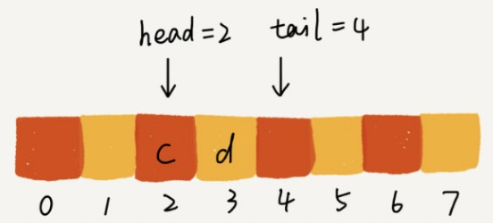
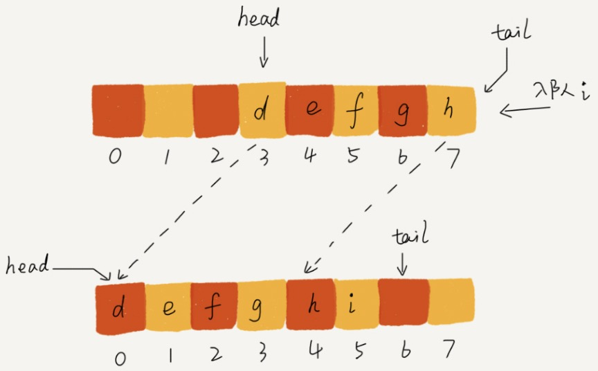
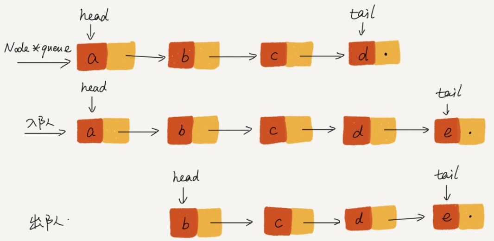
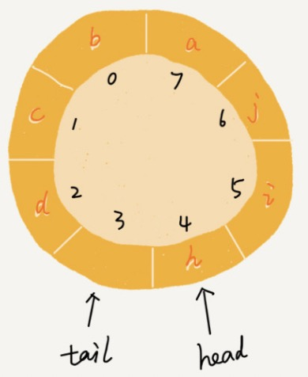
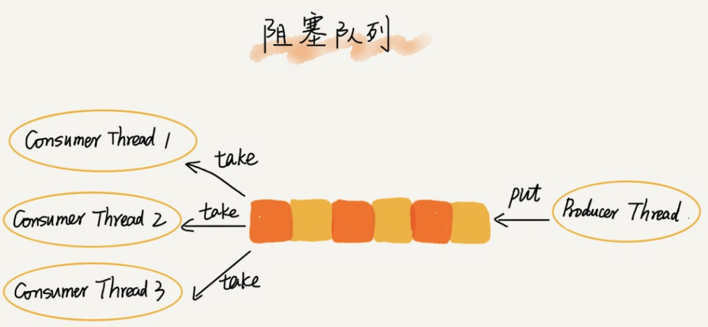

[TOC]

# 概念




**先进者先出。**

队列：操作受限的线性表。

常见队列：循环队列，阻塞队列，并发队列等。

# 实现方式

顺序队列：用数组实现的队列。

链式队列：用链表实现的队列。

## 顺序队列

```python
class ArrayQueue:
    def __init__(self, capacity):
        self.capacity = capacity
        self.items = [None for i in range(capacity)]
        self.tail = 0
        self.head = 0

    # 入队
    def enqueue(self, item):
        # 队列满了
        if self.tail == self.capacity: return False
        self.items[self.tail] = item
        self.tail += 1
        return True

    def dequeue(self):
        # 队列空了
        if self.head == self.tail: return
        ret = self.items[self.head]
        self.head += 1
        return ret
```

问题：随着不停地入队，出队操作后，head 和 tail 都会持续后移。当tail 移到最右边，即使队列中有空闲空间，也无法向队列中继续添加数据了。



解决方案：在入队时，if tail == capacity and head !=0 时，迁移数据。



```python
    # 入队 O(1)
    def enqueue(self, item):
        # 队列满了
        if self.head == 0 and self.tail == self.capacity: return
        # 数据迁移
        if self.tail == self.capacity and self.head != 0:
            for i in range(self.head, self.capacity):
                self.items[i - self.head] = self.items[i]
            self.tail -= self.head
            self.head = 0

        self.items[self.tail] = item
        self.tail += 1
        return True
```

## 链式队列



入队：tail.next = new_node；tail = tail.next;

出队：head = head.next

```python
# 链表结点
class ListNode(object):
    def __init__(self, x):
        self.val = x
        self.next = None


class LinkedQueue():
    def __init__(self):
        self.head = ListNode(None)
        self.tail = self.head

    # 入队
    def enqueue(self, item):
        self.tail.next = ListNode(item)
        self.tail = self.tail.next

    # 出队
    def dequeue(self):
        if not self.tail.val: return
        ret = self.head.next.val
        self.head.next = self.head.next.next
        return ret
```


## 循环队列



在顺序队列中，有数据迁移，非常好性能。

更好的实现方式是：使用循环队列。

关键点：==队空和队满的判定条件==。

对空：head == tail 

队满：（tail + 1）%  n == head

注意：tail 不会指向任何数据，浪费一个存储空间。

```python
class CircularQueue:
    def __init__(self, capacity):
        self.capacity = capacity
        self.items = [None for i in range(capacity)]
        self.tail = 0
        self.head = 0

    # 入队
    def enqueue(self, item):
        # 队列满了
        if (self.tail + 1) % self.capacity == self.head: return
        self.items[self.tail] = item
        self.tail = (self.tail + 1) % self.capacity
        return True

    def dequeue(self):
        # 队列空了
        if self.head == self.tail: return
        ret = self.items[self.head]
        self.head = (self.head + 1) % self.capacity
        return ret
```

# 队列应用

## 阻塞队列

阻塞队列：当队列为空时，从队头取数据时会被阻塞，直到有了数据才能返回。如果队列已经满了，入队操作会被阻塞。

阻塞队列常用作：生产者-消费者模型。

​	有效地协调生产和消费的速度。当“生产者”生产数据的速度过快，“消费者”来不及消费时，存储数据的队列很快就会满了。这个时候，生产者就阻塞等待，直到“消费了数据，“生产者”才会被唤醒继续“生产”

极客时间版权所有: https://time.geekbang.org/column/article/41330



如上图：多个线程同时操作一个队列，那么就存在线程安全问题。那么需要使用**并发队列**。

## 并发队列

并发队列最简单的实现方式：enqueue()，dequeue() 方法上加锁。但是锁的粒度大，并发会降低，同一时刻仅允许一个线程存或者取。

实际上，基于数组的循环队列，利用 CAS 原子操作，可以实现非常高效的并发队列。

极客时间版权所有: https://time.geekbang.org/column/article/41330


