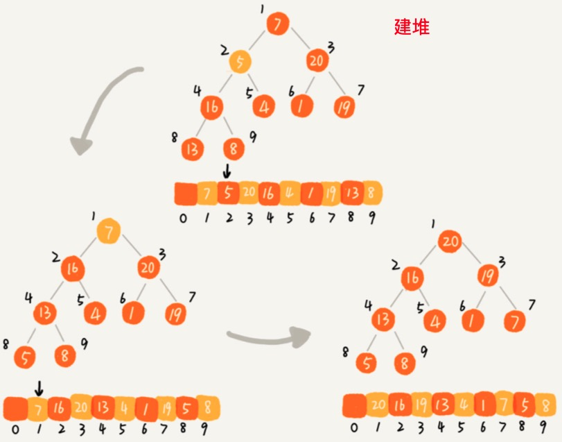

文档在 算法/sort/


### 建堆

#### 思路一

借助堆插入的思路，假设期初堆中只有一个元素，将剩下的元素依次加入堆中。

每次向堆中插入的时间复杂度为：O(log n)，那么建堆的过程是n*O(log n)

```python
def build_heap1(self, nums):
    self.a = nums
    self.n = len(nums)
    self.count = 0
    for item in nums:
        self.insert(item)
```


#### 思路二

从后向前处理数据，从上向下堆化。




```python
  # 时间复杂度 O(N)  
  def build_heap2(self, nums):
        self.a = nums
        self.n = len(nums)
        self.count = len(nums)
        for i in range(self.count >> 1, 0, -1):
            self.heapify(i)
```

复杂度分析：

堆是一棵满二叉树，树的深度越深，节点越多。从前先后处理数据，是自顶向下构建堆，越靠后的数据量越大，树的深度越大，越耗时。

从后向前处理数据，的叶子节点不需要处理， $\frac{n}{4}$ 的结点只需要 log(1) ，先将大量的数据节点以非常小的代价处理完毕了。只有非常小的一部分数据，需要 log n 的堆化。


如下图：后向前处理数据所需的时间：

$T(N)=\frac{N}{2} + \frac{N}{4}*2 + \frac{N}{8}*3 + \frac{N}{16}*4 + ... $

$2T(N)=N + \frac{N}{2}*2 + \frac{N}{4}*3 + \frac{n}{8}*4 + ... $

错位减：

$T(N)=2T(N)-T(N)=N+\frac{N}{2} + \frac{N}{4} + \frac{N}{2} + \frac{N}{8} + ... =N*(1+\frac{1}{2} + \frac{1}{4} + \frac{1}{8} + \frac{1}{16}+...)=O(N)$


# 手动改写堆

1. 建立反向索引表
2. 建立比较器
3. 核心在于各种结构相互配合，非常容易出错


加强堆


```java
import java.util.ArrayList;
import java.util.Comparator;
import java.util.HashMap;
import java.util.List;

public class HeapGreater<T> {
  
    public class DataNode<T> {
        public T data;

        public DataNode(T data) {
            this.data = data;
        }
    }

    private ArrayList<T> heap;
  	// HashMap 对于基础类型，如果数据重复，将会被覆盖，所以需要包装成对象（DataNode）。
    // 存储数据在 ArrayList 中位置信息
    // [a , b , c]
    // a -> 0
    // b -> 1
    // c -> 2
    private HashMap<DataNode<T>, Integer> indexMap;
    private int size;
    private Comparator<? super T> comparator;


    public HeapGreater(Comparator<T> comparator) {
        heap = new ArrayList<T>();
        indexMap = new HashMap<DataNode<T>, Integer>();
        size = 1;
        this.comparator = comparator;
    }

    public void build(ArrayList<T> data) {
        heap = data;
        size = data.size();
        heap.set(0, null);
        indexMap.clear();
        for (int i = 1; i < size; i++) {
            indexMap.put(new DataNode<T>(heap.get(i)), i);
        }

        int n = data.size() >> 1;
        for (int i = n; i >= 0; i--) {
            heapInsert(i);
        }
    }

    public boolean contains(T obj) {
        return indexMap.containsKey(obj);
    }

    public T peek() {
        if (size > 1) {
            return heap.get(1);
        }
        return null;
    }

    public T pop() {
        T res = peek();
        if (res == null) {
            return null;
        }
        swap(1, size);
        indexMap.remove(res);
        heap.remove(size--);
        heapify(1);
        return res;
    }

    public void push(T obj) {
        if (obj == null) {
            return;
        }
        size += 1;
        heap.add(obj);
        indexMap.put(new DataNode<T>(obj), size);
        heapInsert(size);
    }

    // 将堆中最小元素弹出，并将元素 x 入堆
    public T replace(T obj) {
        T res = peek();
        if (res == null) {
            return obj;
        }
        if (obj == null) {
            return pop();
        }

        indexMap.remove(res);
        indexMap.put(new DataNode<T>(obj), 1);
        heap.set(1, obj);
        heapify(1);
        return res;
    }

    // 先将 obj 入队，然后 pop
    public T pushAndPop(T obj) {
        T res = peek();
        if (res == null) {
            return obj;
        }
        if (obj == null) {
            return pop();
        }
        if (comparator.compare(obj, res) < 0) {
            return obj;
        }

        indexMap.remove(res);
        indexMap.put(new DataNode<T>(obj), 1);
        heap.set(1, obj);
        heapify(1);
        return res;
    }


    public int left(int index) {
        return 2 * index;
    }

    public int right(int index) {
        return 2 * index + 1;
    }

    public int parent(int index) {
        return index >> 1;
    }

    public boolean isEmpty(int index) {
        return size <= 1;
    }

    public void remove(T obj) {
        T replace = heap.get(size);
        int index = indexMap.get(replace);
        indexMap.remove(replace);
        heap.remove(size--);
        // 删除不是最后一个节点
        if (obj != replace) {
            heap.set(index, replace);
            indexMap.put(new DataNode<T>(replace), index);
            resign(replace);
        }
    }

    public void heapify(int index) {
        int left = left(index);
        int right = right(index);

        while (left < size) {
            // 从 left 和 right 选择较大的下标给 largest
            int largest = right <= size && comparator.compare(heap.get(right), heap.get(left)) > 0 ? right : left;

            // 较大孩子与父节点比较
            largest = comparator.compare(heap.get(largest), heap.get(index)) > 0 ? largest : index;

            // 父节点比 largest 大，不需要继续下沉了
            if (largest == index) {
                break;
            }

            swap(largest, index);
            index = largest;
            left = left(index);
        }
    }

    public void heapInsert(int index) {
        int parent = parent(index);
        while (parent > 0 && comparator.compare(heap.get(index), heap.get(parent)) > 0) {
            swap(index, parent);
            index = parent;
            parent = parent(index);
        }
    }

    public void resign(T obj) {
        int index = indexMap.get(obj);
        heapInsert(index);
        heapify(index);
    }

    public List<T> getAllElements() {
        List<T> res = new ArrayList<T>(size);
        for (int i = 1; i < size + 1; i++) {
            res.add(heap.get(i));
        }
        return res;
    }

    // 同时维护 indexMap 和 heap
    public void swap(int i, int j) {
        T o1 = heap.get(i);
        T o2 = heap.get(j);
        heap.set(i, o2);
        heap.set(j, o1);
        indexMap.put(new DataNode<T>(o2), i);
        indexMap.put(new DataNode<T>(o1), j);
    }
}
```


# 堆的应用

## 最大线段重合问题

> 给定很多线段，每个线段都有两个数组【start，end】，表示线段开始位置和结束位置，左右都是闭区间
>
> 规定：
>
> 1. 线段的开始和结束位置一定都是整数值
> 2. 线段重合区域的长度必须 >= 1
>
> 返回线段最多重合区域中，包含了几条线段。


## 对几乎有序的数组排序

> 已知一个几乎有序的数组。几乎有序是指，如果把数组排好顺序的话，每个元素移动的距离一定不超过 k，并且 k 相对于数组的长度来说比较小。
>
> 请选择一个合适的排序策略，对这个数组进行排序。


分析：使用一个长度 k 的堆。每次pop 和 push 进行排序。


## 求 Top K

> 给定一个字符串类型的 arr，求其中出现次数最多的前 K 个。


**分析：**

1. 需要一个 map ，统计 arr 中的词频。
2. 需要一个小根堆（大小为 K），根节点最小，是判断是否能进入堆的门槛。


**使用 heapq** 

```python
import heapq

def topk(arr, k):
    n = len(arr)
    if n <= k: return arr

    freq_map = {}
    for item in arr:
        freq_map[item] = freq_map.get(item, 0) + 1

    return heapq.nlargest(k, freq_map.items(), key=lambda x: x[1])

print(topk(["a", "a", "a", "b", "b", "b", "b", "b", "b", "b", "c", "c"], 2))
```


## 数据流中求 Top k

利用堆位 map 快速找到堆节点对应 index，当对中词频变大后，直接从 index 线下堆化。


```java
import java.util.ArrayList;
import java.util.HashMap;
import java.util.List;

public class TopKRecord {
    public class Node {
        public String str;
        public int times;

        public Node(String str, int times) {
            this.str = str;
            this.times = times;
        }
    }
	 
    // 词频表
    private HashMap<String, Node> strNodeMap;
		// 小根堆
    private Node[] heap;
    private int size;
    // 堆位 map
    private HashMap<Node, Integer> nodeIndexMap;

    public TopKRecord(int size) {
        heap = new Node[size];
        size = 0;
        strNodeMap = new HashMap<String, Node>();
        nodeIndexMap = new HashMap<Node, Integer>();
    }

    public void add(String str) {
        Node curNode = null;
        int preIndex = -1;
        // str 第一次出现
        if (!strNodeMap.containsKey(str)) {
            curNode = new Node(str, 1);
            strNodeMap.put(str, curNode);
            nodeIndexMap.put(curNode, -1);
        } else {   // 并非第一次出现
            curNode = strNodeMap.get(str);
            curNode.times++;
            preIndex = nodeIndexMap.get(curNode);
        }

        // 新增
        if (preIndex == -1) {
            // 堆满了
            if (size == heap.length) {
                if (heap[0].times < curNode.times) {
                    nodeIndexMap.put(heap[0], -1);
                    nodeIndexMap.put(curNode, 0);
                    heap[0] = curNode;
                    heapify(0);
                }
            } else {
                nodeIndexMap.put(curNode, size);
                heap[size] = curNode;
                heapInsert(size++);
            }
        } else {
            // （小顶堆）堆中数据变大，节点可能下沉，所以向下 heapify
            heapify(preIndex);
        }
    }

    private void heapify(int index) {
        int l = left(index);
        int r = l + 1;

        int smallest = index;
        while (l < size) {
            if (l < size && heap[l].times < heap[index].times) {
                smallest = l;
            }
            if (r < size && heap[r].times < heap[index].times) {
                smallest = r;
            }
            if (smallest == index) {
                break;
            }
            swap(index, smallest);

            index = smallest;
            l = left(index);
            r = l + 1;
        }
    }

    private void heapInsert(int index) {
        while (index != 0) {
            int parent = parent(index);
            if (heap[index].times < heap[parent].times) {
                swap(index, parent);
                index = parent;
            } else {
                break;
            }
        }
    }

    public void printTopK() {
        System.out.println("Top:");
        for (int i = 0; i < heap.length; i++) {
            if (heap[i] == null) {
                break;
            }
            System.out.println(String.format("Str:%s,Times:%s", heap[i].str, heap[i].times));
        }
    }

    private void swap(int index1, int index2) {
        Node node1 = heap[index1];
        Node node2 = heap[index2];
        heap[index1] = node2;
        heap[index2] = node1;

        nodeIndexMap.put(node1, index2);
        nodeIndexMap.put(node2, index1);
    }

    private int parent(int index) {
        return (index - 1) / 2;
    }

    private int left(int index) {
        return index * 2 + 1;
    }

    private int right(int index) {
        return index * 2 + 2;
    }

    public static void main(String[] args) {
        List<String> list = new ArrayList<String>();
        list.add("a");
        list.add("b");
        list.add("c");
        list.add("d");
        list.add("a");
        list.add("c");
        list.add("d");
        list.add("a");
        list.add("c");
        list.add("d");
        list.add("b");
        list.add("b");
        list.add("b");
        list.add("b");
        list.add("a");

        TopKRecord topKRecord = new TopKRecord(3);
        for (String item : list) {
            topKRecord.add(item);
        }
        topKRecord.printTopK();
    }
}
```


>给定一个整型数组，int [ ] arr；和一个布尔类型的数组，boolean [] op 两个数组一定等长，假设长度为 N，arr[i] 表示客户编号，op[ i ] 表示客户操作
>
>arr = 【3	3	1	2	1	2	5	...】
>
>op = 【T	T	T	T	F	T	F	...】
>
>依次表示 ：
>
>- 用户 3 购买了一件商品。
>- 用户 3 购买了一件商品。
>- 用户 1 购买了一件商品。
>- 用户 2 购买了一件商品。
>- 用户 1 退货了一件商品。
>- 用户 2 购买了一件商品。
>- 用户 5 退货了一件商品。
>- ...
>
>一对 arr[ i ] 和 op[ i ] 就代表了一个事件：用户代号为 arr[ i ]，op[ i ] == T 就代表这个用户购买了一件商品。op[ i ] == F 就代表这个用户退货了一件商品。现在你作为电商平台负责人，你想在每一个事件到来的时候，都给购买次数最多的前 K 名用户颁奖。所以每个事件发生后，你都需要一个获奖名单。
>
>获奖系统规则：
>
>1. adsfadf
>2. adfadfsad
>3. asdfadf
>4. 获奖系统分为：获奖区和候选区，任何用户只要购买数 > 0，一定在这两个区域中的一个。
>5. 购买数最大的前 K 名用户进入获奖区，在最初时如果获奖区没有达到 K 个用户，那么新来的用户直接进入获奖区。
>6. 如果购买数不足以进入获奖区的用户，进入候选区。
>7. 如果候选区购买数最多的用户，已经足以进入获奖区。该用户就会替换获奖区中购买数量最少的用户（大于才能替换），如果获奖区中购买数最少的用户有多个，就替换最早进入获奖区的用户。如果候选区中购买数最多的用户有多个，机会会给最早进入候选区的用户。
>8. 候选区和获奖区是两套时间：因用户只会在其中一个区域，所以只会有一个区域的时间，另一个没有。从获奖区出来进入候选区的用户，获奖区的时间删除。进入候选区的时间就是当前事件的时间（可以理解为 arr[ i ] 和 op[i] 中的 i ）。从候选区出来进入获奖区的用户，候选区的时间删除，进入获奖区的时间就是当前事件的时间（可以理解为 arr[ i ] 和 op[i] 中的 i）
>9. 如果某用户购买数 == 0，不管在哪个区域都得离开，区域时间删除。离开是彻底离开，哪个区域也不会找到该用户。如果下次该用户有发生了购买行为，产生 > 0 的购买数，会再次根据之前的规则回到某个区域，进入区域的时间重记。