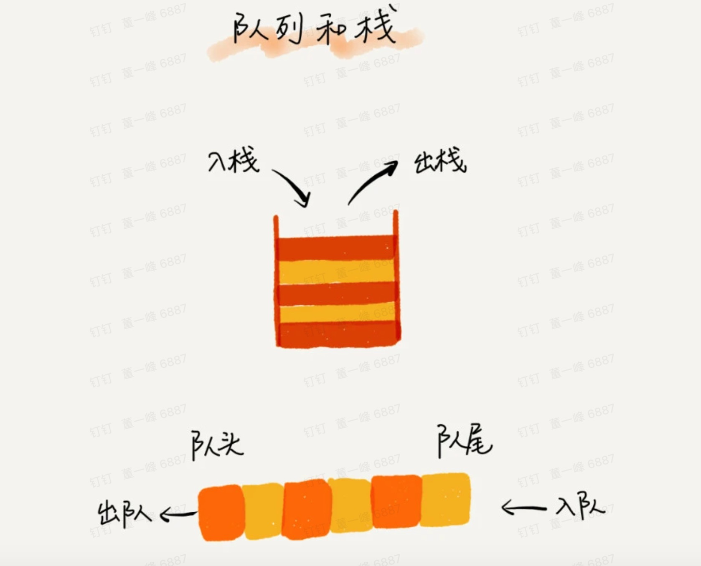
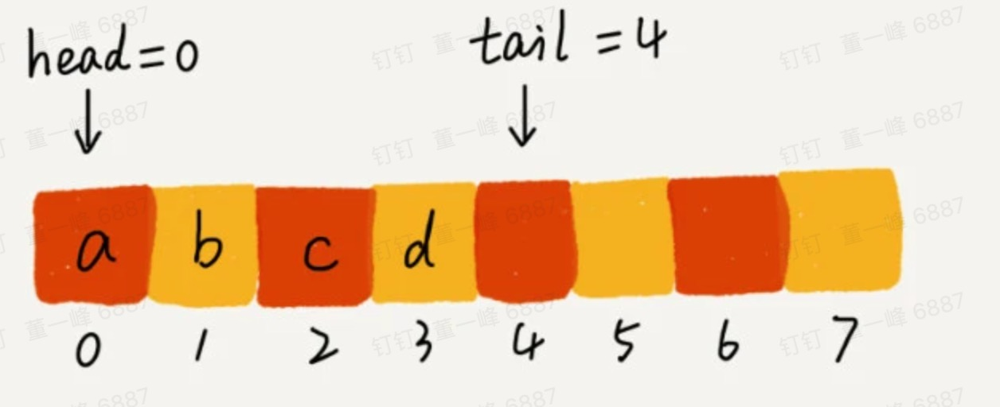
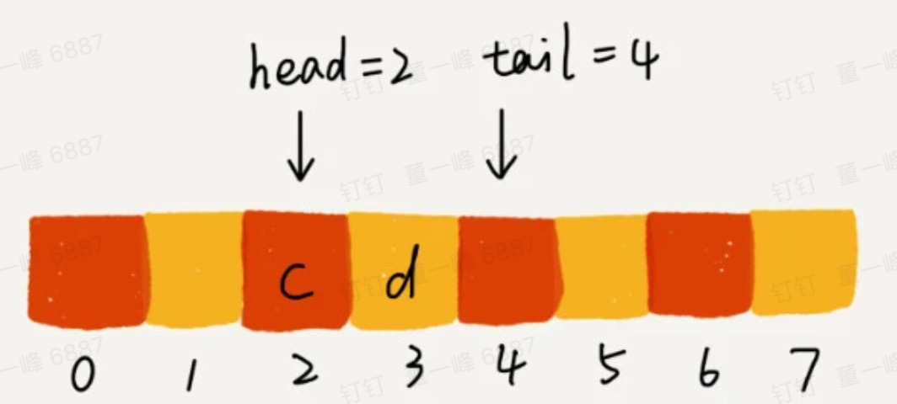
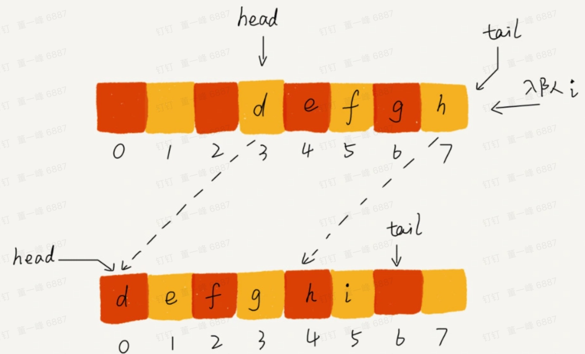
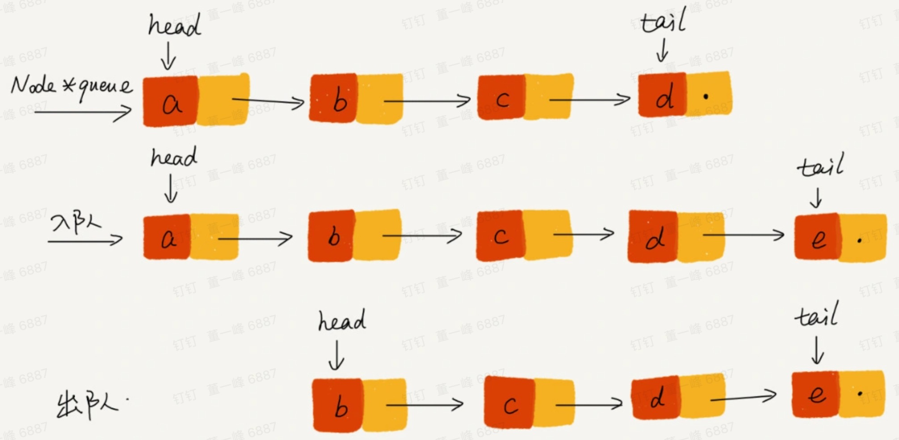
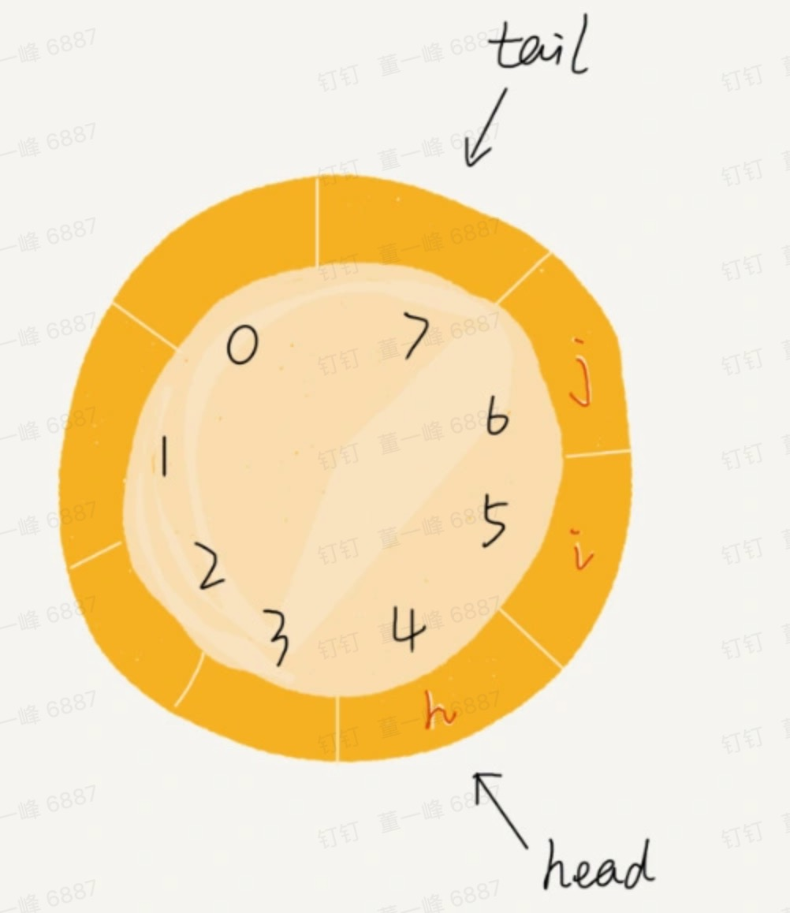
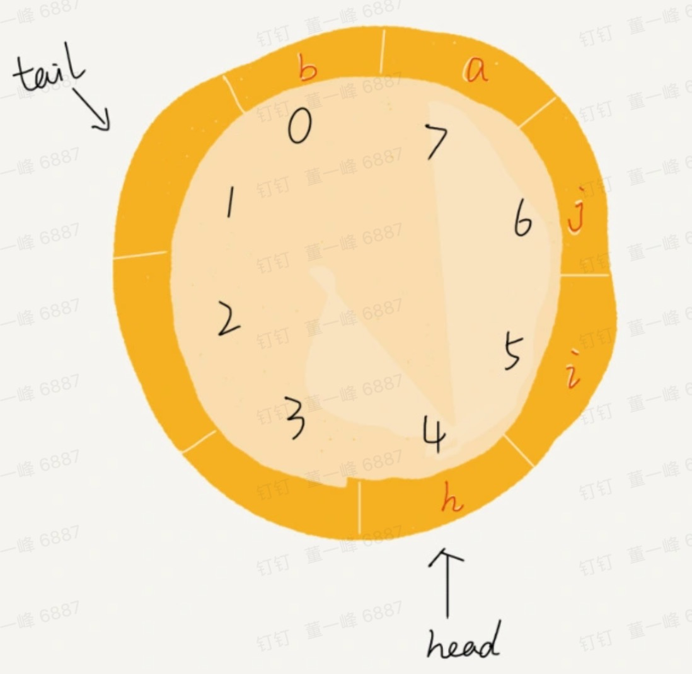
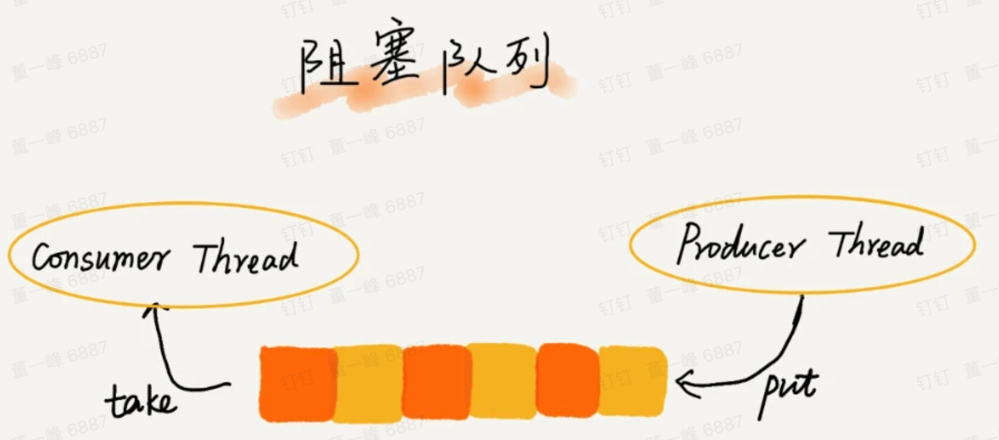
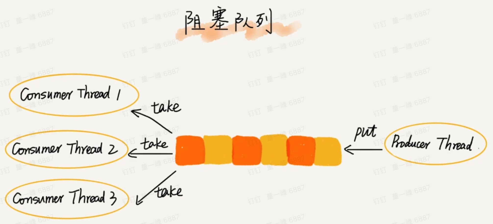

# 队列

队列一般用于削峰。

队列特点：先进先出

基本操作：

1. 入队：enqueue
2. 出队：dequeue



常见的队列：

1. 循环队列
2. 阻塞队列
3. 并发队列

根据实现方式划分

1. 顺序队列：用数组实现
2. 链式队列：用链表实现

## 顺序队列



- head 指针，指向队头。
- tail 指针，指向队位。
- head 和 tail 之间是对队列中数据。

如果调用两次出队后，




不停的入队与出队，head 和 tail 指正都会后移，当tail 移到最右边，即使数组还有空间，也无法插入数据了。如何解决？<font color=red>数据搬移</font>。




代码：

```python
class ArrayQueue:
    def __init__(self, capacity):
        self.capacity = capacity
        self.items = [None for i in range(capacity)]
        self.tail = 0
        self.head = 0

    # 入队
    def enqueue(self, item):
        # 队列满了
        if self.head == 0 and self.tail == self.capacity: return
        
        # 数据搬移
        if self.tail == self.capacity and self.head != 0:
           # 数据搬移
            for i in range(self.head, self.capacity):
                self.items[i - self.head] = self.items[i]
            # 搬移后更新 head 和 tail
            self.tail -= self.head
            self.head = 0

        self.items[self.tail] = item
        self.tail += 1
        return True

    def dequeue(self):
        # 队列空了
        if self.head == self.tail: return
        ret = self.items[self.head]
        self.head += 1
        return ret


queue = ArrayQueue(5)
queue.enqueue(1)
queue.enqueue(2)
queue.dequeue()
queue.dequeue()
queue.enqueue(1)
queue.enqueue(2)
queue.dequeue()
queue.dequeue()
queue.enqueue(1)
queue.enqueue(2)
queue.enqueue(3)
queue.enqueue(4)
queue.enqueue(5)

print(queue.items, queue.head, queue.tail)
```


## 链式队列



基于链表的实现，需要两个指针：head 和 tail

- 入队：tail.next = new_node ; tail = tail.next
- 出队：head= head.next
- 不需要数据搬移


```python
# 链表结点
class ListNode(object):
    def __init__(self, x):
        self.val = x
        self.next = None

class LinkedQueue():
    def __init__(self):
        self.head = ListNode(None)
        self.tail = self.head

    # 入队
    def enqueue(self, item):
        self.tail.next = ListNode(item)
        self.tail = self.tail.next

    # 出队
    def dequeue(self):
        if not self.tail.val: return
        ret = self.head.next.val
        self.head.next = self.head.next.next
        return ret

    def print(self):
        node = self.head.next
        while node:
            print(node.val, "->", )
            node = node.next
        print("")


queue = LinkedQueue()
queue.enqueue(1)
queue.enqueue(2)
queue.enqueue(3)

print(queue.dequeue())
print(queue.dequeue())

queue.enqueue(4)
queue.enqueue(5)

queue.print()
```


## 循环队列

在使用数组实现队列时，当 tail == n 是需要数据搬移的操作。导致入队的性能受影响。如果避免数据搬移？

答：循环队列



- 队列长度：8

- head = 4
- tail = 7

当有一个新元素入队时，我们并不是将 tail 改为 8 ，而是后移到 0，再入队时，tail 变为 1。这样就可以避免数据搬移。



1. 队列判空条件是：head == tail
2. 队列满时：（tail + 1）% n == head。队列满时tail 没有存储数据，浪费一个空间。
3. 入队：tail = （tail + 1）% n
4. 出队：head = （head + 1）% n


```python

class CircularQueue:
    def __init__(self, capacity):
        self.capacity = capacity
        self.items = [None for i in range(capacity)]
        self.tail = 0
        self.head = 0

    # 入队
    def enqueue(self, item):
        # 队列满了
        if (self.tail + 1) % self.capacity == self.head: return
        self.items[self.tail] = item
        self.tail = (self.tail + 1) % self.capacity
        return True

    def dequeue(self):
        # 队列空了
        if self.head == self.tail: return
        ret = self.items[self.head]
        self.head = (self.head + 1) % self.capacity
        return ret


queue = CircularQueue(5)
queue.enqueue(1)
queue.enqueue(2)
queue.dequeue()
queue.dequeue()
queue.enqueue(1)
queue.enqueue(2)
queue.dequeue()
queue.dequeue()
queue.enqueue(1)
queue.enqueue(2)
queue.enqueue(3)
queue.enqueue(4)
queue.enqueue(5)

print(queue.items, queue.head, queue.tail)
```


## 阻塞队列和并发队列

### 阻塞队列

- 入队时：如果队列已满，插入数据的操作会被阻塞。
- 出队时：如果队列为空，从队列获取数据会被阻塞。



上图就是”生成者--消费者模型“。

这种基于阻塞队列实现的 ”生成者--消费者模型“，可以有效协调生产和消费的速度。


阻塞队列可以协调”生产者“ 和”消费者“ 的个数，来提高数据的处理效率。




### 并发队列

并发队列：线程安全的队列

在多线程的情况下，多个线程同时操作队列，会有线程安全问题。如何实现一个线程安全的队列呢？

最简单的方式：在enqueue() 和 dequeue() 时加锁。

基于数组的循环队列，利用 CAS 原子操作，可以实现非常高效的并发队列。这也是循环队列比链式队列应用更加广泛的原因。