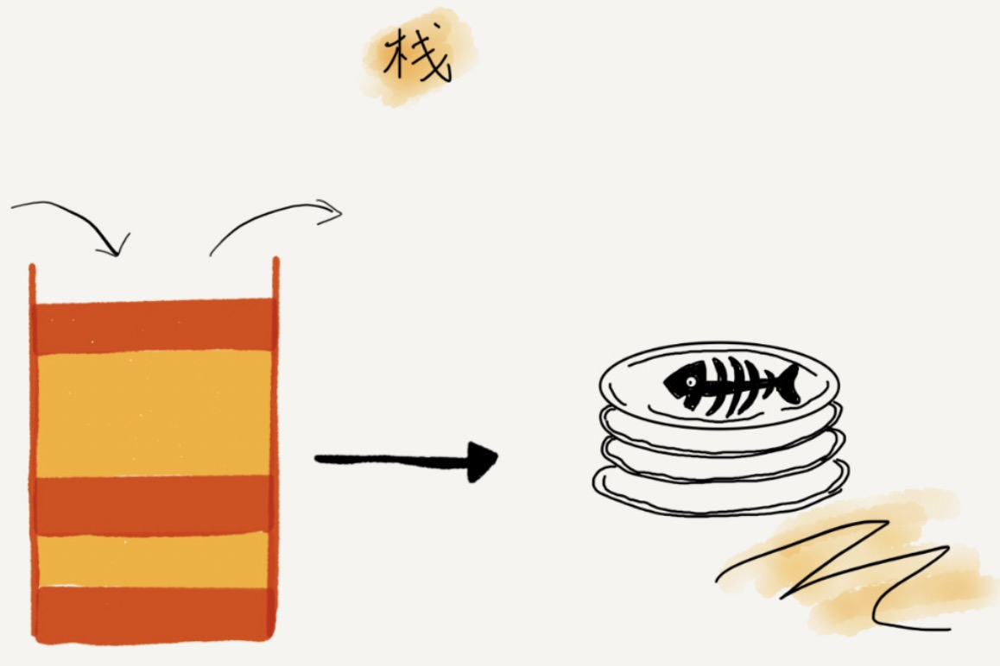

[TOC]

# stack 概念

**后进者先出，先进者后出**




顺序栈：用数组实现

java 版

```java
// 基于数组实现的顺序栈
public class ArrayStack {
  private String[] items;  // 数组
  private int count;       // 栈中元素个数
  private int n;           // 栈的大小

  // 初始化数组，申请一个大小为 n 的数组空间
  public ArrayStack(int n) {
    this.items = new String[n];
    this.n = n;
    this.count = 0;
  }

  // 入栈操作
  public boolean push(String item) {
    // 数组空间不够了，直接返回 false，入栈失败。
    if (count == n) return false;
    // 将 item 放到下标为 count 的位置，并且 count 加一
    items[count] = item;
    ++count;
    return true;
  }
  
  // 出栈操作
  public String pop() {
    // 栈为空，则直接返回 null
    if (count == 0) return null;
    // 返回下标为 count-1 的数组元素，并且栈中元素个数 count 减一
    String tmp = items[count-1];
    --count;
    return tmp;
  }
}

```

python 版

```python
class ArrayStack(object):
    def __init__(self):
        self.items = []

    def is_empty(self):
        return len(self.items) == 0

    # 返回栈顶元素
    def peek(self):
        return self.items[-1]

    def size(self):
        return len(self.items)

    def push(self, item):
        self.items.append(item)

    def pop(self):
        return self.items.pop()

    def size(self):
        return len(self.items)
```


链式栈：用链表实现


# 单调栈

## 单调递增栈

从栈顶到栈底的元素是严格递增的

```python
class Stack(object):
    def __init__(self):
        self.items = []

    def is_empty(self):
        return len(self.items) == 0

    # 返回栈顶元素
    def peek(self):
        return self.items[-1]

    def push(self, item):
        while not self.is_empty() and self.peek() < item:
            self.pop()
        self.items.append(item)

    def pop(self):
        self.items.pop()
```


```python
'''
给定数据 A = [5,3,7,4],返回数组L，L[i] 表示：第i个数向左遍历的第一个比它小的元素的位置
A = [ 5,3,7,4 ]
L : [ 0,0,2,2 ]
'''

def run(a):
    l = [0 for i in range(len(a))]
    stack = Stack()
    for i in range(len((a))):
        # 找到 stack 顶元素比 a[i] 小的第一个元素
        while not stack.is_empty() and a[stack.peek()] >= a[i]:
            stack.pop()
        # 如果不为空，栈顶元素就是，a[i] 左边第一个比它小的元素的位置
        if not stack.is_empty():
            l[i] = stack.peek() + 1
        # 由于 a[stack.peek()] < a[i] ,此处 push 保持了单调递增的性质
        stack.push(i)
    return l
```

总结：一个元素向左遍历的第一个比它小的数的位置就是：==将它插入单调栈时栈顶元素的值==，若栈为空，则说明不存在这么一个数。然后将此元素的下标存入栈，就能类似迭代般地求解后面的元素

## 单调递减栈

从栈顶到栈底的元素是严格递减的

```python
class Stack(object):
    def __init__(self):
        self.items = []

    def is_empty(self):
        return len(self.items) == 0

    # 返回栈顶元素
    def peek(self):
        return self.items[-1]

    def push(self, item):
        while not self.is_empty() and self.peek() > item:
            self.pop()
        self.items.append(item)

    def pop(self):
        self.items.pop()
```

