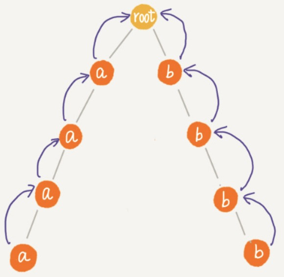

[TOC]

# Trie Tree 多模式匹配

Trie Tree 本质：**就是利用字符串之间的公共前缀，将重复的前缀合并到在一起**。


Trie Tree 和 AC 自动机都是多模式串匹配算法。


单模式串匹配算法：一个模式串和一个主串之间进行匹配。每次匹配都需要扫描一遍主串，效率低下。

多模式串匹配算法：多个模式串和一个主串之间进行匹配。只需扫描一遍主串，效率高。


多模式串匹配算法应用场景：敏感词过滤。

只需要一次构建 Trie Tree，一直在匹配。动态更新敏感词词典，更新 Trie Tree。

[图解字典树多模匹配过程]


Trie 树的多模式匹配算法

```python
class Trie:
    def __init__(self):
        self.root = TrieNode()

    def insert(self, word):
        p = self.root
        for i in range(len(word)):
            if word[i] not in p.children:
                p.children[word[i]] = TrieNode()
            p = p.children[word[i]]
        p.data = word

    def find(self, pattern):
        p = self.root
        for i in range(len(pattern)):
            if pattern[i] not in p.children: return
            p = p.children[pattern[i]]
        return p.data

    def multi_match(self, text):
        res = []
        for i in range(len(text)):
            p = self.root
            for j in range(i, len(text)):
                if text[j] not in p.children: break
                p = p.children[text[j]]
                if p.data: res.append(p.data)

        return res

if __name__ == "__main__":
    trie = Trie()
    # 加载敏感词表
    trie.insert("格力")
    trie.insert("苹果")
    trie.insert("和服")

    text = "格力电器和苹果公司的商品和服务非常不错"
    print(trie.multi_match(text))
# 输出：['格力', '苹果', '和服']
```

基于 Trie 树这种处理方式，有点类似单模式串匹配的 BF 算法。单模式串匹配算法中，KMP 进入了 next 数组，让匹配失败时，尽可能将模式串往后多移动几位。

# AC 自动机


**AC 自动机就是在 Trie 树之上，加了类似 KMP 的 next 数组，只不过此处的 next 数组是构建在树上**。

AC 自动机与 Trie Tree 关系，类似BF 算法与 KMP算法 的关系。


AC 自动机在前缀树的基础上，为前缀树上的每个节点建立一棵==**后缀树**==，节省了大量的查询。


AC 自动的构建步骤：

1. 构建 Trie Tree
2. 在 Trie Tree 上构建失败指针（相当于 KMP 中的失效函数 next 数组）

构建Trie Tree 看Trie Tree 介绍文档。

着重介绍构建失败指针。

## 构建失败指针

假设有 4 个模式串：c，bc，bcd，abcd 和 主串 abcd


假设沿着 Trie Tree 走到了 p 点，p 点的失败指针就是字符串 abc ，跟所有模式串前缀匹配的**最长可匹配后缀子串**。

abc 的后缀子串：bc，c。将 bc ，c 在Trie Tree 中匹配，找到最长匹配前缀，那个后缀子串叫做：**最长可匹配后缀子串**。

计算每个节点的失败指针看似复杂，其实，如果将树中同一深度的结点放到同一层，那么失败结点只可能出现在他所在层的上一层。我们可以逐层依次来求解每个节点的失败指针。所以，==**失败指针的构建过程，就是一个按层遍历树的过程**==。

注意：root 节点的失败指针为 NULL，也就是指向自己。

如上图：节点 p 的失败指针指向 q 节点。那么 qc 节点是否能在 q 节点的子节点找到？如果找到pc 的失败指针就指向 qc，如果找不到，那么再从 q 节点的失败指针中尝试寻找（ q = q.fail ），如果一直没有找到，那么 pc 的失败指针指向根节点。 


```python
class AcNode:
    def __init__(self):
        self.data = None
        self.children = {}
        # 当节点为结束结点时，模式串的长度
        self.length = -1
        # 失败指针
        self.fail = None

class AC:
    def __init__(self):
        self.root = AcNode()

    def add(self, word):
        p = self.root
        for char in word:
            # 只有结束结点才写入 data
            if char not in p.children:
                p.children[char] = AcNode()
            p = p.children[char]
        p.data = word
        p.length = len(word)

    def build_failure_pointer(self):
        queue = [self.root]
        while queue:
            p = queue.pop(0)
            for key, pc in p.children.items():
                q = p.fail
                while q:
                    qc = q.children.get(key, None)
                    if qc:
                        pc.fail = qc
                        break
                    q = q.fail
                if q is None:
                    pc.fail = self.root
                queue.append(pc)

if __name__ == "__main__":
    ac = AC()
    # 加载敏感词表
    ac.add("格力")
    ac.add("苹果")
    ac.add("和服")

    ac.build_failure_pointer()
```

AC 自动机构架完毕后：


**时间复杂度分析：**

Trie Tree 构建时间复杂度：O(m*len)   m 敏感词个数，len 敏感词的平均长度。

上构建失败指针

1. 每个节点构建失败指针，都需要从当前层，一层一层向上找，最大值为树的深度（len），
2. 树的结点树为 k ，那么构建失败指针的时间复杂度为：O(len * k)

注意：AC 自动机一旦构建完毕后，不会频繁改动。所以对匹配效率不会影响。

AC 自动机 构建时间为：O(m*len)  + O(len * k)

## 匹配

匹配过程：

主串 i = 0 开始，AC 自动机指针从 root 开始，b 是模式串，a 是主串，

if  b[ i ]  in  p.children  ，检测一系列失败指针为结尾的路径是否是模式串，处理完毕后，i += 1

if  b[ i ] not in  p.children ，p = p.fail。然后继续这两个过程。

```python
    def match(self, text):
        res = []
        p = self.root
        for i, char in enumerate(text):
            # 一个新 char ，通过 fail 寻找合适 node，开始查询
            while char not in p.children and p != self.root:
                p = p.fail

            # 如果没有匹配，从 root 开始。
            p = p.children[char] if char in p.children else self.root
            tmp = p
            while tmp != self.root:
                if tmp.data is not None:
                    pos = i - tmp.length + 1
                    print('匹配起始下标' + str(pos) + ";长度:" + str(tmp.length))
                    res.append(tmp.data)
                tmp = tmp.fail
        return res
      
      
if __name__ == "__main__":
    ac = AC()
    # 加载敏感词表
    ac.add("格力")
    ac.add("苹果")
    ac.add("和服")

    ac.build_failure_pointer()
    text = "格力电器和苹果公司的商品和服务非常不错"
    print(ac.match(text))
```

**时间复杂度分析：**

与失败指针构建类似，for 遍历每个字符时，最耗时在 while 循环中，这一部分时间复杂度也是：O( len )，所以总的匹配时间复杂度：O(n * len) 。一般敏感词并不会很长，实际情况，可能近似：O( n )


在极端情况下，AC 自动机才会退化为 Trie Tree

