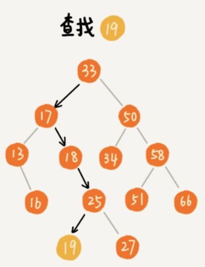
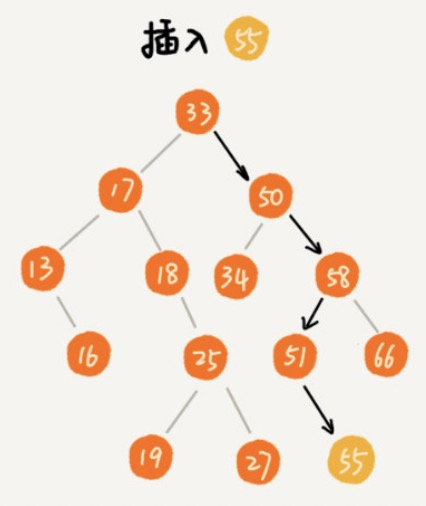
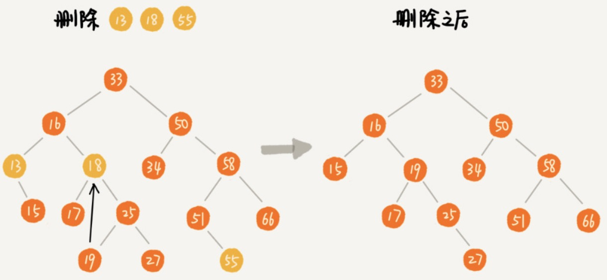
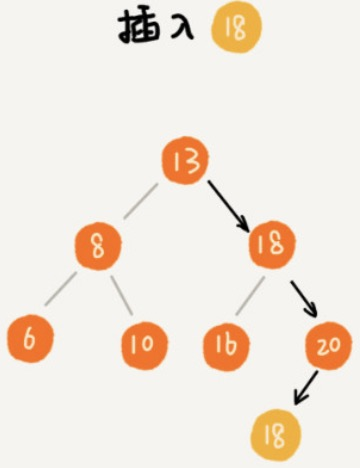
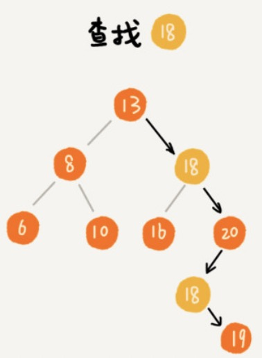
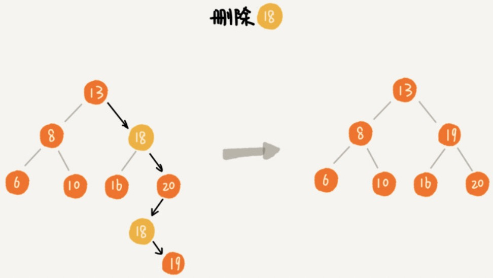
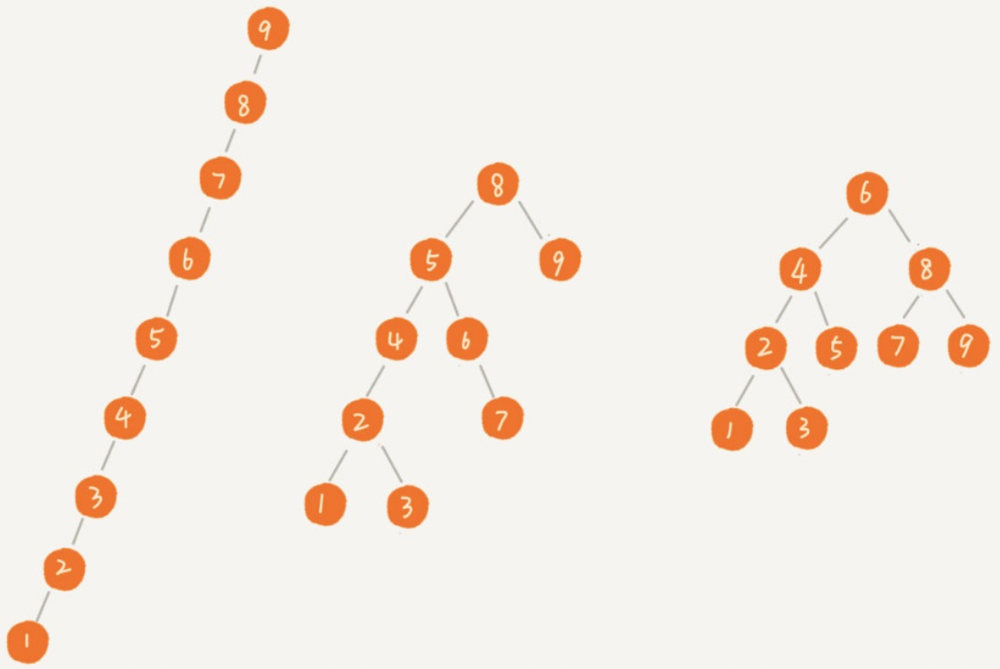

[TOC]

# 二叉搜索树（Binary Search Tree）

二叉搜索树：支持快速查找，插入，删除一个数据。

定义：

1. 根节点 > 左节点
2. 根节点 < 右节点

性质：BST 中序遍历：结果是升序。

## 查找



```python
  '''
    时间复杂：O(log n)
  '''  
  def find(self, data):
        p = self.root
        while p:
            if data < p.data:
                p = p.left
            elif data > p.data:
                p = p.right
            return p
```

## 插入

新插入的数据一般都是在叶子节点上。

查找插入位置。



```python
    '''
    时间复杂：O(log n)
    '''
    def insert(self, data):
        if not self.root:
            self.root = Node(data)
            return

        # 查找插入位置
        temp = self.root
        while temp:
            p = temp
            temp = temp.left if data < temp.data else temp.right
        
        if data < p.data:
            p.left = Node(data)
        else:
            p.right = Node(data)
```

## 删除

真删除

删除操作分为三种情况：

1. 要删除的节点没有子节点，将其父指向它的指针设为 null。
2. 要删除的节点只有一个子节点，将其父节点指向它的指针，指向其子节点即可。
3. 要删除的节点有两个子节点，找到这个节点右子树中最小的结点 min，将最小节点的值付给要删除的节点，然后删除最小节点。



代码：

```python
    def delete(self, data):
        # p 指向要删除的节点
        p = self.root
        # p 的父节点
        pp = Node
        while p and p.data != data:
            pp = p
            if data > p.data:
                p = p.right
            else:
                p = p.left

        # 没有找到
        if p is None: return

        # 要删除的结点有两个子节点
        if p.left and p.right:
            # 查找右子树中，最小节点
            min_p = p.right
            min_pp = p
            while min_p.left:
                min_pp = min_p
                min_p = min_p.left
            # 将 min_p 的数据替换到 p 中
            p.data = min_p.data
            # 下边变成要删除 min_p
            p = min_p
            pp = min_pp

        # 要删除节点是叶子节点或者仅有一个子节点
        # child 是 p 的子节点
        if p.left:
            child = p.left
        elif p.right:
            child = p.right
        else:
            child = None

        # 要删除的节点是根节点
        if pp is None:
            self.root = child
        elif pp.left == p:
            pp.left = child
        else:
            pp.right = child
```

软删除

删除时，将节点标记为“已删除”，这样删除和查找一样。

浪费空间，但是操作简单了很多。

## 查找最大节点

查找最大节点：一直右下去。

```python
    def get_max(self):
        temp = self.root
        while temp:
            if temp.right:
                temp = temp.right
            else:
                return temp.data
```

## 查找最小节点

查找最小节点：一直左下去

```python
    def get_min(self):
        temp = self.root
        while temp:
            if temp.left:
                temp = temp.left
            else:
                return temp.data
```

## 查找前驱节点


## 查找后继节点

## 排序

**==BST 中序遍历：结果是从小到大排列==**。时间复杂度:O(n)

```python
class Node:
    def __init__(self, data):
        self.data = data
        self.left = None
        self.right = None

class BinarySearchTree:
    def __init__(self):
        self.root = None
        
    '''
    中序遍历：输出结果是升序
    '''
    def inorder(self, node):
        if node:
            self.inorder(node.left)
            print(node.data)
            self.inorder(node.right)
    '''
    depth = get_depth(left_sub_tree,right_sub_tree) + 1
    '''
    def get_depth(self, node):
        if not node:
            return 0
        left_h = self.get_depth(node.left)
        right_h = self.get_depth(node.right)
        return max(left_h, right_h) + 1


data = [6, 3, 8, 2, 5, 1, 7]
binarySearchTree = BinarySearchTree()
for item in data:
    binarySearchTree.insert(item)

binarySearchTree.inorder(binarySearchTree.root)
print(binarySearchTree.get_max())
print(binarySearchTree.get_min())
```


# 支持重复数据的二叉查找树

实际开发中，二叉查找树中存储的对象包含很多字段，那么可以将对象某个字段作为 key，其他字段作为卫星数据。

重复 key 的处理方法：

1. 二叉查找树每个节点 key 是唯一的，相同的 key 通过链表或者数组，存储到同一个节点上。

2. 不好理解，比较优雅：

   插入时，如果 key 相同，将新插入的数据当做大于这个节点的值，插入到右子树（后来的优先级高，好处理）。

   

   查找时，遇到 key 相同，并不停止查找，继续向右子树中查找，直到遇到叶子节点，才停止。这样就可以把键值相等的所有节点全都找出来。

   

   ```python
       def search(self, data):
           p = self.root
           res = []
           while p:
               if data < p.data:
                   p = p.left
               else:
                   if p.data == data:
                       res.append(p)
                   p = p.right
           return res
   ```

   

   删除时，先查找到所有节点，按照之前的删除方法，依次删除。

   

```pyhton

```

## 二叉查找树的问题

1. 根节点左右子树极度不平衡，将退化为链表。这样查找的时间复杂度就变为：O(n).

   最理想的情况：完全二叉树（或者满二叉树）：查找的时间复杂度：$O(log_2{n})$



如何构建一棵不管怎么删除，插入数据，都是保持任意节点的左右子树都比较平衡的二叉查找树？


# 既生散列表，何生二叉查找树？

散列表查找的时间复杂度为：O(1)

散列表已经非常高效了，而二叉查找树的插入，删除，查找的时间复杂度为：O(logn)。

二叉查找树存在的意义（从散列表的不足找起）：

1. 散列表中的数据是==无序存储==的，如果要输出有序的数据，需要先进行排序。二叉搜索树只需中序遍历，在 O(n) 的时间复杂度内，输出有序数据。
2. ==散列表扩容耗时很多==。查询时，当遇到散列冲突时，性能不稳定。工程中使用的平衡二叉查找树的性能非常稳定：O(logn)
3. 尽管散列表查找等操作的时间复杂度时常量级的，但是在哈希冲突的存在，这个常量不一定比 log n 小。加上==哈希函数的耗时==，也不一定就比平衡二叉查找树的效率高。
4. ==散列表的构造复杂==，需要考虑的东西很多：散列函数的设计，冲突解决办法，扩容，缩容等。平衡二叉查找树只需考虑==平衡性的问题==，而且这个问题比较成熟，固定。
5. ==散列表浪费空间==,为了避免过多的散列冲突，散列表装载因子不能太大，特别是基于开发寻址解法冲突的散列表。

在实际开发过程中，需要结合具体的需求选择对应的数据结构。

