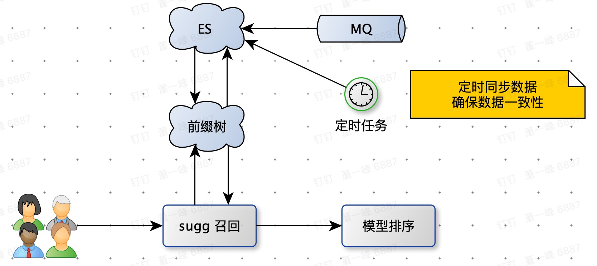
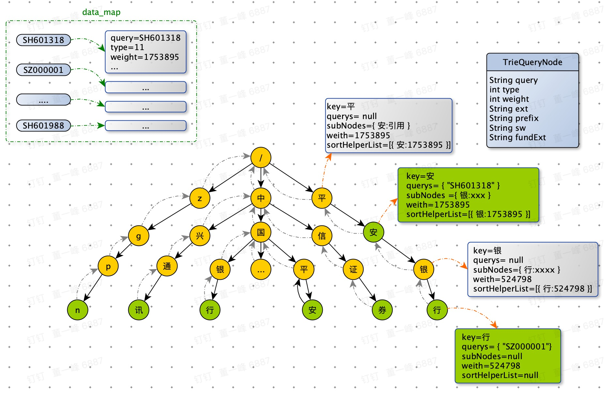
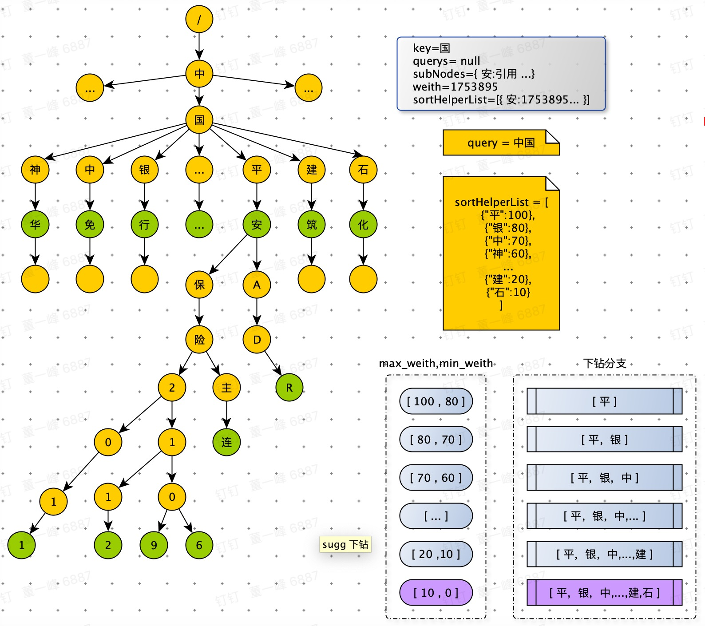
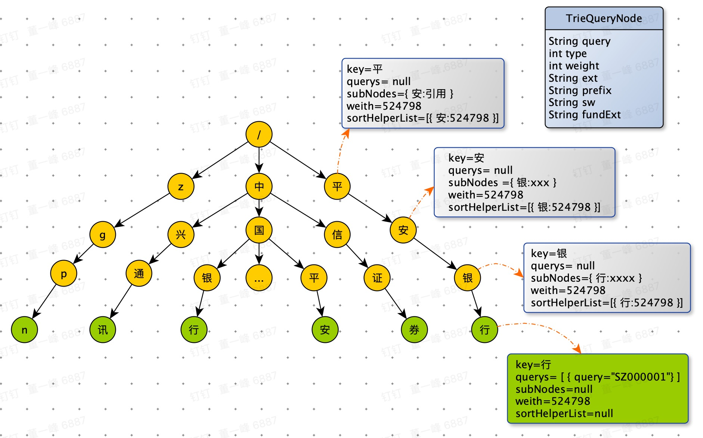
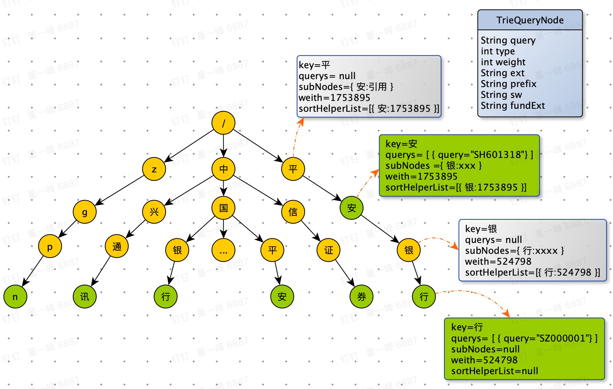
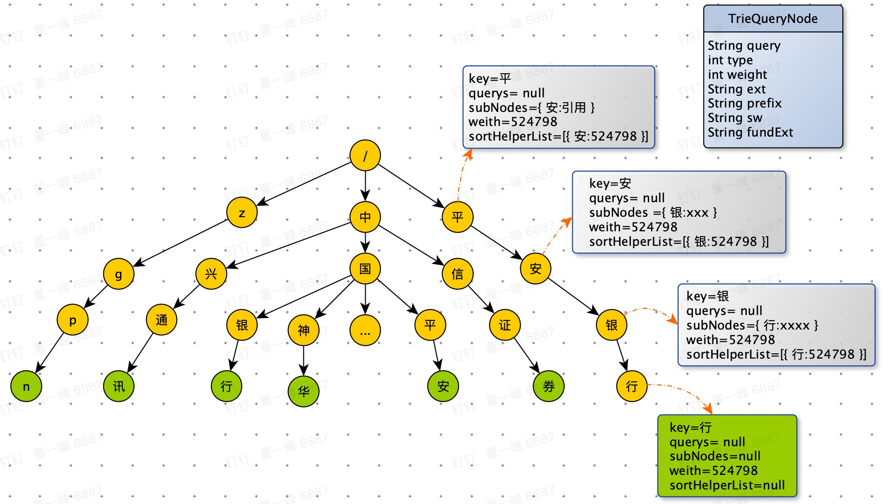
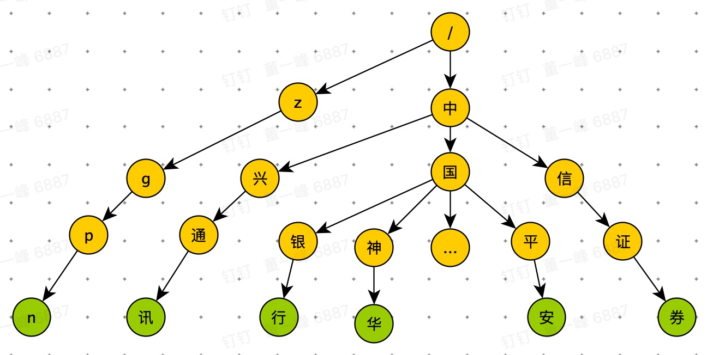

[TOC]

# sugg 架构图

- 前缀树存在与本地缓存中，热门数据（用户和股票）。
- 对于冷门数据，在召回条数少于 k 条时，请求 ES（前缀检索）
- 定时任务，定期更新内存中数据，保证数据一致性。
- MQ 消息，增量更新 sugg 数据。

# 前缀树

- data_map 中存储所有数据，前缀树是一个前缀检索的索引结构。
- 删除时，需删除 data_map 中的数据（操作简单），确保删除的正确性。
- 存在 parent 指针，删除数据时，维护路径和权重。
- 节点权重是该节点及子节点数据的最大权重。

## 前缀匹配

- query = “中国” 精确匹配，走到“国” 的节点。
- 由于“国” 的子节点多，进行剪枝，优先选择权重大的分支下钻。
- 下钻过程，带着 max_weigth 和 min_weith，只收集weight 在[max_weigth, min_weith] 之间的数据节点。
- 当  max_weigth =100 , min_weith = 80 时，weight > 80 的数据节点只能在 “平” 的分支中。
- 当 max_weigth =80 , min_weith = 70 时，需要重新遍历 “平” 分支，因为上次没有收集“平” 分支中 weight > 70 and weight < 80 的数据节点。
- 在收集数据过程中，只要满足要求数据量时，直接返回。

## 前缀树新增数据

新增前

SH601318 股票新增关键词 “平安”

- 根据关键词下钻，一路修正路径上节点权重，已经sortHelperList
- 如果节点为空，就新建节点
- 在最终的节点上，querys 加入 symbol，然后根据权重对 querys 排序（或者使用红黑树）

## 前缀树删除数据

删除前

删除数据：SZ000001 的 “平安银行” 关键词

- 精确匹配“平安银行”，删除 querys 中 symbol = “SZ000001” 的数据。
- check：当前节点如果不是数据节点(querys 为空)，并且没有子节点(subNodes 为空)，那么删除当前节点。
- check：当前节点的父节点，是否需要删除。从下向上一次删除（使用 parent 指针）。  

最终结果：

