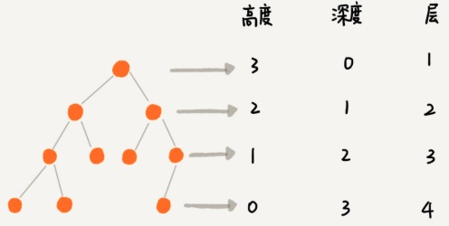
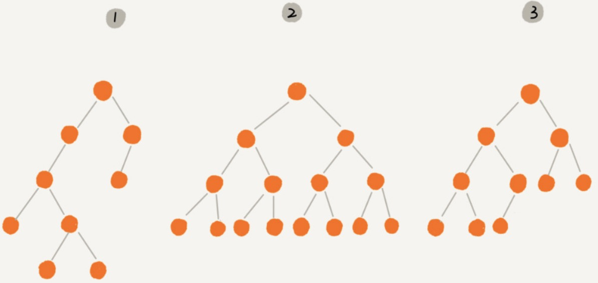
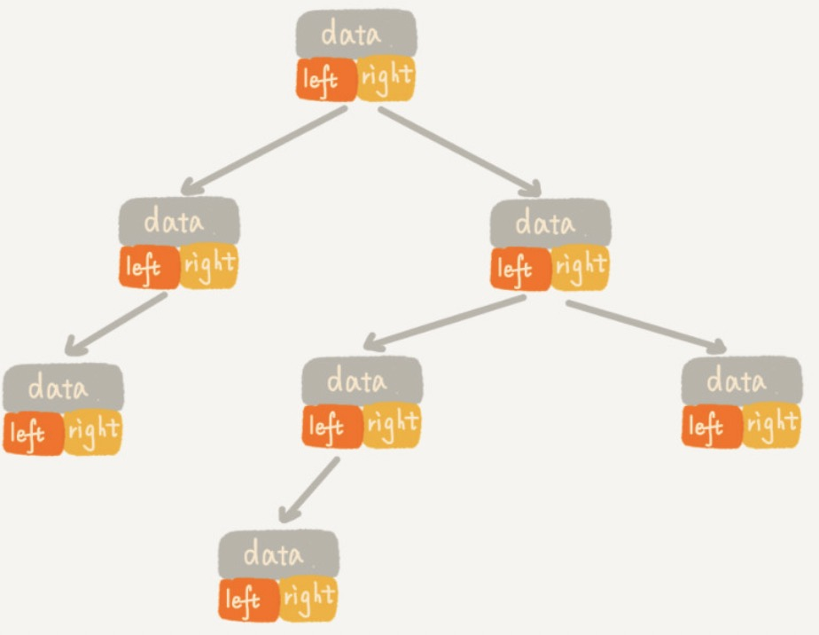
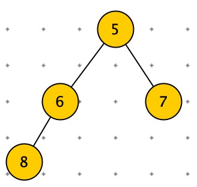
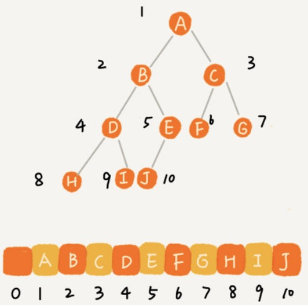
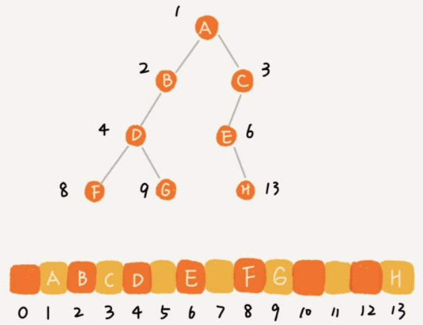
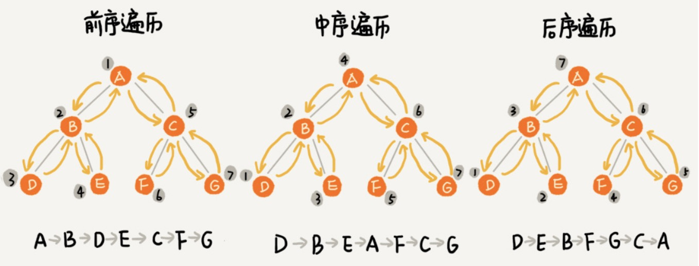

[TOC]

# 二叉树基础

三个比较混淆的概念

- 节点的高度：节点到叶子节点的最长路径（边数）。
- 节点的深度：根节点到这个节点所经历的边的个数。
- 节点的层数：节点深度 + 1。
- 树的高度：根节点的高度。



生活中：

- ”高度“就是从下向上度量。
- ”层“ 从下向上度量，从 1 开始（楼层）。
- ”深度“就是：从上向下度量。



**满二叉树**：叶子节点都在最底层，并且每个节点都有左右两个子节点。（树 2）

**完全二叉树**：叶子节点都在最底两层，最后一层叶子节点靠左排列，且除了最后一层，其他层的节点个数都达到最大。（树 3）

## 二叉树的存储

1. 通过指针链式存储。
2. 通过数组顺序存储。

链式存储：比较常用。






顺序存储

根节点小标为 1，

左子节点：2 * i 

右子节点：2 * i + 1

父节点：i / 2




顺序存储非常适合完全二叉树，如果是非完全二叉树，比较浪费空间。



完全二叉树如果用链式存储，需要额外存储左右指针。

堆就是一个完全二叉树，最常用的存储方式就是数组。


# 二叉树遍历

二叉树遍历的时间复杂度：O(n)

```python
print("二叉树遍历")
class Node:
    def __init__(self, data):
        self.data = data
        self.left = None
        self.right = None
'''
先序遍历
根 -> 左 —> 右
'''
def preorder(node):
    if node:
        print(node.data)
        preorder(node.left)
        preorder(node.right)


'''
中序遍历
左 -> 根 —> 右
'''
def inorder(node):
    if node:
        inorder(node.left)
        print(node.data)
        inorder(node.right)


'''
后序遍历
左 -> 右 —> 根
'''
def postorder(node):
    if node:
        postorder(node.left)
        postorder(node.right)
        print(node.data)

root = Node(5)
node1 = Node(6)
node2 = Node(7)
node3 = Node(8)

root.left = node1
root.right = node2
node1.left = node3

print("先序遍历")
preorder(root)
print("中序遍历")
inorder(root)
print("后序遍历")

postorder(root)
```




